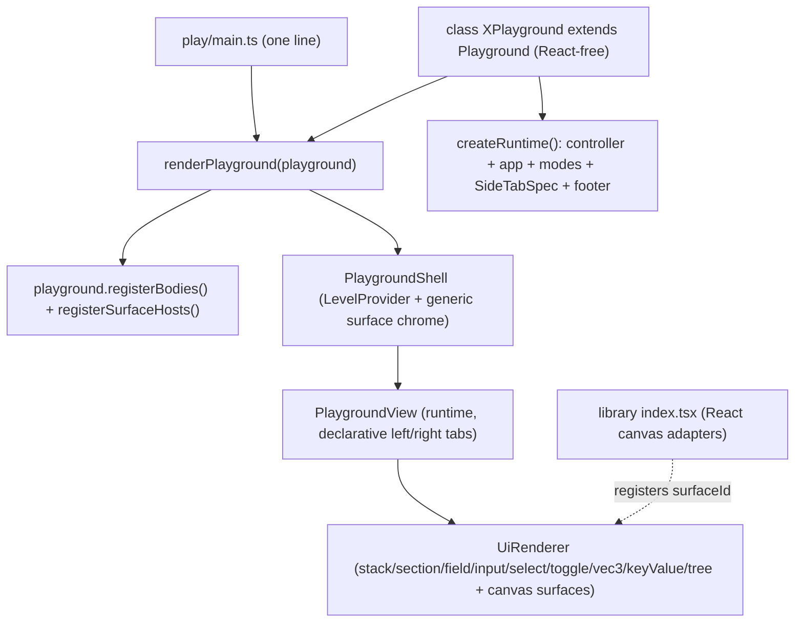

## Goal

Make every elements playground a single React-free class instance, mounted with one line:

```ts
// elements/lib/react/scene/play/main.ts
import { renderPlayground } from "@elements/playground/react";
import { ScenePlayground } from "../index.tsx"; // or play/index.ts
renderPlayground(new ScenePlayground());
```

All panels become declarative `UiNode` trees. The only React that survives is the generic shell/renderer plus the canvas surface adapters, which the library registers (not the playground class).

## Target architecture




## 1. Framework core — `elements/lib/playground/core.ts`

- Extend `UiNode` (region `🔖UiNode`) with declarative panel/form nodes (only valid inside side panels; window bodies stay canvas-only via `assertCanvasOnlyWindowBody`):
  - `UiSectionNode` `{ type:"section", id, label?, defaultOpen?, children }`
  - `UiFieldNode` `{ type:"field", id, label, child }`
  - `UiInputNode` `{ type:"input", id, inputKind:"text"|"number", value, placeholder?, commit?:"change"|"blur", onChange:CommandDescriptor }`
  - `UiSelectNode` `{ type:"select", id, value, items:[{value,label}], placeholder?, onChange:CommandDescriptor }`
  - `UiToggleNode` `{ type:"toggle", id, pressed, text?, onChange:CommandDescriptor }`
  - `UiVec3Node` `{ type:"vec3", id, value:[number,number,number]|null, onChange:CommandDescriptor }`
  - `UiKeyValueNode` `{ type:"keyValue", entries:[{label,value}] }`
  - `UiTreeNode` `{ type:"tree", sections:[{id,label?,defaultOpen?,items}] }` where each item is `{ id,label,description?,selected?,defaultOpen?,command?:CommandDescriptor,items? }` (replaces the `onClick` callbacks used by hierarchy/kinds trees with declarative commands).
- Move the data helper `playgroundTreePanelRootItems` from `@elements/playground/react` into core (returns declarative `UiTreeNode` sections) so `play/index.ts` files stop importing the react entry for pure data.
- Add abstract `Playground` base (new region `🔖Playground`), React-free contract:
  - `abstract readonly id: string`
  - `abstract createRuntime(): ProductRuntime`
  - `abstract registerBodies(): void` (registers window + side-panel bodies)
  - `registerSurfaceHosts(): void` (default no-op; subclasses call the library register fn)
  - `readonly initialPanelVisibility?`, `readonly keybindings?: { key, controllerId, command }[]`
  - lazily memoized `get runtime()`.

## 2. Framework react — `elements/lib/playground/react/index.tsx`

- Extend `UiRenderer` (region `🔖UiRenderer`) to render every new node, dispatching `onChange`/command via `commandBus.dispatch(controllerId, command, { ...args, value|pressed })`, reusing `@elements/ui` `Input`, `Select`, `Toggle`, `Label`, and the tree primitives (`staticTreePanelDefinition`) for `UiTreeNode`.
- In `PlaygroundView` (region `🔖PlaygroundView`): build `detailsTabs` from `sideTabsToPlaygroundPanelTabs(activeApp.rightTabs, bus)` (today right tabs are only fed via `augmentPanelTabs`, line 897), and remove the `augmentPanelTabs` prop entirely (no back-compat). All panels now come from declarative `SideTabSpec` + registered side-panel bodies.
- Generalize surface chrome into the shell: add `PlaygroundShell` that wraps `LevelProvider`/bg and renders a generic theme/device/expertise footer driven by a small framework surface state (persisted to `localStorage`), calling `applyElementsSurfaceChrome` from `@elements/ui`. This removes the bespoke per-playground footers.
- Add the one-line entry:
  ```ts
  export function renderPlayground(playground: Playground, rootId = "root"): void {
    playground.registerBodies();
    playground.registerSurfaceHosts();
    mountPlaygroundApp(<PlaygroundShell playground={playground} />, rootId);
  }
  ```
- Install a generic keydown→`commandBus.dispatch` bridge in `PlaygroundShell` from `playground.keybindings` (replaces `ScenePlayKeyboardBridge`).

## 3. Scene — `elements/lib/react/scene/`

- In `play/index.ts`: add `class ScenePlayground extends Playground`. `createRuntime()` reuses `buildScenePlayRuntime()`; attach `SideTabSpec`s (hierarchy, kinds, inspector, settings) to `mainMode.leftTabs/rightTabs`; `registerBodies()` registers the window body plus new declarative side-panel bodies; `registerSurfaceHosts()` calls a library `registerSceneSurfaceHosts()`; `keybindings` = Delete/Backspace → `deleteSelection`.
- Convert the React panels in `index.tsx` (`buildScenePlayInspectorSections`, `buildScenePlaySettingsSections`, `ScenePlayInspector*`, hierarchy/kinds defs) into declarative `UiNode` side-panel body factories in `play/index.ts` using the new `section`/`field`/`input`/`select`/`vec3`/`keyValue`/`tree` nodes (each edit dispatches an existing controller command; add controller commands where inspectors currently call `patchFixture` directly, e.g. `updateObject`, `updateVortex`, `updateAttraction`).
- In `index.tsx` `🛝PlayHost`: keep only the React canvas adapter `ScenePlaySceneSurfaceHost` (+ `PlaySceneCanvas`/`Canvas3D` wiring) and export `registerSceneSurfaceHosts()`. Delete `PlayApp`/`PlayInner`/`ScenePlayProductShell`/`augmentPanelTabs`/keyboard bridge/footer chrome/`mountScenePlay`.
- `play/main.ts`: replace `mountScenePlay()` with `renderPlayground(new ScenePlayground())`.

## 4. Topology — `elements/lib/react/topology/`

- Same shape: `class TopologyPlayground extends Playground` in `play/index.ts`; convert `TopologyPlayStatusPanel` and hierarchy panel to declarative side-panel bodies; keep `TopologyBoardSurfaceHost`/`TopologySceneSurfaceHost` React adapters in `index.tsx` behind `registerTopologySurfaceHosts()`; delete `TopologyPlayApp`/`augmentPanelTabs`/`mountTopologyPlay`; `play/main.ts` → `renderPlayground(new TopologyPlayground())`.

## 5. Board — `elements/lib/board/` (largest)

- Migrate all React-held state out of `BoardPlayInner` into `BoardPlayShellController`: `fixture`, `selectionIds`, `camerasByPane`, `boardSelectionMethod/Mode/Targets`, `boardGridSnapEnabled`, `boardRedrawPlaying`, `effectiveLodByPane`. Implement `appendCircle/appendRectangle/clearSelection/toggle*` as real controller mutations (move geometry helpers like `triptychCamerasFromFixture`, `newBoardAuthoringId` as needed). Delete `BoardPlayHostBridge`/`setHostBridge`/`runHostCommand`.
- Convert library/inspector/settings/hierarchy panels to declarative side-panel bodies; keep the board canvas adapter React behind `registerBoardSurfaceHosts()`.
- Add `class BoardPlayground extends Playground`; delete `BoardPlayApp`/`BoardPlayInner`/`augmentPanelTabs`/`mountBoardPlay`; `play/main.ts` → `renderPlayground(new BoardPlayground())`.

## 6. Tests & validation

- Extend existing colocated `if (import.meta.vitest)` blocks (no new test files): new `UiNode`/`UiRenderer` cases in `core.ts`/`playground/react`, `Playground`/`renderPlayground` contract, and each playground's declarative panel factories + new controller commands. Update tests asserting `augmentPanelTabs`/canvas-only side panels.
- Run `nx test` for `@elements/playground`, `@elements/scene`, `@elements/topology`, `@elements/board`; run the playwright e2e (`scene.spec.ts`, `topology.spec.ts`, board e2e); start dev and confirm runtime via `[DEBUG]` console logs that panels render and edits dispatch commands.

## Notes

- Open a repo ticket first (repo MCP `ticket_open`) associated with the most fitting `repo://goals` entry; keep temp files inside the ticket folder; close it with a summary when done.
- No backwards compatibility: `augmentPanelTabs`, the board host bridge, and the per-playground `mount*Play()`/`PlayApp` are removed outright.
- The `elements/lib/react/` "no classes" rule applies to pure components; playground classes live in `play/index.ts`, consistent with the existing `*ShellController` classes there.

