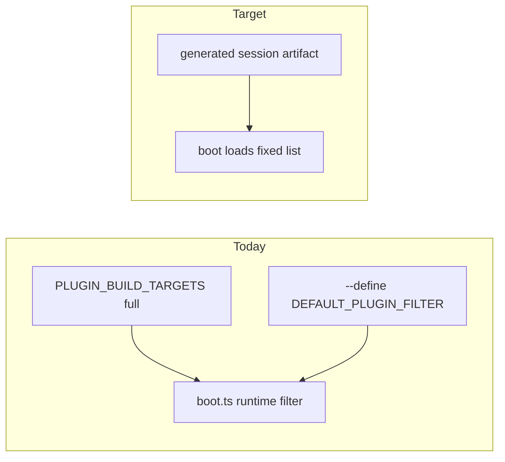

# Decouple Framework from Plugin Identity

## Problem

Framework boot and core still know concrete plugins and re-filter the full registry at runtime:

```240:257:framework/renderer/wgpu/js/boot.ts
const pluginFromUrl = new URLSearchParams(location.search).get("plugin");
const pluginFilter = pluginFromUrl ?? DEFAULT_PLUGIN_FILTER;
const studioMode = pluginFilter === "s";
// ... maps PLUGIN_BUILD_TARGETS / PROGRAM_TARGETS, then expandPluginRegistry(...)
```

That violates SOLID in two ways:

1. **Runtime identity branching** — `studioMode === "s"`, `?? "aggregator"` / `?? "s"`, and `expandPluginRegistry` over the full catalog make boot behavior (and often the compiled `boot.js` via `--define DEFAULT_PLUGIN_FILTER`) depend on which app you start.
2. **Hardwired plugins** — `PLUGIN_HOST_CONFIGS = [{ pluginId: "s", ... }]` in `[framework/core/js/index.ts](framework/core/js/index.ts)` and mirrored in `[framework/renderer/wgpu/rs/lib.rs](framework/renderer/wgpu/rs/lib.rs)`; `isStudioPluginFilter` in `[framework/plugin/registry/script.ts](framework/plugin/registry/script.ts)` hardcodes `"s"`.

Registry codegen already supports build-time filtering (`generatePluginRegistry({ filterPlaygroundPlugin })`) but the browser still embeds the full catalog and re-filters.




## Scope (this ticket)

**In scope:** program selection / host config / studio detection in framework boot, core playground resolution, os/dev entry, registry codegen, and matching Rust wgpu bridge helpers.

**Out of scope:** moving puzzle2d/`Board2dHost`/engine import tables out of `[framework/renderer/react/index.tsx](framework/renderer/react/index.tsx)` (separate larger de-app effort). Shell `studioMode` branches that interpret *host config roles* (landing vs host apps) stay — they must not key off the literal `"s"`.

## Target architecture

Composition root = `[framework/product/os/dev](framework/product/os/dev)` + `[framework/plugin/registry](framework/plugin/registry)`. Framework renderer/core only consume opaque session config + a pre-expanded plugin list.


| Concern                          | Today                                                          | After                                                                                                        |
| -------------------------------- | -------------------------------------------------------------- | ------------------------------------------------------------------------------------------------------------ |
| Which plugins load               | Runtime `expandPluginRegistry` on full catalog                 | Build/dev generates filtered `PROGRAM_TARGETS` (already possible); boot loads that list as-is                 |
| Default program                   | `DEFAULT_PLUGIN_FILTER` / `"s"` / stale `"aggregator"` in boot | Session artifact / Vite env from os/dev only; framework boot has **no** plugin-id default                    |
| Studio / host                    | `pluginFilter === "s"` + hand `PLUGIN_HOST_CONFIGS`            | Host roles declared on the plugin crate metadata; generated into registry; `studioMode = hostConfig != null` |
| Variant → pluginId / default app | Split across boot vs React                                     | Single generated session fields: `registryPluginId`, `defaultAppId`, optional `host`                         |


## Concrete changes

### 1. Host config from program metadata (not framework literals)

In `[s/plugin/rs/Cargo.toml](s/plugin/rs/Cargo.toml)` under `[package.metadata.semio]`:

```toml
host = { landing = "home", studio = "studio" }
```

Extend registry parse/codegen in `[framework/plugin/registry/script.ts](framework/plugin/registry/script.ts)` so each `PluginBuildTarget` may carry optional `host: { landingAppId, hostAppId }`. Emit a generated host table (or embed on the entry) consumed by core — **delete** the hand-written:

```typescript
const PLUGIN_HOST_CONFIGS = [{ pluginId: "s", landingAppId: "home", hostAppId: "studio" }];
```

Mirror: generate the same for Rust (or stop hardcoding in wgpu `PLUGIN_HOST_CONFIGS` / `is_space_mode` that compares to `"s"`). Studio detection = “resolved entry has `host`”, never `=== "s"`. Replace `isStudioPluginFilter` accordingly (host metadata present on the resolved crate, not a magic id).

### 2. Build-time session artifact; boot stops filtering

For each `SEMIO_PLUGIN` / playground launch from `[framework/product/os/dev/script.ts](framework/product/os/dev/script.ts)` / wgpu `[framework/renderer/wgpu/script.ts](framework/renderer/wgpu/script.ts)`:

- Regenerate or write a **session** module (under os/dev generated output or filtered registry already used for that launch) containing at least:
  - `plugins: { pluginId, moduleUrl, contributes?, consumes? }[]` — **already expanded** via existing `resolveRegistryPluginIdsForFilter`
  - `defaultAppId?`, `host?` from playground row + plugin host metadata
  - no need for runtime `expandPluginRegistry` in boot

Change `[framework/renderer/wgpu/js/boot.ts](framework/renderer/wgpu/js/boot.ts)`:

- Remove `DEFAULT_PLUGIN_FILTER`, `pluginFilter === "s"`, and the `PLUGIN_BUILD_TARGETS.map` / `expandPluginRegistry` block.
- Load the fixed session plugin list; pass opaque session id / default app into `semioRendererBoot` as needed.
- Keep optional `?plugin=` only if product wants URL override — resolve via generated playground catalog in **os/dev**, not by baking a default into framework.

Change `[framework/product/os/dev/js/index.ts](framework/product/os/dev/js/index.ts)`:

- Stop defaulting `?? "s"` inside a path that looks like framework identity; default only when the **dev runner** has no session (product layer). Prefer Vite-injected session: pre-filtered `plugins` + `program` / `appId` / host already resolved so React shell does not need to expand the full fleet.

React shell (`[framework/renderer/react/index.tsx](framework/renderer/react/index.tsx)`): keep `resolvePluginHostConfig` / `expandPluginRegistry` only as fallbacks for callers that still pass a full list; preferred path is “plugins already filtered + host from props/session”. Align wgpu with React: never pass raw variant (`aggregator`) into `expandPluginRegistry` without resolving registry id first — ideally neither path expands at runtime for os/dev.

### 3. Kill stale artifacts and `--define` leakage

- Rebuild `[framework/renderer/wgpu/js/boot.js](framework/renderer/wgpu/js/boot.js)` and `[framework/product/os/dev/renderer-modules/wgpu/boot.js](framework/product/os/dev/renderer-modules/wgpu/boot.js)` from the new `boot.ts` so the stale `?? "aggregator"` disappears.
- Stop injecting `DEFAULT_PLUGIN_FILTER` via bun `--define` in `[framework/renderer/wgpu/script.ts](framework/renderer/wgpu/script.ts)`; session JSON/module is the only varying artifact.

### 4. Unify Rust filter with contributes/consumes (or drop runtime filter)

Either:

- Port contributor expansion to wgpu Rust using generated contributes/consumes, **or**
- Prefer: Rust receives the same pre-filtered list JS already loaded (no `filter_plugins` by raw id / `"s"`).

Chosen approach: **pre-filtered list from JS boot** — remove identity hardcoding from Rust filter helpers.

### 5. Tests

Extend existing tests in `[framework/core/js/index.ts](framework/core/js/index.ts)` / registry script tests / renderer tests:

- Host resolution from generated entry with `host` metadata (and absent → single-app path).
- Filtered registry for a non-host playground includes primary + contributors only.
- Boot / os-dev paths contain no `"aggregator"` / `"s"` string literals as defaults (assert via unit tests on session builders, not grepping tree).

## Goal association

Closest product goal: **Running Sketchpad** / **r26-02** (playground boot infrastructure). Ticket work under repo MCP (`ticket_open` / reopen if an open ticket already covers this).

## Non-goals

- Removing domain engines (`puzzle-2d-rs`, flow, infinite) from the React renderer package.
- Changing WIT plugin contracts or per-app `studioMode` UI behavior beyond how studio is *detected*.

