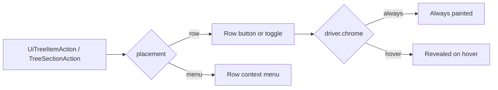

# Default Driver Shows Every Affordance

## Problem

Three violations of "the default driver hides nothing behind hover, and drag starts only on a handle":

1. **Catalogue drags from anywhere on the row.** [TreeDataItemView](🧰️framework/🔨️module/🖱️ui/⚛️react/⚡️implementation/🟦️typescript/📦️index.tsx) line 18973 hardcodes surface initiation whenever a payload exists, ignoring the driver entirely:
   ```
   dragInitiation={item.dragData || dragAndDropController?.pointerPaletteDrag ? "surface" : "handle"}
   ```
   `buildPalettePointerProps` (19429) likewise attaches `onPointerDown` to the whole row.

2. **Row actions hide until hover regardless of driver.** `TreeSectionAction.revealOnHover` (16690) routes actions into `treeHeaderRevealActionsClassName` (16423), which is `opacity-0 pointer-events-none` until `group-hover/tree-row`. The Rust twin `UiTreeItemAction.reveal_on_hover` (wgpu `📦️lib.rs` 2564) does the same and additionally *skips hit-target registration* when unhovered (20826). Hover is a per-action decision today; it must be a driver decision.

3. **One drag handle per tree row.** A row can only express a single drag role, so reorder and palette-transfer collapse onto the same grip.

`DEFAULT_UI_DRIVER` already declares `drag: "handle"` and `chrome: "always"` (2754) — the tree layer just does not honor it.

## Design



- **Placement replaces reveal.** Every action declares where it lives; nothing is hidden by its own declaration.
- **Reveal is driver-only.** Row controls follow `driver.chrome` through the existing `data-ui-reveal-region` mechanism in [globals-ui.css](🧰️framework/🔨️module/🖱️ui/⚛️react/⚡️implementation/🟦️typescript/🎨️globals-ui.css) 160-177, so `default` paints them and `compact` reveals them.
- **Drag roles are explicit.** A row declares `sort` (reorder within the tree) and/or `transfer` (palette drag onto windows), each getting its own labelled handle in the trailing group; `driver.drag === "surface"` collapses both back onto the row and drops the grips.

## Changes

### 1. Framework UI React — [📦️index.tsx](🧰️framework/🔨️module/🖱️ui/⚛️react/⚡️implementation/🟦️typescript/📦️index.tsx)

Inside `//#region 📜️Tree` and `//#region 🫳️DragAffordance`:

- Replace `TreeSectionAction.revealOnHover` with `placement?: TreeActionPlacement` (`"row" | "menu"`, default `"row"`). `TreeCheckboxAction` is row-only.
- `renderTreeHeaderActions` (16763) renders only row-placement actions in a single `treeHeaderActionsClassName` group; delete `treeHeaderRevealActionsClassName` and the `tree-header-reveal-actions` slot.
- `TreeDataItemView` merges menu-placement actions into `item.contextMenu` before handing it to `TreeItemRowContextMenu` (17614), so demoted actions stay reachable.
- Add `TreeDragRole = "sort" | "transfer"` and `TreeItemProps.dragRoles`; derive in `TreeDataItemView` from `item.dragData`/`pointerPaletteDrag` (transfer) and tree reorder capability (sort). Replace the single `dragInitiation` prop.
- `TreeItem` (18070-18521) and `SortableTreeItem` (17759) render one `DragHandle` per role: `grip-vertical` for sort, `move` for transfer. `armDrag` and `buildPalettePointerProps`' `onPointerDown` move onto the transfer handle; the row keeps `draggable={false}` unless `useUiDriverDragSurface()`.
- `DragHandle` (8318) takes a required `labelId` and wraps in `ChromeControlHint` for `title`/`aria-label`.
- Stamp `data-ui-reveal-region` on the row action group so `driver.chrome === "hover"` (compact) drives reveal instead of the deleted class.
- Add i18n keys `ui.tree.drag.sort` and `ui.tree.drag.transfer` to the `ui` schema (3759), the `en` bundle (4877), and the `de` bundle — `check-chrome-i18n` in [📜️script.ts](📜️script.ts) enforces this.

### 2. Shared Rust model — [wgpu 📦️lib.rs](🧰️framework/🔨️module/🖱️ui/🧊️wgpu/⚡️implementation/🦀️rust/📦️lib.rs)

- `UiTreeItemAction.reveal_on_hover: Option<bool>` (2564) becomes `placement: Option<UiTreeActionPlacement>` with a serde camelCase enum `Row`/`Menu`; same for the internal `TreeItemAction` (19652) and the conversion at 18719.
- Painter: drop the `reveal_on_hover && !hovered` skips at 14583 and 20826 — row actions always paint and always register hit targets. Menu-placement actions are appended to the row context menu the painter builds from `UiTreeItemNode.menu` (2618).
- Update the fixtures at 6877 / 15058 and rename the test at 19442 to assert menu-placement actions never paint as row controls while row-placement ones always register a hit target.
- Regenerate [UiTreeItemAction.ts](🧰️framework/⚡️implementation/🦀️rust/bindings/UiTreeItemAction.ts) and update the hand-written twin at [framework/⚡️implementation/🟦️typescript/📦️index.ts](🧰️framework/⚡️implementation/🟦️typescript/📦️index.ts) line 279.

### 3. OS renderer — [📦️index.tsx](🧰️framework/🛍️product/💻️os/🔨️module/📺️renderer/🧑️‍🎨️engine/⚛️react/⚡️implementation/🟦️typescript/📦️index.tsx)

- Line 864 maps `placement` instead of `revealOnHover`; `TableCellButton` (20502) follows.
- `declarativeTreeDragController` (907) and the tree item mapping (841-856) pass drag roles rather than the blanket `cursor-grab` class.

### 4. Plugin call-site audit

Hand-classify each of the 15 `reveal_on_hover: Some(true)` sites — frequent toggles stay `Row`, destructive and rare ones become `Menu`:

- `Row`: puzzle 3d eye/lock toggles ([📦️lib.rs](✏️s/🔌️plugin/🧩️puzzle/🎛️app/🧊️3d/🔨️module/🖱️ui/⚡️implementation/🦀️rust/📦️lib.rs) 2523-2525)
- `Menu`: deletes and removes in [cad](✏️s/🔌️plugin/📐️cad/🎛️app/📐️cad/🔨️module/🖱️ui/⚡️implementation/🦀️rust/📦️lib.rs) (1096-1171), [process 3d](✏️s/🔌️plugin/🏭️process/🎛️app/🧊️3d/🔨️module/🖱️ui/⚡️implementation/🦀️rust/📦️lib.rs) (588-669), [playbook](🧰️framework/🛍️product/💻️os/🔨️module/📖️playbook/⚡️implementation/🦀️rust/📦️lib.rs) (767-775), [lowpoly](✏️s/🔌️plugin/💠️lowpoly/🎛️app/💠️lowpoly/🔨️module/🖱️ui/⚡️implementation/🦀️rust/📦️lib.rs) (658), [os plugin](🧰️framework/🛍️product/💻️os/🔨️module/🔌️plugin/⚡️implementation/🦀️rust/📦️lib.rs) (3232), [sourcing](✏️s/🔌️plugin/🪵️sourcing/🎛️app/🗂️curate/🔨️module/🖱️ui/⚡️implementation/🦀️rust/📦️lib.rs) (242)
- Playbook's raw `Label::data("Remove")` (767) becomes a localized label while the file is open.

### 5. Tests and stories

Extend the existing co-located vitest blocks in the framework UI file (the `describe("UiDriver")` block ~37741 and the tree action test at 37190) — no new test files:

- Default driver: a `dragData` row is not `draggable` and its transfer handle is; the sort handle is a separate element.
- Default driver: a row-placement action is visible with a non-zero hit box without any hover.
- Menu-placement actions appear in the row context menu and never as row controls.
- Compact driver: both handles disappear and the row itself drags.
- Update [DragAndDrop.stories.tsx](.storybook/stories/ui/DragAndDrop.stories.tsx) and [SortableTreeItems.stories.tsx](.storybook/stories/ui/SortableTreeItems.stories.tsx) for the new `DragHandle` label prop and dual handles.

## Blocker

The `project-0-semio-repo` MCP server reports `error` during tool discovery, so `ticket_open` is unavailable and I cannot read `repo://goals` through it. Reading the goal files directly, the best fit is `R26-02/RUNNING-SKETCHPAD`. I will retry the MCP before touching code; if it is still down I will stop and report rather than hand-create the ticket folder.

## Verification

- `nx` typecheck plus the framework UI vitest suite.
- `cargo test` for the wgpu tree painter and each touched plugin crate.
- `check-chrome-i18n` for the new keys.
- Runtime confirmation with `[DEBUG] ` logs in the tree row: catalogue drag start fires only from the transfer handle, and row actions report a non-zero bounding box with the pointer off the row.