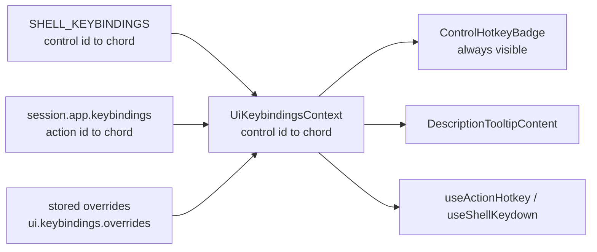

once confirmed, reopen the covering ticket (repo MCP was unavailable last session; the folder `.repo/tickets/26/08/03/DEFAULT-DRIVER-AFFORDANCES` was created by hand) or open a new one before editing.

# Show Every Hotkey Under The Default Driver

## Problem

Three independent gaps, all verified:

- Chords are declared in three unrelated places and never reconciled: app manifests (`AppDefinition.keybindings`, 23 plugin call sites via `AppBuilder::keybinding`), hardcoded TypeScript literals (`PANEL_TOGGLE_HOTKEYS`, `useActionHotkey("mod+p")`, and the introduction's `useHotkeys("escape"| "enter,arrowright"| "arrowleft")` at lines 7704-7706), and an unused optional `hotkey` field on i18n leaves. Not one chrome bundle leaf actually sets `hotkey`, so no button can surface one.
- No chrome control can display a chord. `ButtonGroupItem` (line 13159) and `ToggleGroupItem` (line 14999) take only `id`/`icon`/`text`. Only context menus and the palette show shortcuts. The one existing display path, `DescriptionTooltipContent`, is hover-only, which the default driver forbids.
- Nothing is configurable. `useActionHotkey`'s `configuration.overrides` has no caller, there is no persistence key, no settings tab, and the `navigate-to-hotkey` event dispatched from tooltip kbd elements has no listener anywhere.

The existing chord map is keyed by **action id** (`buildKeysByActionId`), but chrome controls are identified by **control id** (`ui.introduction.next`, `ui.panelToggle.settings`). Bridging those two is the core of this work.

## Architecture

One registry keyed by control id, layered lowest to highest precedence, consumed by both the binder and the renderer so display and behaviour cannot drift.

## Files

- [ui-react chrome](🧰️framework/🔨️modules/🖱️ui/⚛️react/⚡️implementations/🟦️typescript/📦️index.tsx) - driver axis, registry, badge, storage, introduction.
- [OS react renderer](🧰️framework/🛍️products/💻️os/🔨️modules/📺️renderer/🧑️‍🎨️engine/⚛️react/⚡️implementations/🟦️typescript/📦️index.tsx) - registry provider, settings tab, persistence wiring.
- [ui-wgpu painter](🧰️framework/🔨️modules/🖱️ui/🧊️wgpu/⚡️implementations/🦀️rust/📦️lib.rs) and [OS wgpu renderer](🧰️framework/🛍️products/💻️os/🔨️modules/📺️renderer/🧑️‍🎨️engine/🧊️wgpu/⚡️implementations/🦀️rust/📦️lib.rs) - parity for the painted shell.
- [lint gates](🧰️framework/🔨️modules/🖱️ui/⚛️react/⚡️implementations/🟦️typescript/📜️script.ts) - `check-chrome-i18n`, `check-ui-primitives`.

## Work

### 1. Driver axis

Add `UiDriverHotkeys = "inline" | "tooltip" | "none"` next to `UiDriverTooltips` (line 2850), add `hotkeys` to `UiDriver`, to `parseUiDriver`'s strict axis validation, and to `serializeUiDriver` output. `DEFAULT_UI_DRIVER` gets `hotkeys: "inline"`; `COMPACT_UI_DRIVER` gets `"none"` (it is already icons-only with no tooltips). Add the axis row to the driver editor via `driverAxisSelectRow` (OS renderer line 11900) plus `settings.driver.hotkeys` and its three option labels in both `en` and `de` bundles.

### 2. One registry, one formatter

Move `parseKeybindingChords` and `formatKeybindingShortcut` (OS renderer lines 4580-4645) into ui-react so the chrome owns formatting, re-export them for the OS renderer, and delete `formatModShortcut` (line 2643) in favour of the general formatter. Add:

- `UiKeybindingsContext: ReadonlyMap<string, string>` plus `UiKeybindingsProvider`, mirroring `AppKeybindingsContext`.
- `useControlHotkey(id?: string): string | undefined` returning the platform-formatted chord, mirroring `useControlAccessibleLabel` (line 3627) and reusing `resolveControlLabelId`'s id-normalisation so `ui.panelToggle.*` and `ui.nav.*` resolve.

The OS renderer composes the map value once in `FrameworkOsShell` (next to `buildKeysByActionId`, line 9919): shell table, then declarative control ids resolved through `keysByActionId` off each node's `control.action.action`, then user overrides.

### 3. Shell chord table replaces every literal

Add `SHELL_KEYBINDINGS: Record<string, string>` keyed by control id, absorbing `PANEL_TOGGLE_HOTKEYS` as `ui.panelToggle.*` entries and adding `ui.search.toggle` (`mod+p`), `ui.find.toggle` (`mod+f`), `ui.nav.back`/`forward`/`up` (`mod+[`, `mod+]`, `mod+up`), and the introduction: `ui.introduction.skip` (`escape`), `ui.introduction.next` (`enter,arrowright`), `ui.introduction.back` (`arrowleft`).

Then rewrite the consumers to read from it, so a chord exists in exactly one place:

- `UIIntroduction` lines 7704-7706 bind from the table instead of literals, and its footer `Button`s (lines 7803-7804) plus the `close` control automatically show the chord through the badge.
- `usePanelChromeHotkeys` (line 6178) iterates the table.
- The OS shell's five `useActionHotkey` calls (around line 8081) pass the table's control id.
- `UIDialog`'s `escape`/`enter` bindings (line 8381) register as `ui.dialog.cancel`/`ui.dialog.submit`.

Reserved-chord logic in Rust (`is_reserved_shell_chord`) reads the same set, so it cannot fall behind.

### 4. Render the badge

Add `ControlHotkeyBadge({ id })` rendering `` with the muted, monospace styling already used by `contextMenuShortcutClassName` (line 1926) and the tooltip kbd (line 11769). Visible when `driver.hotkeys === "inline"` and a chord resolves. Because an icons-only square control has no room, an inline badge requires an inline label; when `driver.labels === "icons"` the chord degrades to the tooltip if tooltips are enabled.

Insert it after the `inline-label` span in `ButtonGroupItem` (line 13196) and `ToggleGroupItem` (line 15022), then propagate to every remaining control surface: `PanelTabButton` (line 9196), `WindowPaneChromeToggle` (line 20849), ribbon items (line 22077), tree row actions (`UiTreeItemAction` render, line 17258), `CommandItem` (line 11335, replacing the caller-supplied `CommandShortcut`), and `DragHandle` (line 8721).

### 5. Tooltip reads the registry

`DescriptionTooltipContent` (line 11790) and `EnhancedTooltipContent` (line 11721) currently read only the i18n `hotkey` field. Point them at `useControlHotkey` so badge and tooltip share the source, and drop the now-redundant `hotkey` field from `UiLabelValue` (line 3702) along with `useTranslatedHotkey`, since chords are no longer localizable per-leaf.

### 6. User configurability

Mirror the custom-driver persistence pattern (lines 3295-3325):

- `UI_KEYBINDING_OVERRIDES_STORAGE_KEY = "ui.keybindings.overrides"`, with `readStoredUiKeybindingOverrides` / `writeStoredUiKeybindingOverrides` and a strict `parseUiKeybindingOverrides` that drops entries whose control id fails `ELEMENT_ID_PATTERN` or whose chord fails `parseKeybindingChords`.
- Shell store fields next to `uiCustomDrivers` (OS renderer line 2154), a reducer action, and a write in the existing persist effect (line 8037).
- A new `ui.settings.tab.keybindings` entry in `UiTranslationSchema` (line 3868) plus both bundles, a `singleTreeLeaf` in `createFrameworkSettingsPanelTabs` (line 12223), and `buildSettingsKeybindingsTree` listing every registry entry as a `TreeDataItem` with the localized control label, the current chord, a capture control that records the next chord pressed, and a reset action. Conflicts are flagged inline.
- Feed the resolved overrides into `useActionHotkey`'s existing `configuration.overrides` so rebinding actually takes effect, and add the missing `navigate-to-hotkey` listener in `FrameworkOsShell` to open this tab focused on the clicked control.

### 7. Painted-shell parity

The wgpu path must not diverge: port `format_keybinding_shortcut` to Rust, apply it where context menus currently paint raw `mod+z` (OS wgpu line 22361, spec built at line 16363), and extend `paint_button` (line 11532) and `paint_toggle` (line 11652) to draw the chord glyph under the inline policy, resolving through the same action-to-chord map.

### 8. Repo-wide sweep

Audit all 23 plugin `.keybinding(...)` call sites so every bound action has a control that resolves a chord, and grep for any remaining hardcoded chord literal in TypeScript or Rust to fold into the table.

### 9. Verify

Vitest: axis parse/serialize round-trip, badge shown under default and absent under compact, badge suppressed for icons-only with tooltip fallback, override precedence over app and shell layers, and an introduction test asserting the same chord is both bound and displayed. Cargo tests for the Rust formatter and painter. Then run `check-chrome-i18n`, `check-ui-primitives`, `typecheck`, and `cargo check`, and confirm runtime behaviour with temporary `[DEBUG]` logs before removing them.