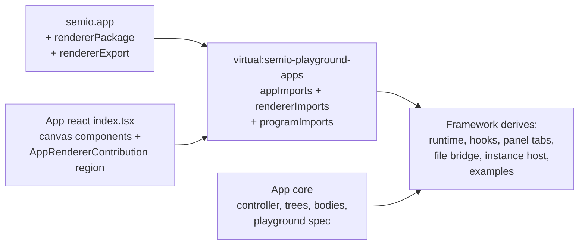

# Delete the Play-Host Layer — Zero-Configuration Playgrounds

## Current state and target

Investigation (23 `play-host.tsx` files, ~10,500 lines) shows ~54% is copy-paste identical structure and ~27% is panel wiring whose data already lives in core. Target: `**play-host.tsx` files and `./play` package exports cease to exist.\*\* An app consists of:

1. `semio.app` manifest (now also naming its renderer package/export)
2. Core: controller class, tree/window-body builders, playground spec (ids, layout, modes, examples)
3. React `index.tsx`: canvas components + one `AppRendererContribution` region (surfaceHosts + optional preload/instanceHost/mountChrome)

## Part 1 — Renderer resolution from manifest (kills `loadRenderer`)

- Add `rendererPackage: string` and `rendererExport: string` to `PlaygroundAppManifest` in [repo/lib/js/index.ts](repo/lib/js/index.ts) (e.g. `"@semio-tech/draw-react"` / `"drawAppRenderer"`).
- `playgroundAppsVirtualModulePlugin` in [ui/styling/vite-elements-assets.ts](ui/styling/vite-elements-assets.ts) emits a third map `playgroundRendererImports: { [kind]: async () => contribution }`.
- `bootPlaygroundApp` ([framework/product/playground/renderer/react/index.tsx](framework/product/playground/renderer/react/index.tsx)) and `ensureOsAppContributionByKind` ([framework/product/os/renderer/react/app-contribution-registry.ts](framework/product/os/renderer/react/app-contribution-registry.ts)) load the contribution from `playgroundRendererImports` instead of `app.loadRenderer()`.
- Delete `loadRenderer` from `PlaygroundAppDefinition` / `PlaygroundAppConfig` / `AppDefinition` and from every app core — cores no longer import their react package at all.
- Delete the `"./play"` export from all 23 react package.json files.

## Part 2 — Derived runtime and generic state subscription

- Extend `createPlaygroundApp` ([framework/product/playground/core/js/index.ts](framework/product/playground/core/js/index.ts)) so `createRuntime` is derived: config gains `createController: (bus, notify) => Controller`, `layout: WindowLayout`, optional `example?: { defaultId, hasExample(id) }` and optional `buildAppRuntime` override for outliers (lowpoly 2-mode, puzzle2d/3d, s). Framework performs the canonical 4-step flow (platform → controller → setActiveExample → `createPlayAppRuntime`); ~20 app cores drop their `createRuntime` + one-line `buildXxxPlayAppRuntime` wrappers.
- Add generic `usePlayController<T>(runtime?)` to [framework/product/playground/renderer/react/index.tsx](framework/product/playground/renderer/react/index.tsx) unifying the three subscription variants (runtime generation, chrome generation, `subscribeSnapshot` + `getInteractionRevision`); delete every per-app `useXxxPlayController` + module-level controller ref.

## Part 3 — Panel tabs fully declarative (core-owned)

Adopt the existing puzzle3d path for all apps:

- Panel trees become core `sidePanelBodies` factories `(ctx: SidePanelBodyViewContext) => UiTreeNode` reading the controller from `ctx` (they already are pure `buildXxxPlayDocumentTree` functions in core).
- Tabs declared as `SideTabSpec[]` (iconId strings, bodyKey) on the app runtime in core; `PlaygroundView` already derives tabs via `sideTabsToPanelTabs`.
- Delete all `PureSidePanelTabDefinition` / `CallbackTreePanelDefinition` subclass usage in apps (~60 lines x 20 apps). Tree drag controllers become a per-tab option on `SideTabSpec` routed through the existing `treeDragController` contribution field.

## Part 4 — Generic bridges, instance hosts, examples

- `createFixtureFileBridge({ filename, accept, getJson, applyJson })` in playground renderer replaces the identical `XxxPlayFileBridge` in draw/note/raster/shooting/procedural.
- `createOsInstanceHost({ Canvas, materialize, dispatch })` factory in [framework/product/os/renderer/react](framework/product/os/renderer/react) wraps the `useOsInstanceMaterialization` + `OsUpstreamBadge` boilerplate; apps supply pure callbacks (from core) + canvas component.
- Examples auto-derived: when a contribution has no explicit `examples` and the app controller implements `PlaygroundExampleHost`, the framework wires `controllerBackedExampleContribution` automatically — apps stop declaring it.

## Part 5 — Migrate all 23 apps, delete play-host.tsx

For each app (draw, note, writer, forms, raster, flow, gis-2d, procedural-2d/3d, shooting, trinity, puzzle-2d/3d/5d, presentation, sequence, layout, imperative, lowpoly, vcs, cad, s, dag, wires):

- Move genuinely app-specific React (canvas surface hosts, custom orchestration/contexts for puzzle2d/trinity/s, `mountChrome`) into a `//#region 🔖️PlayHost` in the app's react `index.tsx`; export `xxxAppRenderer` from there.
- Move panel trees/tab specs and instance-host callbacks to core per Parts 2–4.
- Update `semio.app` manifest with `rendererPackage`/`rendererExport`; delete `play-host.tsx` and the `./play` export.
- Heavy apps (puzzle2d ~3k lines, s, trinity, presentation) keep their orchestration code but relocated into their react index region — no separate host file, no framework special-case.

## Verification

- Tests: `repo-lib`, `ui-styling`, `framework-platform-core`, `framework-playground-core`, `framework-playground-renderer-react`, `framework-os-core/renderer`, `s-core`, every migrated app core/react; dependency-cruiser.
- Boot draw, puzzle 2d, cad, gis 2d, S/OS studio with `[DEBUG]` logs confirming derived runtime, panel tabs, examples, file bridge, and OS instance hosts.

## Work tracking

Continue in the `APP-ISOLATION-ENFORCED-BOUNDARIES` ticket (`.repo/🎫️/26/07/03/`).
