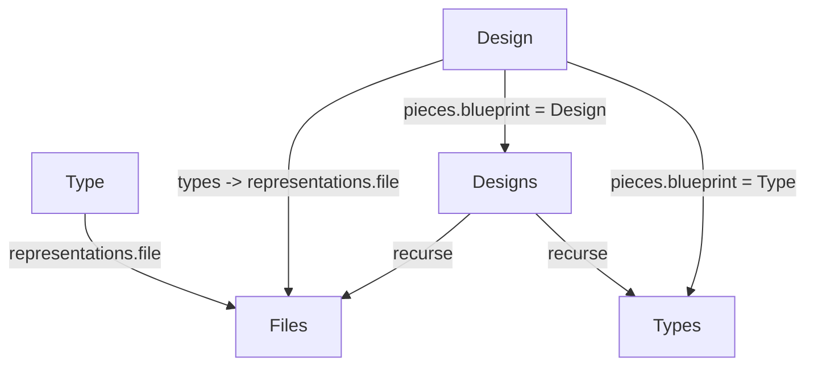

# Derived reference computed properties (semio)

## Goal

The kit graph currently has no computed properties that traverse indirect references. Add them so that:

- A **Type** exposes the **files** it references indirectly via its representations.
- A **Design** exposes the **types**, **designs**, and **files** it references indirectly via its pieces' blueprints — with both a **direct** (one hop over this design's own pieces) and a **transitive** (recursive through nested `Design` blueprints, cycle-guarded) variant, per the chosen "both" option.

All authoritative logic lives in Rust (`semio/rs`); the golden GraphQL SDL and the thin JS wrapper are kept in sync. No other bindings are touched (JS only).

## Current state (verified)

- `Representation` holds `file: RwLock<Option<File>>`; `Type` holds `representations: Vec<Arc<Representation>>`. ([lib.rs L2614-2627, L2725-2748](semio/client/lib/rs/lib.rs))
- `Piece.blueprint: RwLock<Blueprint>` where `Blueprint = Type(Arc<Type>) | Design(Arc<Design>)`; `Design` holds `pieces: Vec<Arc<Piece>>` and `owner_kit: Weak<Kit>`. ([lib.rs L2954-3016, L3472-3494](semio/client/lib/rs/lib.rs))
- `Design::references` (DesignConnection) and `Design::referenced_by` (PieceConnection) already exist but are **stubs returning empty**. ([lib.rs L3643-3649](semio/client/lib/rs/lib.rs))
- Relay helpers exist: `FileConnection`, `TypeConnection::from_types`, `DesignConnection::from_designs`, `PieceConnection::from_pieces`. ([lib.rs L1042-1212](semio/client/lib/rs/lib.rs))
- Golden SDL declares `Design.references/referencedBy` but no `Type.files`, `Design.types/files`. ([schema.golden.graphql L5460-5504, L8281-8326](semio/client/schema/graphql/schema.golden.graphql))
- JS facade fields are wired via `defineBoundKitFields` + `installEntityKitMethods`; foreign-owned entities are produced as `new Ctor(entity.session, id, entity.storeId)` (see `authors` at [index.ts L2842](semio/client/lib/js/index.ts)). A `File` facade already exists ([index.ts L3852](semio/client/lib/js/index.ts)).
- `schema_matches_target_graphql_file` only checks top-level declaration names, so adding fields to existing types does not break it; the connection types reused already exist. ([lib.rs L15778](semio/client/lib/rs/lib.rs))

## Proposed field set (naming)

On `Type`:

- `files: FileConnection!` — distinct files across all representations (Types do not nest, so direct == transitive).

On `Design` (direct, one hop over this design's own pieces):

- `types: TypeConnection!` — distinct `Type` blueprints.
- `designs: DesignConnection!` — distinct `Design` blueprints.
- `files: FileConnection!` — distinct files from representations of the direct `Type`-blueprint pieces.

On `Design` (transitive, recursive through `Design` blueprints, visited-set guarded):

- `allTypes: TypeConnection!`
- `allDesigns: DesignConnection!`
- `allFiles: FileConnection!`

On `Design` (inverse, implement the existing stub):

- `referencedBy: PieceConnection!` — pieces anywhere in the owner kit whose `Design` blueprint is this design.

The current stub `references` is **renamed to `designs`** (clearer, paired with `allDesigns`); no backwards-compat alias is kept (per repo rules).

## Implementation

### 1. Rust resolvers + helpers ([semio/client/lib/rs/lib.rs](semio/client/lib/rs/lib.rs))

- In the `Type` `#[Object]` impl (near `representations`, L2891), add `files()` returning `FileConnection::from_entities(...)`: iterate `self.representations`, read each `representation.file`, dedup by `File.id`, preserve order.
- In the `Design` `#[Object]` impl (replace stub block L3643-3649), add:
  - private async helpers on `impl Design` (non-GraphQL, inside the type's region) to collect direct blueprints from `self.pieces[].blueprint` into ordered, deduped `Vec<Arc<Type>>` / `Vec<Arc<Design>>`.
  - `types()`, `designs()`, `files()` (direct).
  - `all_types()`, `all_designs()`, `all_files()` (transitive): iterative worklist over `Design` blueprints with a `HashSet<Id>` visited guard; `all_files` unions each visited design's direct Type-blueprint files; dedup all results by id.
  - `referenced_by()`: upgrade `owner_kit`, iterate every design's pieces, collect pieces whose blueprint is `Design(d)` with `d.id == self.id`.
  - remove the old `references()` resolver.
- Each new resolver carries a docstring starting with a unique emoji (repo rule); keep everything inside existing `//#region` blocks.

### 2. Golden GraphQL SDL ([semio/client/schema/graphql/schema.golden.graphql](semio/client/schema/graphql/schema.golden.graphql))

- Add to `type Type` (after `representation(id)` / `bestRepresentation`): `files: FileConnection! # computed`.
- In `type Design`: replace `references: DesignConnection!` with `types`, `designs`, `files`, `allTypes`, `allDesigns`, `allFiles` (`# computed`), keeping `referencedBy: PieceConnection! # computed`.
- Mirror the same edits in the generated/companion `client/schema/graphql/schema.graphql` (regenerate via the rs/schema script if it is build-generated; otherwise hand-edit to match).

### 3. JS wrapper ([semio/client/lib/js/index.ts](semio/client/lib/js/index.ts))

- `Type`: add `declare files: () => Promise<readonly File[]>;` and a `TYPE_FIELDS` entry with selection `files { edges { node { id } } }`, parsing ids to `new File(entity.session, id, entity.storeId)`.
- `Design`: add `declare types`, `designs`, `files`, `allTypes`, `allDesigns`, `allFiles`, `referencedBy` accessors and matching `DESIGN_FIELDS` entries; map ids to `new Type/Design/File/Piece(entity.session, id, entity.storeId)` (foreign-owned, kit-root scoped). Reuse `parseDesignBranchConnection` for the `design { ... }` fragment shape.

## Tests (extend existing files only)

- Rust `mod tests` ([lib.rs L15684+](semio/client/lib/rs/lib.rs)): extend in the style of `install_projection_graphql_hydrates_kit_types` (L16250) — install a projection with a type that has a representation→file, and a design whose pieces reference that type and a nested design; assert `type.files`, `design.types/design/files`, transitive `allTypes/allDesigns/allFiles`, and `referencedBy` via GraphQL. Include a cycle case (design referencing a design that references back) to prove the visited guard terminates.
- JS embedded tests ([index.ts L4019+](semio/client/lib/js/index.ts), `SEMIO_JS_RUN_EMBEDDED_TESTS=1`): assert the new accessors are installed (`typeof Type.prototype.files === "function"`, etc.) and exercise them against the in-memory rs pipeline used by the existing "runs the in-memory rs graphql js pipeline" test.
- Run via `nx`/`bun` per repo tooling: Rust tests (with `SEMIO_GOLDEN_STRICT=1`) and `bunx vitest`.

## Process (repo rules)

- Before editing: read `repo://goals` and open a ticket via the repo MCP (`ticket_open`) for this work; keep any temp/log files inside the ticket folder. Add `[DEBUG]`  prefixed logs only if needed to confirm runtime behavior, then remove. Close the ticket (`ticket_close`) with a summary and file list when done.

