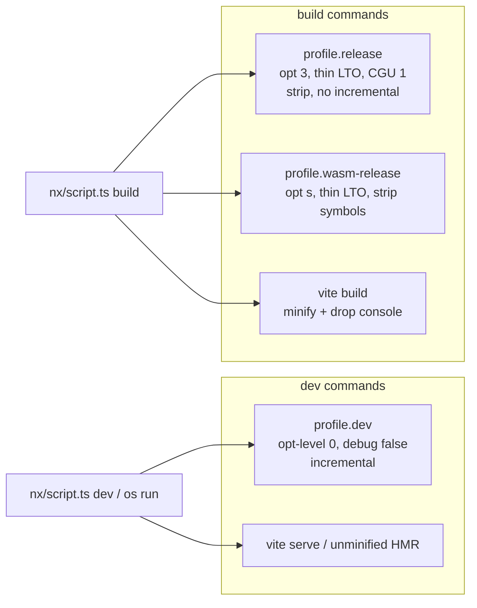

# Align Dev And Build Optimization Profiles

## Context

Closed ticket [OPTIMIZE-TOOLCHAINS-FOR-MAXIMUM-COMPILE-SPEED](.🦑️repo/🎫️tickets/🎆️26/🌙️07/☀️19/OPTIMIZE-TOOLCHAINS-FOR-MAXIMUM-COMPILE-SPEED) correctly stripped stepper/debuginfo from **dev**, but also made **`[profile.release]` compile-fast** (`codegen-units = 256`, `lto = "off"`, `incremental = true`). That conflicts with this request: **build** configs must maximize runtime speed and minimize size.

Agent-first debugging (console only, no adapters) is already largely in place: `debug = false` on `[profile.dev]`, C# `DebugType=none`, `launch.json` is all `node-terminal`, TS has no `sourceMap`. Gaps are mostly **Vite production** (several `minify: false`, preload inline sourcemaps) and the **native release profile**.

Goal association: **AI-OPTIMIZED-REPO**. New ticket (do not reopen OPTIMIZE-TOOLCHAINS — that ticket’s release tradeoff is what we reverse). Repo MCP is not connected in this session; open the ticket via the repo CLI on execution.



## Chosen approach

**Cargo-conventional split (no mid-tier profile):**

| Mode | Cargo | Vite / other |
|------|-------|--------------|
| **dev** | `[profile.dev]` only — no `--release` on `os run`, wgpu native cad, repo-cli dashboard | serve/HMR; no sourcemaps; no minify cost on hot paths |
| **build** | `[profile.release]` = true ship profile; plugins stay on `[profile.wasm-release]` | production minify, `drop: ['console','debugger']`, `sourcemap: false` |

Daily agent loops stay on `dev` (fast compile). Shipping/`build` targets pay LTO once.

## 1. Rust profiles — [Cargo.toml](Cargo.toml)

**Keep `[profile.dev]`** as-is (`debug = false`, `incremental = true`, build-override `opt-level = 3`).

**Rewrite `[profile.release]`** from compile-speed to ship:

```toml
[profile.release]
opt-level = 3
lto = "thin"
codegen-units = 1
strip = "debuginfo"   # native; wasm-release overrides to "symbols"
incremental = false
trim-paths = "object"
```

- Remove `[profile.release.package.semio-framework-os-kernel-store] codegen-units = 16` (redundant once workspace CGU is 1; also fixes the LLVM wasm shard issue for anything still built under `release`).
- **Keep `[profile.wasm-release]`** as documented (opt `"s"`, thin LTO, `strip = "symbols"`, etc.) — already matches build goals for plugins.
- Update the long comment block so it no longer claims release is the fast-iteration profile.

## 2. Route `dev` scripts off `--release`

These currently force `--release` and would become painfully slow after the flip; they are **dev** entrypoints:

- [📜️script.ts](📜️script.ts) `os run` → drop `--release` (use `profile.dev`)
- [wgpu `📜️script.ts`](🧰️framework/🛍️products/💻️os/🔨️modules/📺️renderer/🧑️‍🎨️engine/🧊️wgpu/⚡️implementations/🦀️rust/📜️script.ts) native `build`/`run` defaults → no `--release` unless `--dist` / explicit build flag
- [repo-cli `📜️script.ts`](🧰️framework/🛍️products/🦑️repo/🔨️modules/⌨️cli/⚡️implementations/🦀️rust/📜️script.ts) dashboard `run` → `cargo build` without `--release`

**Keep `--release` / `wasm-release` on true build scripts** (compose hub/gql/rs/query, hub rust, surface wasm-pack callers, plugin fleet default `SEMIO_PLUGIN_PROFILE=wasm-release`).

Document in comments: `SEMIO_PLUGIN_PROFILE=release` escape hatch now means “full native-style release on wasm” (slow + large relative to `wasm-release`), not “fast iterate”.

## 3. Vite — production size/speed; kill leftover debug weight

Add a shared helper (extend existing [🟦️vite-elements-assets.ts](🧰️framework/🔨️modules/🖱️ui/🎨️styling/⚡️implementations/🦀️rust/🟦️vite-elements-assets.ts) or co-located export) e.g. `semioViteProductionBuild()`:

```ts
{
  target: "es2022",
  sourcemap: false,
  minify: "esbuild",
  cssMinify: true,
  reportCompressedSize: false, // faster builds
  esbuild: { drop: ["console", "debugger"], legalComments: "none" },
}
```

Apply on **production** `build` in:

- [♻️mit-bestand/…/⚙️vite.config.ts](♻️mit-bestand/🧺️demonstrator/⚙️vite.config.ts)
- [os/dev ⚙️vite.config.ts](🧰️framework/🛍️products/💻️os/🔨️modules/🧑️‍💻️dev/⚡️implementations/🟦️typescript/⚙️vite.config.ts)
- sketchpad / play vite configs under `compose/client/lib/sketchpad/`
- [compose vscode vite](compose/client/ui/vscode/js/vite.config.ts) — flip `minify: false` → production minify (both webview + extension)
- [repo vscode vite](🧰️framework/🛍️products/🦑️repo/🔨️modules/💻️client/🧩️vscode/⚡️implementations/🟦️typescript/⚙️vite.config.ts) — same
- [vite.preload.config.ts](compose/client/ui/desktop/js/vite.preload.config.ts) — `sourcemap: "inline"` → `false`; enable minify for production

Leave **dev server** paths without minify/drop (HMR speed).

## 4. Other toolchains (small, consistent)

- **Go** (repo client build in [repo cli TS script](🧰️framework/🛍️products/🦑️repo/🔨️modules/💻️client/⌨️cli/⚡️implementations/🟦️typescript/📜️script.ts) / MCP bootstrap): for **build**/dist, add `-trimpath -ldflags="-s -w"`; leave plain `go build` for local `dev` rebuilds if split exists, otherwise apply only on release/pack paths.
- **CMake** ([CMakePresets.json](CMakePresets.json)): add Release configure/build presets for linux/macos (today `ninja-base` is Debug-only; Windows build preset already uses Release). Wire any existing `build` C++ targets to Release.
- **TS / C# / launch.json**: no structural change (already agent-first). Spot-check no new `sourceMap` / debug adapters creep in.

## 5. Ticket + verification

On execution:

1. List goals (already: AI-OPTIMIZED-REPO), open ticket via `bun …/⌨️cli/…/📜️script.ts dev ticket open` (MCP unavailable).
2. Apply changes above; put any temp logs under the ticket folder.
3. Verify:
   - `cargo build -p semio-framework-os-run` (dev profile) completes; confirm no DWARF bloat expectation via `debug=false`.
   - `cargo build -p semio-framework-os-run --release` uses new flags (spot-check `cargo metadata` / build log for LTO).
   - One plugin `wasm-release` build still lands under `target/wasm32-wasip2/wasm-release/`.
   - One `vite build` (demonstrator or os/dev) emits no `.map`, minified JS, no leftover `console` in a sample chunk.
4. Close ticket with summary + file list.

## Out of scope

- Cranelift / panic=abort / Nx daemon (already rejected in OPTIMIZE-TOOLCHAINS).
- Changing product code to remove `console.log` at source (build-time `drop` covers shipping bundles).
- Mixing compose vs mit-bestand features beyond shared vite helper + their own configs.