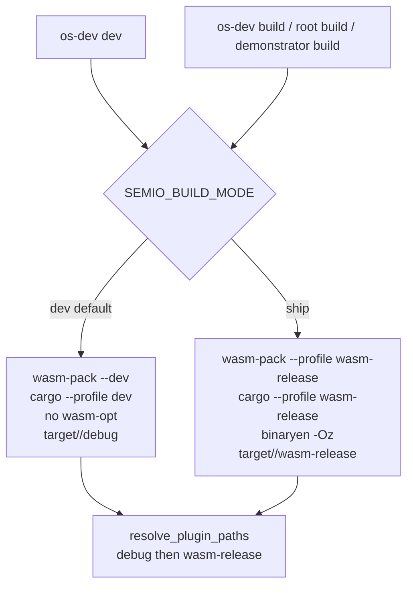

# Dev Wasm Fast Path

## Why dev still optimizes

`bun nx run @semio-tech/framework-os-dev:dev` calls `buildEngineWasm` and `buildPlugins`, and both are pinned to ship settings:

- [os/dev script.ts](🧰️framework/🛍️products/💻️os/🔨️modules/🧑️‍💻️dev/⚡️implementations/🟦️typescript/📜️script.ts) line 50: `const PLUGIN_WASM_PROFILE = process.env.SEMIO_PLUGIN_PROFILE ?? "wasm-release"`, plus `optimizePluginCoreModules` running binaryen `-Oz` on every plugin.
- Seven engine crates hardcode `profile: "wasm-release"` in their own `📜️script.ts` (node-graph, board-2d, editor, paint, terrain, tiled-map, flow-core). wasm-pack maps any custom profile name onto `[package.metadata.wasm-pack.profile.custom]`, which in those crates carries the `-Oz` arg list, producing the `Optimizing wasm binaries with wasm-opt` line.
- The other 23 wasm-pack crates pass no profile, so they default to `release`, which after the last change means thin LTO plus `codegen-units = 1`. Dev currently pays the most expensive Rust profile in the repo.




Decision: dev uses plain `[profile.dev]` (opt-level 0), no wasm-opt anywhere. `os run` resolves artifacts profile-aware, trying `debug` before `wasm-release`.

## 1. Central build-mode resolution

In [repo lib index.ts](🧰️framework/🛍️products/🦑️repo/🔨️modules/📚️library/⚡️implementations/🟦️typescript/📦️index.ts), add a region beside `runWasmPackWebBuild`:

```ts
export type SemioBuildMode = "dev" | "ship";
export function semioBuildMode(): SemioBuildMode;      // "ship" only when SEMIO_BUILD_MODE=ship
export function semioShipEnv(): NodeJS.ProcessEnv;     // { ...process.env, SEMIO_BUILD_MODE: "ship" }
export function cargoProfileDir(profile: string): string; // "dev" -> "debug", else identity
```

Rename `runWasmPackWebBuild`'s `profile` option to `shipProfile` (default `"release"`) and resolve internally: `const profile = semioBuildMode() === "ship" ? shipProfile : "dev"`. The existing `--dev` and `cargoProfileDir` branches already handle the dev case, so wasm-pack skips wasm-opt by its own dev-profile default.

Update the seven crates that pass `profile: "wasm-release"` to `shipProfile: "wasm-release"`; the other 23 callers keep passing nothing.

## 2. Drop dev-only weight from wasm-pack glue

Every `Cargo.toml` that already declares `[package.metadata.wasm-pack.profile.release]` (33 crates) gains an explicit dev section so nothing debug-shaped ships into dev bundles:

```toml
[package.metadata.wasm-pack.profile.dev]
wasm-opt = false
debug-js-glue = false
dwarf-debug-info = false
demangle-name-section = true
```

`demangle-name-section` stays on: wasm stack traces in the console are the only debugging channel left.

## 3. Plugin components in dev

In [os/dev script.ts](🧰️framework/🛍️products/💻️os/🔨️modules/💻️os/🔨️modules/🧑️‍💻️dev/⚡️implementations/🟦️typescript/📜️script.ts):

- `PLUGIN_WASM_PROFILE` becomes mode-driven: `process.env.SEMIO_PLUGIN_PROFILE ?? (semioBuildMode() === "ship" ? "wasm-release" : "dev")`.
- `buildPlugin`'s artifact path uses `cargoProfileDir(PLUGIN_WASM_PROFILE)` so the dev profile reads `target/wasm32-wasip2/debug/`.
- `optimizePluginCoreModules` returns early unless `semioBuildMode() === "ship"`, keeping `SEMIO_WASM_OPT=0` as a ship-side kill switch and `SEMIO_WASM_OPT_BIN` as-is. Update its docstring accordingly.
- `BuildScript` sets `process.env.SEMIO_BUILD_MODE = "ship"` before `PluginBuildScript` / `buildEngineWasm` / `vite build`, so spawned `bun <crate>/📜️script.ts wasm` children inherit ship mode. `DevScript` leaves the default.

## 4. Profile-aware artifact resolution

- [registry script.ts](🧰️framework/🛍️products/💻️os/🔨️modules/🔌️plugin/⚡️implementations/🟦️typescript/📇️registry/📜️script.ts) `emitRustArtifacts` stops baking the profile dir. Emit instead:

```rust
pub const PLUGIN_WASM_TARGET_DIR: &str = "target/wasm32-wasip2";
pub const PLUGIN_WASM_PROFILE_DIRS: &[&str] = &["debug", "wasm-release"];
pub const PLUGIN_WASM_ARTIFACTS: &[(&str, &str)] = &[ /* (plugin id, wasmOut file name) */ ];
```

- [os/run bin.rs](🧰️framework/🛍️products/💻️os/🔨️modules/🏃️run/⚡️implementations/🦀️rust/📦️bin.rs) `resolve_plugin_paths` joins `repo_root / PLUGIN_WASM_TARGET_DIR / <profile dir> / <file>` over `PLUGIN_WASM_PROFILE_DIRS` in order, taking the first existing file and listing every candidate path in the error when none exist.
- [root script.ts](📜️script.ts) `missingPluginWasmArtifacts` mirrors that candidate order instead of the hardwired `pluginWasmProfileRoot`, and its docstring stops claiming a single wasm-release path.

## 5. Remaining ship entrypoints

- [root script.ts](📜️script.ts) `BuildScript` (line 885) passes `env: semioShipEnv()` on its `nx run-many -t build`, `nx run workspace:build-storybook`, and `sites` invocations.
- [demonstrator script.ts](♻️mit-bestand/🧺️demonstrator/📜️script.ts) `BuildScript` sets ship mode before `buildDemonstratorPlugins()`; its `DevScript` stays dev.
- Wgpu native/trunk gating from the previous pass stays as-is (`--dist`/`--release` opt in).

## 6. Verification

Run inside the reopened ticket folder, capturing logs there:

1. `bun nx run @semio-tech/framework-os-dev:dev note` and confirm the engine lines read `wasm-pack build --dev`, no `Optimizing wasm binaries with wasm-opt`, plugin log line shows `(wasm32-wasip2, dev)`, and `Finished dev profile [unoptimized]`.
2. Confirm `target/wasm32-wasip2/debug/` holds the built plugin component and the shell boots (console log from the dev server plus one plugin install line).
3. `SEMIO_BUILD_MODE=ship bun <node-graph crate>/📜️script.ts wasm` still logs `--profile wasm-release` and the wasm-opt pass.
4. `bun ./📜️script.ts os run <bundle>.studio --dry` plus one non-dry run against dev-profile artifacts to prove `resolve_plugin_paths` finds `debug` first.
5. `cargo check -p semio-framework-os-run` for the generated-artifacts signature change.

Reopen ticket `2026/08/04/ALIGN-DEV-AND-BUILD-OPTIMIZATION-PROFILES` (same task, goal AI-OPTIMIZED-REPO) via the repo CLI, then close it with the updated summary and file list.

## Out of scope

- Raising dev `opt-level` above 0 anywhere.
- Changing `[profile.release]` / `[profile.wasm-release]` contents from the previous pass.
- The pre-existing demonstrator `vite build` worker-path failure already logged in the ticket.

