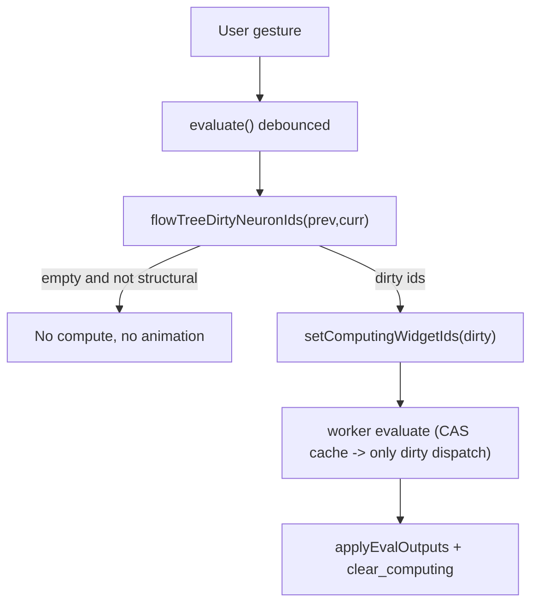

## Problem (root cause)

The CAS Merkle cache already works: the worker `FlowSession` is a singleton, `loadFixtureJson` uses `replace_fixture` (keeps `neural_cache`), and hit/sweep logic in [neural/engine/lib.rs](neural/engine/lib.rs) is correct. So operators are **not** actually re-running for unchanged branches.

What the user sees ("all of them recompute") is the per-node **computing animation**, driven unconditionally on every eval:

```2659:2662:flow/react/index.tsx
        const fixture = session.fixtureJson();
        const computingIds = neuronWidgetIdsFromFixtureJson(fixture);
        session.setComputingWidgetIds(JSON.stringify(computingIds));
        renderFrame();
```

`neuronWidgetIdsFromFixtureJson` returns *every* neuron. Plus `onPointerUp` always calls `evaluate()` (even for pure move/select), with no "did the tree change?" gate, so presentational gestures still kick off a full (cached, but visible) eval pass.

## Fix: predictive dirty set (chosen approach)

Compute the changed node + its downstream in JS, instantly, before the async eval. Light up only those, and skip the eval entirely when nothing tree-relevant changed. Add an authoritative tree-change gate in Rust as a safeguard.

### 1. Predictive dirty-set helper - [flow/react/index.tsx](flow/react/index.tsx)
Add exported, testable `flowTreeDirtyNeuronIds(prevFixtureJson, currFixtureJson): { ids: string[]; structural: boolean }`:
- Parse both; ignore presentational fields (`layout`, `camera`, slider `min`/`max`/`step`, neuron `preview`, preview/expanded/name/flow).
- Compute-relevant per-widget signature: neuron -> `{neuronKind, params, inputPorts}`; inputSlider -> `{value}`; inputNote -> `{text}`; inputImage -> `{src}`; cluster -> `{tree}`. Compare with a recursive key-sorting `canonicalize` to be order-stable (`Dictionary` is an object).
- Dirty roots = nodes whose signature changed, OR whose incoming-synapse set `{from, fromPort, toPort}` changed vs prev (captures reconnect / add / remove-edge, including edges from removed nodes), OR newly added nodes.
- BFS downstream in the current graph via synapses (`from` -> `to`); collect reachable.
- Return neuron/cluster ids; `structural=true` when prev is null/unparseable -> caller treats as all-dirty.

### 2. Use it in `evaluate()` - [flow/react/index.tsx](flow/react/index.tsx) (around line 2651-2702)
- Add `lastEvalFixtureRef = useRef<string|null>(null)`.
- At top of the debounced body: `const dirty = flowTreeDirtyNeuronIds(lastEvalFixtureRef.current, fixture)`.
- If `!dirty.structural && dirty.ids.length === 0`: presentational change -> set `lastEvalFixtureRef.current = fixture`, `renderFrame()`, and return (no `setComputingWidgetIds`, no worker call, no `onEvalOutputs`).
- Otherwise: `session.setComputingWidgetIds(JSON.stringify(dirty.structural ? neuronWidgetIdsFromFixtureJson(fixture) : dirty.ids))` (replaces the all-neurons call), run the existing orchestrator/vitest eval, and set `lastEvalFixtureRef.current = fixture` on success. `applyEvalOutputsJson` still clears computing as today.
- Reset `lastEvalFixtureRef.current = null` in the fixture-prop load effect (line ~2704) so an external fixture load recomputes fully.

### 3. Authoritative tree-change gate (safeguard) - [flow/core/lib.rs](flow/core/lib.rs)
- Add field `last_tree_signature: Option<u64>` to `FlowHost` (init `None` in `from_fixture`).
- Add `fn tree_signature(tree: &Tree, seeds: &HashMap<String, Dictionary>) -> u64` (hash sorted neurons/synapses via `serde_json` + sorted seed entries).
- In `evaluate_internal` (line 1820): compute signature first; if `self.last_tree_signature == Some(sig) && !self.outputs.is_empty()`, return early (keep outputs/`last_eval_json`, skip dispatch + `retain_geometry_handles`); else store sig and proceed. This makes `pointer_up_screen`/native paths and any stray worker eval no-ops when the tree is unchanged, encoding "only a tree change recomputes" at the engine boundary.

### 4. Tests
- [flow/react/index.tsx](flow/react/index.tsx) vitest region: `flowTreeDirtyNeuronIds` - layout-only/camera-only diff -> empty + not structural; reconnect -> target + downstream only; slider `value` change -> downstream neurons; node add/remove; `null` prev -> structural.
- [flow/core/lib.rs](flow/core/lib.rs) tests: `evaluate_internal` skips (dispatch count stable) after a `move_widget`, and recomputes after a reconnect / slider value change; first eval still runs.

## Flow after fix



## Notes
- No worker.ts / worker-client.ts changes needed; prediction is JS-only and correctness stays in the Rust Merkle cache + gate.
- Reconnecting at the head of a chain still recomputes everything downstream (correct); a leaf reconnect lights up only that node.
- Work under the existing ticket; extend existing files/regions only (no new files), per repo rules.