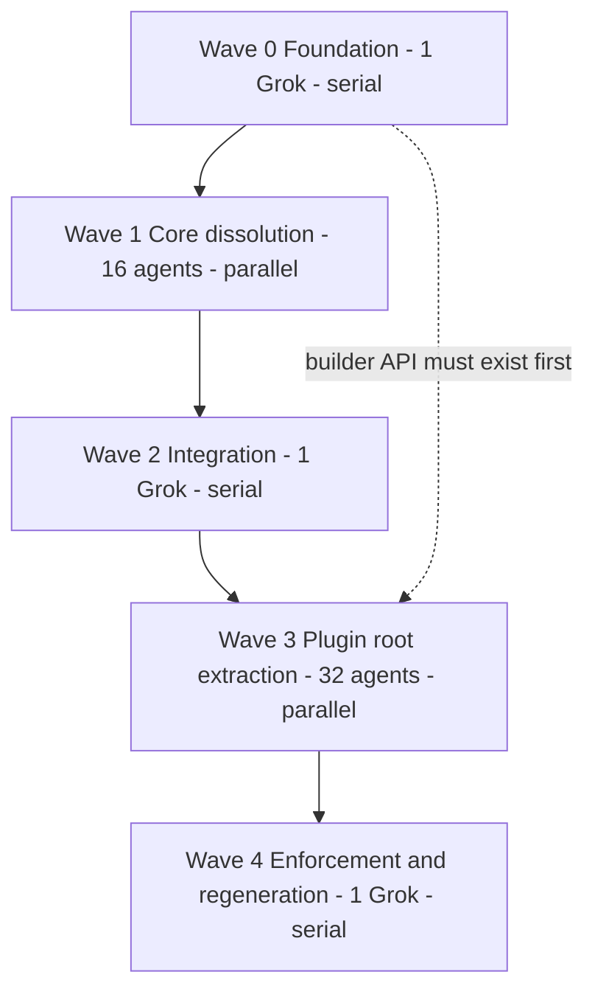

Note on emoji: every path below is verbatim, byte-exact. Directory emoji are identifiers, not decoration.

# 1. Ground truth

Verified by byte-level `find` + `xxd`, not by search:

- **16 `core` folders exist in source** (not 17). `🧰️framework/🛍️products/💻️os/🔨️modules/📡️protocol/🫀️core` **does not exist** — there is no `📡️protocol` module at all; `protocol` / `protocol_core` are only `extern crate self as` aliases. Nothing to do there.
- 14 are named `🫀️core` (`f09fab80 efb88f core`), one is `🎬️core` (animate), one is `🧩core` — **missing the U+FE0F variation selector**, so it is also an emoji-prefix bug. `🔌Ports` under the UI elements core has the same defect.
- **None of the Rust cores are crates.** They are `#[path]`-included modules pulled in from `📦️packages/🦀️rust/📦️glue.rs`. Two exceptions own a real crate: `semio-s-plugin-flow-extension-core` and `semio-s-plugin-imperative-core`.
- **No plugin has any root-level plugin code.** Identity, manifest, capabilities and app registration all live at the tail of `📦️packages/🦀️rust/📦️glue.rs` behind `semio_plugin!` (29 plugins), a manual `PluginBundle` + `plugin_exports!` (space, demonstrator), or nothing at all (energy).
- Enforcement today: the `//#region 🔖️Policy` block in [📜️script.ts](📜️script.ts) (lines 1569-4675, 41 `policy*Breaches` functions), [🔣️taxonomy.json](🧰️framework/🛍️products/🦑️repo/🔨️modules/📚️lib/🔣️taxonomy.json), [.dependency-cruiser.cjs](.dependency-cruiser.cjs), `validateTaxonomyTree` in the plugin registry script, and Rust `assert_taxonomy_components`. The repo documents these as "three validators in lockstep" — all three must change together.
- Repo MCP is **unavailable** (no `repo` namespace). Precedent in this repo is to create the ticket folder by hand plus an `mcp-unavailable.txt`, as several 26/08/07 tickets already do.

# 2. Target vocabulary: per-core dissolution

Three shapes: **lift** (core already has concept subfolders, promote them to siblings), **split** (one grab-bag file becomes several concept folders), **fold** (tiny core merges into the owner's own `🦀️component.rs`).

## Framework

- `**🧰️framework/🔨️modules/🧩core**` (8 files) — LIFT to `🔨️modules/` siblings: `🎯️action-bus` (94), `🖥️platform` (245), `🔺️mesh` (3075), `🛂️manifest` (from `🧩️ui`, 4239 — it is the AppDefinition/PluginManifest/Contribution/CommandDefinition contract, not UI elements), `🧠️kernel` (from `🧩️ui/🧠️kernel`, 626). `🤖️generated` moves under `🛂️manifest/`. The 4090-line `🟦️component.ts` splits into one `🟦️component.ts` per new module. Crate `semio-framework-core` → `semio-framework`; package `@semio-tech/framework-core` → `@semio-tech/framework`. 74 Rust + 151 TS consumers.
- `**🧰️framework/🔨️modules/🖱️ui/🧱️elements/🫀️core**` (13 files, ~2558 lines) — LIFT all 12 subfolders to `🧱️elements/` siblings (`🆔ElementId`, `🌈️Surface`, `🎛️Chrome`, `🏷️ClassNames`, `🏷️Label`, `🏷️UiLabel`, `🐚️ShellScope`, `🐹️ElementProps`, `📚️I18n`, `🔌️Ports` (fix VS16), `🚗️UiDriver`, `🧭️Flow`). No collisions with the 60+ existing element folders. ~59 relative importers, the React barrel, and `🖱️ui/⌨️tui/🦀️component.rs:1343` update.

## OS kernel modules

- `**🌊️flow/🫀️core**` (7915 + `📐️brep-geometry` 563) — SPLIT into siblings under `🌊️flow/`: `📄️document` ~1017, `📚️catalogue` ~298, `📇️registry` ~237, `🌉️bridge` ~400, `🖥️host` ~1967, `🖍️drawing` ~203, `🌉️wasm` ~670, `🌿️vcs` ~1122; lift `📐️brep-geometry` as-is. Retire the `flow_core` alias (`extern crate self as flow_core` → `flow`). 72 consumers. A corrupted duplicate glue file next to `📦️glue.rs` was flagged — verify and delete.
- `**🎒️pack/🫀️core**` (770) — SPLIT: `🆔ids`, `🧾️codec` (varint/bytes/crc), `🚰️source`. 13 consumers via `os_pack::core`.
- `**🛢️db/🫀️core**` (937) — SPLIT: `🆔ids`, `💾️durability` (frontier/fencing), `🎚️policy` (priority/capabilities/config), `🕸️version-graph`. 23 consumers; remove the `db_core` alias and the `pub mod core` facade at `🛢️db/🦀️component.rs:54`.
- `**📡️spr/🫀️core**` (1327) — SPLIT: `🆔ids`, `🔢️scalar` (~348), `📖️dictionary`, `🔐️crypto`, `🧾️wire`. 14 consumers.
- `**🗣️dsl/🫀️core**` (1587) — SPLIT: `📍️span`, `⚠️diagnostic` (~325), `🔤️token` (escape/number/unit), `🔍️lexer` (~457), `🎖️trust`. 19 + 7 consumers; retire `dsl_core`.

## Plugins

- `**🏗️fem/🫀️core**` (8 files, ~7220) — LIFT to `🏗️fem/` siblings: `🏗️model` (root 589), `➗️formulation`, `🕸️mesh`, `🔢️sparse`, `📏️elements2d`, `🧊️elements3d`, `🧮️analyses`, and `🤝️shared` → `🖥️app-surface` (it is app UI helpers; `shared` is itself a banned vague name). 21 consumers.
- `**📕️norm/🫀️core**` (843/253/325) — SPLIT/LIFT: `📄️document`, `🎚️config`, `🖥️app-surface`. **218 consumers — highest mechanical risk in the whole plan.**
- `**🔱️trinity/🫀️core**` (1895) — SPLIT: `🔤️lexer`, `🌳️ast`, `🧮️executor`, `🗣️language-service`. Only 4 consumers.
- `**🧱️block/🫀️core**` (134) — FOLD into `🧱️block/🦀️component.rs`. 24 consumers.
- `**🪐️space/🫀️core**` (53) — FOLD into `🪐️space/🦀️component.rs`. 16 consumers.
- `**📐️cad/🔨️modules/🫀️core**` (9771 TS) — SPLIT into `📐️cad/🔨️modules/` siblings: `📐️geometry` ~3374, `🎬️actions` ~1820, `📄️document` ~900, `🧬️typology` ~149, `🗺️spatial` ~240, `📇️registry` ~172; ~3030 lines of tests distribute to their subject. Only 8 consumers.
- `**🎞️animate/.../⚙️engine/🎬️core**` (6949) — SPLIT into `⚙️engine/` siblings: `🎞️animation`, `🎬️scene`, `📐️geometry`, `🎥️camera`, `🔤️text`, `⏱️rate`, `🎛️config`. Retire `animate_core`. 3 consumers.
- `**🌊️flow/🧩️extensions/🫀️core**` (252, own crate) — RENAME folder to `🔤️primitive`, crate to `semio-s-plugin-flow-extension-primitive`.
- `**📜️imperative/🧩️extensions/🫀️core**` (187, own crate) — RENAME folder to `📣️effect`, crate to `semio-s-plugin-imperative-effect`; consumer `✏️s/🔨️modules/📜️imperative/📇️registry` switches `imperative_module_core::` to `imperative_module_effect::`.

## Name-level cleanup (no folder, still says "core")

`semio-framework-core`, `@semio-tech/framework-core`, `@semio-tech/framework-os-core`, nx projects `@semio-tech/framework-core-rs` / `@semio-tech/dsl-core-rs` / `@semio-tech/framework-playground-core`, workspace Cargo aliases `semio-framework-os-kernel-{flow,db,pack,protocol,dsl}-core`, and the stale `framework/core/index.ts` mapping in `compose/client/lib/sketchpad/js/tsconfig.json`.

# 3. Plugin root contract

Every one of the 32 plugins gets, at its root:

```
✏️s/🔌️plugins/<plugin>/🔌️plugin/
  🦀️component.rs                 # pub fn plugin() -> Plugin  — the only public entry
  🛂️manifest/🦀️component.rs      # id, label, version, contributions, commands
  🎟️capabilities/🦀️component.rs  # CapabilityRequirement declarations
  🔧️setup/🦀️component.rs         # former register_*_exports: codecs, languages, importers/exporters
  🎛️apps/🦀️component.rs          # app factory wiring (create_*_app => *PlayApp)
```

`📦️glue.rs` shrinks to pure `#[path]` wiring plus `plugin_exports!(plugin::plugin)`. Nothing else.

## SDK changes in `🧰️framework/🛍️products/💻️os/🔨️modules/🔌️plugin/`

- New `🏗️builder/🦀️component.rs`: typestate `PluginBuilder`, so a missing label or version is a **compile error**, not a runtime default:

```rust
Plugin::builder(ID)
    .label(LABEL)
    .version(VERSION)
    .setup(setup::register)
    .capability(capabilities::backbone())
    .document_app::<apps::lowpoly::LowpolyPlayApp>(apps::lowpoly::create)
    .build()
```

- Rename struct `PluginBundle` → `Plugin`; rename trait `Plugin` → `PluginProgram` (the host-facing `manifest()` / `create_app()` seam).
- **Delete `semio_plugin!`** (SDK `🦀️component.rs` lines 6166-6204) and its two `#[cfg(test)]` sanity tests.
- **Keep `plugin_exports!`** (lines 5933-5955). It is the WASM component linkage anchor and the weak/strong installer-shim mechanism, not configuration — only its argument changes.
- Extend `testkit::assert_constitutional_crates` (1524-1580) and `assert_taxonomy_components` (1588-1631) to require the `🔌️plugin/` slots.

## Outliers

- `🪐️space` — 2 apps + `local_backbone_storage`; expresses cleanly as builder calls, bundle fn moves from `📦️glue.rs:214-221` into `🔌️plugin/`.
- `🎪️demonstrator` — owns no artifacts; its `bundle()` currently lives in `🎪️panes/🦀️component.rs` and moves into `🔌️plugin/`.
- `🔋️energy` — computation library with no apps. Gets a `🔌️plugin/` with a `.library()` terminal on the builder so the rule stays universal with zero exemptions.

# 4. Clean mechanisms

Extend, do not add parallel systems.

**[🔣️taxonomy.json](🧰️framework/🛍️products/🦑️repo/🔨️modules/📚️lib/🔣️taxonomy.json)**

- `pluginDirName: "🔌️plugin"`, `pluginChildDirs: ["🛂️manifest","🎟️capabilities","🔧️setup","🎛️apps"]`
- `bannedNameStems: ["core","common","util","utils","helper","helpers","misc","shared","base","lib","impl"]` — emoji-stripped stem match
- explicit emoji-prefix + U+FE0F requirement for taxonomy directories
- final step: flip `areas["✏️s/🔌️plugins"]` from `"mixed"` to `"clean"`
- extend `validateTaxonomy` in [🔍️discovery/🟦️component.ts](🧰️framework/🛍️products/🦑️repo/🔨️modules/📚️lib/🔍️discovery/🟦️component.ts) (lines 144-188)

**Root [📜️script.ts](📜️script.ts) Policy region** — new rules modelled on the existing `policySprNamingBreaches` (4210-4256), each registered in `export const policy` (4624-4673):

- `policyBannedNameStemBreaches`
- `policyEmojiPrefixBreaches` (catches `🧩core`, `🔌Ports`)
- `policyPluginRootShapeBreaches`
- `policyPluginBuilderBreaches` (bans `semio_plugin!` and `PluginBundle::new` outside the SDK; requires `Plugin::builder(`)
- **rewrite** `policyTaxonomyLibShapeBreaches` (4123-4160), which today *expects* `semio_plugin!{}` in glue and would otherwise contradict the new contract

Note `runPolicyExit` only fails on `priority: "high"`, and `verify gate` runs only a subset of policies — so all four must also be called from `VerifyScript.runGate()` ([📜️script.ts](📜️script.ts) 669-725) to actually gate.

**[.dependency-cruiser.cjs](.dependency-cruiser.cjs)** — a `no-core-path` rule at `error` severity, and a rule that only `🔌️plugin/` may import the SDK registration surface. `forbiddenPathSegments` is deliberately *not* used: it is migration burn-down, not a ban.

**Registry `validateTaxonomyTree`** (plugin registry `📜️script.ts`, line 940+) — require the `🔌️plugin/` tree and extend the `#[path]` cross-check to it.

**Tests** — extend the existing `🧪️index.test.ts` vocabulary tests in repo-lib. No new test files.

**launch.json** — regenerate via the registry `generate` target; add a policy config in group `4_build` if absent.

# 5. Parallel workforce

Rule: **file ownership must be disjoint within a wave.** Wave 1 and 3 agents are forbidden from touching shared registry files; they instead append to a per-agent manifest in the ticket folder, and a serial integration agent applies them.




**Wave 0 — Foundation (1 Grok 4.5, serial).** Owns taxonomy.json, plugin SDK `🦀️component.rs`, new `🏗️builder/`, root `📜️script.ts` Policy region, `.dependency-cruiser.cjs`, registry `📜️script.ts`, repo-lib `📦️index.ts` and `🧪️index.test.ts`. Lands the new policies at `priority: "medium"` so waves 1-3 are not blocked by their own in-progress work.

**Wave 1 — Core dissolution (16 agents, parallel).** One agent per core; each owns a disjoint subtree plus the import lines of its own consumers.

- Grok 4.5 (design-heavy splits): framework `🧩core`, flow, cad TS, animate, dsl.
- Composer 2.5 (mechanical): UI elements lift, pack, db, spr, fem lift, norm, trinity, block fold, space fold, flow-ext rename, imperative-ext rename.

**Wave 2 — Integration (1 Grok 4.5, serial).** Applies every deferred shared-file edit in one pass: root `Cargo.toml` members, `package.json` workspaces, the ~261 hardcoded plugin paths in root `📜️script.ts`, `.storybook/scopes.ts` (hand-curated puzzle sourceRoots), `eslint.config.mjs`, the stale sketchpad `tsconfig.json`, and nx project renames. Exit criteria: `cargo check --workspace` and `bunx tsc` clean.

**Wave 3 — Plugin root extraction (32 agents, parallel).** One per plugin, touching only its own subtree and its own `📦️glue.rs`. Grok 4.5 for the four hard ones (`🪐️space`, `🎪️demonstrator`, `🔋️energy`, and `📕️norm` with 15 apps and a 1083-line glue); Composer 2.5 for the other 28.

**Wave 4 — Enforcement (1 Grok 4.5, serial).** Flip the new policies to `high`, wire them into `verify gate`, set the plugins area to `clean`, regenerate registry artifacts and launch.json, then drive `bun ./📜️script.ts verify gate`, `bun ./📜️script.ts policy`, and `nx run-many -t test-quick --all` to green.

Handoff: every agent writes `<agent>.report.md` into the ticket folder with files created/updated/removed plus any deferred shared edit. No agent runs a mutating git command.

# 6. Ticket

Repo MCP is down, so create by hand, matching the schema of the existing 26/08/07 tickets:

- `.🦑️repo/🎫️tickets/🎆️26/🌙️08/☀️07/DISSOLVE-CORE-FOLDERS-AND-PLUGIN-ROOT-BUILDER-CONTRACT/🎫️ticket.json` — goal `AI-OPTIMIZED-REPO`, client `cursor-chat`, llm `cursor-grok-4.5-high`, due `2026-08-07`
- a sibling `mcp-unavailable.txt`, as the neighbouring tickets do
- all agent reports, wave manifests and scratch output stay in that folder and are not deleted

# 7. Principal risks

- `**📕️norm`, 218 consumers** and `**@semio-tech/framework-core`, 151 TS consumers** are the two large mechanical rewrites. Both are single-agent-owned so no concurrent edits collide, and both are verified by compiler/tsc rather than by eye.
- **The `flow_core` / `dsl_core` / `db_core` / `animate_core` aliases** are what make these cores look like crates. Retiring them is what actually removes the concept; a rename that keeps the alias would be cosmetic.
- `**policyTaxonomyLibShapeBreaches` currently asserts the opposite** of the new contract. If Wave 0 misses it, Wave 3 produces breaches on correct code.

