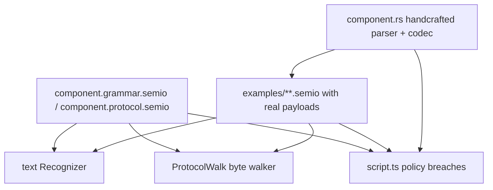

> Paths in this repo are emoji-prefixed. Emoji in paths below are part of the real filename, not decoration.

# Domain-Driven Handcrafted Grammars and Protocols for Every Artifact

## Why the last attempt produced generic specs

Ticket [26/08/03/HANDCRAFTED-GRAMMAR-FOR-EVERY-ARTIFACT](.🦑️repo/🎫️tickets/🎆️26/🌙️08/☀️03/HANDCRAFTED-GRAMMAR-FOR-EVERY-ARTIFACT/🎫️ticket.json) is still open. It shipped 260 spec files, but nothing could tell a real spec from a generic one, so the corpus collapsed:

- **All 52 `📡️spr` protocols are byte-identical** modulo the id/schema line. The 52 `🎒️pack` protocols collapse to exactly 2 shapes (37 generic, 15 identical `📕️norm` ones).
- **The protocol dialect has no AST.** [🧰️framework/🛍️products/💻️os/🔨️modules/🗣️dsl/📖️grammar/🦀️component.rs](🧰️framework/🛍️products/💻️os/🔨️modules/🗣️dsl/📖️grammar/🦀️component.rs) L229-234 and L390-393 match `version|schema|framing|header|field|segment|record|footer|chain` and call `cursor.skip_line()`. `print_grammar` then drops the whole body, so `canonicalize` is lossy for every protocol file.
- **`verify_protocol_bytes` (L712-738) checks 8 magic bytes and a 32-byte minimum.** It cannot detect that the spec declares one `field flags u32` while `Header::write_bytes` emits `required_flags` + `optional_flags` + 8 reserved bytes.
- **The spec is factually wrong.** It declares `framing magic 0x8953504B0D0A1A0A` (`\x89SPK`); real bytes start `8953454d` (`\x89SEM`).
- **All 178 binary examples are empty.** Every `*.pack.semio` and `*.spr.semio` file is ≤64 bytes: envelope plus the token `plugin.artifact.pack v1`, zero payload.
- **105 of 156 text grammars carry the catch-all** `prop = IDENT "=" (...)`; 87 carry the full `prop`+`props`+`list`+`map`+`value` tail, and 85 of those let a property nest an arbitrary `list`/`map`. Only 14 files in the whole corpus are free of it. 13 fields additionally smuggle domain data as escaped strings (`mesh-json`, `camera-json`, `features-json`, `lhs-json`/`rhs-json`).
- **Whole grammars are copy-paste clones.** After normalizing the id/extension lines, the 52 diff grammars collapse to 45 unique: block+puzzle 2d/3d/5d share one identical diff (6 files), procedural2d/3d share another, forms+playbook a third. The same clone groups exist for op (6) and dsl (3+3).
- **Some grammars are outright untyped.** `📐️cad`'s op and diff grammars are `cad-edit = IDENT assign* block?` while `CadOperation` has a dozen typed variants (`AddObject`, `TranslateObjects`, ...). The grammar cannot describe what the parser accepts.
- **`use family-*` does nothing.** The `Recognizer` never loads or merges family fragments — `uses` is stored and reprinted, that's all. Of the 24 grammars that `use family-scene`, 16 never define `layer` locally, so the recognizer would fail on their own examples.
- **`BOOL` is unmatchable.** There is no `Bool` token kind in `dsl_core`; `true`/`false` lex as `Ident`. The recognizer compares `format!("{kind:?}").to_uppercase()` (L700), so every `BOOL` terminal across the corpus can never match.
- **`Recognizer::recognize` has zero call sites outside its own unit tests.** Nothing has ever run a grammar against a real example.
- **Only 5 of 54 artifacts wire their specs** (writer, note, dag, fem2d, fem3d): 25 `include_str!` sites, 27 `register_language` calls. The other 49 artifacts' spec files are dead text — `💠️lowpoly` and `📐️cad` have grammar files on disk with no constant and no registration.
- **Both forcing functions are disarmed.** `POLICY_GRAMMAR_FILE_ALLOWLIST` and `POLICY_PROTOCOL_FILE_ALLOWLIST` in [📜️script.ts](📜️script.ts) L2096/L2099 are empty sets, and the rules only report entries in the allowlist — they never scan for missing or generic files.
- **The codecs are generic too.** [💠️lowpoly/🎒️pack/🦀️component.rs](✏️s/🔌️plugins/💠️lowpoly/🗿️artifacts/💠️lowpoly/🎒️pack/🦀️component.rs) is a two-line delegation to derive-generated `store::DocumentPack::encode_pack`. A spec cannot be domain-specific while the bytes it describes are not.

The lesson: handcrafting 260 files by hand fails without a mechanism that **rejects** genericness. Build the rejector first.

## Locked decisions

- **Full depth.** Each artifact gets a handcrafted binary codec (own magic, own segment kinds, own record tags, typed domain fields) and real example payloads. The derive-generated generic codec path is deleted, not kept as a fallback.
- **Specs stay normative-and-verified, not codegen.** Encoders remain handcrafted Rust; a spec-driven byte walker proves spec and encoder agree. This keeps the prior ticket's ruling but makes it real.
- **Scope is every spec surface**: 54 artifacts x {dsl, op, diff} grammars + {pack, spr} protocols, plus `cmd` for app engines, plus the ~34 app `🎚️config` grammars, plus the embedded languages (jack, construct, expr, md). The 2 stubs (`🎪️demonstrator/🎪️playground`, `🔋️energy/🔋️model`) and 2 outliers (`💡️reasoning/🔌️wires` has no `📚️examples`, `🪐️space/🏠️home` has no `⚙️engine`) are brought to parity.
- **Continue in the open 26/08/03 ticket.** Repo MCP is not connected this session; use the CLI fallback `🧰️framework/🛍️products/🦑️repo/🔨️modules/💻️client/client --repo <root> ticket ...`. Only the orchestrator touches the ticket.
- **Local subagents only.** No worktrees, no cloud branches, no git mutations — the repo rules forbid them and other devs are editing the same files.



## Mechanism work (P1, single writer, engine frozen after)

All in [🧰️framework/🛍️products/💻️os/🔨️modules/🗣️dsl/📖️grammar/🦀️component.rs](🧰️framework/🛍️products/💻️os/🔨️modules/🗣️dsl/📖️grammar/🦀️component.rs) unless noted, using new `//#region` blocks in the existing file.

### M1. A real protocol AST

Delete `is_protocol_directive_line` and the `skip_line()` branch. Add a typed model parsed by a `parse_protocol` sharing the same lexer:

```rust
pub struct ProtocolFile {
    pub id: String, pub version: u16, pub schema: String, pub start: String,
    pub uses: Vec<String>, pub framing: Framing, pub blocks: Vec<Block>,
}
pub enum Framing { Magic([u8; 8]), Record, Chunked }
pub enum Block { Header(Vec<Field>), Segment { name: String, kind: u8, fields: Vec<Field> },
                 Record { name: String, tag: u64, fields: Vec<Field> },
                 Struct { name: String, fields: Vec<Field> },
                 Enum { name: String, variants: Vec<(String, u64)> },
                 Footer(usize), Chain(Prim) }
pub enum Prim { U8, U16, U32, U64, I32, I64, F32, F64, Varint, Zigzag,
                Bytes, Utf8, Fixed(usize), Array(Box<Prim>, Count), Ref(String) }
```

`print_protocol` must round-trip the body (today's printer silently discards it), and `canonicalize` must be idempotent over protocol files. Add `use` support to the protocol dialect so artifacts share struct/enum fragments like grammars share families. Ship `📖️protocol.grammar.semio` beside `📖️grammar.grammar.semio` describing the protocol dialect's own syntax, with a self-hosting test.

### M2. Spec-driven byte walker

Replace `verify_protocol_bytes` with a real walker — the binary analogue of the text `Recognizer`:

```rust
pub fn walk_protocol(spec: &ProtocolFile, bytes: &[u8]) -> Result<ProtocolTrace, ProtocolMismatch>;
```

It consumes every declared field at its declared width, resolves `Ref`/`Array`/`Enum`, follows segment kinds and record tags, and **must finish at exactly `bytes.len()`**. `ProtocolMismatch` names the byte offset and the directive that failed. Trailing or missing bytes are errors, so a spec that under-describes its format cannot pass.

### M3. Make the text Recognizer actually usable

The recognizer has never been run against a real document, and three defects would make it reject nearly every example on first contact. All three must land before any fan-out, or workers will "fix" their grammars to work around engine bugs.

- **Resolve `use` fragments.** `Recognizer::compile` must load the named family grammars and merge their productions into the resolution scope, with local productions shadowing family ones. Today `uses` is inert, so the 16 grammars that `use family-scene` without redefining `layer` cannot recognize their own text. Add a `FragmentRegistry` populated from the family crates' `include_str!` constants.
- **Fix the terminal vocabulary.** `token_kind_name` (L700) stringifies the `TokenKind` debug name, so `BOOL` never matches — `true`/`false` lex as `Ident`. Introduce an explicit terminal table mapping grammar terminal names to token predicates (`BOOL` -> `Ident` with value in `{true,false}`, `QUANTITY`, `VEC3`, `COLOR`, `ARROW`/`DASHARROW`/`EDGEARROW`/`BACKARROW`) instead of debug-name comparison.
- **Finish macro support.** Only `edge` has a matcher (L704). Add `table`, `quantity`, `props` and make `match_macro_span` token-based instead of the current O(n²) re-lex-every-suffix probe (L685-693).
- Add production-coverage tracking so the sweep can assert every production is exercised by at least one example.

### M3b. Remove every generic escape hatch

- Delete `from_record_spec` and `terminal_for_shape` (L513-567). This function *generates* grammars from `RecordSpec` and is the mechanical source of genericness.
- Delete `LanguageSpec::derived` in [🗣️dsl/🦀️component.rs](🧰️framework/🛍️products/💻️os/🔨️modules/🗣️dsl/🦀️component.rs) L479 — it exists purely to service unconverted facets and has 0 call sites.
- Delete `DocumentDsl`/`OpText`/`DocumentPack`/`OpBinary` emission from [🗣️dsl/✨️derive/🦀️component.rs](🧰️framework/🛍️products/💻️os/🔨️modules/🗣️dsl/✨️derive/🦀️component.rs) and the `dsl::__rt`/`op_rt` text path, so no artifact can fall back to the generic codec. Staged: land the deletion at P6 flag day, but add the policy that forbids new uses at P1.
- Delete the empty `🧰️framework/🛍️products/💻️os/🔨️modules/📡️protocol/` directory tree — 13 empty dirs left over from the rename to `📡️spr`, already aliased away by `POLICY_COMPONENT_ALIASES`.

### M4. Policies that make genericness a build failure

Four new breach rules in [📜️script.ts](📜️script.ts), replacing the two inert allowlists:

- **`policySpecDistinctnessBreaches`** — hash every `.grammar.semio`/`.protocol.semio` with the id/schema/extension/start lines normalized away; any two files sharing a hash are a high-priority breach. This single rule invalidates the 52-identical-spr corpus, the 37-identical-pack corpus, the block+puzzle 2d/3d/5d diff and op sextets, the procedural2d/3d pairs, and the forms/playbook pair.
- **`policyGenericSpecBreaches`** — a grammar may not contain the catch-all tail (`prop = IDENT "=" (...)`, untyped `value`/`list`/`map` productions), may not contain a bare statement shell (`x = IDENT assign* block?`, the `📐️cad` op/diff shape), and may not declare a field whose name matches `/-(json|blob|base64|payload)$/`.
- **`policyDeclaredUseBreaches`** — a grammar that declares `use family-X` must reference at least one production the fragment defines, and a production it references must resolve either locally or in a declared fragment. Catches the 16 grammars that `use family-scene` but never mention `layer`.
- **`policySpecWiringBreaches`** — every facet `🦀️component.rs` must `include_str!` its sibling spec and `register_language` with the matching `LanguageRole` (the enum at L448 already has `Document|Config|Ops|Embedded|Diff|Pack|Spr`).
- **`policyEmptyExampleBreaches`** — every `*.pack.semio`/`*.spr.semio` example must exceed its `\x89SEM` envelope length. Catches all 178 empty files today.

Register in `VerifyScript.runGate` beside the existing OS-authority policy block (L692-704).

### M5. Conformance laws in the fixture sweep

[🗣️dsl/🧪️fixture-sweep/🦀️component.rs](🧰️framework/🛍️products/💻️os/🔨️modules/🗣️dsl/🧪️fixture-sweep/🦀️component.rs) already fans in every artifact document type and walks `📚️examples/**`, but only checks DSL text round-trip and skips op/pack/spr. Extend its registry with:

1. **Grammar conformance** — the facet's `Recognizer` accepts every dsl/op/diff example, and accepts `print_dsl(parse_dsl(example))` (agreement with the real parser, not just the shipped text).
2. **Production coverage** — every production in the spec is exercised by at least one example.
3. **Protocol conformance** — `walk_protocol(spec, encode_pack(parse_dsl(example)))` consumes all bytes; same for `encode_op`.
4. **Cross-artifact rejection** — artifact A's recognizer and walker must **reject** artifact B's examples, for every pair. This is the anti-genericness law: no shared generic spec can pass it, and it is what the current corpus would fail hardest.

Run via `bun ./📜️script.ts test dsl`.

## Domain design (P2: 8 family kits)

The 7 existing family fragments are 5-9 line stubs (`family-scene` is 6 lines of `IDENT "@" FLOAT FLOAT`). Rewrite them as real shared vocabularies with typed terminals, and add matching protocol fragments (shared `struct`/`enum` blocks) now that the protocol dialect supports `use`:

- **F1 graph/wiring** (6): dag, reasoning/wires, trinity/jack, trinity/rewrite, flow, sequence — nodes, typed ports, labeled edges, chains.
- **F2 mesh/solid** (12): lowpoly, procedural2d/3d, block 2d/3d/5d, puzzle 2d/3d/5d, cad, process3d, remodel — `VEC3`, half-edge tables, face loops, transforms, B-rep topology. Kills `mesh-json`.
- **F3 sheet/quantity** (17): the 15 `📕️norm` artifacts + architect/program + energy/model — `QUANTITY = FLOAT UNIT`, clause references, verdicts.
- **F4 canvas/raster** (7): draw, raster, note, layout, present, shooting, forms — strokes, layers with blend modes, boxes, `COLOR`.
- **F5 catalog/space** (3): sourcing/curate, space/home, demonstrator/playground — stock entries, typologies, compatibility.
- **F6 text/program** (4): writer, imperative, playbook, mathematical — statements, embedded fences, expressions.
- **F7 geo** (2): gismap, gisterrain — `POINT`, CRS, tiles.
- **F8 engineering** (3): fem2d, fem3d, vcs — nodes/elements/loads/supports; commit chains.

Per artifact: a distinct 4-byte magic (`LWPL`, `CAD3`, `EN92`, ...), domain segment kinds, and one record tag per operation variant so `spr` mirrors the artifact's own `Operation` enum rather than a generic ordinal.

## Execution: parallel agent workforce

Models: `cursor-grok-4.5-high` for design-heavy and adversarial roles, `composer-2.5` for mechanical fan-out. Regular speed, never the fast variants.

- **P0 Bootstrap** (1 grok, serial) — continue the open 26/08/03 ticket via the repo CLI; write contracts v2 into the ticket folder (protocol-dialect contract, distinctness contract, per-family notation guide, verification checklist); build the collision map from `git status --porcelain` and the 25 open tickets; write `wave-ownership.txt`.
- **P1 Engine** (1 grok writer + 1 grok adversarial reviewer, serialized) — M1, M2, M3, M4 rules registered but allowlisted, extended Recognizer. **Gate**: `cargo check --workspace` green, `bun ./📜️script.ts verify gate` green, protocol dialect self-hosts, walker proven on one artifact's real bytes. Engine paths freeze after this gate; later waves queue requests in `engine-requests.txt` drained by one serialized hotfix agent between waves.
- **P2 Families** (8 parallel: grok for F1/F2/F6, composer for F3/F4/F5/F7/F8) — real grammar + protocol fragments per family, each with its own parse test.
- **P3 Enforcement** (2 serialized, grok) — M5 sweep laws; `📜️script.ts` policy rules armed. `📜️script.ts` is orchestrator-owned, so this phase alone touches it.
- **P4 Pilots** (4 grok + 1 grok verifier) — `💠️lowpoly` (hardest: eliminates `mesh-json`, proves mesh notation and binary vertex arrays), `📘️en1992` (sheet/quantity, proves the 15-way norm template is domain-differentiated not copy-pasted), `🕸️dag` (graph, proves edge notation and `use family-graph` resolution), `📐️cad` (proves a typed op grammar can replace the `cad-edit = IDENT assign* block?` shell against a dozen real `CadOperation` variants). Each pilot completes all 5 facets plus real example payloads plus all 4 conformance laws. The verifier independently re-runs every law and never trusts a worker's claim.
- **W5a-W5f Fan-out** (6 waves x 6-8 composer workers + 2 grok reviewers + 1 gate per wave) — disjoint per-plugin globs, one family per worker, hot plugins last (`🌊️flow`, `🌀️procedural`, `🧱️block`, `🧩️puzzle`, `🌿️vcs` in W5f, since they have concurrent open tickets; `📐️cad` is pulled forward into P4 as a pilot). Re-run the collision scan at each wave start.
- **P6 Flag day** (3 grok) — delete derive emission and `dsl::__rt`; every artifact on handcrafted codecs; all allowlists empty; `bun ./📜️script.ts policy` green.
- **P7 End to end** (3: 2 grok + 1 composer) — `bun ./📜️script.ts verify`, `test exhaustive` at 95% LCOV, `bun ./📜️script.ts semio verify` over all 736 example files, OS dev boot across the WASM plugins, writer opens 6+ document kinds with live diagnostics evidenced by `[DEBUG]` logs and screenshots into the ticket folder, then `ticket close`.

**Ownership protocol**: [📜️script.ts](📜️script.ts), [Cargo.toml](Cargo.toml), [package.json](package.json), [.vscode/launch.json](.vscode/launch.json) and all engine paths (`🗣️dsl/**`, `🎒️pack/**`, `📡️spr/**`, `🏪️store/**`) are orchestrator-only between waves. Workers write only inside their owned plugin globs and the ticket folder. No agent closes or reopens the shared ticket.

## Risks

- The 15 `📕️norm` artifacts are the highest re-genericization risk: they share a real domain, so distinctness must come from actual clause vocabulary per standard, not from renamed boilerplate. W5 assigns them a family-core agent plus per-standard vocabulary agents and the distinctness policy is the backstop.
- Deleting derive emission at P6 touches every artifact at once; it is scheduled after all 54 have landed handcrafted codecs, and the policy from P1 prevents new derive uses in the meantime.
- `Shape::Wire` has hot consumers (flow, procedural, cad) with concurrent open tickets — W5f is scheduled last for exactly this.
- Two pre-existing unrelated breakages are recorded in the ticket's `progress.md` (`imperative-text` `OperatorInfo.module`; `ui_wgpu` emoji char literals) and will surface in any full `verify` — do not attribute them to this program.
