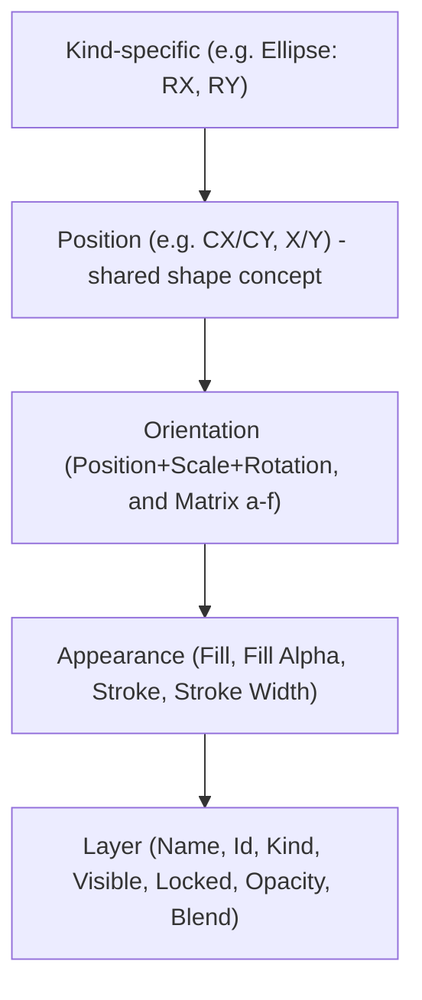

# Draw Selection, Hover Styling, and Inheritance-Ordered Inspector

## 1. Toolbar: make the active tool visibly pressed (fixes "selection should be active by default")

`defaultDrawDocument()` (`draw/core/index.ts:392`), the fixture JSON, and `DrawCanvas`'s prop fallback already default `activeTool` to `"selectDirect"`. The real gap is that the toolbar never shows which tool is active:

- `drawPlayTool()` (`draw/play/index.ts:1154`) always returns `kind: "button"` — never `"toggle"` — so there is no `pressed` state at all.
- `DRAW_PLAY_TOOLS` (`draw/play/index.ts:1158`) is a static array assigned once via `rebuildShellMode()` (`draw/play/index.ts:821`), called only from the constructor (`draw/play/index.ts:818`), so it never reflects `document.activeTool` afterward.

Fix:
- Change `drawPlayTool(...)` (or add a variant) to emit `kind: "toggle"` with `pressed` computed from the current `this.document.activeTool` for every tool whose command is `"setActiveTool"`.
- Turn `DRAW_PLAY_TOOLS` construction into a method (e.g. `private buildTools(): AppTools`) called from `rebuildShellMode()`, and call `rebuildShellMode()` from `bump()` (`draw/play/index.ts:885-889` area) so the toolbar re-renders pressed state after every command, including `setActiveTool` (`draw/play/index.ts:934-938`) and the implicit reset to `selectDirect` after authoring commits (`draw/react/index.tsx:454-458`).

## 2. Canvas: selection/hover colors matching the rest of the UI

`DrawPathShape`, `DrawTextShape`, `DrawImageShape`, and `DrawPreviewPath` (`draw/react/index.tsx:242-357`) hardcode Tailwind blues `#3b82f6`/`#60a5fa`. Elsewhere (`Geometry`, `DiagramNode` in `ui/react/index.tsx:15992-16016`) selection/hover use the shared semantic tokens `--active-base` / `--hover-base`, resolved via `resolveSemanticColorHex` from `@semio-tech/ui-styling` (`ui/styling/js/resolve.ts:211`, exported `ui/styling/js/index.ts:38`).

Fix:
- Add `@semio-tech/ui-styling` to `draw/react/package.json` dependencies.
- Resolve `--active-base` / `--hover-base` once (memoized) in `DrawCanvas` and pass the resolved hex colors down to `DrawPathShape`/`DrawTextShape`/`DrawImageShape`/`DrawPreviewPath`, replacing the hardcoded literals.

## 3. Canvas: groups must actually highlight when selected/hovered

`flattenDrawDocumentToSceneNodes` (`draw/core/index.ts:537+`) recurses into `group` layers but never emits a scene node for the group itself. In `DrawCanvas`, `selected = selectedIds.includes(node.id)` / `hovered = effectiveHoveredId === node.id` (`draw/react/index.tsx:769-770`) only match leaf scene-node ids, so selecting or hovering a group in the hierarchy currently highlights nothing on canvas.

Fix:
- Add `drawLayerDescendantLeafIds(doc, layerId)` to `draw/core/index.ts`: returns `[layerId]` for any non-group layer, and the recursive list of rendered descendant leaf ids for a `group`.
- In `DrawCanvas`, derive `selectedLeafIds`/`hoveredLeafIds` sets via this helper before the render loop, and use set membership instead of direct id comparison for `selected`/`hovered`.

## 4. Shared framework: reusable specific-to-general inspector grouping

Add a small, generically usable helper to `framework/product/platform/core/index.ts` (near `uiDeclarativeSectionsToTree`, `framework/product/platform/core/index.ts:481`) so any play technology can express an inheritance-ordered inspector:

```ts
export interface UiInspectorFieldGroup {
	readonly id: string;
	readonly label: string;
	readonly defaultOpen?: boolean;
	readonly fields: readonly UiNode[];
}

export function uiInspectorReadonlyField(id: string, label: string, value: string): UiFieldNode {
	return { type: "field", id, label, child: { type: "text", value } };
}

/** Builds an inspector tree from groups ordered most-specific first, most-general last. */
export function uiInspectorGroupsToTree(groups: readonly UiInspectorFieldGroup[]): UiTreeNode {
	return uiDeclarativeSectionsToTree(
		groups
			.filter((group) => group.fields.length > 0)
			.map((group) => ({ type: "section", id: group.id, label: group.label, defaultOpen: group.defaultOpen ?? true, children: group.fields })),
	);
}
```

This is purely additive — existing technologies (forms-play, writer-play, raster-play, puzzle/5d-play) keep using `uiDeclarativeSectionsToTree` directly; only Draw adopts the new helper for now.

## 5. Core: matrix decomposition helper for the alternate orientation representation

`drawTransformToMatrix` (`draw/core/index.ts`) already converts `DrawTransform` → `[a,b,c,d,e,f]`. Add the inverse:

```ts
export function drawMatrixToTransform(matrix: readonly [number, number, number, number, number, number]): DrawTransform {
	const [a, b, c, d, e, f] = matrix;
	const scaleX = Math.hypot(a, b);
	const rotation = Math.atan2(b, a);
	const det = a * d - b * c;
	const scaleY = scaleX !== 0 ? det / scaleX : 0;
	return { x: e, y: f, scaleX, scaleY, rotation };
}
```

Note/limitation to surface in code comment: `DrawTransform` has no shear term, so a matrix containing shear will be decomposed best-effort (shear is dropped) — this only affects the matrix-editing path, not existing position/scale/rotation editing.

## 6. Draw inspector: always show every field, grouped specific to general

Rewrite `buildDrawPlayInspectorTree` (`draw/play/index.ts:380-739`) to build an ordered list of `UiInspectorFieldGroup`s per selected layer via `uiInspectorGroupsToTree`, instead of one flat section. Ordering (most specific first):



Per-kind specific/position groups (all fields always rendered, editable or read-only as appropriate):
- shape:rect — specific "Rectangle": Width, Height; general "Position": X, Y
- shape:ellipse — specific "Ellipse": RX, RY; general "Position": CX, CY
- shape:circle — specific "Circle": R; general "Position": CX, CY
- shape:line — specific "Line": X1, Y1, X2, Y2 (no separate position; endpoints are the defining data)
- shape:polygon — specific "Polygon": point count (read-only, as today)
- text — specific "Text": Content, Size; general "Position": X, Y (**new** — `layer.x`/`layer.y` exist on `DrawTextLayer` but are currently not exposed at all)
- image — specific "Image": Image Key, Width, Height (all read-only, as today; no local position field on this kind)
- boolean — specific "Boolean": Op (editable, as today) + Children (**new**, read-only list of child ids/names)
- trace — specific "Trace": Threshold, Simplify (as today) + Source Key (**new**, read-only)
- path — specific "Path": Segment Count (**new**, read-only — path currently has zero kind-specific fields)
- group — specific "Group": Children Count (**new**, read-only)

Orientation group (general, all kinds): keep existing editable Position X/Y, Scale X/Y, Rotation inputs, and add 6 new editable Matrix inputs (A–F) computed via `drawTransformToMatrix(layer.transform)`. On matrix-field change, read all 6 current values, override the changed one, decompose via `drawMatrixToTransform`, and apply through a new `patchLayer` field handling (`transformMatrixA`..`transformMatrixF` cases in `draw/play/index.ts` `run("patchLayer", ...)`, `draw/play/index.ts:999-1138` area) that calls `applyDrawEditOp(doc, { op: "setLayerTransform", layerId, transform })`.

Layer group (most general, new fields added): keep existing Name/Opacity/Blend/Visible, add:
- Id (read-only)
- Kind (read-only, e.g. `"shape:ellipse"`)
- Locked (**new** editable toggle — `DrawLayerBase.locked` exists in the model but has no UI or `patchLayer` handling at all today; add a `case "locked":` branch alongside the existing `case "visible":` in `draw/play/index.ts:999-1138`, calling a new `setLayerLocked` edit op already defined in `DrawEditOp` — confirm/wire `applyDrawEditOp` handling for `"setLayerLocked"`)

Appearance group unchanged in content (Fill, Fill Alpha, Stroke, Stroke Width), just relabeled as its own section.

## 7. Tests (extend existing files only, per repo convention)

- `draw/core/index.ts` test block: round-trip test for `drawMatrixToTransform`/`drawTransformToMatrix`, and a test for `drawLayerDescendantLeafIds` on a group with nested children.
- `draw/play/index.ts` test block (`draw/play/index.ts:1219-1236`): extend to assert `buildDrawPlayInspectorTree` emits multiple ordered sections (e.g. for an ellipse layer, assert an "Ellipse" section appears before a "Position" section, before a "Layer" section), and that `locked`/matrix patch commands mutate the document as expected.
- `draw/react/index.tsx` test block: extend with a small test exercising `drawLayerDescendantLeafIds` usage if practical, or leave color-token resolution untested in vitest (no DOM CSS) and rely on the manual render check used earlier in this session.

## Files touched
- `draw/core/index.ts` — `drawLayerDescendantLeafIds`, `drawMatrixToTransform`, confirm/add `setLayerLocked` edit op handling.
- `draw/react/index.tsx` — semantic-color hover/selection, descendant-id-based highlighting.
- `draw/react/package.json` — add `@semio-tech/ui-styling` dependency.
- `draw/play/index.ts` — toggle-based toolbar tools with dynamic `pressed`, rebuilt inspector grouping, new `locked`/matrix `patchLayer` cases.
- `framework/product/platform/core/index.ts` — new `UiInspectorFieldGroup`, `uiInspectorReadonlyField`, `uiInspectorGroupsToTree` helpers.
