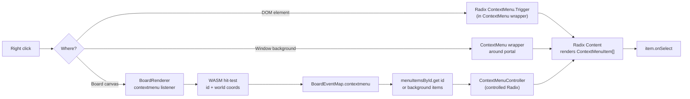

## Goal

Every element (UI components, board `Node`/`Edge`/`Handle`, `UIWindowKindDefinition`) accepts a uniform optional prop:

```ts
contextMenu?: ContextMenuItem[]
```

Right-clicking the element opens a Radix-based menu populated from those items. No registry, no wrapper — just a prop.

## Shared schema

Add to [elements/client/lib/react/index.tsx](elements/client/lib/react/index.tsx) inside a new `//#region ContextMenu`:

```ts
export interface ContextMenuItem {
 id: string;
 label?: string;
 icon?: LucideIcon | string;
 shortcut?: string;
 disabled?: boolean;
 separator?: boolean;
 checked?: boolean;
 destructive?: boolean;
 onSelect?: (event: Event) => void;
 children?: ContextMenuItem[];
}
```

This is the single source of truth, re-exported from `@elements/ui`. `@elements/board` imports it.

## Components

In the same region, add (using `@radix-ui/react-context-menu`, to be added to [elements/client/lib/react/package.json](elements/client/lib/react/package.json) deps):

- `ContextMenu` — wrapper: `<ContextMenu items={...}>{children}</ContextMenu>`. Renders `Root` → `Trigger asChild` → recursive `Content` with `Item`, `Separator`, `Sub`, `SubTrigger`, `SubContent`, `CheckboxItem`. Styling matches existing `DropdownMenu` (breadcrumb) so the visual is consistent.
- `ContextMenuController` — controlled variant used by board: takes `open`, `position: {x,y} | null`, `items`, `onOpenChange`. Renders an invisible anchor at the cursor and a `Content`.
- `useContextMenuItems(items)` — small helper to render items recursively (shared between both variants).

If `contextMenu` is empty/undefined the wrapper is a no-operation (renders `children` directly), so every consumer can pass it unconditionally.

## UI components (`@elements/ui`)

Threading the prop into every component would be noisy. Instead, expose the wrapper publicly and adopt the convention "any element that wants a menu wraps itself or accepts a `contextMenu` prop and forwards it." Concretely:

- Components that already own a root element (Card, DiagramNode, …) gain a `contextMenu?: ContextMenuItem[]` prop and internally do `return <ContextMenu items={contextMenu}>{root}</ContextMenu>`. Update Card and DiagramNode in this PR as canonical examples. Others can adopt incrementally with the same one-line change.

## Windows (`UIWindowKindDefinition`)

Extend the interface in [elements/client/lib/react/index.tsx](elements/client/lib/react/index.tsx):

```ts
export interface UIWindowKindDefinition {
 // ...existing fields...
 contextMenu?: ContextMenuItem[];
}
```

In `UICanvas` (the Golden-Layout `registerComponent` portal callback, around line ~21148), wrap the portal contents:

```tsx
<ContextMenu items={windowKind.contextMenu}>{element}</ContextMenu>
```

Right-clicking the window background (where no inner element handled it) opens the window's menu. Inner elements still take precedence because Radix `ContextMenu` stops the event.

## Board (`@elements/board`)

Board markers are descriptors, not DOM, so we need a small bridge.

### 1. Add `contextMenu` to descriptors

In [elements/client/lib/board/index.tsx](elements/client/lib/board/index.tsx) extend `Node`/`Edge`/`Handle` prop types and `buildBoardSceneDescriptor` so each descriptor carries `contextMenu?: ContextMenuItem[]`. Stored in a `Map<id, ContextMenuItem[]>` kept by `syncBoardScene` (lives on the JS side; never crosses into WASM).

### 2. Emit a `contextmenu` board event

In [elements/client/lib/board/index.ts](elements/client/lib/board/index.ts) extend `BoardEventMap`:

```ts
contextmenu: {
 id: string | null;
 x: number;
 y: number;
 clientX: number;
 clientY: number;
}
```

`BoardRenderer` adds a DOM `contextmenu` listener on its canvas: `event.preventDefault()`, convert client coords → world via existing camera math, call the existing WASM hit-test (the same one used by `hover`/`select`), and dispatch the event.

### 3. Render a `ContextMenuController` in `BoardCanvas`

In `BoardCanvas` (index.tsx), keep `[menuState, setMenuState] = useState<{x,y,items} | null>(null)`. Subscribe with `useBoardEvent('contextmenu', ({id, clientX, clientY}) => { const items = id ? menuItemsById.get(id) : backgroundItems; if (items?.length) setMenuState({x: clientX, y: clientY, items}); })`. Render `<ContextMenuController open={!!menuState} position={menuState} items={menuState?.items ?? []} onOpenChange={(o) => !o && setMenuState(null)} />` as a sibling of the canvas.

Add an optional `contextMenu?: ContextMenuItem[]` prop to `BoardCanvas` for the background (empty-space) menu.

### 4. Example in play

In [elements/client/lib/board/play/index.tsx](elements/client/lib/board/play/index.tsx), attach a couple of items to one `<Node>` and one `<Edge>` plus a background menu on `BoardCanvas` to validate end-to-end.

## Data flow



## Conventions

- All new code lives in existing files inside `//#region ContextMenu` (and a subregion in board files), per AGENTS.md.
- No new files. No legacy/compat shims.
- Docstrings start with a unique emoji; no inline comments inside definitions.
- Open a ticket via repo mcp `ticket_open` before editing; close on completion.

## Validation

- Extend the existing vitest in [elements/client/lib/react/vitest.config.ts](elements/client/lib/react/vitest.config.ts) target (the project's existing test file) with cases: empty items renders no menu; nested children render submenu; `onSelect` fires; shortcut and icon render.
- Extend the existing board vitest target: `contextmenu` event dispatch with id resolves to correct items; background fallback when id is null.
- Playwright e2e under [elements/client/lib/board/play/e2e](elements/client/lib/board/play/e2e) is extended (not duplicated): right-click a node and assert the menu opens with the expected item label.
