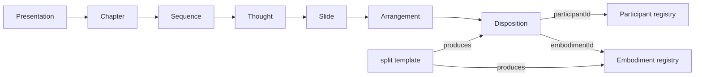

## Source of truth and constraints

- Implement against the pasted spec. Per repo rules, do **not** edit any `AGENTS.md` (so `[framework/product/presentation/AGENTS.md](framework/product/presentation/AGENTS.md)` stays stale by design).
- Open a repo MCP ticket first (read `repo://goals`, associate with the presentation/framework goal). No new files; extend existing files using `#region`s. No backwards-compat shims.
- Blast radius (only React renderer exists, no Svelte): `[core/index.ts](framework/product/presentation/core/index.ts)`, `[renderer/react/index.tsx](framework/product/presentation/renderer/react/index.tsx)`, `[renderer/react/globals.css](framework/product/presentation/renderer/react/globals.css)`, and the deck: `[spec.ts](mit-bestand/präsentation/33.projektetage/spec.ts)`, `[index.ts](mit-bestand/präsentation/33.projektetage/index.ts)`, `[Einleitung.ts](mit-bestand/präsentation/33.projektetage/slide/Hauptteil/Einführung/Einleitung.ts)`, and the four `Medien/*.ts` slide files.

## New core model

Participant becomes identity-only; embodiments get required unique ids and move into scoped registries; dispositions bind both ids.

```ts
interface Participant { readonly id: string; readonly name?: string; }

// every Embodiment variant: `id` becomes REQUIRED (was optional)
type Embodiment = TextEmbodiment | FigureEmbodiment | VideoEmbodiment
  | PdfEmbodiment | BulletEmbodiment | AuthorsEmbodiment | AffiliationsEmbodiment;

interface Disposition {
  readonly participantId: string;
  readonly embodimentId: string;            // required; resolved against the scope registry
  readonly emphasis: ParticipantEmphasis;
  readonly position?: DispositionPosition;
  readonly style?: DispositionStyle;
  readonly morphFrom?: readonly MorphFromSlot[];   // keep generalized-morph machinery
  readonly morphGhost?: boolean;
  readonly morphTargetId?: string;
}
```

Remove entirely: `DispositionSplit`, `SplitTile`, `Disposition.split`, `morphParticipant`, `tileMorphId`, and the split-tile geometry helpers that exist only to serve `DispositionSplit` (`splitTilesPackedFrame`, `clusterSplitTilesByVisualRow`, `splitTilesInGroupFrame`, `splitTilesUnionSourceCrop`, `SplitTileVisualRow`). `FigureEmbodiment.crop` stays — it is how a tile embodiment expresses its source region.

## Multi-level scoping

Add an optional registry to every artifact and resolve nearest-wins down the chain slide→thought→sequence→chapter→presentation:

```ts
interface ArtifactScope {
  readonly participants?: readonly Participant[];
  readonly embodiments?: readonly Embodiment[];
}
// Presentation, Chapter, Sequence, Thought, Arrangement, and SlideFile all extend ArtifactScope.
```

- Add `interface ResolutionScope { participants: Map<string,Participant>; embodiments: Map<string,Embodiment>; }` and `buildResolutionScope(ancestors: readonly ArtifactScope[]): ResolutionScope` (later ancestors override earlier; arrangement-level wins over thought, etc.).
- `resolveEmbodiment(scope, embodimentId)` and `resolveArrangement(scope, arrangement)` replace the current `(participant, …)` / `(participants, arrangement)` signatures. `ResolvedDisposition` keeps `participant`, `embodiment`, `emphasis`, `embodimentId`, `morphId`, `position`, `style` (drop `split`).
- Traversal helpers (`collectPresentationSlides`, `countArrangements`, `expandThoughtSlides`, bookmark/URL helpers) thread the ancestor scope chain so resolution works at render time. `expandArrangementMorphFrom`/ghost expansion stays but reads `embodimentId` from the registry.

## Tile and Split templates (produce embodiments)

New `#region 🔖Tile` / `#region 🔖Split` in core, replacing the old `splitFigureGrid`-returns-tiles mechanism:

- `tile(spec: { id; source: string; crop: DispositionPosition; alt?; }): FigureEmbodiment` — produces one cropped figure embodiment from a source image.
- `split(spec: { keyPrefix; source; rows; columns; frame; gap? }): { embodiments: FigureEmbodiment[]; dispositions: Disposition[] }` — calls `tile` per cell to emit one embodiment + one positioned disposition per cell (so each tile is an ordinary participant/embodiment/disposition; reveal.js auto-animate keys off `participantId` as for any disposition). This is what `[Bauteilkatalog.ts](mit-bestand/präsentation/33.projektetage/slide/Hauptteil/Einführung/Medien/Bauteilkatalog.ts)` consumes.
- Migrate `intro()` and `analogy()` to the new model: split each participant's old `embodiments` array into a `participants` list (`{ id }`) plus an `embodiments` registry with unique ids (e.g. `title-full`, `title-short`, `authors-marked`, `institutions-step1`), and make every disposition carry an explicit `embodimentId`.



## React renderer changes

In `[renderer/react/index.tsx](framework/product/presentation/renderer/react/index.tsx)`:

- Resolve via the new `resolveArrangement(scope, arrangement)`; build the scope chain from presentation→…→arrangement instead of passing `thought.participants`.
- Delete split/tile rendering: `FigureTileView`, the `split`/`morphParticipant` branches of `FigureSplitMorphView` and `MorphDispositionView`, `MorphParticipantArrangementSlots`, `morphParticipantDispositions`, and the per-tile branch of `buildInteractiveSlideLayout` (each tile is now its own disposition, so existing per-disposition interaction covers it). Drop `tileMorphId`/`clusterSplitTilesByVisualRow` imports and re-exports.
- `FigureMorphView` keeps `crop` background support (cropped figure can morph into a label). `declaredDispositionRect` no longer special-cases `split.tiles`.
- Remove now-dead split/tile/morph-participant CSS from `[globals.css](framework/product/presentation/renderer/react/globals.css)`.

## Deck migration (33.projektetage)

- `[spec.ts](mit-bestand/präsentation/33.projektetage/spec.ts)`: replace `mediaParticipants` (participants-with-embodiments) with `mediaParticipants: Participant[]` (identity) + `mediaEmbodiments: Embodiment[]` (registry, unique ids). Build the 15-cell catalogue via the new `split()` template (embodiments + dispositions). Keep the three column participants (`col1/col2/col3`) each backed by a union-crop figure embodiment + a label text embodiment; replace the `morphParticipant` focus trick with ordinary dispositions + generalized `morphFrom`.
- `SlideFile` gains `participants?`/`embodiments?`; update the four `Medien/*.ts` slides and `Einleitung.ts` to reference embodiments by registry id and to register their participants/embodiments at the appropriate scope (thought-level for media).
- `[index.ts](mit-bestand/präsentation/33.projektetage/index.ts)`: `loadPresentationFromSlideGlob` merges per-file `participants`+`embodiments` into the thought scope (extend `mergeSlideFileParticipants` into a merge of both registries).

## Tests and validation (extend inline, no new files)

- Core `🧪Tests`: scope resolution (nearest-wins across levels), `resolveArrangement(scope,…)`, `tile`/`split` output shape, migrated `intro`/`analogy`, unchanged slide counts/bookmarks. Update every existing test that constructs `Participant{embodiments}` or `Disposition` without `embodimentId`.
- Renderer `🧪Tests`: drop split/tile/morph-participant DOM assertions; assert tiles render as positioned cropped figures; positioned dispositions and video/pdf still get `data-id`.
- Deck `🧪Tests` in `[index.ts](mit-bestand/präsentation/33.projektetage/index.ts)`: catalogue produces N tile dispositions, columns morph focus→labels, kinds present.
- Run `bun nx run @framework/presentation/core:test`, `@framework/presentation/renderer/react:test`, and the deck test config; run the projektetage dev server and confirm catalogue/split/morph render live via screenshot/CDP. Close the ticket with summary + touched files.