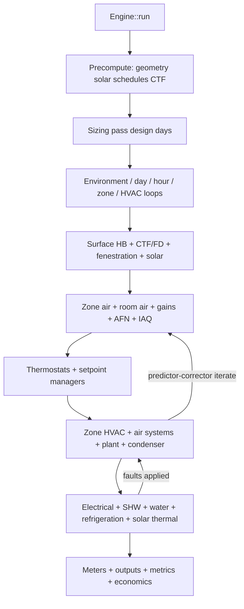

# Energy Engine Absolute Feature Completeness

## Current state

`[energy/engine/rs](energy/engine/rs)` already has ~48 modules with real (often simplified) component physics. The gap is coupling and catalog depth:

- `[sim.rs](energy/engine/rs/src/sim.rs)` / `[kernel.rs](energy/engine/rs/src/kernel.rs)` only run: steady U·A envelope + infiltration + gains + BDF3 zone air + optional ideal loads.
- `Model` lacks air/plant loops, zone equipment, AFN, PV, water, refrigeration, sizing objects.
- CTF envelope, fenestration, solar, daylight, AFN, plant, electrical, SHW, comfort, IAQ, faults, economics exist as APIs but are not called from `Engine::run`.
- Run period ignores calendar fields (hardcoded 168h); `system_timestep_minutes` and `ConvergenceTolerances` are unused.

## Locked decisions

- Reopen ticket `26/07/18/ENERGY-TECHNOLOGY-FULL-BEM-ENGINE` under goal `🎯energy`.
- Stay in single crate `energy_engine`; extend existing `src/*.rs` modules (regions), no new crates / no IDF.
- Use isolated `CARGO_TARGET_DIR` under the ticket folder for all cargo invokes — never wait on the shared workspace lock.
- Completeness gate: every feature-tree leaf is either a wired public API with real physics exercised through `Engine::run` (or a focused harness that the run path uses) plus tests — not dead library code.

## Architecture (target coupling)




## Workstreams

### 1. Ticket + checklist

- `ticket_reopen` for `26/07/18/ENERGY-TECHNOLOGY-FULL-BEM-ENGINE`.
- Replace subsystem checklist with a leaf-level gap checklist (coupling vs catalog) in the ticket folder; update as leaves land.

### 2. Expand typed Model (single native representation)

Extend `[model.rs](energy/engine/rs/src/model.rs)` and validation so the engine can own full topology:

- Geometry: shading surfaces, space lists, thermal/solar enclosures, adjacency pairs.
- Constructions: resistance-only, air-gap, IR-transparent, PCM, variable-k, moisture-dependent, movable insulation, green roof, vented cavity, other-side BC.
- HVAC: fluid-node refs, zone equipment lists, air terminals, air/plant/condenser loops, outdoor-air systems, setpoint managers, availability managers.
- Secondary: AFN network, SHW, solar thermal, refrigeration, electrical load centers / generators / storage, water systems, faults, output-variable registrations, sizing objects, tariffs (economics stay non-physics).

Validate cross-refs, duplicates, topology, orphan nodes, flow direction.

### 3. Rewrite simulation kernel (critical path)

Rewrite `[kernel.rs](energy/engine/rs/src/kernel.rs)` and `[sim.rs](energy/engine/rs/src/sim.rs)`:

- Calendar: leap year, DOW, holidays, DST schedule shifts; honor `run_period_*` and design-day environments with synthesized weather from `[site.rs](energy/engine/rs/src/site.rs)`.
- Nested loops: environment → day → hour → zone timestep → variable HVAC system timestep (auto-shorten on non-convergence).
- Warmup with temperature + heating/cooling load convergence using `ConvergenceTolerances`.
- Predictor-corrector: predict zone demand → simulate zone HVAC / air / plant / condenser / electrical → correct zone T/W; iterate to tolerances with diagnostics.
- Precompute: geometry, solar geometry, expanded schedules, CTF coeffs, sparse output registration.
- Advance and persist: surface histories, zone air histories, equipment state histories.
- Wire radiant/convective gain split into surface HB; use fenestration + polygon shading + interior solar distribution; ground BC from `GroundTemperatureModel`.

### 4. Couple existing physics modules into the timestep

Call into (do not leave standalone):

- Envelope/fenestration/solar/daylight → surface and window HB, daylight dimming → lighting power feedback.
- Room-air models when selected; AFN + infiltration/ventilation/hybrid; IAQ + DCV → OA controllers.
- Controls from `Model.thermostats` / humidistats / demand limiting / setpoint managers.
- Zone equipment, terminals, air systems, fans, coils, evaporative, humidity, heat recovery.
- Plant loops via `PlantLoopSimulation` + `[dispatch.rs](energy/engine/rs/src/dispatch.rs)`; SHW, solar thermal, refrigeration, water, electrical/PV/battery/`grid_balance`.
- Faults applied to sensors/equipment during solve.
- Meters record **delivered** fuel/end-use power, not just zone demand; economics post-pass over meters.

### 5. Catalog depth fill (same modules, full leaf APIs)

Extend component modules so every tree leaf has a typed variant + `simulate`/`evaluate` with real equations (not stubs). Priority catalog fills where audit found gaps:

- Geometry diagnostics + subdivision; full construction/material catalog; multi-state CTF + FD + EMPD/HAMT; foundation/GSHP domains.
- Window angular/spectral/BSDF, shades/blinds/screens/EC/thermochromic, dynamic shade controls.
- Full zone HVAC / terminal / air-system / coil / plant / refrigeration / electrical / water / fault families listed in the feature tree.
- Sizing from design-day peaks feeding autosize; full reporting frequencies and summary tables; environmental + resilience metrics in results.

### 6. Validation suite

Extend existing inline tests (no new test files):

- Conservation: energy, mass, moisture, electrical, water.
- Analytical / single-zone / multi-zone / HVAC+plant topology / design-day sizing / annual weather.
- ASHRAE 140 and HVAC BESTEST numeric reference cases (in-crate constants).
- Invalid-model, non-convergence diagnostics, deterministic repeatability.
- End-to-end: `Engine::run` on models with ideal loads, full air+plant, AFN, PV+battery, SHW.

Verify with:

```bash
CARGO_TARGET_DIR=".repo/🎫/26/07/18/ENERGY-TECHNOLOGY-FULL-BEM-ENGINE/target" \
  cargo test -p energy_engine
```

Never block on the shared `target/` lock.

### 7. Close

`ticket_close` with summary + all touched paths once the leaf checklist is complete and tests pass.

## Implementation order

1. Model schema + validation expansion (unblocks coupling).
2. Kernel rewrite (calendar, multi-rate loops, P-C, precompute).
3. Envelope/solar/fenestration/daylight coupling.
4. Zone domain + AFN + controls coupling.
5. HVAC + plant + dispatch coupling; meter actual energy.
6. Secondary systems (electrical, SHW, water, refrigeration, solar thermal, faults).
7. Catalog leaf fill pass across modules.
8. Sizing feedback + full results/economics.
9. Validation suite + isolated `cargo test` + ticket close.

## Key files

- Rewrite: `[kernel.rs](energy/engine/rs/src/kernel.rs)`, `[sim.rs](energy/engine/rs/src/sim.rs)`, `[model.rs](energy/engine/rs/src/model.rs)`
- Heavy extend: `[envelope.rs](energy/engine/rs/src/envelope.rs)`, `[fenestration.rs](energy/engine/rs/src/fenestration.rs)`, `[solar.rs](energy/engine/rs/src/solar.rs)`, `[air_system.rs](energy/engine/rs/src/air_system.rs)`, `[plant.rs](energy/engine/rs/src/plant.rs)`, `[sizing.rs](energy/engine/rs/src/sizing.rs)`, `[output.rs](energy/engine/rs/src/output.rs)`, `[meters.rs](energy/engine/rs/src/meters.rs)`
- Wire-through: all remaining `src/*.rs` modules already present

