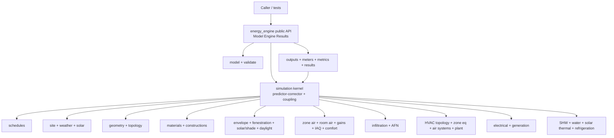

# Energy Technology — Full BEM Engine

## Decisions (locked)

- **Goal:** Approving this plan authorizes opening goal `energy` (title “Energy”, due `2026-12-31`). Ticket binds to `energy`.
- **Path / crate:** [`energy/engine/rs`](energy/engine/rs) → Cargo package `energy_engine`; nx `@semio-tech/energy-engine`.
- **Surface:** Headless Rust library only. Callers build a typed `Model`, call `Engine::run`, receive typed `Results`. No CLI, GUI, WASM plugin, language bindings, or C API in this ticket.
- **Weather:** Native EPW ingest into typed weather structs (data ingest, not a model schema). Callers may also supply in-memory weather / design-day profiles.
- **No mixing:** Do not depend on `norm_*`, CAD energy modules, or `mit-bestand`. Norm compliance and CAD geometry stay separate consumers later.
- **Economics:** Utility tariffs / LCCA live in `pub mod economics` and are explicitly outside the physics kernel (optional post-pass over meters).
- **Depth:** Full subsystem tree from the prompt in the first go — every leaf capability is a real module API with working physics or control logic and tests, not stubs.

## Architecture



**Public API (stable surface):**

```rust
pub struct Model { /* typed entities, SI-only */ }
pub struct SimulationConfig { /* timesteps, tolerances, environments */ }
pub struct Engine;
impl Engine {
    pub fn run(model: &Model, config: &SimulationConfig) -> Result<Results, Error>;
}
pub struct Results {
    pub time_series: TimeSeriesStore,
    pub meters: MeterStore,
    pub summaries: SummaryTables,
    pub sizing: SizingTables,
    pub diagnostics: Diagnostics,
}
```

Single native input representation = Rust types. Single validation path = `Model::validate()`. No alternate schemas.

## Crate layout

Follow the large-engine pattern from [`animate/core/rs`](animate/core/rs): thin `lib.rs` router + `src/*.rs` modules.

```
energy/
  AGENTS.md
  engine/
    project.json          # @semio-tech/energy-engine → bun ./script.ts test
    script.ts
    rs/
      Cargo.toml          # energy_engine
      lib.rs              # pub mod + pub use facade
      src/
        error.rs
        units.rs
        num.rs            # solvers, interpolation, integration, polynomials, tables
        props.rs          # psychrometrics, water/steam/refrigerant/glycol
        model.rs          # entities, ids, validate, topology checks
        schedule.rs
        site.rs           # site, EPW, design days, solar, ground, mains
        geometry.rs
        material.rs
        envelope.rs       # opaque HT, CTF/FD/HAMT, convection, ground HT
        fenestration.rs
        solar.rs          # shading, interior solar distribution
        daylight.rs
        zone_air.rs
        room_air.rs
        gains.rs
        air_exchange.rs
        airflow_network.rs
        iaq.rs
        comfort.rs
        controls.rs       # thermostats, humidistats, zone load control
        hvac_topo.rs      # nodes, branches, loops, paths
        ideal_hvac.rs
        zone_hvac.rs
        terminal.rs
        air_system.rs
        fans.rs
        coils.rs          # heating + cooling
        evaporative.rs
        humidity_eq.rs
        heat_recovery.rs
        plant.rs          # plant topo, pumps, boilers, chillers, HPs, towers, HX, GSHP, storage
        shw.rs
        solar_thermal.rs
        refrigeration.rs
        electrical.rs     # loads, generation, storage, transformers
        water.rs
        faults.rs
        curves.rs         # performance curves + tables
        sizing.rs
        dispatch.rs
        output.rs         # variable registration, aggregation
        meters.rs
        metrics.rs        # environmental + resilience
        results.rs
        economics.rs      # tariffs / LCCA — non-physics
        kernel.rs         # environment/day/hour/zone/HVAC loops, warmup, P-C, coupling
        sim.rs            # Engine::run orchestration
```

Register `energy/engine/rs` in root [`Cargo.toml`](Cargo.toml). Add launch.json test entry with existing energy/tech grouping order. Temp notes and subsystem checklists live only under the ticket folder.

## Implementation order (dependency layers)

Work so each layer compiles and tests before dependents:

1. **Scaffold** — AGENTS.md, crate, workspace member, nx/script, launch.json, empty module stubs that compile.
2. **Foundation** — `error`, `units` (SI-only internal), `num`, `props` (psychrometrics first; water/steam/refrigerant/glycol).
3. **Model + schedules + site** — typed model, validation, schedule expansion, EPW + design-day weather, solar position, ground/mains models.
4. **Geometry + materials** — surfaces, fenestration/shade topology, constructions, diagnostics, subdivision.
5. **Envelope physics** — exterior/interior heat balance, CTF + FD conduction, ground HT, fenestration layer models, solar/shading, daylighting.
6. **Zone domain** — zone/space air + moisture balance, room-air models, gains, infiltration/ventilation, AFN, IAQ, comfort, zone controls.
7. **HVAC** — fluid nodes/topology, ideal loads, zone equipment, terminals, air systems, fans, coils, evaporative, humidity equipment, heat recovery, supervisory controls/setpoint managers.
8. **Plant + specialized** — plant loops/pumps/boilers/chillers/HPs/towers/HX/GSHP/storage, SHW, solar thermal, refrigeration, water systems, electrical loads/generation/storage, faults, curves.
9. **Kernel** — nested time loops, warmup convergence, predictor-corrector, iterative coupling (zone ↔ air ↔ plant ↔ condenser ↔ electrical), convergence management, state histories, performance caches.
10. **Sizing + dispatch** — design-day loads, autosize, plant/equipment dispatch schemes.
11. **Outputs** — variable registration, meters, standard summaries, environmental + resilience metrics, canonical `Results`, optional CSV export, streaming writer.
12. **Economics** — tariffs and LCCA as post-physics pass over meters.
13. **Validation suite** — conservation tests, analytical cases, multi-zone/HVAC/plant topology, ASHRAE 140 / HVAC BESTEST fixtures (numeric references in-crate), invalid-model and non-convergence diagnostics, deterministic repeatability.
14. **Verify + close** — `cargo test -p energy_engine`; `ticket_close`.

## Completeness gate (per subsystem module)

A subsystem is done only when:

- Public types and `simulate`/`apply`/`evaluate` entry points exist for every leaf in that branch of the feature tree.
- Physics/control equations are implemented (not `todo!` / empty returns).
- Inline `#[cfg(test)]` coverage includes unit tests and at least one multi-component integration path that exercises the module through `Engine::run` or a focused harness.
- Conservation or analytic checks exist where the subsystem moves energy, mass, moisture, electricity, or water.

## Explicit exclusions (do not implement)

IDF/epJSON, dual schemas, HVACTemplate, macros/EMS/Python plugins, C/Python APIs, FMU/co-sim/sockets, GUI/editor, weather converters, version translators, legacy ESO/MTR/XML/HTML/CAD exports, i18n UI strings, runtime unit-system switching, historical EnergyPlus quirk parity.

## Ticket workflow

1. Open goal `energy` (authorized by plan approval).
2. `ticket_open` with emoji suitable for energy (e.g. bolt), title “Energy Technology Full BEM Engine”, goal `energy`, `plan_id` from this plan; write a subsystem checklist under the ticket folder mirroring the feature tree.
3. Implement + verify; keep logs/scratch only in the ticket folder.
4. `ticket_close` with summary + all touched paths.

## Key files touched outside `energy/`

- [`Cargo.toml`](Cargo.toml) — workspace member
- [`.vscode/launch.json`](.vscode/launch.json) — test launch entry
- Root nx discovery via `project.json` only (no extra script files)
