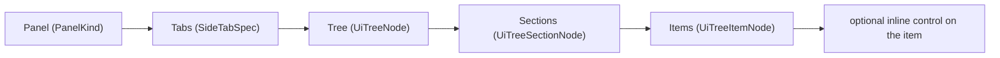

## Goal

Make one and only one shape legal for side panels everywhere:

Strict means: no `SidePanelTabConfig.panel` escape hatch, no `TreeDataSection.content`, no `mount: nested` bodies, no `playgroundPanelSection`. Form controls (input/select/toggle/vec3/button/keyValue) become a `control` slot on a tree item, so inspector/setting/details panels are real trees.

## Current divergence (to remove)

- `SidePanelTabConfig` allows `tree?` OR `panel?: React.ReactNode` — [ui/react/index.tsx](ui/react/index.tsx) ~11178.
- `TreeDataSection.content` arbitrary blob — [ui/react/index.tsx](ui/react/index.tsx) ~7898.
- Two divergent converters: platform wraps body as `tree.sections[].content` ([framework/product/platform/renderer/react/index.tsx](framework/product/platform/renderer/react/index.tsx) ~2946), playground emits `panel:` escape hatch for `treeRoot` ([framework/product/playground/renderer/react/index.tsx](framework/product/playground/renderer/react/index.tsx) ~739).
- `mount: "treeRoot" | "nested"` bifurcation + `getSidePanelBodyMount` — [framework/product/playground/core/index.ts](framework/product/playground/core/index.ts) ~447-473.
- `playgroundPanelSection(content)` escape hatch — [framework/product/playground/renderer/react/index.tsx](framework/product/playground/renderer/react/index.tsx) ~1220.
- Free-form body node kinds (`section`/`field`/`stack`/`table`) used as side-panel bodies in apps.
- `showTabBar = sortedTabs.length > 1` hides the tab strip for single-tab panels — [ui/react/index.tsx](ui/react/index.tsx) ~11353.

## 1. Core model (`framework/core` + `framework/product/playground/core`)

- In playground core `#region 🔖UiNode` ([framework/product/playground/core/index.ts](framework/product/playground/core/index.ts) ~140-216): add `export type UiControlNode = UiInputNode | UiSelectNode | UiToggleNode | UiVec3Node | UiButtonNode | UiKeyValueNode;` and extend `UiTreeItemNode` with `readonly control?: UiControlNode;`. This lets every form/setting be an item.
- Keep `UiTreeSectionNode.items` required; this is already strict (no `content`).
- Remove `UiSectionNode`/standalone `UiFieldNode` from the side-panel body union usage (they survive only nested under an item's `control` via `UiFieldNode`-style wrapping, or are deleted if unused after migration).
- Remove `SidePanelBodyMount`, the `mount` option, `sidePanelBodyMountByKey`, and `getSidePanelBodyMount` ([framework/product/playground/core/index.ts](framework/product/playground/core/index.ts) ~447-473). `registerSidePanelBody(bodyKey, build)` now always means "build a `UiTreeNode`". Add an assertion in the build path that `node.type === "tree"` (throw otherwise), mirroring `assertCanvasOnlyWindowBody`.
- Unify the duplicated side-panel-body registry: platform core ([framework/product/platform/core/index.ts](framework/product/platform/core/index.ts) ~1374-1414) and playground core both expose `registerSidePanelBody`; collapse onto one shared implementation/source so "frameworks are built the same way".

## 2. `@semio-tech/ui-react` primitives (`ui/react/index.tsx`)

- `SidePanelTabConfig`: drop `panel?`; make `tree: TreePanelConfig` required (~~11178-11186). Delete `SidePanelTreePane`'s `activeTabPanel` branch and the `panel ?? tree` fallthrough in both `SidePanel` (~~11362, ~~11447) and `MobilePanel` (~~11490).
- `TreePanelConfig.sections`: keep required; add dev assertion that it is non-empty.
- `TreeDataSection`: remove `content?` (~7898). A section renders only `items`/`getItems`.
- `TreeDataItem`: add `control?` slot (renderer-side React control descriptor) rendered in the row; the declarative `UiControlNode` maps onto it. Keep `label`/`description` for row text.
- `SidePanel`/`MobilePanel`: always render the tab strip (remove the `length > 1` guard) so every panel visibly has tabs.

## 3. Unified converter (both product renderers)

- Replace `sideTabsToPanelTabs` (platform ~2946) and `sideTabsToPlaygroundPanelTabs` (playground ~739) with one shared `sideTabsToPanelTabs` that: resolves `bodyKey` → `UiTreeNode`, maps `UiTreeSectionNode` → `TreeDataSection { items }`, maps `UiTreeItemNode` (+ `control`) → `TreeDataItem`. No `content` wrapping, no `panel:` escape hatch, no `DeclarativeTreeWorkbenchPanel` special case.
- Delete `playgroundPanelSection` (~~1220) and `DeclarativeTreeWorkbenchPanel` (~~766); fold their behavior into the unified tree mapping.
- Extend `uiTreeSectionsToTreeData` (~464) to map `item.control` to a `TreeDataItem.control`.

## 4. Rebuild every non-tree panel as a tree (strict migration)

Each becomes `UiTreeNode` with sections whose items carry controls:

- Display panel: rebuild `DisplayPanel` React component ([framework/product/platform/renderer/react/index.tsx](framework/product/platform/renderer/react/index.tsx) ~901-995) as a declarative tree with two tabs — Windows (draggable template items) and Layout (layout items with apply/delete actions). Each tab is its own tree.
- Presentation details form ([framework/product/presentation/play/index.ts](framework/product/presentation/play/index.ts) ~479-541): name/crop fields + delete → items with `control`.
- Puzzle 3D inspector + settings ([puzzle/3d/play/index.ts](puzzle/3d/play/index.ts) ~1937-2344): vec3/select/slider/delete → control items; both bodies become trees.
- Puzzle 2D inspector + settings ([framework/product/playground/renderer/react/index.tsx](framework/product/playground/renderer/react/index.tsx) ~2311-2349, builders ~3388-3460, ~2465-2579): sliders/selects/checkboxes → control items.
- Puzzle 5D status ([framework/product/playground/renderer/react/index.tsx](framework/product/playground/renderer/react/index.tsx) ~1750-1759, [puzzle/5d/play/index.ts](puzzle/5d/play/index.ts)): stats → keyValue control items.
- CAD catalog + details ([cad/js/renderer/play/index.tsx](cad/js/renderer/play/index.tsx) ~1985-2185): shape select/file status/attribute editors → control items.
- Sketchpad windows/workbench/details ([compose/client/lib/sketchpad/js/index.ts](compose/client/lib/sketchpad/js/index.ts) ~14865-14884, ~13704-13934): stack/text/button bodies → trees of items.
- Playground template workbench/details ([framework/product/playground/core/index.ts](framework/product/playground/core/index.ts) ~721-754): table-host bodies are canvas-like; if they must remain tabular, treat the table as the single tree body, otherwise express as item rows. Confirm during implementation.

## 5. Tests + verification

- Extend existing test files only: framework/core + playground/platform core (tree-only assertion, removed `mount`), `ui/react` (required `tree`, no `content`, always-visible tab strip, `control` item rendering), both renderers (unified converter), and each migrated app's existing tests.
- Verify at runtime via existing `launch.json` entries (puzzle 2d/3d/5d, presentation, cad, sketchpad) that every panel shows a tab strip and renders a real tree; confirm controls work via console logs per repo rules.

## Repo process

- Open a repo-MCP ticket first (read `repo://goals`, associate with the best goal), keep temp artifacts in the ticket folder, edit existing files using `#region`/subregions, extend existing tests, close the ticket with a summary.

## Defaults chosen

- Single-tab panels still render the tab strip (enforces "every panel has tabs" visibly).
- Form controls are modeled as an optional `control` on a tree item (rather than allowing section `content`).
- GIS map keeps having no side panel (nothing to enforce where no panel exists).
