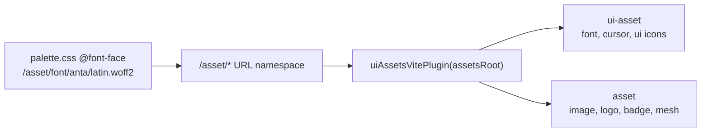

## Root cause

`🎨️palette.css` declares every `@font-face` against `/asset/🔤️fonts/...`. That URL namespace is served by `uiAssetsVitePlugin(assetsRoot: string)` in [🧰️framework/🔨️modules/🖱️ui/🎨️styling/⚡️implementations/🦀️rust/🟦️vite-elements-assets.ts](🧰️framework/🔨️modules/🖱️ui/🎨️styling/⚡️implementations/🦀️rust/🟦️vite-elements-assets.ts). It accepts a caller-supplied filesystem path, and five of six callers pass a directory that does not exist:

- `♻️mit-bestand/🧺️demonstrator/⚙️vite.config.ts:17` - `🧰️framework/🔨️modules/🖼️assets/⚡️implementations/🟦️typescript` (has logos/meshes, no `🔤️fonts`)
- `🟦️vite-elements-assets.ts:1583` in `createPlaygroundPlayViteConfig` - `🧰️framework/🔨️modules/🖱️ui/🖼️assets` (missing `/⚡️implementations/🟦️typescript`)
- `.storybook/main.ts:35` - `framework/module/ui/asset` (pre-emoji-rename, gone)
- `compose/client/lib/sketchpad/js/vite.config.ts:306` - `framework/ui/asset` (gone); its import at line 29 is also a dead path
- `♻️mit-bestand/🎤️präsentation/…/⚙️vite.config.ts:13` and `🧪️vitest.config.ts:12` - `🧰️framework/🔨️modules/🖱️ui/🖼️assets` (gone)

Only `🧑️‍💻️dev/⚙️vite.config.ts:22` is correct. Everywhere else Anta/Kelly Slab/Share Tech Mono 404 and Tailwind preflight falls back to `ui-sans-serif, system-ui`.

The reason it drifted: `/asset/*` spans two packages, so no single caller-supplied root could ever be right.



## Part 1 - Merge the two asset packages into one

Merge `@semio-tech/ui-asset` (A, `🧰️framework/🔨️modules/🖱️ui/🖼️assets/⚡️implementations/🟦️typescript`, 789 files) **into** `@semio-tech/assets` (B, `🧰️framework/🔨️modules/🖼️assets/⚡️implementations/🟦️typescript`, 2172 files). B is the target because it is the only location general enough to hold both UI chrome and domain assets, and B already depends on A - merging removes that edge.

The two `🔣️icons` trees are distinct catalogs, not duplicates (kebab-case UI chrome vs snake_case compose domain, colliding only on the bare ids `file` and `type`). Keep them as **separate named catalogs inside one package** rather than one flat folder, so both codegen pipelines and both Rust `#[path]` consumers survive:

- `🔣️icons` - UI chrome catalog moved from A (247 SVGs), keeps codegen to `🟦️icons.ts`, `🔷️Icons.cs`, `🐍️icons.py`, `🦀️icon_name.rs`, `🟦️shortcodes.ts`
- `🏛️compose/🔣️icons` - B's current root `🔣️icons` (313 SVGs + ~992 PNG/ICO), renamed into a namespace to resolve the `file`/`type` collision; it has no code consumer today, only static serving
- `🌱️metabolism` - unchanged, keeps its `🦀️metabolism_icon_name.rs` codegen
- `🔤️fonts`, `👆️cursor`, `👋️introduction` move from A verbatim
- `📃️list` - merge A's 7 files (licenses, mimes, wordlists, palettes) with B's 10 (qualities, tags); no filename overlap
- `🟦️icon_resolver.ts` - fold A's `resolveCatalogIcon*` and B's `resolveMetabolismIcon*` into one file under two regions

Then:
- Delete A's `package.json`, `📋️project.json`, `📜️script.ts`; fold A's `generate` subcommands into B's `📜️script.ts` as regions so one `@semio-tech/assets:build` drives all codegen
- Remove `@semio-tech/ui-asset` from B's `package.json` dependencies and from root `package.json` workspaces (line 7)
- Re-export A's former barrel (`ICONS`, `ICON_NAMES`, `isIconName`, `IconName`, `ICON_CONCEPT_ASSIGNMENTS`, `SHORTCODE_*`) from B's `📦️index.ts`

Rewrite every consumer of `@semio-tech/ui-asset` to `@semio-tech/assets`: `🧰️framework/⚡️implementations/🟦️typescript/📦️index.ts:8`, `ui/⚛️react/…/📦️index.tsx:146`, renderer react `📦️index.tsx:295`, renderer wgpu `📦️index.ts:5`, `.storybook/stories/ui/Icons.stories.tsx:13`, `📜️script.ts:272`, plus the `package.json` deps, vite/vitest aliases and the nx `dependsOn` in `🧑️‍💻️dev/📋️project.json:21`.

Rewrite the Rust paths that point into A:
- `🧰️framework/🔨️modules/🖱️ui/🧊️wgpu/⚡️implementations/🦀️rust/📦️lib.rs:3` (`#[path]`) and `:12905-12918` (font `include_bytes!`)
- `🧰️framework/🛍️products/💻️os/…/📺️renderer/…/🧊️wgpu/…/build.rs:7` and `📦️lib.rs:32366`
- `🧰️framework/🛍️products/💻️os/…/♾️infinite/🖼️canvas/…/build.rs:15` and `📦️lib.rs:1218`

## Part 2 - Make `/asset/*` enforced by API

In `🟦️vite-elements-assets.ts`, replace the exported `uiAssetsVitePlugin(assetsRoot: string)` with a plugin that takes no filesystem path:

```ts
/** @emoji 🗂️ Canonical repo-relative root of `@semio-tech/assets`, the only tree served at `/asset/*`. */
export const SEMIO_ASSET_ROOT = "🧰️framework/🔨️modules/🖼️assets/⚡️implementations/🟦️typescript";

export function semioAssetsVitePlugin(repoRoot: string): Plugin[] { /* serve + copy, throw if missing */ }
```

Key behaviours:
- Callers pass only `repoRoot`; the root is resolved internally, so no caller can pick a wrong half again.
- Throw at `configResolved` when the root or its `🔤️fonts` subtree is absent, instead of silently 404ing at runtime.
- `semioFaviconSources` (`:560`) already resolves under this same root, so favicons and fonts finally share one truth.

Update all six call sites, including `createPlaygroundPlayViteConfig:1583` and `.storybook/main.ts:136`.

## Part 3 - One host-HTML API

`semioHostHtmlVitePlugin` / `semioHostHtmlString` (`:757-798`) already generate the canonical document (boot inline style, appearance + theme scripts, favicon links, reveal script, entry) but are referenced **only by tests**. Every app hand-writes its own HTML instead.

Move the apps onto it and delete their hand-authored `🌐️index.html` inline `<style>` blocks and body classes:
- `♻️mit-bestand/🧺️demonstrator/🌐️index.html` - drop the `<style>` at lines 7-14 and the `bg-background text-foreground` body classes; drive from `semioHostHtmlVitePlugin` with `title`, `entry: "./📦️index.tsx"`, `bodyClass`
- `♻️mit-bestand/🎤️präsentation/📅️33.projektetage/…/🌐️index.html` - same, and its `<script src="./js/index.ts">` points at a `js/` directory that does not exist; entry is `📦️index.ts`
- `🧰️framework/…/🧑️‍💻️dev/…/🌐️index.html` - currently gets no boot script injection at all, so it can flash unstyled
- The five compose hosts (`sketchpad/js`, `sketchpad/play`, `sketchpad/doc`, `ui/desktop`, `ui/3dm/ui`), which have inconsistent titles and no boot scripts

## Part 4 - Repair the stale CSS and alias paths

All verified missing on disk:
- `♻️mit-bestand/🎤️präsentation/…/🎨️globals.css:1-4` imports `../../../ui/js/react/…` and `../../../animate/present/renderer/react/…`; repoint at the framework react hub and `✏️s/🔌️plugins/🎞️animate/…/🎨️globals.css`, matching the demonstrator's working pattern
- `.storybook/main.ts:29-35` - `framework/module/ui/js/react`, `framework/module/ui/styling/js`, `framework/module/asset`, `puzzle/asset`, `framework/module/ui/asset` all gone
- `.storybook/globals.css:2-12` - legacy flat `@source` roots
- `compose/client/lib/sketchpad/js/vite.config.ts:29` - dead import path for `🟦️vite-elements-assets.ts`
- `compose/client/{lib/sketchpad/js,lib/sketchpad/play,lib/sketchpad/doc,ui/desktop,ui/3dm/ui}/globals.css` - legacy `../../../elements/ui/...` roots
- `compose/client/lib/sketchpad/doc/globals.css:1` - bypasses the stack with its own `@import "tailwindcss"`
- `compose/client/ui/desktop/js/renderer.tsx:17` imports a `🎨️globals.css` that does not exist next to it
- `.vscode/launch.json:4263` - `cwd` `${workspaceFolder}/ui/asset`

## Part 5 - Tests that make this unrepeatable

Extend the existing `🧪️index.test.ts` in the styling package (no new test files):
- Parse every `url()` in `🎨️palette.css` and assert each resolves to a real file under `SEMIO_ASSET_ROOT`. This is the check that would have caught the original bug.
- Assert `semioAssetsVitePlugin` throws for a repo root without the asset tree.
- Assert no `vite.config.ts` in the repo passes a filesystem path to the assets plugin.
- Extend `🟦️vite-elements-assets.ts`'s own `import.meta.vitest` block to assert every `🎨️globals.css` `@import`/`@source` target exists.

## Verification

Per the repo rules, runtime behaviour must be confirmed, not assumed: run `bun nx run @semio-tech/mit-bestand-demonstrator:dev`, load the page, and confirm with a `[DEBUG]` log of `getComputedStyle(document.body).fontFamily` that it reports Anta and that `/asset/🔤️fonts/🔤️anta/🔤️latin.woff2` returns 200 with `font/woff2`. Repeat for Storybook and one playground. Then run the styling and ui-react test suites plus `cargo check` on the crates whose `include_bytes!` paths moved.

## Ticket

The repo MCP server is configured in `.mcp.json` but is **not connected in this session**, so `ticket_open` and `repo://goals` are unavailable. I read the goals from `.🦑️repo/🎯️goals` directly: the closest fit is `R26-03`. The closed ticket `🎆️26/🌙️05/☀️29/FIX-ELEMENTS-PALETTE-FONT-UR-LS` fixed this same class of bug under the old pre-emoji layout, so this is effectively its regression plus a much wider scope. Before implementation starts, the repo MCP needs to be connected so a ticket can be opened and all scratch files placed in its folder.