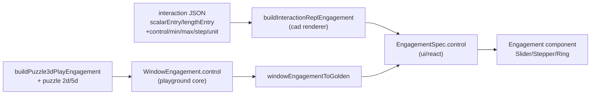

## Goal

Add an optional `control` to engagement so plays can render a `Slider` / `Stepper` / `Ring` next to the command line when asking for a value (e.g. a height) or choosing among options. Wire it into CAD (all interactions, declaratively) and puzzle plays. Generic union supporting all three control kinds; sensible defaults chosen per case.

## Data flow

## Control type (generic, all kinds)

Discriminated union added to `ui/react`:

- `slider`: `{ kind, value, min, max, step?, unit?, label?, onChange(value), onCommit?(value) }`
- `stepper`: `{ kind, value, min?, max?, step?, unit?, label?, onChange(value), onCommit?(value) }`
- `ring`: `{ kind, value?, options: { id, label, disabled? }[], label?, onSelect(id) }` (radial dropdown; orbs spread evenly on the ring `t`)

Default choices: numeric value entry (height/distance/radius/scalar) → `stepper`; angle entry (rotate) → `ring` dial; discrete option selection (transitions, brush candidates) → `ring`.

## 1. UI layer — `ui/react/index.tsx` (`#region 🧭Shell`)

- Add interfaces `EngagementSliderControl`, `EngagementStepperControl`, `EngagementRingControl`, union `EngagementControl` (near `EngagementOption` ~`11741`), each docstring starting with an emoji.
- Add `control?: EngagementControl` to `EngagementSpec` (`12122`) and export the new types.
- In the `Engagement` component (`12174`-`12445`), render the control in a new `data-slot="engagement-control"` block between the command row and `secondaryStatus`. Map:
  - `slider` → `<Slider />`, `stepper` → `<Stepper />` (both already accept `value/min/max/step/onChange`).
  - `ring` → `<Ring />` with `orbs` derived from `options` (even `t = i/options.length`), `selected` = `value`, `onOrbSelect` → `onSelect`.
- Include in the `if (!hasOptions && !hasInput && !hasStatus)` early-return guard so a control alone keeps the overlay visible.
- Storybook: add a `WithControl` story variant in `.storybook/story/ui/Engagement.stories.tsx`.

## 2. Playground core — `framework/product/playground/core/index.ts` (`#region 🔖WindowEngagement`)

- Add `WindowEngagementControl` union mirroring the UI union but callback-as-`CommandDescriptor` (slider/stepper `onChange`/`onCommit` dispatch `{ value }`; ring `onSelect` dispatch `{ id }` or per-option command).
- Add `control?: WindowEngagementControl` to `WindowEngagement` (`185`).
- Extend `windowEngagementDigest` (`200`) to fold the control in (kind + value + bounds + command digests) so shell sync still skips redundant updates.

## 3. Golden bridge — `framework/product/playground/renderer/react/index.tsx`

- In `windowEngagementToGolden` (`714`-`748`), map `engagement.control` → `EngagementControl`, wiring callbacks to `bus.dispatch(...)` (merge `{ value }` / `{ id }` into args, same pattern as `input.onChange`).

## 4. CAD — declarative controls

- `cad/js/core/index.ts`: extend `InteractionScalarEntrySpec` (`817`) and `InteractionLengthEntrySpec` (`808`) with optional `control?: "slider" | "stepper" | "ring"`, `min?`, `max?`, `step?`, `unit?`, `default?`. Add a helper `interactionControlForState(spec, state)` returning resolved control params (defaults: scalar→stepper, length→stepper, `set.angle` event→ring).
- `cad/schema/json/interaction.json` (`153`-`188`): add the same optional properties to `lengthEntry` and `scalarEntry` items.
- `cad/asset/modelDefinition/**/interaction/*.json` (~45 files with `scalarEntry`/`lengthEntry`/`heightDragStates`, e.g. `box.json`, `sphere.json`, `cylinder.json`, `rotate.json`, `scale1d/3d.json`, energy + structure constructors): declare `control`/`min`/`step`/`unit` on the relevant entries (height/radius→stepper min 0; rotate angle→ring; etc.).
- `cad/js/renderer/index.tsx`:
  - Extend `InteractionReplEngagementInputs` (`3775`) with `control?: EngagementControl`.
  - In `buildInteractionReplEngagement` (`3805`) attach `control` to the returned spec.
  - In `InteractionRepl` (the `engagementSpec` memo ~`4735`) compute the control from` interactionControlForState(spec, snapshot.state)`plus the current value (from runtime ctx /`cmdLine`);` onChange`sets`cmdLine`to the numeric string (reusing the existing live`interactionNumericEntryApplyEvent`path at`4764`-`4778`),` onCommit`/ring select drives submit/transition.

## 5. Puzzle plays

- `puzzle/3d/react/index.tsx` `buildPuzzle3dPlayEngagement` (`5939`): when brush candidates exist, also emit a `ring` control (orbs = candidates) so placement is selectable radially; keep possibles as fallback. Mirror in `Puzzle3dPlayEngagementPublisher` (in the golden renderer) to `WindowEngagement.control`.
- `puzzle/2d/play/index.ts` `windowEngagementForPane` (~`692`): add a` ring` control for tool/create selection.
- `puzzle/5d/play/index.ts`: add control only if a value/selection step exists; otherwise leave input-only.

## 6. Tests

Extend existing test files (no new files) covering: UI `Engagement` rendering each control kind, `windowEngagementToGolden` control mapping + `windowEngagementDigest` equality, `buildInteractionReplEngagement` control output, and `buildPuzzle3dPlayEngagement` ring control.

## Process (repo rules)

Implementation happens inside a repo ticket: read `repo://goals`, open/reopen a ticket via repo MCP, put any temp artifacts under the ticket folder, register no new files outside it, and close the ticket with a summary. Run the relevant `launch.json` build/test tasks (bun + nx) and confirm runtime behavior before claiming success.
