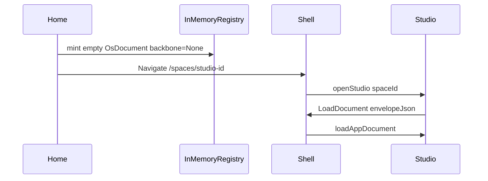

# Ephemeral Create-and-Open Studio (No Backbone, No Sync)

## Problem

Source already removed `DownloadMediaExport` from `createStudio`, but default create still calls [`create_os_space`](framework/product/os/core/rs/lib.rs) which:

- writes through `LocalStorageBackbonePort` (`CATALOG_PORT` in [`s/plugin/rs/lib.rs`](s/plugin/rs/lib.rs))
- sets `document.backbone = space://{id}` via `sync_os_space_document`

That is not `DocumentHost` sync, but it **is** a backbone attach on the document and persists to browser storage. Demo can still appear via catalog seed (`id: "default"`), `openStudio` example fallback (`"demo"`), or a **stale WASM** build of the old download path.

User requirement: **just create a new empty studio and open it** — no download, no backbone, no sync by default.

## Target flow

## Implementation

### 1. Ephemeral create API (os-core)

In [`framework/product/os/core/rs/lib.rs`](framework/product/os/core/rs/lib.rs):

- Add `create_ephemeral_os_space(name) -> OsDocument` that only calls `create_empty_os_document` (already has `backbone: None`).
- Do **not** call `sync_os_space_document` / `track_os_space_backbone_uri`.

Keep existing `create_os_space(port)` for explicit later persistence (file/folder/catalog save).

### 2. Default `createStudio` uses ephemeral registry only

In [`s/plugin/rs/lib.rs`](s/plugin/rs/lib.rs) home app:

- Add an in-memory map `EPHEMERAL_STUDIOS: Mutex<HashMap<String, OsDocument>>` (or reuse `STUDIO_PORTS` + `MemoryBackbonePort` **without** setting `document.backbone`).
- Default Meta+N / `createStudio` (no kind / `"catalog"` / `"file"`):
  1. `create_ephemeral_os_space(name)`
  2. Register in ephemeral map
  3. Emit **only** `created_studio_emit` (Navigate) — assert no `DownloadMediaExport`
- `"temporary"`: same ephemeral path (collapse with default; temporary was already MemoryBackbonePort).
- `"folder"`: leave as opt-in native-only path (unchanged).
- Update `resolve_studio_document` to read ephemeral map first.

### 3. `openStudio` loads empty doc, never demo by accident

In studio app `openStudio` ([`s/plugin/rs/lib.rs`](s/plugin/rs/lib.rs) ~2771):

- Resolve ephemeral → then catalog ports.
- On miss: emit `LoadDocument` of `create_empty_os_document(space_id, "Untitled Studio")` (or no-operation empty), **not** `parse_demo_space_document()`.
- Keep demo only when `space_id == "demo"` explicitly (example route), or drop example fallback entirely and require seed id `"default"` only when opening that catalog entry.

### 4. Stop demo as create/open default chrome

- Do not change seeded Demo Studio in home VFS listing for now (user can still open it deliberately).
- Ensure create never navigates to `/spaces/default` or `/spaces/demo`.
- Confirm React boot `setActiveExample` stays skipped in `studioMode` ([`framework/renderer/react/index.tsx`](framework/renderer/react/index.tsx) ~6461) and `applyShellUri` still applies `LoadDocument`.

### 5. Explicit: no `openDocument` / `attachBackbone` on create

Do not call shell `openDocument` or program `attachBackbone` from create/open path. Persistence remains future opt-in (`bindStudioFile` / folder / sync card).

### 6. Tests + rebuild

- Extend home tests: default create → Navigate to fresh id; **no** DownloadMediaExport; resolved document has `backbone == None` and empty `app_instances`; `openStudio` → LoadDocument with empty instances.
- Rebuild/reload `s` plugin WASM (`bun run dev:s` or OS dev build) so runtime matches source — this is why the user may still see the old download.

## Out of scope

- Re-adding Temporary/File/Folder footer UI.
- Wiring DocumentHost sync for new studios.
- Removing Demo Studio from the home list.