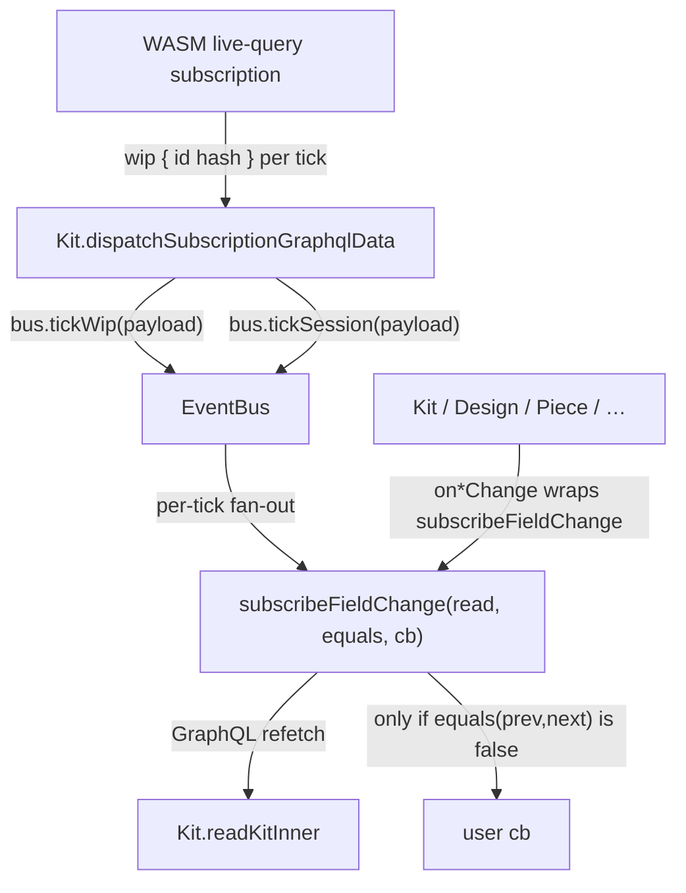

## Scope clarification

- **Field-level events (this ticket):** `on${Field}Change(cb)` reacts to the value of a GraphQL leaf changing in the WIP graph (e.g. `onNameChange` fires when `kit.name` is now different from before). Same intent as MobX `observe` / Svelte stores.
- **Operation-level events (out of scope):** `on${Operation}(cb)` would fire whenever a specific mutation succeeds (`onRenamed`, `onPieceMoved`, …). Not added here; the obsolete bus kinds (`kitRenamed`, `changedDescription`) emitted from `wip` ticks are removed because they conflate the two notions.
- **Transport limitation:** `[semio/js/index.ts](semio/js/index.ts)` lines 137–193 — `WorkerStringTransport.subscribe` returns `Promise<void>` with no per-subscription cancel handle. We therefore keep the single coarse `subscription { wip { id hash } }` (line 252) and diff per listener. The `subscribeFieldChange` API is designed transport-agnostic so a follow-up ticket can swap each listener to its own `subscription { wip { theKit { kit { … field … } } } }` once `op: "unsubscribe"` lands in `[semio/js/kit-store.worker.ts](semio/js/kit-store.worker.ts)`.

## Architecture




## EventBus surface (`[semio/js/index.ts](semio/js/index.ts)` lines 222–249)

Replace the current minimal bus with:

```ts
type Equals<T> = (a: T, b: T) => boolean;

export class EventBus {
  // legacy raw fan-out kept for the few callers that still inspect kind/payload (commandSucceeded, operationFailed)
  private readonly raw = new Set<(ev: JsonValue) => void>();
  private readonly wipListeners = new Set<(payload: JsonObject | null) => void>();
  private readonly sessionListeners = new Set<(payload: JsonObject | null) => void>();

  emit(ev: JsonValue): void;                      // unchanged signature, only used by legacy raw kinds
  subscribe(handler): Unsubscribe;                // unchanged
  subscribeKind(kind, handler): Unsubscribe;      // unchanged

  // new: typed transport demux entry points (called by Kit.dispatchSubscriptionGraphqlData)
  tickWip(payload: JsonObject | null): void;
  tickSession(payload: JsonObject | null): void;

  // new: typed fan-outs
  subscribeWipTick(cb: (payload: JsonObject | null) => void): Unsubscribe;
  subscribeSessionTick(cb: (payload: JsonObject | null) => void): Unsubscribe;

  // new: field-change helper used by every on*Change method
  subscribeFieldChange<T>(
    read: () => Promise<T>,
    equals: Equals<T>,
    cb: (next: T) => void,
    opts?: { readonly fireInitial?: boolean; readonly source?: "wip" | "session" | "both" },
  ): Unsubscribe;
}
```

Semantics of `subscribeFieldChange`:

- On every selected tick (`wip` by default), run `read()`. Cache the result. If `equals(prev, next)` is false, invoke `cb(next)` and update the cache.
- Sequential per-listener: drop overlapping refetches (track an in-flight token; if a new tick arrives while one is in flight, queue exactly one re-run after it settles).
- `fireInitial: true` schedules one immediate `read()` and unconditional `cb(next)` (cache is seeded but the diff is skipped for that first call). Default `false`.
- Errors in `read()` are swallowed (logged via `console.warn` with a `[semio]` prefix) so a transient GraphQL hiccup does not poison the listener.

Equality helpers (module-private):

- `eqIs = Object.is` for scalars / nullable scalars (string, number, boolean).
- `eqIdList = (a: readonly string[], b: readonly string[]) => a.length === b.length && a.every((x, i) => x === b[i])`.
- `eqDeep = (a, b) => stableStringify(a) === stableStringify(b)` for `Position`, `Plane`, `Coordinate`, `Attribute[]`, `Benchmark[]`, `ConnectionSide`, `PieceBlueprint`.

## Dispatcher cleanup (`[semio/js/index.ts](semio/js/index.ts)` lines 638–659)

Rewrite `Kit.dispatchSubscriptionGraphqlData`:

```ts
private dispatchSubscriptionGraphqlData(data: JsonObject | null | undefined): void {
  if (data == null) return;
  if (data["wip"] !== undefined)     this.bus.tickWip(data["wip"] as JsonObject | null);
  if (data["session"] !== undefined) this.bus.tickSession(data["session"] as JsonObject | null);
  if (data["commandSucceeded"] !== undefined) this.bus.emit({ kind: "commandSucceeded", payload: data["commandSucceeded"] });
  if (data["operationFailed"] !== undefined)  this.bus.emit({ kind: "operationFailed",  payload: data["operationFailed"]  });
}
```

Removed:

- Synthetic `{ kind: "kitRenamed" }` / `{ kind: "changedDescription" }` emissions on every WIP tick (they conflated field-changes and operations).
- The `data["event"]` legacy branch (the schema no longer carries `Subscription.event`).
- `data["operationSucceeded"]` legacy branch.

## `KIT_ARTIFACT_FIELD_SPECS` / `DESIGN_ARTIFACT_FIELD_SPECS` cleanup (`[semio/js/index.ts](semio/js/index.ts)` lines 491–550)

Drop the `eventKind` markers — they only existed to wire the legacy semantic-event bus into `bindDefinedFieldToReact`. The new path is `entity.on${Field}Change`, so React bindings simply call that.

`FieldSpec<T>` becomes:

```ts
export type FieldSpec<T> = Readonly<{ selection: string; parse: (v: JsonValue) => T }>;
```

`Design.subscribeField` (`[semio/js/index.ts](semio/js/index.ts)` lines 1128–1134) is removed (callers should use the typed `on*Change` methods); `Design.onDescriptionChanged` is renamed to `Design.onDescriptionChange` (no back-compat per repo rules).

## `on${Field}Change` factory

Add a single private helper in `Entity` so every method body is one line:

```ts
protected onChange<T>(read: () => Promise<T>, equals: Equals<T> = eqIs): (cb: (next: T) => void) => Unsubscribe {
  return (cb) => this.kit.bus.subscribeFieldChange(read, equals, cb);
}
```

Each class then declares its `on*Change` methods alongside its `read*` methods, e.g.:

```ts
// Kit
onNameChange       = (cb: (n: string) => void)            => this.bus.subscribeFieldChange(() => this.readName(),        eqIs,    cb);
onDescriptionChange= (cb: (d: string) => void)            => this.bus.subscribeFieldChange(() => this.readDescription(), eqIs,    cb);
onIconChange       = (cb: (s: string) => void)            => this.bus.subscribeFieldChange(() => this.readIcon(),        eqIs,    cb);
onImageChange      = ...; onPreviewChange = ...; onRemoteChange = ...; onHomepageChange = ...; onLicenseChange = ...; onUriChange = ...;
onTypeIdsChange    = (cb: (ids: readonly string[]) => void) => this.bus.subscribeFieldChange(() => this.readTypeIds(),    eqIdList, cb);
onDesignIdsChange  = ...; onAuthorIdsChange = ...; onQualityIdsChange = ...; onTagIdsChange = ...; onConceptIdsChange = ...;
```

## Coverage of `on*Change` per class

For every `read${X}()` listed below, add one matching `on${X}Change(cb)`:

- `**Kit**` (lines 1025–1078): `onIdChange`, `onNameChange`, `onDescriptionChange`, `onIconChange`, `onImageChange`, `onPreviewChange`, `onRemoteChange`, `onHomepageChange`, `onLicenseChange`, `onUriChange`, `onTypeIdsChange`, `onDesignIdsChange`, `onAuthorIdsChange`, `onQualityIdsChange`, `onTagIdsChange`, `onConceptIdsChange`.
- `**Design**` (lines 1083–1202): `onIdChange`, `onNameChange`, `onDescriptionChange`, `onIconChange`, `onImageChange`, `onUnitChange`, `onQualitySumChange`, `onPieceIdsChange`, `onConnectionIdsChange`, `onAttributeIdsChange`. (Drops `onDescriptionChanged`.)
- `**Type**` (lines 1306–1465): `onNameChange`, `onDescriptionChange`, `onIconChange`, `onImageChange`, `onUnitChange`, `onConnectorsChange`, `onRepresentationsChange`, `onAttributesChange`.
- `**Port**` (lines 1467–1559): `onCodeChange`, `onLabelChange`, `onOrderChange`, `onNameChange`, `onDescriptionChange`, `onIconChange`, `onAttributesChange`.
- `**Connector**` (lines 1561–1725): `onNameChange`, `onCodeChange`, `onDescriptionChange`, `onIconChange`, `onPortIdChange`, `onAttributesChange`.
- `**Piece**` (lines 1727–1830): `onNameChange`, `onDescriptionChange`, `onIconChange`, `onScaleChange`, `onPositionChange`, `onFlatPositionChange`, `onPlaneChange`, `onCenterChange`, `onFlatPlaneChange`, `onFlatCenterChange`, `onBlueprintChange`, `onAttributesChange`, `onConnectionKindChange`, `onParentPieceIdChange`, `onParentConnectionIdChange`, `onChildPieceIdsChange`, `onChildConnectionIdsChange`, `onDepthChange`.
- `**Connection**` (lines 1947–2038): `onNameChange`, `onDescriptionChange`, `onIconChange`, `onGapChange`, `onShiftChange`, `onRiseChange`, `onRotationChange`, `onTurnChange`, `onTiltChange`, `onConnectedChange`, `onConnectingChange`, `onAttributesChange`.
- `**Author**` (lines 2040–2084): `onNameChange`, `onDescriptionChange`, `onIconChange`, `onEmailChange`, `onRoleChange`, `onRankChange`.
- `**Quality**` (lines 2086–2191): `onKeyChange`, `onValueChange`, `onUnitChange`, `onDefinitionChange`, `onNameChange`, `onDescriptionChange`, `onIconChange`, `onAttributesChange`, `onBenchmarksChange`.
- `**Tag**` (lines 2193–2264): `onNameChange`, `onDescriptionChange`, `onIconChange`, `onOrderChange`, `onAttributesChange`.
- `**Concept**` (lines 2266–2334): `onNameChange`, `onDescriptionChange`, `onIconChange`, `onOrderChange`, `onAttributesChange`.
- `**Representation**` (lines 2339–2419): `onNameChange`, `onUrlChange`, `onDescriptionChange`, `onIconChange`, `onFileIdChange`, `onTagIdsChange`, `onQualityIdsChange`, `onAttributesChange`.
- `**Family**` (lines 2424–2448): `onNameChange`, `onDescriptionChange`, `onIconChange`.
- `**FileEntity**` (lines 2452–2463): `onNameChange`.
- `**FolderEntity**` (lines 2468–2492): `onNameChange`, `onDescriptionChange`, `onPathChange`.
- `**LayerEntity**` (lines 2497–2555): `onNameChange`, `onDescriptionChange`, `onIconChange`, `onColorChange`, `onOrderChange`, `onVisibleChange`, `onLockedChange`.
- `**GroupEntity**` (lines 2559–2575): `onNameChange`.
- `**StatEntity**` (lines 2580–2616): `onKeyChange`, `onValueChange`, `onUnitChange`, `onNameChange`, `onDescriptionChange`, `onIconChange`.
- `**PropEntity**` (lines 2621+): `onKeyChange`, `onValueChange`, plus whatever scalars `read*` exposes.

For `Family`, `FileEntity`, `FolderEntity`, `StatEntity`, `PropEntity` the underlying `readScalarOnNode` paths use root `Query.node(id:)` (not WIP-scoped), so the diff still works — `subscribeFieldChange` only cares that `read()` returns a comparable value on each WIP tick.

## Tests (`[semio/js/index.ts](semio/js/index.ts)` embedded `describe("semio/js field-only kit", …)` block, line 3256)

Extend that block (no new files) with:

- `EventBus.subscribeFieldChange` unit:
  - Fires `cb(next)` only when `equals(prev, next)` is false.
  - With `fireInitial: true`, fires exactly once before the first tick.
  - Honours `Unsubscribe` (no further `cb` after disposal even if more ticks arrive).
  - Concurrent ticks coalesce to at most one queued re-run.
- `Kit#onNameChange` end-to-end:
  - Subscribe, call `kit.rename("foo")`, await callback with `"foo"`.
  - Calling `kit.rename("foo")` again does not invoke the callback a second time (value unchanged).
- `Design#onDescriptionChange` end-to-end mirrors above on a design.
- `Piece#onScaleChange`, `Piece#onPositionChange`:
  - `move`/`drag` produces exactly one diff per real change.
  - `eqDeep` correctly suppresses no-op moves.
- Multi-listener: two subscribers on `Kit#onNameChange` both fire on a real change, neither fires on a no-op rename.

## Ticket lifecycle (per AGENTS.md)

- Read `repo://goals` first; associate with the existing live-subscription / subscriptions goal (e.g. the goal that owns the live-query refactor) — fall back to creating a new ticket under that goal if none exists.
- `ticket_open` with title `"Extend EventBus With Field-Level on*Change"` before any code edits.
- All temp logs / scratch under `.repo/🎫/26/05/12/EVENTBUS-FIELD-CHANGE/`.
- `ticket_close` with the file list (`semio/js/index.ts`, ticket folder) once `tsc --noEmit` and `vitest run` in `semio/js` pass.

## Out of scope (explicit follow-ups)

- Operation-level event API (`onRenamed`, `onPieceMoved`, …) — separate ticket; will reuse `EventBus.subscribeKind` with a typed payload union.
- Per-field server-side live queries — needs `op: "unsubscribe"` in the worker protocol and an `Unsubscribe` return from `WorkerStringTransport.subscribe`. Once landed, `subscribeFieldChange` can switch from "tick + refetch" to "one live subscription per leaf" without changing the public `on*Change` surface.

