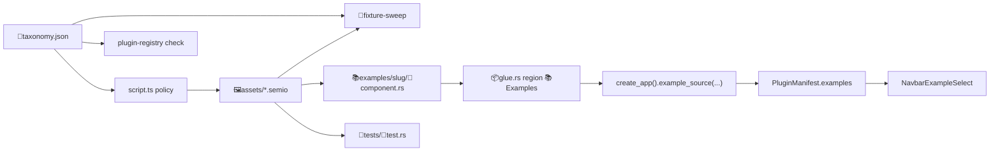

## Current state (measured, not assumed)

- **110** `📚️examples` roots: 53 under `🗿️artifacts/<artifact>/`, 52 under `🎛️apps/<app>/⚙️engine/`, 1 plugin-root (`💡️reasoning`), 4 framework. **2** are empty.
- **700** `.semio` files repo-wide, of which **429** are example assets. The other **271** are facet specs (`📖️component.grammar.semio`, `📡️component.protocol.semio`) and framework grammars that stay exactly where they are — no shard may move them.
- The **429** example assets are buried two levels deep in plural dirs: `📚️examples/♻️reuse/🗣️dsls/♻️reuse/🧬️component.<plugin>.<artifact>.dsl.semio`. Flow and dag have a doubly-nested `♻️reuse/♻️reuse/`.
- **315** `🦀️component.rs` shims under `📚️examples` are **dead code**: `rg '#\[path[^]]*📚️examples'` returns zero hits, so no `📦️glue.rs` ever declares them. Only the **124** `include_str!`/`include_bytes!` sites in facet files actually load assets.
- Example identity is not in the tree at all — it is hardcoded in Rust `create_*_app()` builders as `.example(id, LocalizedLabel::native("Nakagin Capsule Tower", "Nakagin Kapselturm"), payload, "list-tree")`, duplicated again in `ActionArgOption` dropdown lists and again in `🗣️terminology`. See [ShellHost/🟦️component.tsx](🧰️framework/🛍️products/💻️os/🔨️modules/📺️renderer/🧑‍🎨️engine/🧱️elements/ShellHost/🟦️component.tsx) lines 3938-3977.
- Placeholder names dominate (`♻️reuse`, `♻️default`, `📕️default`, `♻️semio`) and most `.pack.semio` / `.spr.semio` are 64-byte header-only stubs.
- **28 of 32** plugins have no `🧪️vitest.config.ts`, so no TS test can run inside them.
- Storybook puzzle stories import paths that no longer exist (`s/plugin/puzzle/...`, `📚️examples/🧩️concrete-forest.puzzle3d`).

## Target shape

```
✏️s/🔌️plugins/<plugin>/
  🗿️artifacts/<artifact>/
    🔺️diff 🗣️dsl 🎒️pack 🔧️op 📡️spr ⚙️engine        (facets unchanged)
    📚️examples/
      🏗️nakagin-capsule-tower/
        🦀️component.rs        example definition: id, labels, icon, asset consts
        🟦️component.ts        same definition for TS consumers
        🖼️assets/
          🗣️tower.dsl.semio
          🎒️tower.pack.semio
          🎒️tower-v2.pack.semio
          📡️tower.spr.semio
          🔧️relabel.op.semio
          🧊️capsule.glb
          🖼️floor-plan.png
        🧪️tests/
          🦀️test.rs
          🟦️test.ts
  🎛️apps/<app>/
    📚️examples/🎬️demo-session/          moved up, out of ⚙️engine
      🦀️component.rs
      🖼️assets/🎮️demo.cmd.semio
      🧪️tests/🦀️test.rs
```

Laws:

- **Example dir**: emoji + VS16 + kebab-case slug, one dir per demonstrable scenario. Placeholders (`♻️reuse`, `♻️default`, `📕️default`, `♻️semio`) are deleted, not renamed.
- **Assets**: free-form name, prefixed by asset-kind emoji — `🗣️` dsl, `🔧️` op, `📡️` spr, `🎒️` pack, `🔺️` diff, `🎮️` cmd. Non-semio media allowed flat with `🖼️` image, `🧊️` mesh, `📄️` document, `🎬️` video. Multiple assets and versions per example are expected; the plural dirs `🗣️dsls/🎒️packs/🔧️ops/📡️sprs` are gone.
- **Definition leaf**: `🦀️component.rs` is the single source of truth for id, localized label, icon and asset bytes. It is wired in the plugin's `📦️glue.rs` under a new `//#region 📚️Examples`, exactly like every other taxonomy leaf.
- **Tests**: `🧪️tests/🦀️test.rs` (declared `#[cfg(test)]` in `📦️glue.rs` beside its example) and `🧪️tests/🟦️test.ts` (picked up by a per-plugin `🧪️vitest.config.ts`). Tests read assets from `🖼️assets/` via `include_str!` / `node:fs` — never via bundler-specific `?raw`, so they run in vitest and node alike.
- **No dead files**: every file under `📚️examples` is either reachable from `📦️glue.rs`/`📦️index.ts` or is an asset referenced by a definition leaf.




## Mechanism changes

**Taxonomy** — [🔣️taxonomy.json](🧰️framework/🛍️products/🦑️repo/🔨️modules/📚️library/🔣️taxonomy.json):

- Delete `exampleComponentDirs` (lines 191-196) and its four entries from `taxonomyLeafParentDirs` (223-241).
- Add `exampleAssetsDirName: "🖼️assets"`, `exampleTestsDirName: "🧪️tests"`, `exampleSlugPattern`, `exampleAssetKindPrefixes`, `exampleMediaKindPrefixes`, `exampleLeafFilenames`, `exampleTestLeafFilenames`.
- Add `📚️examples` to `appChildDirs` (197-205).

**Policy** — root [📜️script.ts](📜️script.ts) (note `script.ts` is a symlink to the same file):

- Rewrite `policySemioArtifactExamplesBreaches` (3973-4058): require `≥1` example per artifact and per app, slug matches pattern, `🖼️assets/` + `🧪️tests/` present, definition leaf present, no plural dirs, no plugin-root `📚️examples`.
- Rewrite `policyEmptyExampleBreaches` (4531-4559) to cover all asset kinds, not just pack/spr, keeping `POLICY_EMPTY_EXAMPLE_EXEMPTIONS` empty so stubs are breaches.
- Add a `policyDeadExampleLeafBreaches` rule: any `.rs` under `📚️examples` not reachable from a `#[path]` in a `📦️glue.rs`.
- Fix `policyComponentFileBreaches` (4079) for the dynamic slug leaf-parent.
- New permanent command group `examples` (`list`, `verify`, `verify <plugin>`) per the "all permanent scripts in script.ts" rule.

**Registry** — [📇️registry/📜️script.ts](🧰️framework/🛍️products/💻️os/🔨️modules/🔌️plugin/📦️packages/🟦️typescript/📇️registry/📜️script.ts): rewrite `validateTaxonomyTree` (940-1024) for the new shape and `discoverExamplesForPlayground` (302-342) to read emoji-slug dirs and the definition leaf instead of legacy `*.json` basenames.

**Discovery + locks** — `validateTaxonomy` in [🔍️discovery/🟦️component.ts](🧰️framework/🛍️products/🦑️repo/🔨️modules/📚️library/🔍️discovery/🟦️component.ts) (144-188) and the assertions in [🧪️index.test.ts](🧰️framework/🛍️products/🦑️repo/🔨️modules/📚️library/📦️packages/🟦️typescript/🧪️index.test.ts) (1117-1133, 1175-1187).

**Fixture sweep** — [🧪️fixture-sweep/🦀️component.rs](🧰️framework/🛍️products/💻️os/🔨️modules/🗣️dsl/🧪️fixture-sweep/🦀️component.rs), 722 lines: rewrite `example_dirs` walk, `repo_wide_semio_example_kind_coverage` (306-336), and all 38 hardcoded pilot `include_`* paths.

**Runtime example type** — OS kernel plugin module: add an `ExampleSource` value type and `App::example_source(...)` so `create_*_app()` consumes the definition leaf instead of restating labels. This is what removes the triplicated titles across manifest, action args and terminology.

## Workforce

All subagents use `cursor-grok-4.5-high` or `composer-2.5` (regular, never `-fast`). Grok takes law, architecture and DSL-heavy domains; Composer takes high-volume mechanical migration.

Shared files are reserved to a single wave so parallel agents never collide: taxonomy, root `📜️script.ts`, registry script, discovery, `🧪️index.test.ts`, fixture-sweep and OS kernel belong to W1; `.storybook/**` to W4; `launch.json`, root `package.json`, `📋️project.json`, `README.md` to W5. Every W3 shard owns only whole plugin directories plus that plugin's own `📦️glue.rs`, `📦️index.ts`, `📋️project.json` and new `🧪️vitest.config.ts`. Root `Cargo.toml` and root `🧪️vitest.config.ts` stay untouched — no new crates, and vitest auto-discovers `**/🧪️vitest.config.ts`.

- **W0** (1 Grok) — open ticket under goal `R26-02/UPDATED-DOCS/UPDATED-USER-DOCS/UPDATED-EXAMPLES`; freeze `🧾️inventory.json` (110 roots, 429 assets, 315 dead shims, 124 include sites) and `📋️shards.json` in the ticket folder.
- **W1a** (1 Grok, serial gate) — taxonomy, policy, registry, discovery, test locks, `examples` command.
- **W1b** (1 Grok, parallel with W1a) — `ExampleSource` + `App::example_source` in OS kernel, fixture-sweep rewrite.
- **W2** (1 Grok, serial gate) — pilot `🧩️puzzle` end to end: 3 artifacts, 3 apps, real handcrafted examples, glue wiring, tests, vitest config, green on `nx run @semio-tech/puzzle-plugin:test` and `policy`. Writes `📐️pattern.md` in the ticket folder as the canonical diff template every W3 shard follows.
- **W3** (11 parallel shards) — remaining 31 plugins, each doing shape + wiring + handcrafted real content + tests in one pass:
  - S1 Grok — `📕️norm` (14 artifacts, 14 apps; `📦️glue.rs` is 1082 lines)
  - S2 Grok — `🌀️procedural`, `📐️cad` + its 4 extensions
  - S3 Grok — `🔱️trinity` (incl. jack LSP), `🌊️flow`
  - S4 Grok — `🧱️block`, `🕸️dag`
  - S5 Grok — `🪐️space`, `🏛️architect`, `🪵️sourcing`
  - S6 Grok — `💡️reasoning` (plugin-root move), `🔋️energy` (non-standard glue regions), `🎪️demonstrator`
  - S7 Composer — `🏗️fem`, `🏭️process`, `💠️lowpoly`
  - S8 Composer — `✒️writer`, `🗒️note`, `🖍️draw`, `🖨️raster`
  - S9 Composer — `📋️forms`, `📏️layout`, `📖️playbook`, `📜️imperative`
  - S10 Composer — `🌍️gis`, `🌿️vcs`, `📸️remodel`
  - S11 Composer — `🎞️animate`, `🎬️sequence`, `🎥️shooting`, `➗️mathematical`
- **W4** (2 Grok, parallel) — (a) framework/OS examples: `📚️examples/🌊️default.flow`, `🎬️demo.space`, `🎬️demo.collection`, `🎬️demo.workflow-document` plus the two empty roots; (b) `.storybook/`** broken puzzle imports, playground registry, `🌎️hub` audit.
- **W5** (1 Grok) — repo-wide gates, `launch.json` / root `package.json` / `📋️project.json` registration of `examples`, `README.md` section, final dead-file sweep.
- **W6** (1 Grok) — `ticket_close` with summary and full file list.

Each shard writes `🧪️<shard>-log.json` into the ticket folder and must not touch another shard's plugin.

## Verification

Per shard: `bun nx run <plugin>-plugin:test-quick`, `bun nx run <plugin>-js:test`, `bun ./📜️script.ts examples verify <plugin>`.

Repo-wide in W5: `bun ./📜️script.ts policy`, `verify gate`, `test dsl exhaustive`, `lint`, `nx run @semio-tech/plugin-registry:check`, `nx run workspace:test-exhaustive`, `bun run test:storybook`. Then boot a playground dev server and confirm from `[DEBUG]`  console output that `NavbarExampleSelect` lists the handcrafted examples with labels sourced from the definition leaves — the rules forbid claiming a feature works without observed runtime behaviour.

## Notes and non-goals

- The repo MCP server is declared in [.mcp.json](.mcp.json) but was not loaded in this session, so W0 must confirm `ticket_open` is reachable before starting.
- `libWiringLineBudget` is 150 while `📕️norm/📦️glue.rs` is already 1082 lines; adding example regions grows it further. If a `TaxonomyLibShape` breach appears, raise the budget in taxonomy and its lock in `🧪️index.test.ts` — do not inline example mods into other files.
- Plugins use `📦️index.ts` while taxonomy declares `entryFilenames["🟦️typescript"] = "🟦️glue.ts"`. Real inconsistency, but out of scope here; W5 records it as a follow-up ticket rather than widening this one.
- `compose`, `♻️mit-bestand` and `🌎️hub` are not touched.

