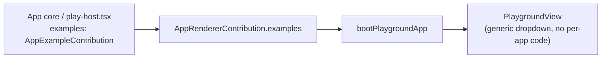

# Examples Contract + OCP Cleanup

## Confirmed scope (from user answers)

- Keep the "playground" concept/package as-is; make it fully generic (no renaming/merging with OS).
- Add `examples` as a first-class field on `AppRendererContribution`; delete the puzzle2d/wires and cad bespoke `slotNavbarCenter` example dropdowns so every app registers examples the same declarative way.

## Investigation highlights (grounding for the plan)

- Today only `puzzle/2d/react/play-host.tsx` (lines 1520-1526, 2963-2995) and `cad/renderer/react/index.tsx` (`CadPlayExampleNavbarSelect`, lines 1618-1631, 1876-1884) bypass the generic dropdown via `PlaygroundViewProps.slotNavbarCenter` — every other app relies on the controller implementing an ad-hoc `PlaygroundExampleHost.getExampleCatalog()` duck-typed interface, detected at runtime in [`resolvePlaygroundExampleCatalog`](framework/product/playground/core/js/index.ts) (897-905).
- `AppRendererContribution` ([framework/product/platform/core/js/index.ts](framework/product/platform/core/js/index.ts) 2367-2374) has no `examples` field — confirming the gap.
- Found and will fix a real, pre-existing bug while doing this: [`buildUiTreeDragAndDropController`](framework/product/playground/renderer/react/index.tsx) (lines 475-492) references `FLOW_WIDGET_DRAG_MIME`, `flowWidgetPaletteTreeDragController`, `PUZZLE_2D_FIXTURE_DRAG_MIME`, `puzzle2dFixturePaletteTreeDragController`, `puzzle3dFixturePaletteTreeDragController` — **none of these are imported anywhere in the file** (verified via grep + package.json, which doesn't even list `flow-react`/`puzzle-2d-react`/`puzzle-3d-react` as dependencies). This is a live `ReferenceError` waiting to fire for any app with a non-empty tree drag source; it must be replaced with a generic, contribution-derived mechanism, not restored as-is.
- The `UiRenderer` switch ([framework/product/playground/renderer/react/index.tsx](framework/product/playground/renderer/react/index.tsx) 649-676) enumerates every technology's `UiNode.type` string by name, and its `default:` case renders "Unsupported UiNode" (734-736) — adding a new app today requires editing this framework file, which is a hard OCP violation. `PLAYGROUND_CANVAS_HOST_TYPES` (381) and `renderPlaygroundHostSurface`'s if-chain (389-403) duplicate the same enumeration.
- The prior "os-plugins" migration only finished for `draw` (`drawProgramContribution.register()` in [draw/core/js/index.ts](draw/core/js/index.ts) 1383-1390 correctly owns its own VCS handler). `framework/product/os/core/js/index.ts` (680-910) still defines and **eagerly registers at module load** VCS handler factories for flow (x2), procedural-2d/3d, shooting, trinity, gis, presentation, puzzle2d/3d/5d, sequence, layout, imperative, lowpoly, vcs-demo, cad, and 3x compose — none of these moved into their owning app cores yet.
- `s/core/js/internal.ts` `registerAllMediaExportHandlers` (245-319) still hardcodes a 13-package `Promise.all` import fan-out instead of each app registering its own media export handlers from inside its own `OsProgramContribution.register()`.
- `framework/product/os/renderer/react/app-contribution-registry.ts` `PROGRAM_ID_TO_PLAYGROUND_KIND` (9-41) hand-maps ~27 plugin ids to manifest kinds even though manifests already carry `pluginId` ([repo/lib/js/index.ts](repo/lib/js/index.ts) `PlaygroundAppManifest.pluginId`, line 1181) — this reverse index is not built from the scan.
- `s/core/js/program-extensions.ts`, `puzzle5d-extension.ts`, `shooting-extension.ts` are confirmed dead (not imported anywhere; `reasoning.mindmap`'s plugin registration already lives correctly in [reasoning/mindmap/wires/core/js/index.ts](reasoning/mindmap/wires/core/js/index.ts) line 329, and puzzle5d/shooting contributions already live in their own cores) — safe to delete.
- `repo/lib/js/index.ts` `PLAYGROUND_PORTS`/`PlaygroundHostKind` (1010-1076) and `PLAYGROUND_SITE_HOSTS` (1150-1156) hardcode per-app port/host tables that duplicate the manifest's own optional `port` field (line 1183); `resolvePlaygroundDevAppFromManifests` (1243-1249) still special-cases `puzzle`/`procedural`/`trinity`/`gis` CLI segment prefixes instead of relying purely on manifest `aliases`.
- `ui/styling/vite-elements-assets.ts` `stripPlaygroundRendererForS`/`stripPlaygroundRendererPuzzleHosts`/`PLAYGROUND_RENDERER_PUZZLE_HOSTS_START`/`S_PLAYGROUND_HOST_MARKERS` are confirmed no-operations post-refactor (own tests assert the source is returned unchanged) — dead code to delete. The live per-`playEntryKind` Vite plugin dispatch (mesh/tiles/sketchpad plugins, ~1519-1541) is a pragmatic, Vite-config-time exception and is out of scope for this pass (documented, not silently left as a surprise).
- `framework/product/platform/renderer/react/index.tsx`'s own `slotNavbarCenter` (2539-2540, 5033, 5343-5351) belongs to the unrelated generic `PlatformView` breadcrumb/file-browser shell (not `PlaygroundView`) and has no example-catalog knowledge — confirmed out of scope, left untouched.

## Part 1 — App-level example contribution (the explicit ask)



Add to [framework/product/platform/core/js/index.ts](framework/product/platform/core/js/index.ts) (next to `AppRendererContribution`, 2367-2374):

```ts
export interface AppExampleOption {
 readonly id: string;
 readonly label: string;
}

export interface AppExampleContribution {
 readonly options: readonly AppExampleOption[];
 readonly activeExampleId: (runtime: Platform) => string;
 readonly onSelect: (exampleId: string, runtime: Platform) => void;
}
```

- Add `readonly examples?: AppExampleContribution;` to `AppRendererContribution` and to `PlaygroundMountProps` (2359-2364).
- In [framework/product/playground/renderer/react/index.tsx](framework/product/playground/renderer/react/index.tsx): replace `PlaygroundViewProps.slotNavbarCenter` (1068-1069) with `exampleContribution?: AppExampleContribution`. Replace `usePlaygroundExampleCatalog` (1092-1125) with a version that reads from the contribution instead of duck-typing the controller (`contribution.activeExampleId(runtime)` / `contribution.options`, still gated by `isPlaygroundExampleLocked()`). Update the navbar dropdown block (1401-1426) to call `exampleContribution.onSelect(exampleId, runtime)` on change instead of `shell.bus.dispatch(controllerId, "setActiveExample", ...)` directly.
- Update `bootPlaygroundApp` (1640-1660) to pass `contribution.examples` into `mountProps` and into the default `<PlaygroundView exampleContribution={contribution.examples} />`.
- Add an exported helper `controllerBackedExampleContribution(options)` (same file) that wraps the existing `PlaygroundExampleHost.getExampleCatalog()` / `run("setActiveExample", ...)` convention so the ~13 apps that already implement it (forms, raster, writer, note, draw, gis, procedural-2d/3d, shooting, trinity-jack, puzzle-3d/5d, presentation) only need to declare `examples: controllerBackedExampleContribution(XXX_PLAY_EXAMPLE_OPTIONS)` in their `play-host.tsx` contribution instead of relying on shell-side duck typing.
- Migrate `puzzle/2d/react/play-host.tsx`: delete the local `NavbarExampleSelect` construction and `slotNavbarCenter` usage (1963-1973... i.e. 2963-2995); pass `exampleContribution={{ options: PUZZLE_2D_PLAY_NAVBAR_EXAMPLE_OPTIONS, activeExampleId: () => activeExampleId, onSelect: applyNavbarFixtureId }}` into `<PlaygroundView>` instead (no need to lift `activeExampleId` out of local component state).
- Migrate `cad/renderer/react/index.tsx`: delete `CadPlayExampleNavbarSelect` (1618-1631); compute the same shape from `useCadPlayModelSpace()` at the call site (1876-1884) and pass it as `exampleContribution`.
- Opportunistic correctness fixes surfaced by the stricter contract: give `S` a working dropdown (it already has `S_PLAY_EXAMPLE_OPTIONS()` and fixture data in `s/core/js/index.ts` 993-1022 but never wired a catalog); fix `writer`'s `getExampleCatalog()` (missing `activeExampleId`, `writer/core/js/index.ts` 348-354) and the `playgroundResolvedExampleId` 2-arg call mismatch (`writer/core/js/index.ts` 740/747 vs. the 1-arg core signature at `framework/product/playground/core/js/index.ts` 866-868 — extend the core signature to take an optional slug resolver).
- Delete now-unused `PlaygroundExampleHost` duck-typed detection path and `slotNavbarCenter` prop entirely once all apps are migrated.

## Part 2 — Generic UiRenderer dispatch (fixes the broken drag import too)

- In [framework/product/playground/renderer/react/index.tsx](framework/product/playground/renderer/react/index.tsx): replace `PLAYGROUND_CANVAS_HOST_TYPES`/`isPlaygroundCanvasHostChild` (381-385) and the `UiRenderer` per-tech case list (649-671) with a single structural predicate (`"surfaceId" in node && "controllerId" in node`, matching the existing generic `UiSurfaceHostNode` shape from `framework/product/platform/core/js/index.ts` 2376-2387) used in the switch's `default:` branch. Add a `layout?: "canvas" | "panel"` field to `UiSurfaceHostNode` so `panel`/`table`/`editor`/`virtualFileSystem` (the only real non-technology "panel-layout" cases) can declare it themselves instead of the shell checking `node.type` by name.
- Replace `buildUiTreeDragAndDropController`'s broken MIME-sniffing (475-492) with a small registry apps populate via a new optional `AppRendererContribution.treeDragController?: (dragByItemId) => TreeDragAndDropController | undefined` field, applied through `applyAppRendererContribution` (1629-1638) similar to `surfaceHosts`/`tabIcons`. Move the flow/puzzle2d/puzzle3d drag-controller wiring into their own `play-host.tsx` contributions. Drop the `import.meta.env.PUZZLE_PLAY_ENTRY === "map"` special case in the same function (477-479) — GIS map simply won't register a `treeDragController`.

## Part 3 — Finish OS-layer program contribution migration

- Move the remaining VCS handler factories out of [framework/product/os/core/js/index.ts](framework/product/os/core/js/index.ts) (680-910) into their owning app cores' `internal.ts`, following the `draw` pattern (`draw/core/js/index.ts` 1374-1391): flow (document + dag), procedural-2d, procedural-3d, shooting, trinity (graph), gis (map), presentation (deck), puzzle-2d, puzzle-3d, puzzle-5d, sequence, layout, imperative, lowpoly, vcs (demo), cad (scene), and the 3 `compose.*` handlers (design/type/kit, into compose's own core if one exists — flag if not, as an accepted exception). Delete the eager top-level `registerAppVcsHandler(...)` calls (866-910+) from OS core; each app's `XxxProgramContribution.register()` now calls its own handler factory, same as `drawProgramContribution` already does.
- Move each `registerXxxMediaExportHandlers()` call from `s/core/js/internal.ts`'s `registerAllMediaExportHandlers` (245-319) into the corresponding app's own `OsProgramContribution.register()`. Delete `registerAllMediaExportHandlers` and its `bootstrapSPlayExtensions` caller once empty. Keep the generic, non-app-specific `3d.mesh` resource handlers (306-318) in S/OS core since they're a cross-cutting resource kind, not a per-app document type.
- In [framework/product/os/renderer/react/app-contribution-registry.ts](framework/product/os/renderer/react/app-contribution-registry.ts): delete `PROGRAM_ID_TO_PLAYGROUND_KIND` (9-41); derive `pluginId -> kind` from the manifest scan (extend the virtual module program to also emit this reverse map from `PlaygroundAppManifest.pluginId`, same source `repo/lib/js/index.ts` already populates at line 1181). Keep the 2 genuinely non-manifest entries (`reasoning.mindmap`, `presentation.deck` alias) as a short, explicitly-commented residual list rather than silently dropping them.
- Delete confirmed-dead `s/core/js/program-extensions.ts`, `s/core/js/puzzle5d-extension.ts`, `s/core/js/shooting-extension.ts` (verified unreferenced) and their `s/core/package.json` devDependency entries.
- Formalize `s/react/play-host.tsx`'s hardcoded `compose.sketchpad` branch (97-131) as a manifest-registered `instanceHost` contribution like every other app, if compose/sketchpad can expose one through the same `programExport` mechanism; otherwise document it as an accepted, explicit exception (compose is a distinct technology per `AGENTS.md`, not silently special-cased).

## Part 4 — repo/lib manifest-driven ports and dev resolution

- In [repo/lib/js/index.ts](repo/lib/js/index.ts): derive dev/test ports from `PlaygroundAppManifest.port` (already an optional field, line 1183) instead of the hardcoded `PLAYGROUND_PORTS`/`PlaygroundHostKind` table (1010-1076); keep only the handful of non-app entries (`storybook`, `s`/OS hub, `compose`) that have no manifest. Same treatment for `PLAYGROUND_SITE_HOSTS`/`PLAYGROUND_EMBED_SITE_DEV_PORTS` (1120-1169) where possible.
- Simplify `resolvePlaygroundDevAppFromManifests` (1243-1249) to rely purely on manifest `aliases` (already supports multi-word aliases via the `byAlias` map, 1236) instead of hardcoded `puzzle`/`procedural`/`trinity`/`gis` prefix rules — add the missing alias entries (e.g. `"puzzle 2d"`, `"procedural 2d"`, `"trinity jack"`) to each app's `semio.app` manifest instead.

## Part 5 — Delete confirmed-dead Vite stripping code

- Delete `PLAYGROUND_RENDERER_PUZZLE_HOSTS_START`, `S_PLAYGROUND_HOST_MARKERS`, `stripPlaygroundRendererForS`, `stripPlaygroundRendererPuzzleHosts`, `PlaygroundRendererPuzzleKind` from [ui/styling/vite-elements-assets.ts](ui/styling/vite-elements-assets.ts) (694-778) and their now-unused test assertions, plus the `playgroundRendererVitestShellOnlyPlugin` wiring in `framework/product/playground/renderer/react/vitest.config.ts` that calls them.
- Leave the live per-`playEntryKind` Vite plugin dispatch (mesh/tiles/sketchpad plugins) as a documented, pragmatic exception (Vite config must resolve plugins synchronously at startup); do not attempt to generalize it in this pass.

## Verification

- Extend `.dependency-cruiser.cjs`'s `framework-no-app-packages` / `s-no-app-packages-except-flow-media` rules to also catch npm-resolved workspace package imports (not just `dependencyTypes: ["local"]`), since the broken `flow-react`/`puzzle-2d-react` references in Part 2 slipped through undetected.
- Run the full test suite for touched packages (`framework-platform-core`, `framework-playground-core`, `framework-playground-renderer-react`, `framework-os-core`, `framework-os-renderer-react`, `s-core`, `s-react`, every migrated app's `*-core`/`*-react`, `repo-lib`, `ui-styling`) plus `bun nx run-many -t lint` for dependency-cruiser.
- Manually boot at least 3 representative playground dev entries (a controller-backed one e.g. `draw`, puzzle2d/wires, cad) and the S/OS studio to confirm example dropdowns and drag-and-drop still work end to end.

## Work tracking

- This continues the "App-Defined Apps, Fully Derived Shells" effort; reopen its existing ticket (or the in-progress `APP-ISOLATION-ENFORCED-BOUNDARIES` work already scaffolded under `.repo/🎫️/26/07/03/`) rather than opening a new one, per the repo's ticket workflow.
