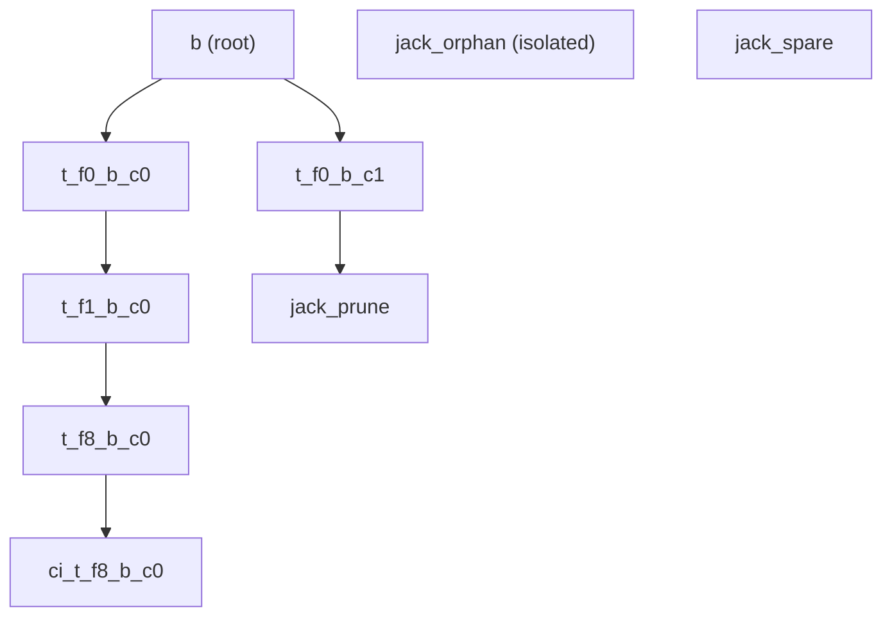

# Expand Nakagin Fixture for Full Jack Coverage

## Goal

The nakagin graph is the shared default for **Jack play** and **Trinity Rewrite** (`[trinity/fixture/nakagin-capsule-tower.trinity.json](trinity/fixture/nakagin-capsule-tower.trinity.json)` via `[TRINITY_DEFAULT_FIXTURE_JSON](trinity/react/index.tsx)`). Expand it so Jack can exercise every supported clause, without breaking rewrite's `MATCH (a:Piece) WHERE a.name = 'b' SET a.label = ...` flow.

## Jack feature checklist (in scope)

| Feature                      | Example shape                                                                            |
| ---------------------------- | ---------------------------------------------------------------------------------------- |
| MATCH node                   | `(a:Piece)`                                                                              |
| MATCH edge                   | `(a:Piece)-[r:Connection]->(b:Piece)`                                                    |
| WHERE `=`, `!=`, `AND`, `OR` | `a.name = 'b' AND b.name != 'b'`                                                         |
| RETURN table                 | `RETURN a.name, b.label`                                                                 |
| RETURN graph                 | `RETURN a, r, b`                                                                         |
| CREATE                       | `CREATE (n:Piece)` or `CREATE (a:Piece)-[:Connection]->(b:Piece)`                        |
| SET                          | `SET a.label = '...'`, `a.name`, `a.x`, `a.y`                                            |
| DELETE                       | `MATCH (n:Piece) WHERE n.name = '...' DELETE n`                                          |
| MERGE                        | `MERGE (a:Piece)-[:Connection]->(b:Piece)` (no-operation when edge exists; creates when absent) |

Out of scope: `WITH`, `ORDER BY`, `LIMIT`, kindless patterns, edge filters in WHERE.

## Fixture expansion (additive only)

Edit `[trinity/fixture/nakagin-capsule-tower.trinity.json](trinity/fixture/nakagin-capsule-tower.trinity.json)`:

**Preserve unchanged (rewrite contract):**

- Root node `7dc5b737-...` named `b`, all 6 existing nodes, all 5 existing edges, `rootNodeId`, `manifestId: "nakagin"`

**Enrich existing nodes** (additive properties only):

- Root `b`: add `label: "tower-core"`, `tier: 0` (enables SET/WHERE on `label` before rewrite applies `nakagin-core`)
- Branch/shaft nodes: add distinct `label` strings and numeric `tier` (0/1/8) for `WHERE` with `AND`/`!=`
- Keep existing `position` blobs (derived `flatPosition` tests in `[trinity/rewrite/engine/lib.rs](trinity/rewrite/engine/lib.rs)` must still pass)

**Add new nodes** (new UUIDs, `Piece` + `Connector` ports):

- `jack_orphan` — disconnected piece (`name: "jack_orphan"`) for isolated MATCH / CREATE context
- `jack_prune` — leaf piece (`name: "jack_prune"`, in-port only) attached to `t_f0_b_c1` via new edge — safe DELETE demo target (not used by rewrite rule)
- `jack_spare` — piece (`name: "jack_spare"`, out-port only) reserved for MERGE/CREATE edge demos

**Add new edges** (new ids, `Connection` kind):

- `t_f0_b_c1` → `jack_prune` (DELETE leaf)
- Optional: `jack_spare` → `jack_orphan` **not** pre-connected — left for `MERGE (a:Piece)-[:Connection]->(b:Piece)` / `CREATE` to establish

Layout: place new nodes to the right/below existing tower so the canvas stays readable at default zoom.



## Default and example queries

### Default nakagin preset

Update `[trinity/jack/play/fixture-slugs.ts](trinity/jack/play/fixture-slugs.ts)` default query to a richer **read** query (still table result):

```jack
MATCH (a:Piece)-[r:Connection]->(b:Piece)
WHERE a.name = 'b' AND b.name != 'b'
RETURN a.name, b.name, b.label
```

### Example query catalogue

Add `TRINITY_JACK_PLAY_EXAMPLE_QUERIES` in `[trinity/jack/play/fixture-slugs.ts](trinity/jack/play/fixture-slugs.ts)` — labeled entries for each remaining clause:

| Label        | Query purpose                                                                                                    |
| ------------ | ---------------------------------------------------------------------------------------------------------------- |
| Where Or     | `MATCH (a:Piece) WHERE a.name = 't_f0_b_c0' OR a.name = 't_f0_b_c1' RETURN a.name`                               |
| Return Graph | `MATCH (a:Piece)-[r:Connection]->(b:Piece) WHERE a.name = 'b' RETURN a, r, b`                                    |
| Set Label    | `MATCH (a:Piece) WHERE a.name = 'b' SET a.label = 'demo-label'`                                                  |
| Set Position | `MATCH (a:Piece) WHERE a.name = 'jack_orphan' SET a.x = 300, a.y = 120`                                          |
| Create Node  | `CREATE (n:Piece)`                                                                                               |
| Create Edge  | `CREATE (a:Piece)-[:Connection]->(b:Piece)` (after MATCH binds `jack_spare` / `jack_orphan` or standalone)       |
| Delete Leaf  | `MATCH (n:Piece) WHERE n.name = 'jack_prune' DELETE n`                                                           |
| Merge Edge   | `MERGE (a:Piece)-[:Connection]->(b:Piece)` with prior `MATCH` binding spare→orphan, or document as two-step demo |

Wire catalogue in `[trinity/jack/play/index.ts](trinity/jack/play/index.ts)`:

- New **Example queries** tree section in `buildTrinityJackPlayCatalogueTree`
- Items dispatch `setJackQuery` + optional `runJackQuery` via existing controller command bus
- Sync editor placeholder / fallback text in `[framework/product/playground/renderer/react/index.tsx](framework/product/playground/renderer/react/index.tsx)` (`TrinityJackEditorSurfaceHost`) to the new default preset constant — avoid hardcoded `MATCH (a:Piece) RETURN a.name`

## Tests

Extend existing test files only:

1. `[trinity/jack/play/index.ts](trinity/jack/play/index.ts)` — vitest for expanded default query, each example query category (table vs graph result, mutation updates fixture)
2. `[trinity/jack/core/lib.rs](trinity/jack/core/lib.rs)` — add `run_delete` and `run_merge` execution tests (currently parsed but untested)
3. `[trinity/react/index.tsx](trinity/react/index.tsx)` — update nakagin parse test if node/edge counts change
4. `[trinity/rewrite/play/index.ts](trinity/rewrite/play/index.ts)` + `[trinity/rewrite/engine/lib.rs](trinity/rewrite/engine/lib.rs)` — re-run existing rewrite/nakagin tests; must still pass unchanged

## Validation

- `bun nx run trinity-jack-play:test`
- `bun nx run trinity-rewrite-play:test`
- `cargo test -p trinity_rewrite` (nakagin fixture tests)
- Browser: Jack play loads expanded graph; editor default query runs; catalogue example queries exercise each clause; Rewrite play before/after + label rule still works

## Risk notes

- **MERGE** matches structurally — example must use a pattern that is absent in the initial graph (spare→orphan edge) to show create behavior; when present, it is a no-operation
- **DELETE** mutates the fixture in Jack play session — example targets `jack_prune` only
- Do not rename/remove `b` or existing edge topology — rewrite LHS `a.name = 'b'` depends on it
