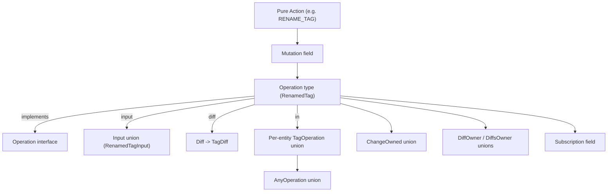

## Conventions

- **Naming:** keep the existing past-tense convention (`CreatedFixedPiece`, `RenamedKit`, `ChangedDescription`, `DraggedPiece`). Each `<ACTION>_<ENTITY>` becomes a type `Verbed<Entity>` (singular) and `Verbed<Entity>s` (plural batch). `IN_DESIGN` / `FROM_TYPE` qualifiers are kept where they disambiguate context (e.g. `RenamedConnectorInType`).
- **Each operation gets:**
  - `<Op>Input` (input type — note: the existing schema declares operation inputs as object `type` rather than `input`; we keep that style for consistency, but the global `Input` union remains the registry).
  - `<Op>` `implements Operation & Entity` with `owner: <Op>Owner!`, `input: <Op>Input!`, `diff: Diff!`, plus typed result fields (`tag: Tag!`, `tags: TagConnection!`, …).
  - `union <Op>Owner = Change`.
  - `union <Op>Owned = <ResultEntities>` (omit comment-only when nothing is owned).
- **Per-entity union:** new `union <Entity>Operation = …` listing every operation type that targets that entity. This is the "more specific" union the request calls for.
- **Global registries to extend:** `Input` (line 1210), `ChangeOwned` (line 4290), `DiffOwner` (line 5880), every `<X>DiffsOwner` line that today repeats `RenamedKit | ChangedDescription | …`, the `OwnerEntity` and `AggregateEntityEdge` / `EntityConnection` / `OwnedEntityConnection` mega-unions, plus `Mutation` and `Subscription`.

## Entity field extensions (prerequisites)

The action list references fields that don't yet exist on a few entities. Add them (data + computed `Modification` fields) before wiring update operations:

- `Tag` ([target.schema.graphql:2272](compose/graphql/target.schema.graphql:2272)): add `description: String`, `icon: String`. Mirror in `TagModification` with `removeDescription`/`removeIcon`.
- `Concept` ([target.schema.graphql:2392](compose/graphql/target.schema.graphql:2392)): add `icon: String` (description already present). Mirror in `ConceptModification`.
- `Port` ([target.schema.graphql:2639](compose/graphql/target.schema.graphql:2639)): add `description: String`, `icon: String`. Mirror in `PortModification`.
- `Quality` ([target.schema.graphql:2139](compose/graphql/target.schema.graphql:2139)): add `icon: String` (description already present). Mirror in `QualityModification`.
- `Connector` ([target.schema.graphql:2761](compose/graphql/target.schema.graphql:2761)): add `icon: String`. Mirror in `ConnectorModification`.

## Per-entity Operations to add

Each list below becomes a fresh `#region Operations` subregion at the bottom of the entity's region (mirroring the existing `#region Operations` inside `Piece` at [target.schema.graphql:3692](compose/graphql/target.schema.graphql:3692)).

### Tag (inside `#region Tag`)

- `CreatedTagInput { kitOwnerId: ID, typeOwnerId: ID, representationOwnerId: ID, name: String!, description: String, icon: String, order: Int }` → `CreatedTag` (`tag: Tag!`).
- `CreatedTagsInput { ownerId: ID!, tags: [CreatedTagInput!]! }` → `CreatedTags` (`tags: TagConnection!`).
- `RenamedTagInput { tagId: ID!, name: String! }` → `RenamedTag`.
- `UpdatedTagDescriptionInput { tagId: ID!, description: String! }` → `UpdatedTagDescription`.
- `UpdatedTagIconInput { tagId: ID!, icon: String! }` → `UpdatedTagIcon`.
- `AddedAttributeToTagInput { tagId: ID!, attribute: AttributeInput! }` → `AddedAttributeToTag` (`attribute: Attribute!`).
- `AddedAttributesToTagInput { tagId: ID!, attributes: [AttributeInput!]! }` → `AddedAttributesToTag`.
- `RemovedAttributeFromTagInput { tagId: ID!, attributeId: ID! }` → `RemovedAttributeFromTag`.
- `RemovedAttributesFromTagInput { tagId: ID!, attributeIds: [ID!]! }` → `RemovedAttributesFromTag`.
- `DeletedTagInput { tagId: ID! }` → `DeletedTag`.
- `DeletedTagsInput { tagIds: [ID!]! }` → `DeletedTags`.
- `union TagOperation = CreatedTag | CreatedTags | RenamedTag | UpdatedTagDescription | UpdatedTagIcon | AddedAttributeToTag | AddedAttributesToTag | RemovedAttributeFromTag | RemovedAttributesFromTag | DeletedTag | DeletedTags`.

### Concept (inside `#region Concept`)

Same shape as Tag: `CreatedConcept`, `CreatedConcepts`, `RenamedConcept`, `UpdatedConceptDescription`, `UpdatedConceptIcon`, `AddedAttributeToConcept`, `AddedAttributesToConcept`, `RemovedAttributeFromConcept`, `RemovedAttributesFromConcept`, `DeletedConcept`, `DeletedConcepts`. Add `union ConceptOperation`.

### Port (inside `#region Port`)

Same shape: `CreatedPort`, `CreatedPorts`, `RenamedPort`, `UpdatedPortDescription`, `UpdatedPortIcon`, `AddedAttributeToPort`, `AddedAttributesToPort`, `RemovedAttributeFromPort`, `RemovedAttributesFromPort`, `DeletedPort`, `DeletedPorts`. Add `union PortOperation`.

### Quality (inside `#region Quality`)

Same shape: `CreatedQuality`, `CreatedQualities`, `RenamedQuality`, `UpdatedQualityDescription`, `UpdatedQualityIcon`, `AddedAttributeToQuality`, `AddedAttributesToQuality`, `RemovedAttributeFromQuality`, `RemovedAttributesFromQuality`, `DeletedQuality`, `DeletedQualities`. Add `union QualityOperation`.

### Type (inside `#region Type`, before connector ops)

- `CreatedType`, `CreatedTypes`, `RenamedType`, `UpdatedTypeDescription`, `UpdatedTypeIcon`, `AddedAttributeToType`, `AddedAttributesToType`, `RemovedAttributeFromType`, `RemovedAttributesFromType`, `DeletedType`, `DeletedTypes`.
- `union TypeOperation`.

### Connector (own subregion `#region Operations` inside `#region Type`)

- `AddedConnectorToTypeInput { typeId: ID!, connector: ConnectorInput! }` → `AddedConnectorToType` (`connector: Connector!`).
- `AddedConnectorsToTypeInput { typeId: ID!, connectors: [ConnectorInput!]! }` → `AddedConnectorsToType`.
- `RenamedConnectorInTypeInput { connectorId: ID!, code: String! }` → `RenamedConnectorInType` (rename = change `code` since Connector has no `name`).
- `UpdatedConnectorDescriptionInTypeInput`, `UpdatedConnectorIconInTypeInput` → matching ops.
- `RemovedConnectorFromTypeInput`, `RemovedConnectorsFromTypeInput` → matching ops.
- `union ConnectorOperation = AddedConnectorToType | AddedConnectorsToType | RenamedConnectorInType | UpdatedConnectorDescriptionInType | UpdatedConnectorIconInType | RemovedConnectorFromType | RemovedConnectorsFromType`.
- Note: a new `input ConnectorInput { code: String!, description: String, icon: String, portId: ID }` is added near `AttributeInput` ([target.schema.graphql:1065](compose/graphql/target.schema.graphql:1065)).

### Design (inside `#region Design`, replaces the orphaned ops emitted today only at kit level)

- `CreatedDesign`, `CreatedDesigns`, `DeletedDesign`, `DeletedDesigns`, `FlattenedDesign` (`FlattenedDesignInput { designId: ID! }`).
- `AddedAttributeToDesign`, `AddedAttributesToDesign`, `RemovedAttributeFromDesign`, `RemovedAttributesFromDesign`.
- `union DesignOperation`.

### Piece (inside the existing `#region Operations` at [target.schema.graphql:3692](compose/graphql/target.schema.graphql:3692))

Keep the three existing ones (`CreatedFixedPiece`, `FixedPiece`, `DraggedPiece`) and add:

- `AddedFixedPieceToDesign` (alias-style replacement for `CreatedFixedPiece` that uses the new `AddFixedPieceToDesignInput { designId: ID!, blueprintId: ID!, position: PositionInput!, name: String, description: String }`). Keep `CreatedFixedPiece` (rename in code? per CLAUDE.md no backwards compatibility, **rename `CreatedFixedPiece` → `AddedFixedPieceToDesign`** so naming is consistent with the rest of the list, and update every existing reference).
- `AddedChildPieceWithParentConnectionToDesign` (single) and `AddedChildPiecesWithParentConnectionsToDesign` (batch).
- `AddedHangingChildPieceWithParentConnectionToDesign` and `AddedHangingChildPiecesWithParentConnectionsToDesign`.
- `RenamedPieceInDesign`, `UpdatedPieceDescriptionInDesign`.
- Existing `DraggedPiece` → renamed to `DraggedPiecesInDesign` (singular sibling: `DraggedPieceInDesign`).
- `MovedPieceInDesign`, `MovedPiecesInDesign` (`offset: OffsetInput`/`position: PositionInput`).
- `FixedPieceInDesign`, `FixedPiecesInDesign` (rename existing `FixedPiece` → `FixedPieceInDesign`).
- `ChangedPieceToTypeInDesign`, `ChangedPiecesToTypeInDesign`.
- `AddedAttributeToPiece`, `AddedAttributesToPiece`, `RemovedAttributeFromPiece`, `RemovedAttributesFromPiece`.
- `DeletedPieceInDesign`, `DeletedPiecesInDesign`, `DeletedPiecesAndConnectionsInDesign`.
- `union PieceOperation = …` listing all the above.
- The two read-only commands from the list (`READ_PIECE_FROM_DESIGN`, `GET_ALTERNATIVE_PIECE_KIND_FOR_PIECE_IN_DESIGN`) do **not** fit the `Operation` interface (which requires `diff: Diff!`); they become **Query fields**: `pieceInDesign(designId: ID!, pieceId: ID!): Piece` and `alternativePieceKind(designId: ID!, pieceId: ID!): Blueprint`.

### Kit (extend the existing `#region Operations` at [target.schema.graphql:4238](compose/graphql/target.schema.graphql:4238))

Keep `RenamedKit`, `ChangedDescription`. Add `union KitOperation = RenamedKit` and a roll-up `union DescriptionChangeOperation = ChangedDescription` (or fold `ChangedDescription` into the per-entity update ops above and remove it — but per the workspace rule "do not remove functionality" we keep `ChangedDescription` and instead reference it from the relevant per-entity unions where appropriate).

## Global / cross-cutting unions

- Extend `union Input` ([target.schema.graphql:1210](compose/graphql/target.schema.graphql:1210)) with every new `<Op>Input`.
- Extend `union ChangeOwned` ([target.schema.graphql:4290](compose/graphql/target.schema.graphql:4290)) with every new operation type.
- Extend each `<X>DiffsOwner` line (e.g. [2355](compose/graphql/target.schema.graphql:2355), [2477](compose/graphql/target.schema.graphql:2477), [2724](compose/graphql/target.schema.graphql:2724), [2848](compose/graphql/target.schema.graphql:2848), [2969](compose/graphql/target.schema.graphql:2969), [3122](compose/graphql/target.schema.graphql:3122), [3542](compose/graphql/target.schema.graphql:3542), [3662](compose/graphql/target.schema.graphql:3662), [4038](compose/graphql/target.schema.graphql:4038)) with the new operation names that own diffs (every new op owns its diff).
- Extend `union DiffOwner` ([target.schema.graphql:5880](compose/graphql/target.schema.graphql:5880)) and `union DiffsOwner` ([target.schema.graphql:5922](compose/graphql/target.schema.graphql:5922)) with every new op.
- Extend `union OwnerEntity` ([target.schema.graphql:5506](compose/graphql/target.schema.graphql:5506)) with every new op.
- Add a top-level `union Operation = …` (rename current `interface Operation`? No — keep the interface, add a sibling `union AnyOperation = TagOperation | ConceptOperation | PortOperation | QualityOperation | TypeOperation | ConnectorOperation | DesignOperation | PieceOperation | KitOperation`). This is the "specific" composite the request asks for.

## `Mutation` and `Subscription` updates ([target.schema.graphql:5995](compose/graphql/target.schema.graphql:5995), [6002](compose/graphql/target.schema.graphql:6002))

- Add one mutation per new operation type (`createTag`, `createTags`, `renameTag`, …) returning the operation `ID!` and taking `draftId, transactionId, …` like the existing four mutations.
- Add one subscription per operation type (`tagCreated: CreatedTag!`, …). Group by entity for readability.

## Diagram

## Out of scope

- Resolvers, persistence, websocket payloads — schema only.
- Backend Rust/Python sync; raised in a follow-up ticket once schema settles.
