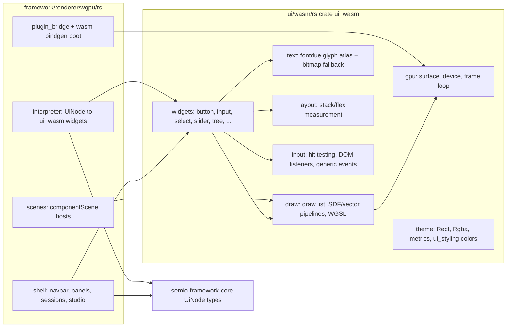

# Custom UI Framework in ui/wasm and Renderer on Top

## Goal

Split the current monolithic [framework/renderer/wgpu/rs](framework/renderer/wgpu/rs/lib.rs) into two layers:

- `**ui/wasm/rs**` (new crate `ui_wasm`) — a general, pure, business-logic-free wgpu UI toolkit, the Rust/wasm sibling of `ui/react`. It knows nothing about `semio-framework-core`, `UiNode`, plugins, or the OS shell.
- `**framework/renderer/wgpu/rs**` (existing crate `semio-framework-renderer-wgpu`) — a thin renderer that depends on `ui_wasm` and only contains framework concerns: `UiNode` interpretation, componentScene hosts, OS shell chrome, plugin bridge, boot.

Path note: the request said "ui/rs/wasm"; repo convention for the ui technology is `ui/<bundle>/rs` (e.g. [ui/styling/rs](ui/styling/rs/Cargo.toml) with crate `ui_styling`), so the bundle lands at `ui/wasm/rs` with crate name `ui_wasm`.

## Architecture

## New crate: `ui/wasm/rs` (`ui_wasm`)

Mirror the [ui/styling/rs](ui/styling/rs/project.json) bundle shape: `Cargo.toml`, `lib.rs` (+ module files), `project.json` (`@semio-tech/ui-wasm-rs`, test target), `script.ts` (cargo test router). Add `"ui/wasm/rs"` to the workspace [Cargo.toml](Cargo.toml).

Modules moved (and generalized) from `framework/renderer/wgpu/rs`:

- `geometry` + `theme` — from [theme.rs](framework/renderer/wgpu/rs/theme.rs): `Rect`, `Rgba`, metric constants; a `Theme` struct (colors, spacing, radii) with a dark default, using `ui_styling::color` conversion helpers so tokens stay the source of truth. No hardcoded framework naming.
- `shaders` — WGSL consts from [shaders.rs](framework/renderer/wgpu/rs/shaders.rs) unchanged.
- `draw` — from [draw.rs](framework/renderer/wgpu/rs/draw.rs): `DrawList`, instances, vector vertices, ear-clip tessellation, `UiPipelines`. Make wgpu types non-public (private fields, methods only) so wgpu stays behind the interface per repo rules.
- `text` — from [text.rs](framework/renderer/wgpu/rs/text.rs): `FontAtlas` (fontdue + built-in bitmap fallback), `fetch_font_bytes`.
- `layout` — from [layout_engine.rs](framework/renderer/wgpu/rs/layout_engine.rs): vertical/horizontal stack layout, gap/padding tokens.
- `gpu` — from [gpu.rs](framework/renderer/wgpu/rs/gpu.rs): `GpuContext::from_canvas`, resize/DPI, `render_frame(&DrawList)`, `schedule_frame`.
- `input` — from [input.rs](framework/renderer/wgpu/rs/input.rs), made generic: `HitTarget<E>` / `InputState<E>` carry a caller-defined event payload `E: Clone` instead of `semio_framework_core::CommandDescriptor`. DOM listener attachment stays here.
- `widgets` — the widget layer from [widgets.rs](framework/renderer/wgpu/rs/widgets.rs), rewritten against plain `ui_wasm` data structs (e.g. `ButtonSpec { label, event }`, `SelectSpec`, `TreeSpec`, ...) generic over `E`. One widget per control: text, button, separator, input, select, toggle, vec3, key-value, slider, number-stepper, ring, icon-select, field, section, tree. `WidgetContext<E>` bundles draw list, atlas, input.

Unit tests (layout math, tessellation, atlas packing) move into these modules' `#[cfg(test)]` blocks so `cargo test -p ui_wasm` runs natively (no wasm target needed for pure math).

## Rebuilt renderer: `framework/renderer/wgpu/rs`

Depends on `ui_wasm` (path dep) + `semio-framework-core`; drops direct `wgpu`, `fontdue`, `bytemuck` deps.

- `interpreter.rs` (replaces `widgets.rs`) — maps each `semio_framework_core::UiNode` variant to the corresponding `ui_wasm` widget spec, instantiating `E = CommandDescriptor`. Measurement delegates to `ui_wasm`.
- `scenes.rs` — componentScene hosts (raster, table, canvas-2d, node-graph, flow-canvas, virtualFileSystem, text-editor, world-3d) rewritten against the `ui_wasm` draw/widget API.
- `shell.rs` — unchanged responsibilities (sessions, navbar, panels, studio mode) but renders through `ui_wasm` widgets/theme instead of local draw calls.
- `plugin_bridge.rs`, `lib.rs` — boot flow unchanged (`semioRendererBoot`), now constructing `ui_wasm::GpuContext`, `FontAtlas`, `InputState<CommandDescriptor>`.
- Delete the now-moved module files (`draw.rs`, `gpu.rs`, `text.rs`, `theme.rs`, `layout_engine.rs`, `shaders.rs`, `input.rs`).

JS side ([framework/renderer/wgpu/js/index.ts](framework/renderer/wgpu/js/index.ts), [script.ts](framework/renderer/wgpu/script.ts), dev-host wiring, launch entries) is untouched — the wasm artifact name and boot export stay the same.

## Verification

- `cargo test -p ui_wasm` (native) and `cargo build -p semio-framework-renderer-wgpu --target wasm32-unknown-unknown --release` both green.
- `bun ./script.ts wasm` in `framework/renderer/wgpu` regenerates `public/renderer-modules/wgpu/`.
- Existing vitest suites (`framework/renderer/wgpu`, `framework/renderer/react`) still pass.
- Dev server with `SEMIO_RENDERER=wgpu` serves and boots (`[DEBUG] wgpu renderer booted` on console).
