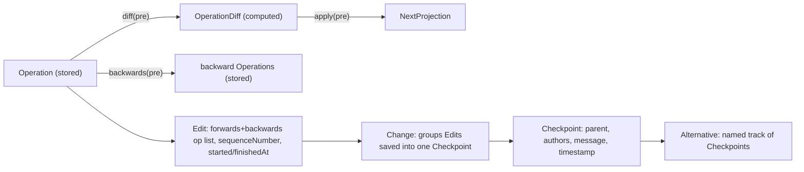

# Extract Version Control into a `vcs` Technology

## Current state (confirmed by reading the code, not the stale plan docs)

- `framework/rs/lib.rs` already has a generic, typesafe engine: `Operation<P>` (`diff`, `backwards`), `OperationDiff<P>` (`apply`, `absorb`), `Edit`→ wait, no — today it only has `DocumentChange<Op>` (flat forwards/backwards), `DocumentCheckpoint`, `DocumentAlternative`, `DocumentVcsStore`, and a `Backbone` trait with `DevJsonFileBackbone`/`SqliteFolderBackbone`/`RemoteHttpBackbone`. Its own `package.json` is already named `@semio-tech/framework-vcs-rs` and `.vscode/launch.json:989` already calls it `📦build🗄️framework🔗vcs` — the extraction was anticipated but never done.
- `framework/core/vcs-sync.ts` is a parallel **TS mirror** with the same shape but a weaker contract: `DocumentVcsStoreOptions.backwardsOp` is *optional*, so nothing forces a caller to define backwards.
- The Rust workspace ([`Cargo.toml`](Cargo.toml)) already lists every technology's crate (`draw/rs`, `forms/rs`, `shooting/rs`, `cad/rs`, `framework/product/presentation/rs`, `gis/2d/rs`, `puzzle/2d|3d|5d/rs`, `procedural/2d|3d/rs`, `mathematical/graph/port/directed/dag`, `reasoning/mindmap`, `trinity/ram`, `trinity/jack/*`, `trinity/rewrite/engine`, `writer/rs`, `raster/rs`, `semios/rs`), and each already has a real `Operation<P>`/`OperationDiff<P>` impl (`DrawOp`/`DrawDiff`, `FormOp`, `RasterOp`, `ShootingOp`, `CadOp`, `PresentationOp`, `Puzzle3dOp`, `Puzzle5dOp`, `GisMapOp`, `Procedural2dOp`/`3dOp`, `FlowDagOp`, `MindmapOp`, `TrinityGraphOp`, `WriterOp`) — confirmed via `impl Operation<` / `impl OperationDiff<` in every one of those `lib.rs` files.
- Of those, `cad/rs`, `forms/rs`, `shooting/rs`, `framework/product/presentation/rs`, and `draw/rs` already export a `#[wasm_bindgen] pub struct XDocumentVcs` wrapper (constructor, `dispatchJson`, `projectionJson`, `envelopeJson`, `generation` — see [`draw/rs/lib.rs:484-528`](draw/rs/lib.rs)). None of the five have a `package.json`/`project.json`/`script.ts` (verified via glob — only `Cargo.toml`+`lib.rs`, or +`script.ts` for `draw/rs`), so wasm-pack never runs and nothing in the JS workspace can import them. `gis/2d/rs`, `puzzle/3d|5d/rs`, `procedural/2d|3d/rs`, `dag`, `reasoning/mindmap`, `trinity/ram`, `trinity/rewrite/engine` have **no** wasm wrapper struct at all yet.
- Every one of these technologies' `*/play/index.ts` still constructs the **TS-mirror** `DocumentVcsStore<Doc, EditOp>` from `@semio-tech/framework-core`, runs a local TS reducer (`applyDrawEditOp`, etc.), and pushes the *entire resulting document* as one opaque `{ op: "setDocument", document: next }` into the store (e.g. [`draw/play/index.ts:1119`](draw/play/index.ts), same pattern in `forms/play`, `raster/play`, `writer/play`, `shooting/play`, `flow/play` (`commitFixture`), `gis/2d/play`, `procedural/2d|3d/play`, `puzzle/3d|5d/play`, `framework/product/presentation/play`, `mathematical/.../dag/play`). This is exactly what [`.repo/🎫/26/07/01/REPO-WIDE-CQRS-VIOLATION-AUDIT/audit.md`](.repo/🎫/26/07/01/REPO-WIDE-CQRS-VIOLATION-AUDIT/audit.md) flags as unresolved despite the prior ticket being marked "completed" — the real per-field ops and their `backwards()`/`diff()` are computed and then thrown away in favor of a whole-document snapshot.
- Compose's own canonical model (`compose/client/schema/graphql/schema.golden.graphql:9391-9567`) is 5 entities: **Operation** (stored) → **Edit** (`forwards`/`backwards` op lists, `sequenceNumber`, `startedAt`/`finishedAt`) → **Change** (`edits: EditConnection!`, checkpoint-scoped save unit) → **Checkpoint** (`changes`, `parent`, `authors`) → **Alternative**/`TheKit` (named track of Checkpoints). The generic engine today conflates Edit+Change into one `DocumentChange`.

## Target: the `vcs` technology

New top-level technology, same bundle shape as every other technology (`core/`, `rs/`, `react/`, `play/`, `AGENTS.md`), following the conventions in [`framework/rs/script.ts`](framework/rs/script.ts) / [`draw/play`](draw/play):



### `vcs/rs` (crate renamed `vcs`, was `framework_vcs`)

Move [`framework/rs/lib.rs`](framework/rs/lib.rs) to `vcs/rs/lib.rs`, keep `Operation<P>`/`OperationDiff<P>`/`CollectionDiff`/`ItemPatch`/`Backbone`+3 impls+`resolve_backbone` verbatim, and split `DocumentChange<Op>` into the 5-entity model:

```rust
pub struct Edit<Op> { id: String, forwards: Vec<Op>, backwards: Vec<Op>, description: Option<String>, sequence_number: i32, started_at: String, finished_at: Option<String> }
pub struct Change { id: String, edit_ids: Vec<String>, description: Option<String>, saved_at: String }
pub struct Checkpoint { id: String, change_ids: Vec<String>, parent_id: Option<String>, authors: Vec<Author>, message: Option<String>, timestamp: String }
pub struct Author { id: String, name: String, avatar: Option<String> }
pub struct Alternative { id: String, name: String, checkpoint_ids: Vec<String> }
pub struct DocumentVcs<P, Op> { initial_projection: P, edits: Vec<Edit<Op>>, changes: Vec<Change>, checkpoints: Vec<Checkpoint>, alternatives: Vec<Alternative> }
```

`DocumentVcsStore::dispatch`: `Apply` still computes `backwards`/`diff` per op exactly as today and appends an `Edit`; `CommitCheckpoint { message, authors }` now wraps the edits applied since the parent checkpoint into one new `Change`, then a `Checkpoint{ change_ids: [...parent.change_ids, change.id], parent_id: Some(parent.id), authors, message }`. Rewrite the crate's own unit tests for the new shape (repo rule: extend, don't add new test files).

### `vcs/core` (was `framework/core/vcs-sync.ts`)

Same split in TS (`Edit<TOp>`, `Change`, `Checkpoint`, `Author`, `Alternative`). Make `diffOp` and `backwardsOp` **required** (not optional) fields of `DocumentVcsStoreOptions` — this is the concrete enforcement of "every operation defines backwards, to diff" on the TS side, since TS ops are plain discriminated unions rather than trait-bound types.

### `vcs/react`

New `HistoryTable` component — a 3-row grid, columns = checkpoints sorted chronologically (oldest→newest, left→right):

```
┌─────────┬─────────┬─────────┬─────────┐
│ labels  │ v1.0     "main"  │ "wip-2"  │  ← row 1: checkpoint/alternative label chips
├─────────┼─────────┼─────────┼─────────┤
│ parent  │ (●●)─┐   (●)──┼──┐(●●)      │  ← row 2: avatar stack + one vertical/lane
│         │      └──(●)   └──(●)        │     line per track down to its parent column
├─────────┼─────────┼─────────┼─────────┤
│ descr.  │ "init"  │  ""     │ "retry"  │  ← row 3: optional message text
└─────────┴─────────┴─────────┴─────────┘
```

- Row 2 assigns each `Alternative` a lane index (simple greedy left-to-right lane packer, same idea as a git-graph); reuses `TableAvatar`/`Avatar` from [`ui/react/index.tsx:5234`](ui/react/index.tsx) for the overlapping avatar stack, draws lane connectors with inline SVG. More concurrent tracks ⇒ more parallel vertical lines rendered in that row.
- Input type: `HistoryColumn[]` derived from a `DocumentVcs` via a `vcs/core` selector `buildHistoryColumns(vcs)` (pure, testable, no React).

### `vcs/play`

New Vite playground (mirrors [`draw/play`](draw/play/index.ts) `Controller`/`Playground`/`WindowKindRuntime` shape) with one window hosting `HistoryTable`, backed by a small demo projection (title + counter + notes) with a seeded fixture containing 2 authors, a base checkpoint, two forked alternatives with several checkpoints each (to exercise multi-lane rendering), plus minimal engagement controls to apply an edit / commit a checkpoint (choosing an author) / create or switch an alternative — so the graph grows live. Port `6075` (next free slot after semios' `6066`).

## Migrating every consumer (no back-compat, single pass)

`framework/rs` and `framework/core/vcs-sync.ts` are deleted outright once `vcs` exists; every crate's `Cargo.toml` dependency on `framework_vcs` (already present in ~20 files, e.g. [`draw/rs/Cargo.toml`](draw/rs/Cargo.toml), [`semios/rs/Cargo.toml`](semios/rs/Cargo.toml), [`writer/rs/Cargo.toml`](writer/rs/Cargo.toml), [`compose/client/lib/rs/Cargo.toml`](compose/client/lib/rs/Cargo.toml)) is renamed to `vcs`; every TS import of `@semio-tech/framework-core`'s `DocumentVcsStore`/`recordProjectionChange` (in `draw/core`, `forms/core`, `raster/core`, `writer/core`, `semios/core`, `flow/core`, and every matching `*/play/index.ts`) is repointed to `@semio-tech/vcs-core`. [`framework/core/index.ts`](framework/core/index.ts) drops its `vcs-sync.ts` import entirely.

For every technology, in addition to the import rename, finish wiring play onto the real per-technology Rust operation (the actual "make every operation's backwards/diff reachable" fix):

- **Already has a `#[wasm_bindgen] XDocumentVcs` wrapper, only missing JS packaging** — `draw/rs`, `forms/rs`, `shooting/rs`, `cad/rs`, `framework/product/presentation/rs`: add `package.json`+`project.json`+`script.ts` (copy [`framework/rs/script.ts`](framework/rs/script.ts) template, swap `wasmBaseName`/pkg name), register in root [`package.json`](package.json) workspaces, then rewrite the matching `*/play/index.ts` to construct `XDocumentVcs` and call `dispatchJson({ kind: "apply", operations: [<real op>] })` instead of the local TS reducer + `setDocument`.
- **No wrapper yet, needs one written** — `gis/2d/rs`, `puzzle/3d/rs`, `puzzle/5d/rs`, `procedural/2d/rs`, `procedural/3d/rs`, `mathematical/graph/port/directed/dag`, `reasoning/mindmap`, `trinity/ram`, `trinity/rewrite/engine`: add the `#[wasm_bindgen] pub struct XDocumentVcs` wrapper (copy the shape from `draw/rs/lib.rs:484-528`) around the crate's existing `Operation`/`OperationDiff` impl, then the same packaging + play-rewire as above.
- **Already packaged as a workspace crate but play still bypasses it** — `writer/rs`, `raster/rs`, `semios/rs`: just the play/core rewire (no new packaging).
- **`puzzle/2d/rs`** is the real GPU board engine (not a VCS consumer in production — its `Puzzle2dOp`/`Puzzle2dProjection` are an internal test-only demo module); leave its production interaction code alone, only update the crate's `Cargo.toml` dependency rename and its own test-demo module to use `vcs`'s new `Operation`/`Edit` types.
- **Trinity jack/rewrite play residuals** ([`.repo/🎫/26/07/01/REPO-WIDE-CQRS-VIOLATION-AUDIT/audit.md`](.repo/🎫/26/07/01/REPO-WIDE-CQRS-VIOLATION-AUDIT/audit.md) Tier D): route `patchTrinityNodes`/rewrite LHS sync through the canvas WASM store's dispatch instead of throwaway sessions once the wrapper exists.

Every migrated technology's `*/core/index.ts` test file gets extended (never a new file) with a `dispatch(Apply) → undo restores projection` case per the audit's "tests to add per tech" list.

## Root wiring

- [`package.json`](package.json) workspaces: replace `framework/core`, `framework/rs` entries with `vcs/core`, `vcs/rs`, `vcs/react`, `vcs/play`; add entries for every technology's `*/rs` crate that gets packaged for the first time (`draw/rs`, `forms/rs`, `raster/rs`, `shooting/rs`, `cad/rs`, `framework/product/presentation/rs`, `gis/2d/rs`, `puzzle/3d/rs`, `puzzle/5d/rs`, `procedural/2d/rs`, `procedural/3d/rs`, `mathematical/graph/port/directed/dag`, `reasoning/mindmap`, `trinity/ram`, `trinity/rewrite/engine`).
- [`Cargo.toml`](Cargo.toml): rename `framework/rs` member path to `vcs/rs` (crate `framework_vcs` → `vcs`); all other members already listed, no path changes needed.
- [`.vscode/launch.json`](.vscode/launch.json): rename `📦build🗄️framework🔗vcs` → `📦build🗄️vcs`, add a `🛠️dev🗄️vcs🎛️play` entry (port `6075`) in the same group/order convention as the other `play` entries, add build entries for every newly-packaged crate.
- `vcs/AGENTS.md`: spec for the technology (entities, mechanisms — `Operation`, `Edit`, `Change`, `Checkpoint`, `Alternative`, `Backbone`), matching the format of `framework/AGENTS.md`/`compose/AGENTS.md`.

## Execution notes

- Per repo rules this work happens inside a ticket (`ticket_open`/`ticket_reopen` via the repo MCP), associated with the existing goal `🎯semios🎯fullcqrsunification` (direct continuation of `TYPESAFE-RUST-VCS-ENGINE` / `operation_diff_backwards_vcs_pattern`), with all temp notes under the ticket's `.repo/🎫/...` folder.
- Order of execution: (1) build `vcs/rs`+`vcs/core` with the 5-entity model and its own tests green, (2) `vcs/react`+`vcs/play` so the History table has something real to render against, (3) rename the Cargo/package dependency across all ~20 crates in one mechanical pass, (4) go technology-by-technology through the wrapper/packaging/play-rewire checklist above, (5) root wiring + regression (`cargo test` across the workspace, `nx test` across touched TS packages, manual `dev:semios` + `dev:vcs` verification).
