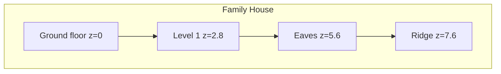

# FEM Family House Default Examples

## Context

Both FEM defaults are didactic L-frame + slab demos, not buildings:

- `[fem/2d/example/default.fem2d.json](fem/2d/example/default.fem2d.json)` — 8 nodes, 3 beams, 1 region
- `[fem/3d/example/default.fem3d.json](fem/3d/example/default.fem3d.json)` — 7 nodes, 2 frames, 1 solid

They are compile-time embedded in `[fem/plugin/rs/lib.rs](fem/plugin/rs/lib.rs)` via `include_str!` and loaded by `setActiveExample` → `SetDocument`. No program code changes are required beyond the example display label and fixture-coupled test assertions.

Goal association (from `.repo/🎯`): `🎯r2602🎯updateddocs🎯updatedexamples`. Open a new ticket at implementation start (no open ticket covers this).

## Chosen building model

European detached timber-frame family house, shared geometry across 2D/3D:

- Footprint **8 m × 10 m**
- **2 full stories** (story height **2.8 m**) + **gable attic**
- Eaves at **5.6 m**, ridge at **7.6 m** (~26.5° pitch over 4 m half-span)
- Materials: **C24 timber** (frame/roof) + **C30/37 concrete** (floor slabs)
- Sections: timber posts ~140×140, floor beams ~80×220, rafters ~80×180
- Load cases kept for existing tests: `dead` (self-weight + permanent floor pressure + roof snow UDL), `live` (residential imposed floor pressure), `uls` = 1.35×dead + 1.5×live
- Coarse continuum meshing so unit tests stay fast (`meshSize` ≈ 1.5–2.0 m, one tet layer)

### FEM 2D — gable cross-section

Elevation/section in the short span (x horizontal, y vertical), matching how the current 2D fixture already treats `y` as up:

- Planar bay: wall posts at x=0 / 4 / 8; levels y=0, 2.8, 5.6; ridge (4, 7.6)
- Beam elements: wall posts, floor beams, two rafters, optional collar tie
- Continuum regions: thin horizontal floor strips at y≈2.8 and y≈5.6 (so area pressure = gravity `-Y` remains meaningful and contour/von Mises tests still pass)
- Supports: pin/fix at all three base nodes
- Camera centered on the section with zoom that frames the full height

### FEM 3D — full house frame

- 3×3 column grid on the 8×10 footprint (corners, mid-walls, center)
- Frame members: columns through both stories, perimeter + internal floor beams at z=2.8 and z=5.6, ridge beam along the long axis, rafters at each transverse grid line
- Solids: floor slabs `sol1` (first floor) and `sol2` (attic floor) — **keep `sol1` / `e1` ids** so existing program render assertions (`solid-sol1`, `el-e1`) stay valid
- Supports: all ground nodes fixed in Tx/Ty/Tz (and rotations for frames)
- Area loads on both solids; snow as member UDLs on rafters

## Files to change

1. Replace `[fem/2d/example/default.fem2d.json](fem/2d/example/default.fem2d.json)` with the 2D house section document.
2. Replace `[fem/3d/example/default.fem3d.json](fem/3d/example/default.fem3d.json)` with the 3D house document.
3. Update example label in `[fem/plugin/rs/lib.rs](fem/plugin/rs/lib.rs)`: `.example("default", "Family House", ...)` for both apps (id stays `"default"` so boot/`setActiveExample` is unchanged).
4. Update fixture-coupled assertions only:
  - `[fem/2d/rs/lib.rs](fem/2d/rs/lib.rs)` `example_fixture_parses_and_solves` — new node/element/region counts; keep solve/von Mises/buckling behavioral checks
  - `[fem/3d/rs/lib.rs](fem/3d/rs/lib.rs)` `example_fixture_parses` — new counts; keep mesh preview / von Mises / buckling checks; expect 2 solid previews if both floors are solids
5. Ticket-folder scratch notes for geometry/load assumptions and test logs (no new files outside the ticket).

## Verification

- Run `cargo test -p fem_2d -p fem_3d -p fem-plugin` (or the existing `🧪test🏗️fem` launch target)
- Confirm both fixtures parse, solve `dead`/`live`/`uls`, produce non-empty nodal von Mises from floor continuum, and yield buckling factor > 1
- Confirm program scene tests still find mesh edges / contours / `solid-sol1` / reaction labels

## Out of scope

- Solver/schema/API changes
- Additional named examples beyond replacing `default`
- Architectural detailing (windows, stairs, foundations beyond base supports)

