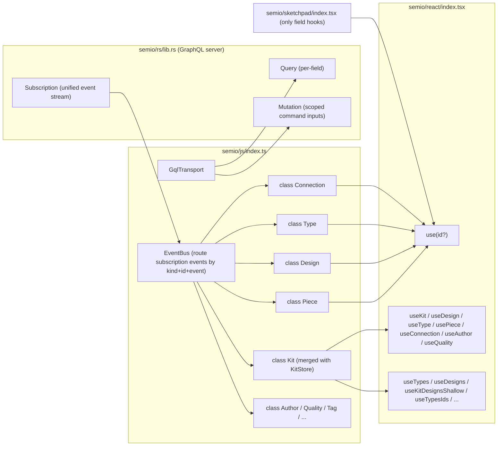

## 1. Direction

[semio/js/index.ts](semio/js/index.ts) is collapsed to a single layer of CQRS entity classes that talk only GraphQL to [semio/rs/lib.rs](semio/rs/lib.rs). `Kit` and the legacy `KitStore` merge into one `Kit` class. Every entity (`Kit`, `Design`, `Type`, `Piece`, `Connection`, `Author`, `Quality`, `Tag`, `Concept`, `Family`, `File`, `Folder`, `Layer`, `Group`, `Stat`, `Prop`, `Attribute`, `Representation`, `Connector`, `Port`, `Plane`, `Coordinate`, `Point`, `Vector`, `Camera`, `Side`, `Benchmark`, `Position`, `Place`, `Location`) follows the same CQRS pattern over the schema in [semio/graphql/target.schema.graphql](semio/graphql/target.schema.graphql).



## 2. CQRS surface on every entity class

Each class has three things, all driven by [semio/graphql/target.schema.graphql](semio/graphql/target.schema.graphql):

1. **Reads** — three methods per field from the schema's data/computed fields:
   - `field(): Promise<T>` — one-off GraphQL `Query` against [semio/rs/lib.rs](semio/rs/lib.rs).
   - `fieldSync(): T | undefined` — synchronous read from the in-class cache. For object-typed fields (`Plane`, `Coordinate`, `Position`, `Side`, …) the cache holds the same instance reference until the field changes, so React `useSyncExternalStore.getSnapshot` returns a stable reference and skips rerenders.
   - `on<Event>(cb: (next: T) => void): Unsubscribe` — subscribe to the routed event channel. Event names follow the schema's Edit/Modification union (`onRenamed`, `onDescriptionChanged`, `onMoved`, `onDragged`, `onFixed`, `onFlattened`, `onPlaneChanged`, `onCenterChanged`, `onAttributeAdded`, `onAttributeRemoved`, `onPieceAdded`, `onPieceDeleted`, `onConnectionAdded`, `onConnectionDeleted`, `onPortCreated`, `onPortDeleted`, `onConnectorAdded`, `onConnectorRemoved`, `onTagCreated`, `onTagDeleted`, `onConceptCreated`, `onConceptDeleted`, `onQualityCreated`, `onQualityDeleted`, `onTypeCreated`, `onTypeDeleted`, `onDesignCreated`, `onDesignDeleted`, `onCheckpointCreated`, …).

2. **Operations** — exactly **one** method per leaf command in the matching `*OperationInput` from §`#region Commands`. There are no `opSync(...)` companions. Method signatures mirror the schema (same names, same args, same nullability) and return `Promise<SetResult>`:
   - `operation(...args): Promise<SetResult>` — single async path. Applies the operation optimistically to the in-class cache *immediately* (synchronous side-effect that fires the matching `on<Event>` callbacks in the same tick so React `useSyncExternalStore` rerenders without waiting for the network), dispatches the matching `mutation { session { ... } }` against [semio/rs/lib.rs](semio/rs/lib.rs), and resolves when the server confirms or rejects. The unified subscription stream then reconciles the cache: a no-op when the optimistic state already matches, a corrective re-emit when the server diverged, or a rollback when the server rejected the mutation.
   - `SetResult` is `{ ok: true; id: ID }` on success, or `{ ok: false; error: SetError }` on rejection. `SetError` is the discriminated union enumerated in [target.schema.graphql](semio/graphql/target.schema.graphql) (e.g. `Readonly`, `TooLong`, `Validation`, `Conflict`, `Rejected`). Network timeouts surface as `{ kind: "Timeout"; message }` from the transport.
   - Callers that want fire-and-forget simply drop the `Promise`; the optimistic apply has already happened.

3. **Navigation methods** — for command-input fields that nest into another scoped command input, the class returns the matching child class instance (lazy, cached by id). E.g. `design.piece(id) → Piece`, `design.pieces(ids) → PiecesOperations`, `kit.type(id) → Type`, `type.port(id) → Port`, `type.connector(id) → Connector`, etc.

### Generic mechanisms (JS side)

Every entity class is built from the same internal `Entity` base + a tiny set of factory helpers, so per-field / per-operation declarations are one-liners. The factories are private to [semio/js/index.ts](semio/js/index.ts); only the resulting classes are exported.

```ts
// internal — shared by every entity class
abstract class Entity {
 constructor(
  protected readonly transport: GqlTransport,
  protected readonly bus: EventBus,
  protected readonly kit: Kit, // owning Kit; routes commands through session/version/change scope
  public readonly id: string,
 ) {}

 /** Read the cached value for `key`. Object-typed values are stored with stable identity. */
 protected fieldSync<T>(key: string): T | undefined;
 /** Async query for `key` using the GraphQL document and select function `selector`. */
 protected fieldQuery<T>(key: string, selector: (data: any) => T, doc: GqlDoc): Promise<T>;
 /** Subscribe to the named event channel for this entity. */
 protected subscribeField(eventName: string, cb: () => void): Unsubscribe;

 /**
  * Single async dispatch path. Applies the deterministic local cache mutation synchronously
  * via applyToCache, fires the matching on<Event> callbacks in the same tick, then awaits the
  * GraphQL mutation. Resolves with the server-confirmed SetResult (or a rejection that triggers
  * a cache rollback). There is no separate sync dispatch — optimistic apply is part of this method.
  */
 protected dispatch<Args extends any[]>(
  operation: GqlOpInput,
  applyToCache: (cache: this["cache"], ...args: Args) => void,
  args: Args,
 ): Promise<SetResult>;
}

// internal helpers attached at class-definition time. Each returns a small object describing the
// field/operation so the constructor can install methods on the prototype with one call to defineFields/defineOperations.
const defineField = <E extends Entity, T>(spec: { key: string; query: GqlDoc; pickQuery: (data: any) => T; event: string }) => spec;

const defineOperation = <E extends Entity, Args extends any[]>(spec: {
 name: string; // matches the *OperationInput leaf name
 buildInput: (...args: Args) => GqlOpInput;
 applyToCache: (cache: E["cache"], ...args: Args) => void;
}) => spec;
```

Class definitions then read like a schema bundle, one line per leaf. Example for `Piece`:

```ts
export class Piece extends Entity {
 // Reads — defineFields installs name() / nameSync() / onRenamed(), and so on for every field.
 static fields = [
  defineField({ key: "name", query: PIECE_NAME_QUERY, pickQuery: (d) => d.node.name, event: "Renamed" }),
  defineField({ key: "description", query: PIECE_DESCRIPTION_QUERY, pickQuery: (d) => d.node.description, event: "DescriptionChanged" }),
  defineField({ key: "position", query: PIECE_POSITION_QUERY, pickQuery: (d) => d.node.position, event: "PositionChanged" }),
  defineField({ key: "plane", query: PIECE_PLANE_QUERY, pickQuery: (d) => d.node.plane, event: "PlaneChanged" }),
  defineField({ key: "center", query: PIECE_CENTER_QUERY, pickQuery: (d) => d.node.center, event: "CenterChanged" }),
  defineField({ key: "scale", query: PIECE_SCALE_QUERY, pickQuery: (d) => d.node.scale, event: "ScaleChanged" }),
  defineField({ key: "blueprint", query: PIECE_BLUEPRINT_QUERY, pickQuery: (d) => d.node.blueprint, event: "BlueprintChanged" }),
  defineField({ key: "flatPosition", query: PIECE_FLAT_POSITION_QUERY, pickQuery: (d) => d.node.flatPosition, event: "FlatPositionChanged" }),
  defineField({ key: "flatPlane", query: PIECE_FLAT_PLANE_QUERY, pickQuery: (d) => d.node.flatPlane, event: "FlatPlaneChanged" }),
  defineField({ key: "flatCenter", query: PIECE_FLAT_CENTER_QUERY, pickQuery: (d) => d.node.flatCenter, event: "FlatCenterChanged" }),
  defineField({ key: "parentPiece", query: PIECE_PARENT_PIECE_QUERY, pickQuery: (d) => d.node.parentPiece, event: "ParentPieceChanged" }),
  defineField({ key: "parentConnection", query: PIECE_PARENT_CONN_QUERY, pickQuery: (d) => d.node.parentConnection, event: "ParentConnectionChanged" }),
  defineField({ key: "childPieces", query: PIECE_CHILD_PIECES_QUERY, pickQuery: (d) => d.node.childPieces, event: "ChildPiecesChanged" }),
  defineField({ key: "childConnections", query: PIECE_CHILD_CONN_QUERY, pickQuery: (d) => d.node.childConnections, event: "ChildConnectionsChanged" }),
  defineField({ key: "depth", query: PIECE_DEPTH_QUERY, pickQuery: (d) => d.node.depth, event: "DepthChanged" }),
  defineField({ key: "connectionKind", query: PIECE_CONN_KIND_QUERY, pickQuery: (d) => d.node.connectionKind, event: "ConnectionKindChanged" }),
  defineField({ key: "attributes", query: PIECE_ATTRIBUTES_QUERY, pickQuery: (d) => d.node.attributes, event: "AttributesChanged" }),
 ];

 // Operations — defineOperations installs exactly one async method per leaf (no Sync companions).
 static operations = [
  defineOperation({
   name: "rename",
   buildInput: (newName: string) => ({ rename: { newName } }),
   applyToCache: (c, newName: string) => {
    c.name = newName;
   },
  }),
  defineOperation({
   name: "changeDescription",
   buildInput: (newDescription: string) => ({ changeDescription: { newDescription } }),
   applyToCache: (c, d: string) => {
    c.description = d;
   },
  }),
  defineOperation({
   name: "drag",
   buildInput: (offset: OffsetInput) => ({ drag: { offset } }),
   applyToCache: (c, offset: OffsetInput) => {
    c.center = applyOffsetToCenter(c.center, offset);
   },
  }),
  defineOperation({
   name: "move",
   buildInput: (position: PositionInput) => ({ move: { position } }),
   applyToCache: (c, position: PositionInput) => {
    c.center = position.center;
    c.plane = position.plane;
   },
  }),
  defineOperation({
   name: "fix",
   buildInput: () => ({ fix: true }),
   applyToCache: (c) => {
    c.fixed = true;
   },
  }),
  defineOperation({
   name: "changeBlueprint",
   buildInput: (blueprintId: string) => ({ changeBlueprint: { blueprintId } }),
   applyToCache: (c, id) => {
    c.blueprintId = id;
   },
  }),
  defineOperation({
   name: "addAttribute",
   buildInput: (key: string, value: string, definition: string) => ({ addAttribute: { key, value, definition } }),
   applyToCache: (c, k, v, def) => {
    c.attributes = [...c.attributes, { key: k, value: v, definition: def }];
   },
  }),
  defineOperation({
   name: "removeAttribute",
   buildInput: (id: string) => ({ removeAttribute: { id } }),
   applyToCache: (c, id) => {
    c.attributes = c.attributes.filter((a) => a.id !== id);
   },
  }),
  defineOperation({
   name: "removeAttributes",
   buildInput: (ids: readonly string[]) => ({ removeAttributes: { ids } }),
   applyToCache: (c, ids) => {
    const set = new Set(ids);
    c.attributes = c.attributes.filter((a) => !set.has(a.id));
   },
  }),
 ];

 // Navigation — Piece has no scoped child entities; Design/Type/Kit override this with cached children.
}

// One call per class wires every defined field/operation into prototype methods named exactly as in the schema.
defineFields(Piece, Piece.fields);
defineOperations(Piece, Piece.operations);
```

`defineFields(C, specs)` installs three methods per spec on `C.prototype`: `<key>(): Promise<T>` (calls `Entity.fieldQuery`), `<key>Sync(): T | undefined` (calls `Entity.fieldSync`), and `on<Event>(cb): Unsubscribe` (calls `Entity.subscribeField`). `defineOperations(C, specs)` installs **exactly one** method per spec: `<name>(...args): Promise<SetResult>` (calls `Entity.dispatch`, which performs the optimistic local apply via `applyToCache`, fires `on<Event>` callbacks, sends the GraphQL mutation, and resolves with the server-confirmed `SetResult`). There is no `<name>Sync` companion — the optimistic path is *part of* the single async method, not a separate one. Same recipe for `Kit`, `Design`, `Type`, `Port`, `Connector`, `Connection`, `Author`, `Quality`, `Tag`, `Concept`, etc. — each class is mostly two static arrays.

The full operation surface per class (mirrors [semio/graphql/target.schema.graphql](semio/graphql/target.schema.graphql) exactly):

- **`Kit`** (merged with `KitStore`; mirrors `KitOperationInput`): owns `GqlTransport` + `EventBus`. Operations: `rename(newName)`, `changeDescription(newDescription)`, `createTag(name, description?, icon?, order?)`, `tag(id) → Tag`, `deleteTag(id)`, `deleteTags(ids)`, `createConcept(name, description?, icon?, order?)`, `concept(id) → Concept`, `deleteConcept(id)`, `deleteConcepts(ids)`, `createQuality(key, value?, unit?, definition?, description?, icon?)`, `quality(id) → Quality`, `deleteQuality(id)`, `deleteQualities(ids)`, `createType(name, description?, icon?, image?, unit?)`, `type(id) → Type`, `deleteType(id)`, `deleteTypes(ids)`. Plus version/session control: `startNewChange()`, `save()`, `createCheckpoint(message)`, `unsavedChange(id) → Kit` scope helper, `startAlternative(name?)`, `alternative(id)`, `integrateAlternative(id)`, `start()`, `end()`, `login(username, passwordHash, hubUrl?)`, `logout()`, `hydrateBundleJson(json)`.
- **`Design`** (mirrors `DesignOperationInput`): `rename(newName)`, `changeDescription(newDescription)`, `flatten()`, `addAttribute`, `removeAttribute(id)`, `removeAttributes(ids)`, `addFixedPiece(blueprintId, position, name?, description?)`, `addChildPieceWithParentConnection(blueprintId, parentPieceId, parentConnector, childConnector, name?, description?, position?, scale?)`, `addHangingChildPieceWithParentConnection(blueprintId, parentPieceId, parentConnector, childConnector, position, name?, description?, scale?)`, `piece(id) → Piece`, `pieces(ids) → PiecesOperations`, `deletePiece(id)`, `deletePieces(ids)`, `deletePiecesAndConnections(pieceIds, connectionIds)`.
- **`PiecesOperations`** (small helper returned by `design.pieces(ids)`; mirrors `PiecesOperationInput`): `drag(offset)`, `move(offset)`, `fix()`, `changeBlueprint(blueprintId)`. Has no reads — it's a pure command scope.
- **`Type`** (mirrors `TypeOperationInput`): `rename(newName)`, `changeDescription(newDescription)`, `changeIcon(newIcon)`, attributes operations, `createPort(code?, label?, description?, icon?, order?)`, `port(id) → Port`, `deletePort(id)`, `deletePorts(ids)`, `addConnector(code, description?, icon?, portId?)`, `connector(id) → Connector`, `removeConnector(id)`, `removeConnectors(ids)`.
- **`Port`** (mirrors `PortOperationInput`): `rename(newCode, newLabel?)`, `changeDescription(newDescription)`, `changeIcon(newIcon)`, attributes operations.
- **`Connector`** (mirrors `ConnectorOperationInput`): `rename(newCode)`, `changeDescription(newDescription)`, `changeIcon(newIcon)`.
- **`Tag`** / **`Concept`** (mirror `TagOperationInput` / `ConceptOperationInput`): `rename(newName)`, `changeDescription(newDescription)`, `changeIcon(newIcon)`, attributes operations.
- **`Quality`** (mirrors `QualityOperationInput`): `rename(newKey)`, `changeDescription(newDescription)`, `changeIcon(newIcon)`, attributes operations.
- **`Piece`** (mirrors `PieceOperationInput`): see snippet above.
- **`Connection`**, **`Author`**: both implement `Artifact` (bulky) so they are classes with the full read API (one `field()` / `fieldSync()` / `on<Event>(cb)` triple per schema field). The schema currently does not declare a dedicated `*OperationInput` for either, so the class only carries reads; their commands (e.g. add/remove connection, addAuthor) live on the parent `Design` / `Kit` per the schema. If the schema later grows `ConnectionOperationInput` / `AuthorOperationInput`, the matching methods are added then.

`Plane`, `Coordinate`, `Position`, `Point`, `Vector`, `Side`, `Attribute` (every `WeakEntity` per [target.schema.graphql](semio/graphql/target.schema.graphql) lines 51–67) are **not classes**. They are plain TypeScript record types that mirror the schema 1:1 (e.g. `interface Plane { origin: Point; xAxis: Vector; yAxis: Vector }`). They are returned by-value from owner methods (`piece.planeSync()`, `piece.flatPlaneSync()`, `connection.sideSync()`, `piece.attributesSync()`, …). The owning `Entity`'s cache holds a stable reference per logical value, so `fieldSync()` returns the same object instance until the field changes. There is no `class Plane`, no `class Coordinate`, no `class Attribute`. There are no `*Scope` / `*Context` providers, no entity-identity hooks, and no `field()` / `fieldSync()` / `on<Event>` API anchored to a weak-entity id — those values appear _only_ as field results inside their owning Artifact class.

Every command method translates to one `mutation { session { ... } }` GraphQL request. The session/version/change scoping (`session.theKit.unsavedChange(activeChangeId).kit.<…>`, or `session.alternative(…)`, or `session.theKit.…` for save / checkpoint flows) is encapsulated by `Kit`; child classes hold a reference to their owning `Kit` and route their own command through it.

The transport speaks only GraphQL:

- Reads: a single `GqlTransport.query(doc, vars)` per field method (typed `Query` selection with the right `node(id)` lookup).
- Subscriptions: one persistent `subscription { event }` per `Kit` instance; the `EventBus` deserializes each `Json` event, looks up its kind + entity id + field affinity, and pushes typed values into all registered channels.
- Commands: a single async path per leaf in `*OperationInput`. `operation(...)` first runs the in-class reducer (mutates the cache deterministically using the same logic the server applies for the matching event, and fires `on<Event>` callbacks in the same tick so React `useSyncExternalStore` rerenders without waiting for the network), then dispatches the `mutation { session { ... } }`. The returned `Promise<SetResult>` resolves with the server's confirmation (or rejection). The subscription event arriving later reconciles the cache (no-operation if the optimistic state already matches, corrective re-emit if the server diverged, rollback on rejection). Background reconciliation/dispatch failures surface through `Kit.errors` (consumed by `useKitErrors`); the rejecting `SetResult` itself is delivered to the caller's `Promise` and therefore to the React op hook's `status` (§4).

## 3. Public exports of `semio/js/index.ts`

Keep only:

- The entity classes: `Kit` (merged with `KitStore`), `Design`, `Type`, `Piece`, `Connection`, `Author`, `Quality`, `Tag`, `Concept`, `Family`, `File`, `Folder`, `Layer`, `Group`, `Stat`, `Prop`, `Attribute`, `Representation`, `Connector`, `Port`, `Plane`, `Coordinate`, `Point`, `Vector`, `Camera`, `Side`, `Benchmark`, `Position`, `Place`, `Location`.
- The minimal types those classes need in their public method signatures, mirrored from [semio/graphql/target.schema.graphql](semio/graphql/target.schema.graphql) input objects: `OffsetInput`, `PositionInput`, `PlaneInput`, `CoordinateInput`, `PointInput`, `VectorInput`, `LocationInput`, `BackboneConfig`, `ConflictResolution`, `SetResult`, `SetError`, `Unsubscribe`, plus the GraphQL-derived event union types if a method signature references them.
- One factory: `openKit(config: { rsUrl?: string; backbone?: BackboneConfig; ... }): Promise<Kit>`. No `createKitStoreClient`, no `createSessionKitStore`, no `applyKitClientSnapshotToLocalStore`.

Delete entirely (full list — these were the bulk of the current 7715-line file):

- The legacy `KitStore` class and its client family — `KitStoreClient`, `WasmKitStoreClient`, `createKitStoreClient`, `kitStoreFromKitStoreClient`, `getKitClientReadPoint`, `theKitReadPoint`, `KitReadPoint`, `kitReadPointKey`.
- All host stores: `KitHostStore`, `KitHostStoreSnapshot`, `KitStoreSnapshot`, `KitSyncSnapshot`, `DEFAULT_KIT_SYNC`, `InMemoryKitStore`, `createSessionKitStore`, `createJsonFileKitStore`, `createFolderKitStore`, `applyKitClientSnapshotToLocalStore`, `KitBundlePersistingStore`, `KIT_BUNDLE_BOOTSTRAPPED`, `KitJsonFileAdapter`, `KitFolderAdapter`, `KitBinaryStore`.
- All read commands and aggregate read stores: `ReadKitCommand`, `ReadDesignCommand`, `ReadPieceCommand`, `ReadTypeCommand`, `SemioKitLiveReadStore`, `KitDesignReadStore`, `KitShallowListStore`, `KitViewCatalogStore`, `getSemioKitLiveReadStore`, every `getSnapshot` aggregate path. Reads are exclusively through the field methods on the classes.
- Free-standing write helpers, replaced by class methods: `kitStoreClientAddPiece`, `kitStoreClientAddConnection`, `kitStoreClientAddChildByKind`, `kitStoreClientUpdatePiece`, `kitStoreClientUpdateConnection`, `kitStoreClientRemovePiece`, `kitStoreClientRemoveChildByKind`, `submitKitChangeCommands`, `buildSchemaEntityChangeCommands`, `writeKitStoreClientSchemaField`, `StoreField`, `StoreCommand`, `CommandBuilder`.
- Zod schemas, DTO types, metadata/shallow types: every `*Schema`, every `*Dto`, every `*MetadataDto`, every `*Shallow`, `KitFullDto`, `KitFullDtoSchema`, `normalizeKitFullDtoFolderPaths`, `KitJsonObjectDto`, `KitJsonTreeDto`, `JsonValue`, `JsonObject`, `parseJsonValue`, `KitGraphqlResponseEnvelope`, `ReadonlyDto`, `kitChangeSemanticKindToGraphQl`, `KitChangeKind`, `KitChangeSemanticKindGql`, `KitCommandLifecycleEvent`, `SEMIO_KIT_STORE_CONTROL_COMMAND_KINDS`, `SemioKitStoreControlCommandName`.
- Helper utilities tied to the deleted graph: `asKitInstance`, `kitEventAffectsPieceLiveRead`, `kitEventAffectsCanUndoRedo`, `kitEventAffectsDesignQualitySumRead`, `kitEventAffectsKitColoredConnectorsRead`, `kitEventAffectsReplaceableCatalogRead`, `kitEventAffectsTypeScopedRead`, `kitEventTouchesDesign`, `resolveDesignIdForPieceOrConnection`, `isKitCommandLifecycleEvent`, `isKitBundlePersistingStore`, `getStoredKitFileUrls`, `getOrCreateKitFileState`, `getKitFileProvider`, `getExistingKitFileProvider`, `getReadableKitFileUrl`, `fetchReadableKitFileBlob`, `getKitFileStoragePath`, `createKitFileObjectUrl`, `isBrowserReadableFileUrl`, `getKitPorts`, `id` (uuid helper kept only if `Kit` constructor needs it), `TOLERANCE`, `ICON_WIDTH`, `DiffStatus`, `EntityLifecycle`, `FlatMerkleCacheEntry`, `OperationResult`, `DesignOperationResult`, `DesignDiffOperationResult`, `AlgorithmError`, `PiecePlacementRowDto`.
- The `*Diff` types and the `applyDiff` machinery: `*DiffSchema`, `*Diff`, `*sDiffSchema`, `*sDiff`, `Design.applyDiff`, `Design.previewWithDiff`, `Design.dragBySelection`, `Design.deletePiecesAndConnectionsDiff`, `Type.pickBestRepresentation`, `Kit.copyDesignOp`, `Kit.pasteDesignOp`, `Kit.flattenDesignCachedOp`, `Kit.findParentPieceInDesign`, `Kit.findParentConnectionForPieceInDesign`, `Kit.findChildrenPiecesInDesign`, `Kit.findDesign`, `Kit.findType`, `Kit.piecesMetadataFor`, `Kit.fromDto`, `Kit.toDto`, `Kit.toJSON`, `Kit.deserialize`, `Kit.serialize`, `Kit.ensure`. All graph navigation moves to the GraphQL server; the JS classes only hold the local cache.
- Inline subagent / view stores: `KitViewCatalogKey`, `KitDesignReadKind`, `KitShallowListKind`, `KitStoreReadSnap`, `KitAlternativeSummary` (re-derive from class subscriptions if needed in react).

The `kit-store.worker.ts` worker is rewritten to host only the GraphQL transport (`async-graphql` over WASM) and to forward `subscription { event }` payloads to the main thread; no DTO marshaling.

## 4. `semio/react/index.tsx` shape

### Schema-1:1 invariant

[semio/react/index.tsx](semio/react/index.tsx) adds **nothing** beyond [target.schema.graphql](semio/graphql/target.schema.graphql). Every exported hook corresponds to exactly one schema field (read) or one `*OperationInput` leaf (write). No sub-selection. No derivation. No aggregation. No metadata, shallow, or "view" hooks unless the schema itself exposes them as computed fields.

Per-field read hooks follow the schema's lean/bulky split (lines 51–105 of the schema):

- **Lean fields** — return type is a scalar (`String`, `Int`, `Float`, `Boolean`, `ID`, `Timestamp`, an enum, a JSON value), a `WeakEntity` (`Plane`, `Coordinate`, `Position`, `Point`, `Vector`, `Side`, `Attribute`), or a list of those. Hook returns the value verbatim (`T | undefined`).
- **Bulky fields** — return type is an `Artifact` / `StrongEntity` (`Kit`, `Design`, `Type`, `Piece`, `Connection`, `Port`, `Connector`, `Representation`, `Author`, `Quality`, `Tag`, `Concept`) or a list of those. Hook returns the matching JS class instance (or array of class instances). Class navigation through the parent class (`design.piece(id)`, `kit.type(id)`, …) provides stable per-id instance identity.
- **Never anything in between**: a hook does not slice a `Plane` into `usePiecePlaneOriginX`, does not flatten a `Position` into `usePieceCenterU`, does not project a `[Piece!]!` list into `useDesignPieceIds`. Consumers that need a sub-field destructure the lean value at the call site (`usePieceCenter()?.u`) or read the synchronous `id` getter on the class instance (`pieces?.map((p) => p.id)`).

The same rule applies to writes — every write hook is a 1:1 wrapper around one `*OperationInput` leaf. Sketchpad and any other consumer obey the same rule (see §5).

### Strict separation of reads and writes

- **Reads** are pure plain-data hooks. `use<Entity><Field>(id?)` returns just the value (`T | undefined` for lean, `Entity | null` / `readonly Entity[] | undefined` for bulky). No tuple, no setter, no status, no `KitFieldBinding`, no `HookRead`. If the entity / kit / field is not yet resolved the hook returns `undefined` / `null`.
- **Writes** are operation hooks. `use<Operation><Entity>(id?)` returns a stable `readonly [run, status]` tuple where `run(...args): Promise<SetResult>` is bound to that entity + operation and `status: OperationStatus<SetSuccess>` is a discriminated-union snapshot (`idle` / `pending` / `successful` / `tooLong` / `timeout` / `failed`) — see §"Operation hook pattern". There is no `*Sync` variant, no embedded read fallback; callers compose a read hook and a write hook independently. The optimistic local apply that keeps drag/slider UX single-tick lives inside the underlying class method, not inside a separate hook.
- The kit can only be modified through these operation hooks. Operation hooks map 1:1 to leaves of the `*OperationInput` types in [target.schema.graphql](semio/graphql/target.schema.graphql).

### Resolution rules (every hook)

- Every read / write hook accepts a single optional argument `id?: string`. When `id` is omitted the hook reads the matching context (`KitContext`, `DesignContext`, `TypeContext`, `PortContext`, `ConnectorContext`, `PieceContext`, `ConnectionContext`, `AuthorContext`, `QualityContext`, `TagContext`, `ConceptContext`, …). When `id` is provided it wins over the context.
- There are no `useResolved*` helpers. Resolution is the explicit composition `useKit()` → `kit.<child>(id)`, `useDesign()` → `design.<child>(id)`, `useType()` → `type.<child>(id)`, `useDesign().piece(id)` → `Piece`, `useDesign().connection(id)` → `Connection`, `useType().port(id)` → `Port`, `useType().connector(id)` → `Connector`, etc. Inside the per-field hook body the chain is written out.
- The entity-identity selectors return the class instance from §2, never a DTO. Their union signatures are:

  ```ts
  export function useKit(): Kit | null;
  export function useDesign(id?: string): Design | null; // useKit().design(id ?? useDesignContext()?.id)
  export function useType(id?: string): Type | null; // useKit().type(id ?? useTypeContext()?.id)
  export function usePiece(id?: string): Piece | null; // useDesign().piece(id ?? usePieceContext()?.id)
  export function useConnection(id?: string): Connection | null; // useDesign().connection(id ?? useConnectionContext()?.id)
  export function useAuthor(id?: string): Author | null; // useKit().author(id ?? useAuthorContext()?.id)
  export function useQuality(id?: string): Quality | null; // useKit().quality(id ?? useQualityContext()?.id)
  ```

  `Connection`, `Author`, `Quality` get matching navigation methods on `Design` / `Kit` (`design.connection(id)`, `kit.author(id)`, `kit.quality(id)`) so the chain composes cleanly.

### Naming

All `*Scope*` symbols are renamed to `*Context*` across the public API:

- Components: `KitScope` → `KitContext`, `DesignScope` → `DesignContext`, `TypeScope` → `TypeContext`, `PortScope` → `PortContext`, `ConnectorScope` → `ConnectorContext`, `PieceScope` → `PieceContext`, `ConnectionScope` → `ConnectionContext`, `AuthorScope` → `AuthorContext`, `QualityScope` → `QualityContext`, `TagScope` → `TagContext`, `ConceptScope` → `ConceptContext`. Each is a JSX provider component used as `<PieceContext id="p1">…</PieceContext>` (writing `<PieceContext id>` shorthand for `<PieceContext id={id}>`).
- React contexts: `PieceScopeContext` → `PieceContext` (the React.Context object), and the same for every other entity. The provider component shares the entity's context name.
- Hooks: `useKitScope` → `useKitContext`, `useDesignScope` → `useDesignContext`, `useTypeScope` → `useTypeContext`, `usePortScope` → `usePortContext`, `useConnectorScope` → `useConnectorContext`, `usePieceScope` → `usePieceContext`, `useConnectionScope` → `useConnectionContext`, `useAuthorScope` → `useAuthorContext`, `useQualityScope` → `useQualityContext`, `useTagScope` → `useTagContext`, `useConceptScope` → `useConceptContext`. The `useIs*Scope` helpers go away.
- Other "scope" symbols are renamed too: `KitWriteScope` → `KitWriteContext`, `SchemaScope` → deleted (per §"Generic schema readers"), `useResolvedKitIdentifier` keeps its name (no "scope" in it).

### Context usage

Every entity has a JSX provider component that puts an id into the matching React context. Each provider takes a single `id` prop (mirrors the existing `*Scope` shape — `KitScope` already takes `id`, the live `Kit` instance is resolved from the registry inside the provider). Hooks omit their `id` argument to bind to the context. Providers nest naturally.

```tsx
<KitContext id={kitId}>
 <DesignContext id={designId}>
  <DesignNameLabel /> {/* uses useDesignName() */}
  <DesignPieceList /> {/* uses useDesignPieceIds() then maps to <PieceContext id={...}> */}
  <DesignControls /> {/* uses useFlattenDesign() / useAddFixedPiece() */}
 </DesignContext>
</KitContext>;

function DesignNameLabel() {
 const name = useDesignName(); // omits id → reads DesignContext
 return <span>{name ?? "…"}</span>;
}

function DesignPieceList() {
 const pieceIds = useDesignPieceIds(); // omits id → reads DesignContext
 if (!pieceIds) return null;
 return (
  <>
   {pieceIds.map((id) => (
    <PieceContext id={id} key={id}>
     <PieceCard /> {/* uses usePieceName(), usePiecePlane(), etc. */}
    </PieceContext>
   ))}
  </>
 );
}

function PieceCard() {
 const name = usePieceName(); // PieceContext-bound, schema-1:1 read
 const center = usePieceFlatCenter();
 const plane = usePiecePlane();
 const [dragPiece, dragPieceStatus] = useDragPiece(); // op tuple [run, status]
 const [fixPiece, fixPieceStatus] = useFixPiece();
 return (
  <Card title={name} saving={dragPieceStatus.kind === "pending" || fixPieceStatus.kind === "pending"}>
   <Plane plane={plane} />
   <Coord center={center} />
   <button onClick={() => void fixPiece()}>Fix</button>
   <DragHandle onDrag={(offset) => void dragPiece(offset)} />
   {dragPieceStatus.kind === "tooLong" && <Hint>Value out of range</Hint>}
   {dragPieceStatus.kind === "timeout" && <Hint>Server slow, retrying…</Hint>}
  </Card>
 );
}
```

The `id` argument always wins over the surrounding context, so a single provider tree can read sibling entities by passing ids explicitly:

```tsx
function PieceCompare({ otherId }: { otherId: string }) {
 const myCenter = usePieceFlatCenter(); // current PieceContext
 const otherCenter = usePieceFlatCenter(otherId); // explicit id
 return <Compare a={myCenter} b={otherCenter} />;
}
```

A connector editor binds inside a `Type` and a specific `Connector` and uses one of the operation hooks that _does_ exist (`ConnectorOperationInput` declares `rename` / `changeDescription` / `changeIcon`):

```tsx
<TypeContext id={typeId}>
 <ConnectorContext id={connectorId}>
  <ConnectorRow />
 </ConnectorContext>
</TypeContext>;

function ConnectorRow() {
 const code = useConnectorCode();
 const description = useConnectorDescription();
 const icon = useConnectorIcon();
 const [renameConnector, renameConnectorStatus] = useRenameConnector();
 return (
  <Row
   code={code}
   description={description}
   icon={icon}
   onRename={(next) => void renameConnector(next)}
   saving={renameConnectorStatus.kind === "pending"}
   tooLong={renameConnectorStatus.kind === "tooLong"}
   timedOut={renameConnectorStatus.kind === "timeout"}
  />
 );
}
```

`Connection`, `Author` and the value-object classes do not have a `*OperationInput` in [target.schema.graphql](semio/graphql/target.schema.graphql), so they only get read hooks — no `useSet*` / `use<Op>*` hooks for them. Mutating a connection happens through the parent `Design`'s operations (e.g. `useAddChildPieceWithParentConnection(designId)`), and connection-field reads are still per-field hooks (`useConnectionGap`, `useConnectionShift`, `useConnectionRotation`, …).

Operation hooks called outside any provider must take an explicit `id` (otherwise the returned function reports a `Readonly` error).

### Sketchpad target

Sketchpad obeys the same schema-1:1 rule: it never re-implements a `usePieceCenterU` / `usePieceIsHidden` / `useConnectionGapValue`-style hook either. Every existing `HookResult<T>` style sketchpad hook is **deleted entirely**. Slicing a lean value (e.g. picking `u` from a `Coordinate`) or picking a class `id` from a list happens *inline at the call site*, in the component body that needs it. Reads come from `@semio/react`'s schema-1:1 read hooks; writes come from `@semio/react`'s schema-1:1 op hooks.

```ts
// Before — semio/sketchpad/index.tsx around line 16888
export function usePieceCenterU(): HookResult<number> {
 const pieceScope = usePieceScope();
 const piece = usePiece() as Piece | null;
 const commands = useDesignAppCommands();
 const setter = useCallback(
  (value: number) => {
   if (pieceScope && piece)
    commands.updatePiece(
     "semio.sketchpad.app.design.panel.details.section.piece.center.u",
     pieceScope.id,
     { center: { u: value, v: piece.center?.v ?? 0 } },
    );
  },
  [pieceScope, piece, commands],
 );
 return conditionalHookResult(!!pieceScope && !!piece, piece?.center?.u ?? 0, setter);
}
```

```tsx
// After — usePieceCenterU does NOT exist anywhere. The component inlines reads and writes.
function PieceCenterUInput() {
 const center = usePieceCenter();                           // Coordinate | undefined — schema-1:1 read
 const [movePiece, movePieceStatus] = useMovePiece();       // schema-1:1 write returns [run, status]
 const u = center?.u ?? 0;
 return (
  <NumberInput
   value={u}
   onCommit={(next) => { if (center) void movePiece({ center: { u: next, v: center.v } }); }}
   saving={movePieceStatus.kind === "pending"}
   error={
    movePieceStatus.kind === "tooLong" ? "Value out of range" :
    movePieceStatus.kind === "timeout"  ? "Server slow, retrying" :
    movePieceStatus.kind === "failed"   ? movePieceStatus.error.message :
    null
   }
  />
 );
}
```

The same rule deletes (in sketchpad and `@semio/react`) every other tuple/sub-selection hook and replaces it with inline destructuring + 1:1 op calls:

- `usePieceCenterV` — gone. Component inlines `usePieceCenter()?.v` for read and `const [movePiece] = useMovePiece(); … void movePiece({ center: { u, v: next } })` for write.
- sketchpad's tuple `usePieceScale` — gone. Component uses `@semio/react`'s `usePieceScale()` (returns `number | undefined`) plus `const [movePiece, movePieceStatus] = useMovePiece()` for write.
- `usePieceIsHidden` / `usePieceIsLocked` — gone. The schema does not expose `Piece.isHidden` / `Piece.isLocked` as direct fields today; until the schema grows `Piece.isHidden: Boolean!` + `PieceOperationInput.changeIsHidden` (and the matching `usePieceIsHidden` / `useChangePieceIsHidden` auto-generated 1:1 hooks appear in `@semio/react`), the component reads `usePieceAttributes()?.find((a) => a.key === "isHidden")?.value === "true"` inline and writes through `const [addPieceAttribute] = useAddPieceAttribute()` / `const [removePieceAttribute] = useRemovePieceAttribute()`.
- `useConnectionGapValue` / `useConnectionShiftValue` / `useConnectionRotationValue` / `useConnectionRiseValue` / `useConnectionTurnValue` / `useConnectionTiltValue` — gone. Component uses `useConnectionGap()`, `useConnectionShift()`, `useConnectionRotation()`, `useConnectionRise()`, `useConnectionTurn()`, `useConnectionTilt()` (each schema-1:1) for read. Writes are unavailable until `ConnectionOperationInput` is added to the schema.

List rendering follows the same rule — never ask for ids; ask for the bulky list and read `id` from the class instance:

```tsx
// Before
const ids = useDesignPieceIds(designId);                // sub-selection — gone
return ids?.map((id) => <PieceCard key={id} pieceId={id} />);

// After
const pieces = useDesignPieces(designId);               // bulky → readonly Piece[] | undefined
return pieces?.map((p) => <PieceCard key={p.id} pieceId={p.id} />);
```

Drag interaction (canvas pointer move) is already pure-write and stays a one-liner:

```tsx
// Before — snapshot-driven optimistic diff applied through commands.applyKitDiff(...)
function useDraggingPiece(id: string) {
 const piece = usePiece(undefined, id) as Piece | null;
 const commands = useDesignAppCommands();
 return useCallback(
  (offset: OffsetInput) => {
   if (!piece) return;
   commands.applyKitDiff(buildDragDiff(piece, offset));
  },
  [piece, commands],
 );
}
```

```tsx
// After — pure write, schema-1:1, single async path with status feedback.
const [dragPiece, dragPieceStatus] = useDragPiece(id);
// onPointerMove={(offset) => void dragPiece(offset)}        // optimistic apply happens synchronously inside dragPiece
// dragPieceStatus.kind === "pending" while awaiting confirmation
// dragPieceStatus.kind === "successful" | "tooLong" | "timeout" | "failed" once resolved
```

Optimistic UI feedback during pointer-move drags is unaffected: `piece.drag(offset)` mutates the cache + fires `onCenterChanged` synchronously *before* it awaits the network, so any `usePieceCenter` consumer rerenders in the same tick the pointer event was handled. The promise then resolves a moment later and updates `dragPieceStatus` to `successful` / `tooLong` / `timeout` / `failed`.

Net effect: every banned `useKit` / `useDesign` / `useType` / `usePiece` / `useConnection` / `useAuthor` / `useQuality` import disappears from sketchpad, every sub-selection / tuple sketchpad hook (`usePieceCenterU`, `usePieceCenterV`, `usePieceScale` (sketchpad version), `usePieceIsHidden`, `usePieceIsLocked`, `useConnectionGapValue`, `useConnectionShiftValue`, `useConnectionRiseValue`, `useConnectionRotationValue`, `useConnectionTurnValue`, `useConnectionTiltValue`, `useDesignPieceIds`, `useDesignConnectionIds`, …) is *deleted* (no rename, no replacement hook), every `commands.updatePiece` / `updateConnection` / `updateType` / `updateDesign` / `applyKitDiff` call becomes a `const [op, opStatus] = use<Op><Entity>(); … void op(...)` pair, and every read uses a schema-1:1 field hook from `@semio/react` plus inline destructuring at the call site. The `useDesignAppCommands` indirection itself is deleted — sketchpad calls the operation hooks directly.

### Generic mechanisms (React side)

Every per-field and per-operation hook in [semio/react/index.tsx](semio/react/index.tsx) is produced by a tiny set of factories. The factories encapsulate context resolution, parent-class lookup, the `useSyncExternalStore` bridge, and the readonly fallback — so the actual hook declarations are one-liners.

```ts
// internal — hidden from the public API
const READONLY: SetResult = { ok: false, error: { kind: "Readonly", message: "no entity" } };

function bindFieldToReact<E, T>(entity: E | null, getSnap: (e: E) => T | undefined, subscribe: (e: E, listener: () => void) => Unsubscribe): T | undefined {
 const sub = React.useCallback((cb: () => void) => (entity ? subscribe(entity, cb) : noop), [entity, subscribe]);
 const get = React.useCallback(() => (entity ? getSnap(entity) : undefined), [entity, getSnap]);
 return React.useSyncExternalStore(sub, get, get);
}

type OperationStatus<T = SetSuccess> =
 | { kind: "idle" }
 | { kind: "pending"; startedAt: number }
 | { kind: "successful"; value: T; finishedAt: number }
 | { kind: "tooLong"; error: SetError; finishedAt: number }
 | { kind: "timeout"; startedAt: number }
 | { kind: "failed"; error: SetError; finishedAt: number };

const IDLE: OperationStatus = { kind: "idle" };

function bindOpToReact<E, Args extends any[]>(entity: E | null, call: (e: E, ...args: Args) => Promise<SetResult>): readonly [(...args: Args) => Promise<SetResult>, OperationStatus] {
 const [status, setStatus] = React.useState<OperationStatus>(IDLE);
 const run = React.useCallback(
  async (...args: Args): Promise<SetResult> => {
   if (!entity) return READONLY;
   const startedAt = performance.now();
   setStatus({ kind: "pending", startedAt });
   try {
    const result = await call(entity, ...args);
    const finishedAt = performance.now();
    if (result.ok) {
     setStatus({ kind: "successful", value: result, finishedAt });
    } else if (result.error.kind === "TooLong") {
     setStatus({ kind: "tooLong", error: result.error, finishedAt });
    } else if (result.error.kind === "Timeout") {
     setStatus({ kind: "timeout", startedAt });
    } else {
     setStatus({ kind: "failed", error: result.error, finishedAt });
    }
    return result;
   } catch (e) {
    const finishedAt = performance.now();
    const error: SetError = { kind: "Rejected", message: String(e) };
    setStatus({ kind: "failed", error, finishedAt });
    return { ok: false, error };
   }
  },
  [entity, call],
 );
 return [run, status] as const;
}

// One field-hook factory per entity. Each one knows the context chain it needs to resolve the entity:
//   Kit       — useKit()
//   Design    — useKit().design(id ?? DesignContext)
//   Type      — useKit().type(id ?? TypeContext)
//   Port      — useType().port(id ?? PortContext)
//   Connector — useType().connector(id ?? ConnectorContext)
//   Piece     — useDesign().piece(id ?? PieceContext)
//   Connection— useDesign().connection(id ?? ConnectionContext)
//   Author    — useKit().author(id ?? AuthorContext)
//   Quality   — useKit().quality(id ?? QualityContext)
//   Tag       — useKit().tag(id ?? TagContext)
//   Concept   — useKit().concept(id ?? ConceptContext)
const createPieceFieldHook = <T>(getSnap: (p: Piece) => T | undefined, subscribe: (p: Piece, listener: () => void) => Unsubscribe): ((id?: string) => T | undefined) =>
 function usePieceField(id?: string): T | undefined {
  const design = useDesign();
  const pieceId = id ?? React.useContext(PieceContext)?.id;
  const piece = design && pieceId ? design.piece(pieceId) : null;
  return bindFieldToReact(piece, getSnap, subscribe);
 };

const createPieceOpHook = <Args extends any[]>(call: (p: Piece, ...args: Args) => Promise<SetResult>): ((id?: string) => readonly [(...args: Args) => Promise<SetResult>, OperationStatus]) =>
 function usePieceOp(id?: string) {
  const design = useDesign();
  const pieceId = id ?? React.useContext(PieceContext)?.id;
  const piece = design && pieceId ? design.piece(pieceId) : null;
  return bindOpToReact(piece, call);
 };

// Same shape for each entity:
// createKitFieldHook / createKitOpHook
// createDesignFieldHook / createDesignOpHook
// createTypeFieldHook / createTypeOpHook
// createPortFieldHook / createPortOpHook
// createConnectorFieldHook / createConnectorOpHook
// createPiecesOpHook                              (resolves design.pieces(ids), no field hook)
// createConnectionFieldHook                        (no operation factory — Connection has no *OperationInput)
// createAuthorFieldHook
// createQualityFieldHook / createQualityOpHook
// createTagFieldHook / createTagOpHook
// createConceptFieldHook / createConceptOpHook
```

### Read hook pattern

Every per-field read hook is a one-line application of the matching `create<Entity>FieldHook`. The factory returns `(id?: string) => T | undefined` for lean fields, and `(id?: string) => Entity | null` / `(id?: string) => readonly Entity[] | undefined` for bulky fields. There is one hook per schema field — never less, never more, never sliced.

```ts
// Lean fields → return value verbatim (string / number / WeakEntity / list of WeakEntity)
export const usePieceName        = createPieceFieldHook((p) => p.nameSync(),        (p, s) => p.onRenamed(s));
export const usePieceDescription = createPieceFieldHook((p) => p.descriptionSync(), (p, s) => p.onDescriptionChanged(s));
export const usePiecePlane       = createPieceFieldHook((p) => p.planeSync(),       (p, s) => p.onPlaneChanged(s));
export const usePieceCenter      = createPieceFieldHook((p) => p.centerSync(),      (p, s) => p.onCenterChanged(s));
export const usePieceFlatPlane   = createPieceFieldHook((p) => p.flatPlaneSync(),   (p, s) => p.onFlatPlaneChanged(s));
export const usePieceFlatCenter  = createPieceFieldHook((p) => p.flatCenterSync(),  (p, s) => p.onFlatCenterChanged(s));
export const usePieceScale       = createPieceFieldHook((p) => p.scaleSync(),       (p, s) => p.onScaleChanged(s));
export const usePieceAttributes  = createPieceFieldHook((p) => p.attributesSync(),  (p, s) => p.onAttributesChanged(s));

// Bulky fields → return class instance(s)
export const usePieceParentPiece      = createPieceFieldHook((p) => p.parentPieceSync(),      (p, s) => p.onParentPieceChanged(s));      // Piece | null
export const usePieceParentConnection = createPieceFieldHook((p) => p.parentConnectionSync(), (p, s) => p.onParentConnectionChanged(s)); // Connection | null
export const usePieceChildPieces      = createPieceFieldHook((p) => p.childPiecesSync(),      (p, s) => p.onChildPiecesChanged(s));      // readonly Piece[]
export const usePieceChildConnections = createPieceFieldHook((p) => p.childConnectionsSync(), (p, s) => p.onChildConnectionsChanged(s)); // readonly Connection[]

export const useDesignName        = createDesignFieldHook((d) => d.nameSync(),        (d, s) => d.onRenamed(s));
export const useDesignPieces      = createDesignFieldHook((d) => d.piecesSync(),      (d, s) => d.onPiecesChanged(s));      // readonly Piece[] (bulky)
export const useDesignConnections = createDesignFieldHook((d) => d.connectionsSync(), (d, s) => d.onConnectionsChanged(s)); // readonly Connection[]

export const useTypeName        = createTypeFieldHook((t) => t.nameSync(),         (t, s) => t.onRenamed(s));
export const useTypePorts       = createTypeFieldHook((t) => t.portsSync(),        (t, s) => t.onPortsChanged(s));        // readonly Port[]
export const useTypeConnectors  = createTypeFieldHook((t) => t.connectorsSync(),   (t, s) => t.onConnectorsChanged(s));   // readonly Connector[]
export const useTypeRepresentations = createTypeFieldHook((t) => t.representationsSync(), (t, s) => t.onRepresentationsChanged(s));

export const useConnectionGap   = createConnectionFieldHook((c) => c.gapSync(),     (c, s) => c.onGapChanged(s));
export const useConnectionShift = createConnectionFieldHook((c) => c.shiftSync(),   (c, s) => c.onShiftChanged(s));
// …one hook per schema field on every Artifact entity (Kit / Design / Type / Piece / Connection / Port / Connector / Representation / Author / Quality / Tag / Concept).
```

Forbidden examples (sub-selection / derivation):

```ts
// NO — slices a Coordinate. Caller does usePieceCenter()?.u inline.
export function usePieceCenterU(): number { return usePieceCenter()?.u ?? 0; }
// NO — projects a list. Caller does useDesignPieces()?.map((p) => p.id) inline.
export function useDesignPieceIds(): readonly string[] | undefined { … }
// NO — derives from attributes. Caller does usePieceAttributes()?.find(…) inline.
export function usePieceIsHidden(): boolean { … }
// NO — derives a sum. Caller does the math inline (or the schema adds Design.qualitySum: Float! and the hook becomes useDesignQualitySum 1:1).
export function useDesignQualitySum(): number { … }
```

For both lean and bulky fields, `<entity>Sync()` is guaranteed by §2 to return the same reference until the matching event fires — `bindFieldToReact` simply forwards that to `useSyncExternalStore` so React rerenders only on real changes.

### Operation hook pattern

Every per-operation write hook is a one-line application of the matching `create<Entity>OpHook`. There are **no `*Sync` op hooks** — the optimistic local apply is already part of the single async class method (§2). Each hook returns a stable `readonly [run, status]` tuple:

- `run(...args): Promise<SetResult>` — invokes the underlying class method (`piece.drag(offset)`, …). The class method applies the change optimistically to the cache (so any bound `usePieceCenter` etc. rerender in the same tick), then awaits the GraphQL mutation. The promise resolves with `{ ok: true; id }` or `{ ok: false; error }`.
- `status: OperationStatus<SetSuccess>` — discriminated union snapshot of the most recent invocation, kept in sync via React state inside the factory:
  ```ts
  type OperationStatus<T = SetSuccess> =
    | { kind: "idle" }
    | { kind: "pending"; startedAt: number }
    | { kind: "successful"; value: T; finishedAt: number }
    | { kind: "tooLong"; error: SetError; finishedAt: number }   // input violates a length / range constraint (validation rejection)
    | { kind: "timeout"; startedAt: number }                      // transport gave up before the server responded
    | { kind: "failed"; error: SetError; finishedAt: number };    // any other server-side rejection (Readonly, Conflict, Validation, …)
  ```
  `tooLong` is the dedicated kind for the "name/value too long" family of validation errors (the schema's `SetError.kind === "TooLong"`). `timeout` is the dedicated kind for transport timeouts. Every other rejection lands as `failed` with the raw `SetError`. Once a call resolves the next call resets `status` to `pending` for the new attempt — the previous final state is replaced, not stacked.

The factory invokes `useState` once internally to track the latest status; the returned `[run, status]` tuple is stable as long as the resolved entity/id doesn't change.

```ts
// Async-only; status mirrors the lifecycle.
export const useRenameKit              = createKitOpHook((k, newName: string) => k.rename(newName));
export const useRenamePiece            = createPieceOpHook((p, newName: string) => p.rename(newName));
export const useDragPiece              = createPieceOpHook((p, offset: OffsetInput) => p.drag(offset));
export const useMovePiece              = createPieceOpHook((p, position: PositionInput) => p.move(position));
export const useFixPiece               = createPieceOpHook((p) => p.fix());
export const useChangePieceBlueprint   = createPieceOpHook((p, id: string) => p.changeBlueprint(id));
export const useDragPieces             = createPiecesOpHook((ops, offset: OffsetInput) => ops.drag(offset));
export const useDeletePiece            = createDesignOpHook((d, pieceId: string) => d.deletePiece(pieceId));
export const useFlattenDesign          = createDesignOpHook((d) => d.flatten());
export const useCreateType             = createKitOpHook((k, name: string, opts?: CreateTypeOpts) => k.createType(name, opts));
export const useStartNewChange         = createKitOpHook((k) => k.startNewChange());
// …every other operation on every entity follows the same one-liner. None of them has a *Sync variant.
```

Usage at the call site is uniform — every op hook destructures into `[run, status]`:

```tsx
function PieceDragHandle({ id }: { id: string }) {
  const [dragPiece, dragPieceStatus] = useDragPiece(id);
  return (
    <DragSurface
      onDrag={(offset) => { void dragPiece(offset); }}
      saving={dragPieceStatus.kind === "pending"}
      tooLong={dragPieceStatus.kind === "tooLong"}
      timedOut={dragPieceStatus.kind === "timeout"}
    />
  );
}

function KitNameField() {
  const name = useKitName();
  const [renameKit, renameKitStatus] = useRenameKit();
  return (
    <NameInput
      value={name ?? ""}
      onCommit={(next) => { void renameKit(next); }}
      saving={renameKitStatus.kind === "pending"}
      message={
        renameKitStatus.kind === "tooLong"
          ? "Name is too long"
          : renameKitStatus.kind === "timeout"
            ? "Server took too long, retrying"
            : renameKitStatus.kind === "successful"
              ? "Saved"
              : null
      }
    />
  );
}
```

Because the optimistic apply happens *inside* `run`, drag/slider feedback stays single-tick responsive even though the hook surface is async. Callers that don't want to track status simply ignore the second tuple slot (`const [dragPiece] = useDragPiece(id);`) — the read fields they bind via `usePieceCenter` etc. still update synchronously.

### Operation hook surface (1:1 with [target.schema.graphql](semio/graphql/target.schema.graphql))

Every entry below is a single async hook (no `*Sync` variants). The hook signature is `(id?: string) => readonly [run: (...args) => Promise<SetResult>, status: OperationStatus<SetSuccess>]`. Only the base names are listed.

- **`KitOperationInput`** → `useRenameKit`, `useChangeKitDescription`, `useCreateTag`, `useDeleteTag`, `useDeleteTags`, `useCreateConcept`, `useDeleteConcept`, `useDeleteConcepts`, `useCreateQuality`, `useDeleteQuality`, `useDeleteQualities`, `useCreateType`, `useDeleteType`, `useDeleteTypes`, `useCreateDesign`, `useDeleteDesign`, `useDeleteDesigns`.
- **`VersionCommandInput` / `UnsavedChangeCommandInput`** → `useStartNewChange`, `useSaveUnsavedChange`, `useCreateCheckpoint`, `useSaveVersion`.
- **`SessionCommandInput` / `AlternativeCommandInput`** → `useStartSession`, `useEndSession`, `useLogin`, `useLogout`, `useStartAlternative`, `useIntegrateAlternative`.
- **`Mutation` root extras** → `useHydrateKitStoreBundleJson`.
- **`DesignOperationInput`** → `useRenameDesign`, `useChangeDesignDescription`, `useFlattenDesign`, `useAddDesignAttribute`, `useRemoveDesignAttribute`, `useRemoveDesignAttributes`, `useAddFixedPiece`, `useAddChildPieceWithParentConnection`, `useAddHangingChildPieceWithParentConnection`, `useDeletePiece`, `useDeletePieces`, `useDeletePiecesAndConnections`.
- **`PieceOperationInput`** → `useRenamePiece`, `useChangePieceDescription`, `useDragPiece`, `useMovePiece`, `useFixPiece`, `useChangePieceBlueprint`, `useAddPieceAttribute`, `useRemovePieceAttribute`, `useRemovePieceAttributes`.
- **`PiecesOperationInput`** (batch on `design.pieces(ids)`) → `useDragPieces`, `useMovePieces`, `useFixPieces`, `useChangePiecesBlueprint`. Each takes `(ids: readonly string[], …args)`.
- **`TypeOperationInput`** → `useRenameType`, `useChangeTypeDescription`, `useChangeTypeIcon`, `useAddTypeAttribute`, `useRemoveTypeAttribute`, `useRemoveTypeAttributes`, `useCreatePort`, `useDeletePort`, `useDeletePorts`, `useAddConnector`, `useRemoveConnector`, `useRemoveConnectors`.
- **`PortOperationInput`** → `useRenamePort`, `useChangePortDescription`, `useChangePortIcon`, `useAddPortAttribute`, `useRemovePortAttribute`, `useRemovePortAttributes`.
- **`ConnectorOperationInput`** → `useRenameConnector`, `useChangeConnectorDescription`, `useChangeConnectorIcon`.
- **`TagOperationInput`** → `useRenameTag`, `useChangeTagDescription`, `useChangeTagIcon`, `useAddTagAttribute`, `useRemoveTagAttribute`, `useRemoveTagAttributes`.
- **`ConceptOperationInput`** → `useRenameConcept`, `useChangeConceptDescription`, `useChangeConceptIcon`, `useAddConceptAttribute`, `useRemoveConceptAttribute`, `useRemoveConceptAttributes`.
- **`QualityOperationInput`** → `useRenameQuality`, `useChangeQualityDescription`, `useChangeQualityIcon`, `useAddQualityAttribute`, `useRemoveQualityAttribute`, `useRemoveQualityAttributes`.

### Kept exports

- **Entity-identity selectors** — class navigation, returning `Entity | null`. Each is the React surface for the class navigation methods on the JS classes (no schema-level derivation):
  - `useKit(): Kit | null` (resolves the active kit from the runtime),
  - `useDesign(id?: string): Design | null` (= `useKit()?.design(id ?? useDesignContext()?.id)`),
  - `useType(id?: string): Type | null`, `usePiece(id?: string): Piece | null`, `useConnection(id?: string): Connection | null`, `useAuthor(id?: string): Author | null`, `useQuality(id?: string): Quality | null`, `usePort(id?: string): Port | null`, `useConnector(id?: string): Connector | null`, `useTag(id?: string): Tag | null`, `useConcept(id?: string): Concept | null`, `useRepresentation(id?: string): Representation | null`.
- **Per-field read hooks** — one per (Artifact type) × (schema field), generated by `create<Entity>FieldHook` (see read hook pattern above). Lean fields return the value, bulky fields return the class instance(s).
- **Per-operation write hooks** — exactly one async hook per leaf of every `*OperationInput`, generated by `create<Entity>OpHook`. Each returns the `readonly [run, status]` tuple described above. No `*Sync` variants.
- **Context providers + context hooks** — one per Artifact type that takes an `id` prop: `KitContext`, `DesignContext`, `TypeContext`, `PortContext`, `ConnectorContext`, `PieceContext`, `ConnectionContext`, `AuthorContext`, `QualityContext`, `TagContext`, `ConceptContext`, `RepresentationContext`. Each pairs with a `use<Entity>Context()` accessor that returns `{ id: string } | null`. No `*Scope` / `*ScopeContext` / `*ScopeProvider` aliases.
- **Runtime / shell hooks** — minimal surface for binding the React tree to a `Kit` instance and reporting its sync/error status. These are *not* schema fields; they wrap the `Kit` class's runtime control APIs so React components can render their state. Each is 1:1 with one `Kit` runtime method (no derivation):
  - `useKitConnectionStatus(): "disconnected" | "connecting" | "ready" | "error"` (binds `kit.connectionStatusSync()` + `kit.onConnectionStatusChanged`),
  - `useKitErrors(): readonly KitError[] | undefined` (binds `kit.errorsSync()` + `kit.onErrorsChanged`),
  - `useKitSync(): KitSyncSnapshot | undefined` (binds `kit.syncSync()` + `kit.onSyncChanged`).

### Deleted exports

The following are deleted because they violate the schema-1:1 invariant or the strict read/write split:

- **Sub-selection / derived hooks**: every `useTypesIds`, `useDesignsIds`, `useKitTypeIds`, `useKitDesignIds`, `useKitAuthorIds`, `useKitQualityIds`, `useDesignPieceIds`, `useDesignConnectionIds`, `useTypePortIds`, `useTypeConnectorIds`, `useTypeRepresentationIds`, `useConnectionConnectedPieceId`, `useConnectionConnectingPieceId`, `usePieceCenterU`/`V`, `usePieceIsHidden`, `usePieceIsLocked`. Callers destructure the lean value or read the class `id` getter inline.
- **Aggregate / metadata / shallow / view hooks**: `useTypesMetadata`, `useDesignsMetadata`, `useTypesFull`, `useDesignsFull`, `useFilesFull`, `useTagsFull`, `useKitDesignsShallow`, `useKitTypesShallow`, `useKitAuthorsShallow`, `useKitPieces`, `useKitConnections`, `usePiecesMetadataMap`, `usePieceMetadata`, `useIncludedDesigns`, `useDesignClusterableGroups`, `useDesignQualitySum`, `useTypeBestRepresentation`, `useKitColoredConnectors`, `useReplacableTypes`, `useReplacableDesigns`, `useExplodeableDesignNodes`. Each is reintroduced as a 1:1 hook *only if* the corresponding field is added to [target.schema.graphql](semio/graphql/target.schema.graphql) as a computed field (e.g. `Design.qualitySum: Float!`, `Type.bestRepresentation: Representation`, `Kit.coloredConnectors: [Connector!]!`, …).
- **Registry / shell-state hooks**: `useOpenKitGuids`, `useActiveKitGuid`, `useOpenKitShallows`, `useRegistryHasKit`, `useRegistryKitPersistenceKind`, `useKitAlternatives`, `useKitAlternativeSelection`. The runtime kit registry is not in `target.schema.graphql`; consumers that need cross-kit shell state import the registry from the host application directly (sketchpad). `@semio/react` exposes only the active `Kit` (via `useKit()` / `KitContext`) and the operation hooks for `SessionCommandInput` / `AlternativeCommandInput`.
- **Backbone hooks**: same rule — only kept if `target.schema.graphql` declares the corresponding fields/operations. Otherwise dropped, and consumers call the host transport directly.
- **All `KitFieldBinding`, `HookRead`, `WriteStatus`, `WRITE_STATUS_IDLE`, `WRITE_STATUS_READONLY`, `WRITE_STATUS_PENDING`, `writeStatusEquivalent`** types and helpers.
- **Old freeform command hooks**: `useUndo`, `useRedo`, `useDeselectAll`, `useDeleteSelected`, `usePasteDesignSelection`, `useChange`, `useCommandBuilder`, `useWriteIndicator`, `useWriteQueue`, `useOptimistic`, `usePendingTriad`. Replaced by the schema-1:1 operation hooks (`use<Op><Entity>` returning `readonly [run, status]`, 1:1 with `*OperationInput` leaves). Sketchpad's existing pending-write indicator now reads `status.kind === "pending"` off whichever op hook is in flight (see §4 examples).
- **Old per-entity `useCreate*`/`useDelete*`/`useUpdate*`** legacy shapes (replaced by operation hooks).
- **Whole-object triads**: `usePieceTriad`, `useDesignTriad`, `useTypeTriad`, `useAuthorTriad`, `useQualityTriad`, `useConnectionTriad`.
- **Whole-object accessors**: `useFolder`, `useFile`, `useTag` (DTO), `useConcept` (DTO), `useFamily`, `useGroup`, `usePort` (DTO), `useProp`, `useStat`, `useBenchmark`, `useCoordinate`, `usePoint`, `useVector`, `usePlane`, `useCamera`, `useAttribute`, `useLocation`, `useRepresentation` (DTO), `useConnector` (DTO), `useActor`, `useUser`, `useAgent`, `useSessionActorInput`, every `*Input` and `*PatchInput` whole-object hook. (Note: there is *no* `usePort` returning a DTO; the entity-identity `usePort(id?)` returning `Port | null` does survive — same for `useConnector`, `useTag`, `useConcept`, `useRepresentation`.)
- **Snapshot exports**: `useKitSnapshot`, `useKitStoreSnapshot`, `useKitHostStore`, `useKitStore`, `useSemioStoreSelector`, `useSemioReadSnap`, `useSemioKitScopedView`. `useKitStoreClient` is removed entirely.
- **Generic schema readers**: `useSchemaObjectState`, `useSchemaObjectMutation`, `useSchemaObjectValue`, `useSchemaFieldValue`, `useSchemaFieldMutation`, `useSchemaFieldState`, `useSchemaScope`, `useKitRuntimeSafe`, `useKitRegistry`, `useKitRegistrySafe`. The `IndexedSchemaState` / `resolveReference` / `readSchemaFieldValue` / `KitRuntimeContext` machinery is deleted.
- **`useResolved<Entity>`** helpers.
- **Whole-snapshot file/binary helpers**: `useKitFileBlobUrl`, `useKitStoredFileUrls`, `useFileUrls`, `useKitFileState`, `useKitPersistenceKind`, `useKitPersistenceSource`, `useKitBinary`, `useEmbedKitFile`, `useKitFileUrl`. If the schema later adds `File.url` / `File.blob` as computed fields, the matching 1:1 hook reappears.
- **Re-exports of deleted js symbols** (`asKitInstance`, `Kit`-class static helpers, `KitEntityStore`, `*Store` legacy aliases, `KitFileState`, …).

## 5. Sketchpad migration ([semio/sketchpad/index.tsx](semio/sketchpad/index.tsx))

Sketchpad must compile without importing any of:

- the named entity-identity selectors `useKit`, `useDesign`, `useType`, `usePiece`, `useConnection`, `useAuthor`, `useQuality` (and their `*ById` aliases),
- any bulk / list / aggregate / metadata / shallow hook from §4 (e.g. `useTypes`, `useDesigns`, `useTypesIds`, `useKitDesignsShallow`, `useTypesFull`, …),
- any deleted hook from §4,
- any entity class as a runtime read carrier (`Piece`, `Design`, `Type`, `Connection`, `Author`, `Quality`, `Kit`).

Sketchpad obeys the same schema-1:1 invariant as `@semio/react` — it *adds nothing* beyond the schema either. Every existing `HookResult<T>` tuple sketchpad hook (`usePieceCenterU`, `usePieceCenterV`, sketchpad's tuple `usePieceScale`, `usePieceIsHidden`, `usePieceIsLocked`, `useConnectionGapValue`, `useConnectionShiftValue`, `useConnectionRiseValue`, `useConnectionRotationValue`, `useConnectionTurnValue`, `useConnectionTiltValue`, `useDesignPieceIds`, `useDesignConnectionIds`, every `useType*Ids` / `useKit*Ids`, every `*Metadata` / `*Shallow` / `*Full` derivation) is **deleted entirely** with no replacement hook. Slicing a lean value or picking class ids happens *inline at the call site* (see §4 "Sketchpad target" for examples).

Per call site (64 currently identified by `\b(useKit|useDesign|useType|usePiece|useConnection|useAuthor|useQuality)\b`), inspect what fields the JSX actually reads and what mutations it performs, then replace with schema-1:1 hooks from `@semio/react`. Reads and writes are spelled out independently (no tuple shape, no setter inside a read hook, no read inside a write hook, no sub-selection wrapper):

- `const piece = usePiece() as Piece` (read-only JSX) → use the schema-1:1 hooks `usePieceName(id)`, `usePiecePlane(id)`, `usePieceCenter(id)`, `usePieceFlatPlane(id)`, … and destructure (`const center = usePieceCenter(id); const u = center?.u`) at the call site.
- A drag handler that called `piece.drag(offset)` → `const [dragPiece, dragPieceStatus] = useDragPiece(id); … onDrag={(offset) => void dragPiece(offset)}`. The optimistic local apply happens synchronously inside `dragPiece` (so `usePieceCenter` rerenders the same tick); `dragPieceStatus.kind` switches to `pending` while the network is in flight and to `successful` / `tooLong` / `timeout` / `failed` once it resolves. Components that need to await confirmation can `await dragPiece(offset)`.
- `const type = useType() as Type` → `useTypeName(typeId)` + `useTypeRepresentations(typeId)` (returns `readonly Representation[] | undefined`, JSX maps to `<RepresentationContext id={r.id}>` children) + `useTypePorts(typeId)` (same pattern). Mutations like `type.createPort(...)` become `const [createPort, createPortStatus] = useCreatePort(typeId); … void createPort(...)`.
- `const connection = useConnection() as Connection` → `useConnectionConnected(id)` (returns `Side`), `useConnectionConnecting(id)` (returns `Side`), `useConnectionGap(id)`, `useConnectionShift(id)`, `useConnectionRise(id)`, `useConnectionRotation(id)`, `useConnectionTurn(id)`, `useConnectionTilt(id)`. Component picks `side.piece.id` inline when it needs the piece id.
- `const design = useDesign() as Design` → `useDesignName(designId)`, `useDesignPieces(designId)` (returns `readonly Piece[] | undefined`, JSX maps to `<PieceContext id={p.id}>` children), `useDesignConnections(designId)` (returns `readonly Connection[] | undefined`). Mutations like `design.deletePiece(id)` become `const [deletePiece, deletePieceStatus] = useDeletePiece(designId); … void deletePiece(pieceId)`.

Where a list of children is needed, sketchpad calls the bulky list hook (`useDesignPieces`, `useDesignConnections`, `useTypePorts`, `useTypeConnectors`, `useTypeRepresentations`, `useKitTypes`, `useKitDesigns`, `useKitAuthors`, `useKitQualities`, `useKitTags`, `useKitConcepts`) and reads `id` off each class instance.

Missing per-field hooks that sketchpad needs are added to [semio/react/index.tsx](semio/react/index.tsx) **only if** they correspond to existing schema fields (one method on the matching class, one hook in react). Likely additions, all schema-direct: `useDesignPieces`, `useDesignConnections`, `useTypeRepresentations`, `useTypePorts`, `useTypeConnectors`, `useConnectionConnected`, `useConnectionConnecting`, `useKitTypes`, `useKitDesigns`, `useKitAuthors`, `useKitQualities`, `useKitTags`, `useKitConcepts`. Anything sketchpad needs that is *not* in the schema (e.g. `Design.qualitySum`, `Type.bestRepresentation`, `Piece.isHidden`) is either added to the schema first (so the auto-generated 1:1 hook appears) or computed inline in the sketchpad component.

## 6. Validation

- `npm run depcruise:layers` for the relevant packages.
- `npm run typecheck` for `semio/js`, `semio/react`, `semio/sketchpad` (see each `tsconfig.json`).
- Run the inline vitest blocks embedded in [semio/js/index.ts](semio/js/index.ts) and [semio/react/index.tsx](semio/react/index.tsx). Update tests that asserted on deleted exports (`useKitSnapshot`, `useSchemaObjectState`, `KitFullDto`, `Kit.toJSON`, `store.getSnapshot().kit.id`, …). Add tests:
  - `Piece` class: `nameSync`/`name()`/`onRenamed` round-trip after a `rename` mutation on a stub transport.
  - `Piece.planeSync()` returns the same object reference until a `Moved`/`PlaneChanged` event fires.
  - `Piece.drag(offset)` mutates `centerSync()` synchronously *before* its returned `Promise<SetResult>` resolves, fires `onCenterChanged` in the same tick, and a stub `GqlTransport` records exactly one queued mutation. The matching subscription event arriving later is a no-operation (cache already matches).
  - `Piece.drag(offset)` followed by a server-emitted *contradicting* `PlaneChanged` event reconciles the cache to the server value and fires `onPlaneChanged` once. The pending `Promise<SetResult>` still resolves with the server's `SetResult`.
  - `useDragPiece` returns a stable `[run, status]` tuple. After `run(offset)`: (1) the bound `usePieceCenter` consumer rerenders exactly once synchronously (optimistic apply), (2) `status.kind` flips through `idle → pending → successful` (stub success), `idle → pending → tooLong` (stub `SetError.kind === "TooLong"`), `idle → pending → timeout` (stub transport timeout), and `idle → pending → failed` (stub `SetError.kind === "Conflict"`).
  - `usePieceName`/`usePiecePlane`/`usePieceFlatPlane`/`usePieceFlatCenter` rerender exactly once when the matching event fires (use a fake `EventBus`).
  - `useRenameKit()(tooLongName)` produces `status.kind === "tooLong"` carrying the server's `SetError`.
- Add an inline negative test in `semio/sketchpad/index.tsx` test region that grep-asserts the file source contains zero matches for the banned hooks listed in §5.
- Manual: launch sketchpad, open a kit, drag a piece, confirm rendering still works using only field hooks (`[DEBUG]` console traces on hook subscriptions).

## 7. Ticket + execution

- Open ticket (slug `field-only-kit-reads-cqrs-classes`) under the existing kit-data SSOT goal via the repo MCP; place all temporary scripts in its folder.
- Delegate three hour-scale subagents in parallel:
  - **A** ([semio/js/index.ts](semio/js/index.ts) + [semio/js/kit-store.worker.ts](semio/js/kit-store.worker.ts)): introduce `GqlTransport` + `EventBus` + Entity base, reshape every entity class into the CQRS pattern (3 read methods per field, command methods 1:1 with the schema's scoped command inputs), merge `KitStore` into `Kit`, delete every non-class export listed in §3.
  - **B** ([semio/react/index.tsx](semio/react/index.tsx)): add `bindFieldToReact` / `bindOpToReact` bridges + the `OperationStatus` discriminated union + the `create<Entity>FieldHook` / `create<Entity>OpHook` factory family; declare every per-field read hook and every per-operation write hook as one-liners on top of the factories (no `*Sync` flavours; op hooks return `readonly [run, status]`); rewire the kept bulk + identity hooks onto the new classes; delete the public symbols listed in §4 (including `KitFieldBinding`/`HookRead`/`WriteStatus`); add the missing field hooks listed in §5.
  - **C** ([semio/sketchpad/index.tsx](semio/sketchpad/index.tsx)): rewrite all 64 banned-hook usages with per-field hook compositions, fan out to per-id child components, and add the negative-grep inline test.
- Coordinator (this agent) integrates, runs typecheck / depcruise / tests, fixes fallout, closes the ticket with a per-file summary.
