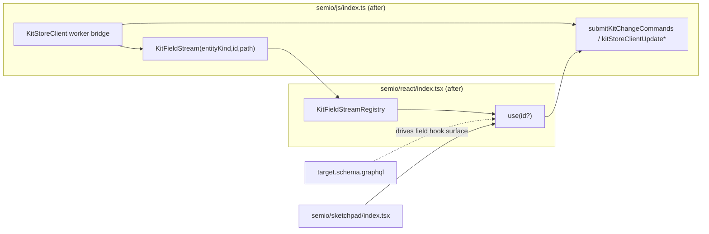

## 1. Direction

The only authority for kit data becomes a per-`(entityKind, id, fieldPath)` GraphQL field stream over the `KitStoreClient` worker. There is no `Kit`, `Design`, `Type`, `Piece`, `Connection`, `Author`, `Quality` (etc.) DTO graph in the JS client, no `KitHostStoreSnapshot`, no list/triad/aggregate hook, and no general selector. Every reachable field path in [semio/graphql/target.schema.graphql](semio/graphql/target.schema.graphql) becomes one hook. Mutations keep going through the existing `submitKitChangeCommands` / `writeKitStoreClientSchemaField` write path.




## 2. New JS primitive (replaces snapshots)

In [semio/js/index.ts](semio/js/index.ts) introduce one read primitive (regions `🔖KitFieldStream` / `🔖KitFieldRegistry`):

```ts
export type KitFieldKey = { entityKind: string; id: string; path: readonly string[] };
export type KitFieldSnap<T = unknown> = { value: T | undefined; pending: number; error?: SetError };
export interface KitFieldStream<T = unknown> {
  getSnapshot(): KitFieldSnap<T>;
  subscribe(onChange: () => void): () => void;
}
export function getKitFieldStream<T>(client: KitStoreClient, key: KitFieldKey): KitFieldStream<T>;
```

`getKitFieldStream` opens (or reuses) a GraphQL subscription (or polling read) keyed exactly by `(entityKind, id, path)`. No client-side materialization of parent objects; parents are decomposed into independent leaf streams. Connection-typed fields stream a `readonly string[]` of edge node ids.

## 3. Deletions in `semio/js/index.ts`

Delete entirely (with their schemas, ID dtos, diff dtos, and helpers):

- Entity classes / DTO graphs: `Kit`, `Design`, `Type`, `Piece`, `Connection`, `Author`, `Quality`, `Tag`, `Concept`, `Family`, `File`, `Folder`, `Layer`, `Group`, `Stat`, `Prop`, `Attribute`, `Representation`, `Connector`, `Plane`, `Coordinate`, `Point`, `Vector`, `Camera`, `Side`, `Benchmark`, plus their `*Schema`, `*Dto`, `*ShallowSchema`, `*MetadataDtoSchema`, `*DiffSchema`, `KitFullDto`, `asKitInstance`, `Kit.fromDto/toDto/findDesign/findType/findChildrenPiecesInDesign/flattenDesignCachedOp/...`, `Design.applyDiff/previewWithDiff/dragBySelection/...`, `Type.pickBestRepresentation`.
- Snapshot/host stores: `KitHostStore`, `KitHostStoreSnapshot`, `KitStoreSnapshot`, `KitSyncSnapshot`, `DEFAULT_KIT_SYNC`, `InMemoryKitStore`, `createSessionKitStore`, `createJsonFileKitStore`, `createFolderKitStore`, `applyKitClientSnapshotToLocalStore`, `KitBundlePersistingStore`, `KIT_BUNDLE_BOOTSTRAPPED`, every `*.getSnapshot(): { kit, sync }` path.
- Aggregate read stores: `SemioKitLiveReadStore` (the bulk `getSnapshot(key)` entrypoint stays only as the per-leaf field stream — keep its subscription transport, drop its `Kit`/`Design`-graph reads), `KitDesignReadStore`, `KitShallowListStore`, `KitViewCatalogStore`, plus their `getSnapshot` methods.
- Bulk/aggregate read commands in `ReadKitCommand` / `ReadDesignCommand` / `ReadPieceCommand` / `ReadTypeCommand` that materialize whole entities (e.g. `readDesignPiecesFullCommand`, `readDesignConnectionsFullCommand`, `readDesignIncludedDesignsCommand`, `readTypeBestRepresentationCommand`); keep only field-leaf reads expressible as `(entityKind, id, path)`.

Keep: `KitStoreClient`, GraphQL transport, write helpers (`submitKitChangeCommands`, `kitStoreClientAddPiece/Connection/...`, `kitStoreClientUpdate*`, `kitStoreClientRemove*`, `writeKitStoreClientSchemaField`, `buildSchemaEntityChangeCommands`), `KitChangeKind`, `KitEvent`, `SetError`, `SetResult`, `WriteStatus`, `BackboneConfig`, `KitConflict`, `KitCommandLifecycleEvent`, the worker plumbing.

## 4. Deletions in `semio/react/index.tsx`

Delete every export that is not a single-field schema hook. Concretely, remove:

- Entity-identity selectors named by the user: `useKit`, `useDesign`, `useType`, `usePiece`, `useConnection`, `useAuthor`, `useQuality` (and aliases `useAuthorById`, `useQualityById`, `useTypeById`, `useConnectionById`, `usePieceById`, `useDesignById`).
- Whole-object triads: `usePieceTriad`, `useDesignTriad`, `useTypeTriad`, `useAuthorTriad`, `useQualityTriad`, `useConnectionTriad`, `useFolder`, `useFile`, `useTag`, `useConcept`, `useFamily`, `useGroup`, `usePort`, `useProp`, `useStat`, `useBenchmark`, `useCoordinate`, `usePoint`, `useVector`, `usePlane`, `useCamera`, `useAttribute`, `useLocation`, `useRepresentation`, `useConnector`, plus every `*Input` and `*PatchInput` whole-object hook (only their leaf field hooks remain).
- Snapshots: `useKitSnapshot`, `useKitStoreSnapshot`, `useKitHostStore`, `useKitStore`, `useSemioStoreSelector`, `useSemioReadSnap`.
- Bulk / list / aggregate / metadata / shallow: `useTypes`, `useDesigns`, `usePieces`, `useConnections`, `useAuthors`, `useTypesIds`, `useDesignsIds`, `useTypesMetadata`, `useDesignsMetadata`, `useTypesFull`, `useDesignsFull`, `useFilesFull`, `useTagsFull`, `useKitDesignsShallow`, `useKitTypesShallow`, `useKitAuthorsShallow`, `useKitPieces`, `useKitConnections`, `usePiecesMetadataMap`, `usePieceMetadata`, `useIncludedDesigns`, `useDesignClusterableGroups`, `useDesignQualitySum`, `useTypeBestRepresentation`, `useKitColoredConnectors`, `useReplacableTypes`, `useReplacableDesigns`, `useExplodeableDesignNodes`, `useOpenKitGuids`, `useActiveKitGuid`, `useOpenKitShallows`, `useRegistryHasKit`, `useRegistryKitPersistenceKind`, `useKitAlternatives`, `useKitAlternativeSelection`.
- Generic schema readers: `useSchemaObjectState`, `useSchemaObjectMutation`, `useSchemaObjectValue`, `useSchemaFieldValue` (replaced by `useKitFieldValue` field-stream-bound primitive used internally by every generated hook), the `IndexedSchemaState` / `resolveReference` / `readSchemaFieldValue` machinery, and `KitRuntimeContextValue.{snapshot,state}`.
- Whole-snapshot file/binary helpers: `useKitFileBlobUrl`, `useKitStoredFileUrls`, `useFileUrls`, `useKitFileState`, `useKitPersistenceKind`, `useKitPersistenceSource`, `useKitBinary`, `useEmbedKitFile`, `useKitFileUrl` (re-add as thin wrappers later if needed, but only over specific File field hooks like `useFileBlob`).

Keep & realign: `KitScope`, `DesignScope`, `TypeScope`, `AuthorScope`, `QualityScope`, `PieceScope`, `ConnectionScope`, `useKitScope`, `useDesignScope`, `useTypeScope`, `useAuthorScope`, `useQualityScope`, `usePieceScope`, `useConnectionScope`, `useIs*Scope`, `useResolvedKitIdentifier`, all command hooks (`useUndo`, `useRedo`, `useDeletePiece`, `useUpdatePiece`, `useUpdateConnection`, `useCreate*`, `useDelete*`, `useUpdate*`, `useFlattenDesign`, `useExpandDesign`, `useChangePieceType`, etc.), backbone hooks (`useBackboneStatus`, `useAttachBackbone`, `useDetachBackbone`, `useListConflicts`, `useResolveConflict`, `useSyncNow`), `useWriteIndicator`, `useWriteQueue`, `useSchemaEvents`, `useSetErrors`. Each command hook reads its inputs only via field hooks.

## 5. Field-hook surface (schema-driven)

In [semio/react/index.tsx](semio/react/index.tsx) emit exactly one exported hook per reachable field path in [semio/graphql/target.schema.graphql](semio/graphql/target.schema.graphql), wrapping a single `KitFieldStream`. Path flattening rules:

- `Piece.name` → `usePieceName(pieceId?)` → `string | undefined`.
- `Piece.position.plane` → `usePiecePlane(pieceId?)` (existing name; from `Position.plane`).
- `Piece.position.center` → `usePieceCenter(pieceId?)`.
- `Piece.flatPosition.plane` → `usePieceFlatPlane(pieceId?)`.
- `Piece.flatPosition.center` → `usePieceFlatCenter(pieceId?)`.
- Connection-typed fields (`Design.pieces: PieceConnection!`) → `useDesignPieceIds(designId?)` returning `readonly string[]` of edge node ids; never the full Piece graph.
- FK-typed fields (`Piece.parentPiece: Piece`) → `usePieceParentPieceId(pieceId?)` returning `string | undefined`.
- `Position`, `Plane`, `Coordinate`, `Point`, `Vector`, `Side` are flattened until a scalar is reached; no compound-object hook is exported (e.g. `usePiecePlaneOrigin`, `usePiecePlaneOriginX`, `usePiecePlaneXAxis`, `usePiecePlaneXAxisX`).

Each hook signature is `function use<Entity><FieldPath>(idValue?: string): KitFieldBinding<T>` reading id from the matching scope context when `idValue` is omitted. Implementation:

```ts
function makeFieldHook<T>(entityKind: string, path: readonly string[]) {
  return function useField(idValue?: string): KitFieldBinding<T> {
    const id = useResolvedScopeId(entityKind, idValue);
    const client = useKitStoreClient();
    const stream = React.useMemo(() => (client && id ? getKitFieldStream<T>(client, { entityKind, id, path }) : null), [client, id]);
    const snap = useSemioFieldSnap(stream);
    const [run, status] = useKitFieldMutation<T>(entityKind, path, id);
    return [snap.value, run, status] as const;
  };
}
```

## 6. Sketchpad migration ([semio/sketchpad/index.tsx](semio/sketchpad/index.tsx))

Rewrite all 64 sites that use `useKit/useDesign/useType/usePiece/useConnection/useAuthor/useQuality`. Per call site, identify the fields actually consumed downstream and replace with explicit per-field hooks:

- `const piece = usePiece() as Piece` → `const id = usePieceScope()?.id; const [name] = usePieceName(id); const [plane] = usePiecePlane(id); …` reading only what that JSX actually uses.
- `const type = useType(undefined, undefined, true) as Type` → `useTypeName(typeId)`, `useTypeRepresentationIds(typeId)` + per-representation field hooks, `useTypeConnectorIds(typeId)` + per-connector hooks, etc.
- `const connection = useConnection() as Connection` → `useConnectionConnectedPieceId(id)`, `useConnectionConnectingPieceId(id)`, `useConnectionGap(id)`, etc.
- `const design = useDesign() as Design` → `useDesignName(designId)`, `useDesignPieceIds(designId)`, then iterate ids and render child components reading per-piece fields.

Resulting components fan out into per-id child components (`<PieceFields pieceId=... />`) so reactivity is field-scoped.

## 7. Validation

- `npm run depcruise:layers` — confirm no rebuilt graph crosses layer boundaries.
- `npm run typecheck` for `semio/js`, `semio/react`, `semio/sketchpad` (see each `tsconfig.json`).
- Run inline vitest blocks (the test cases currently embedded in [semio/js/index.ts](semio/js/index.ts)). Every test that asserts `store.getSnapshot().kit.id` must be rewritten to assert through `getKitFieldStream(client, { entityKind: "Kit", id, path: ["id"] })`.
- Add per-field hook tests directly in `semio/react/index.tsx` (`if (import.meta.vitest)`) covering `usePieceName`, `usePiecePlane`, `usePieceFlatCenter`, `usePieceFlatPlane`, plus list-id hooks and FK hooks.
- Manual: launch sketchpad, open a kit, drag a piece, confirm only the affected piece's field hooks rerender (`[DEBUG]` console traces).

## 8. Ticket + execution

- Reopen / open one ticket (slug `field-only-kit-reads-refactor`) under the existing kit-data SSOT goal; keep all temporary scripts in the ticket folder.
- Delegate three parallel hour-scale subagents:
  - **A**: rewrite [semio/js/index.ts](semio/js/index.ts) — introduce `KitFieldStream`/registry, delete entity classes, delete host-store family, delete aggregate read stores, keep writes + worker + transport.
  - **B**: rewrite [semio/react/index.tsx](semio/react/index.tsx) — generate the field-hook surface from [semio/graphql/target.schema.graphql](semio/graphql/target.schema.graphql), delete every banned hook, rewire mutations on top of `KitFieldStream`.
  - **C**: rewrite [semio/sketchpad/index.tsx](semio/sketchpad/index.tsx) — replace all 64 banned-hook usages with per-field compositions.
- Coordinator (this agent) integrates, runs typecheck/depcruise/tests, fixes fallout, closes the ticket with a summary.

