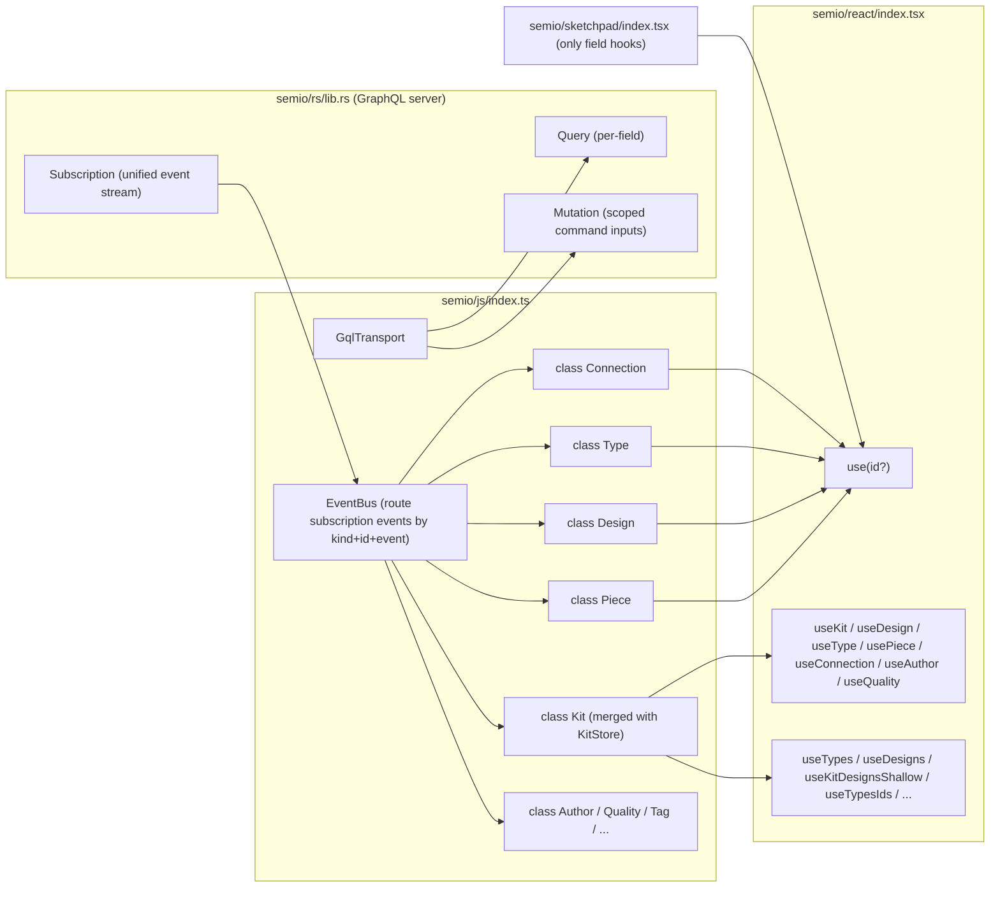

## 1. Direction

[semio/js/index.ts](semio/js/index.ts) is collapsed to a single layer of CQRS entity classes that talk only GraphQL to [semio/rs/lib.rs](semio/rs/lib.rs). `Kit` and the legacy `KitStore` merge into one `Kit` class. Every entity (`Kit`, `Design`, `Type`, `Piece`, `Connection`, `Author`, `Quality`, `Tag`, `Concept`, `Family`, `File`, `Folder`, `Layer`, `Group`, `Stat`, `Prop`, `Attribute`, `Representation`, `Connector`, `Port`, `Plane`, `Coordinate`, `Point`, `Vector`, `Camera`, `Side`, `Benchmark`, `Position`, `Place`, `Location`) follows the same CQRS pattern over the schema in [semio/graphql/target.schema.graphql](semio/graphql/target.schema.graphql).



## 2. Stateless GraphQL client on every entity class

Every entity class is a thin, stateless wrapper around the GraphQL surface in [semio/graphql/target.schema.graphql](semio/graphql/target.schema.graphql). There is **no in-class cache, no optimistic apply, no reconciliation** anywhere in [semio/js/index.ts](semio/js/index.ts) — [semio/rs/lib.rs](semio/rs/lib.rs) is in-memory and authoritative for every read.

Each class has three things:

1. **Reads** — two methods per field from the schema's data/computed fields:
   - `field(): Promise<T>` — one-off GraphQL `Query` against [semio/rs/lib.rs](semio/rs/lib.rs). Always hits the server. There is no synchronous companion (`fieldSync` is gone) because there is nothing to read from synchronously.
   - `on<Event>(cb: (next: T) => void): Unsubscribe` — subscribe to the routed event channel. The `next` argument is delivered by the unified `subscription { event }` stream — either taken directly from the server's event payload when the schema embeds the new value, or fetched once by the JS class via the same `field()` query and broadcast to all listeners. Either way the class never *stores* `next`; it just relays it. Event names follow the schema's Edit/Modification union (`onRenamed`, `onDescriptionChanged`, `onMoved`, `onDragged`, `onFixed`, `onFlattened`, `onPlaneChanged`, `onCenterChanged`, `onAttributeAdded`, `onAttributeRemoved`, `onPieceAdded`, `onPieceDeleted`, `onConnectionAdded`, `onConnectionDeleted`, `onPortCreated`, `onPortDeleted`, `onConnectorAdded`, `onConnectorRemoved`, `onTagCreated`, `onTagDeleted`, `onConceptCreated`, `onConceptDeleted`, `onQualityCreated`, `onQualityDeleted`, `onTypeCreated`, `onTypeDeleted`, `onDesignCreated`, `onDesignDeleted`, `onCheckpointCreated`, …).

2. **Operations** — exactly **one** method per leaf command in the matching `*OperationInput` from §`#region Commands`. Method signatures mirror the schema (same names, same args, same nullability) and return `Promise<SetResult>`:
   - `operation(...args): Promise<SetResult>` — single async path. Builds a `mutation { session { ... } }`, dispatches it through `GqlTransport` against [semio/rs/lib.rs](semio/rs/lib.rs), and resolves with the server's response. **Nothing** is mutated locally — the JS class does not touch any cache, does not pre-fire `on<Event>` callbacks, does not reconcile anything. UI updates flow exclusively from the subscription event(s) that the server emits in response to the mutation.
   - `SetResult` is `{ ok: true; id: ID }` on success, or `{ ok: false; error: SetError }` on rejection. `SetError` is the discriminated union enumerated in [target.schema.graphql](semio/graphql/target.schema.graphql) (e.g. `Readonly`, `TooLong`, `Validation`, `Conflict`, `Rejected`). Network timeouts surface as `{ kind: "Timeout"; message }` from the transport.
   - Callers that want fire-and-forget simply drop the `Promise` (the React op hook tracks status independently — see §4).

3. **Navigation methods** — for command-input fields that nest into another scoped command input, the class returns the matching child class instance. E.g. `design.piece(id) → Piece`, `design.pieces(ids) → PiecesOperations`, `kit.type(id) → Type`, `type.port(id) → Port`, `type.connector(id) → Connector`, etc. Because these wrappers are stateless, memoizing them by id is purely an ergonomic identity helper (so `design.piece("p1") === design.piece("p1")`); it is not value caching.

### Generic mechanisms (JS side)

Every entity class is built from the same internal `Entity` base + a tiny set of factory helpers, so per-field / per-operation declarations are one-liners. The factories are private to [semio/js/index.ts](semio/js/index.ts); only the resulting classes are exported.

```ts
// internal — shared by every entity class. Stateless; carries no value cache.
abstract class Entity {
 constructor(
  protected readonly transport: GqlTransport,
  protected readonly bus: EventBus,
  protected readonly kit: Kit, // owning Kit; routes commands through session/version/change scope
  public readonly id: string,
 ) {}

 /** One-off GraphQL Query for `key`. Always hits semio/rs/lib.rs; never reads from a local store. */
 protected fieldQuery<T>(key: string, selector: (data: any) => T, doc: GqlDoc): Promise<T>;

 /**
  * Subscribe to the named subscription event channel for (entity-kind, this.id, eventName).
  * `cb` receives the new value sourced from the server's event payload (or, when the schema
  * doesn't embed it, from a single shared refetch the EventBus performs once per event and
  * broadcasts to all listeners). Nothing is cached.
  */
 protected subscribeField<T>(eventName: string, cb: (next: T) => void): Unsubscribe;

 /**
  * Single async dispatch path. Builds and sends one `mutation { session { ... } }` to
  * semio/rs/lib.rs and resolves with the server's SetResult. Does not touch any local state,
  * does not pre-fire on<Event> callbacks, does not reconcile anything. UI updates come from
  * the subscription event(s) the server emits in response.
  */
 protected dispatch(operation: GqlOpInput): Promise<SetResult>;
}

// internal helpers attached at class-definition time. Each returns a small object describing the
// field/operation so defineFields/defineOperations can install named methods on the prototype.
const defineField = <T>(spec: {
 key: string;
 query: GqlDoc;
 pickQuery: (data: any) => T;
 event: string;
}) => spec;

const defineOperation = <Args extends any[]>(spec: {
 name: string; // matches the *OperationInput leaf name
 buildInput: (...args: Args) => GqlOpInput;
}) => spec;
```

Class definitions then read like a schema bundle, one line per leaf. Example for `Piece`:

```ts
export class Piece extends Entity {
 // Reads — defineFields installs name(): Promise<string> + onRenamed(cb): Unsubscribe, and so on per field.
 static fields = [
  defineField({ key: "name", query: PIECE_NAME_QUERY, pickQuery: (d) => d.node.name, event: "Renamed" }),
  defineField({ key: "description", query: PIECE_DESCRIPTION_QUERY, pickQuery: (d) => d.node.description, event: "DescriptionChanged" }),
  defineField({ key: "position", query: PIECE_POSITION_QUERY, pickQuery: (d) => d.node.position, event: "PositionChanged" }),
  defineField({ key: "plane", query: PIECE_PLANE_QUERY, pickQuery: (d) => d.node.plane, event: "PlaneChanged" }),
  defineField({ key: "center", query: PIECE_CENTER_QUERY, pickQuery: (d) => d.node.center, event: "CenterChanged" }),
  defineField({ key: "scale", query: PIECE_SCALE_QUERY, pickQuery: (d) => d.node.scale, event: "ScaleChanged" }),
  defineField({ key: "blueprint", query: PIECE_BLUEPRINT_QUERY, pickQuery: (d) => d.node.blueprint, event: "BlueprintChanged" }),
  defineField({ key: "flatPosition", query: PIECE_FLAT_POSITION_QUERY, pickQuery: (d) => d.node.flatPosition, event: "FlatPositionChanged" }),
  defineField({ key: "flatPlane", query: PIECE_FLAT_PLANE_QUERY, pickQuery: (d) => d.node.flatPlane, event: "FlatPlaneChanged" }),
  defineField({ key: "flatCenter", query: PIECE_FLAT_CENTER_QUERY, pickQuery: (d) => d.node.flatCenter, event: "FlatCenterChanged" }),
  defineField({ key: "parentPiece", query: PIECE_PARENT_PIECE_QUERY, pickQuery: (d) => d.node.parentPiece, event: "ParentPieceChanged" }),
  defineField({ key: "parentConnection", query: PIECE_PARENT_CONN_QUERY, pickQuery: (d) => d.node.parentConnection, event: "ParentConnectionChanged" }),
  defineField({ key: "childPieces", query: PIECE_CHILD_PIECES_QUERY, pickQuery: (d) => d.node.childPieces, event: "ChildPiecesChanged" }),
  defineField({ key: "childConnections", query: PIECE_CHILD_CONN_QUERY, pickQuery: (d) => d.node.childConnections, event: "ChildConnectionsChanged" }),
  defineField({ key: "depth", query: PIECE_DEPTH_QUERY, pickQuery: (d) => d.node.depth, event: "DepthChanged" }),
  defineField({ key: "connectionKind", query: PIECE_CONN_KIND_QUERY, pickQuery: (d) => d.node.connectionKind, event: "ConnectionKindChanged" }),
  defineField({ key: "attributes", query: PIECE_ATTRIBUTES_QUERY, pickQuery: (d) => d.node.attributes, event: "AttributesChanged" }),
 ];

 // Operations — defineOperations installs exactly one async method per leaf. No applyToCache:
 // there is no cache. Each method just builds the GraphQL input and awaits the server.
 static operations = [
  defineOperation({ name: "rename",            buildInput: (newName: string)               => ({ rename:            { newName } }) }),
  defineOperation({ name: "changeDescription", buildInput: (newDescription: string)        => ({ changeDescription: { newDescription } }) }),
  defineOperation({ name: "drag",              buildInput: (offset: OffsetInput)            => ({ drag:              { offset } }) }),
  defineOperation({ name: "move",              buildInput: (position: PositionInput)        => ({ move:              { position } }) }),
  defineOperation({ name: "fix",               buildInput: ()                               => ({ fix: true }) }),
  defineOperation({ name: "changeBlueprint",   buildInput: (blueprintId: string)            => ({ changeBlueprint:   { blueprintId } }) }),
  defineOperation({ name: "addAttribute",      buildInput: (key: string, value: string, definition: string) => ({ addAttribute:    { key, value, definition } }) }),
  defineOperation({ name: "removeAttribute",   buildInput: (id: string)                     => ({ removeAttribute:   { id } }) }),
  defineOperation({ name: "removeAttributes",  buildInput: (ids: readonly string[])         => ({ removeAttributes:  { ids } }) }),
 ];
}

// One call per class wires every defined field/operation into prototype methods named exactly as in the schema.
defineFields(Piece, Piece.fields);
defineOperations(Piece, Piece.operations);
```

`defineFields(C, specs)` installs **two** methods per spec on `C.prototype`: `<key>(): Promise<T>` (calls `Entity.fieldQuery` — one GraphQL `Query` per call) and `on<Event>(cb): Unsubscribe` (calls `Entity.subscribeField` — relays subscription events from the unified stream). `defineOperations(C, specs)` installs **exactly one** method per spec: `<name>(...args): Promise<SetResult>` (calls `Entity.dispatch` — one GraphQL `Mutation` per call, awaits the server's reply, never touches local state). There is no `<key>Sync` field method, no `<name>Sync` op method, no `applyToCache`, no reconciliation. Same recipe for `Kit`, `Design`, `Type`, `Port`, `Connector`, `Connection`, `Author`, `Quality`, `Tag`, `Concept`, etc. — each class is mostly two static arrays plus optional navigation methods.

The full operation surface per class (mirrors [semio/graphql/target.schema.graphql](semio/graphql/target.schema.graphql) exactly):

- **`Kit`** (merged with `KitStore`; mirrors `KitOperationInput`): owns `GqlTransport` + `EventBus`. Operations: `rename(newName)`, `changeDescription(newDescription)`, `createTag(name, description?, icon?, order?)`, `tag(id) → Tag`, `deleteTag(id)`, `deleteTags(ids)`, `createConcept(name, description?, icon?, order?)`, `concept(id) → Concept`, `deleteConcept(id)`, `deleteConcepts(ids)`, `createQuality(key, value?, unit?, definition?, description?, icon?)`, `quality(id) → Quality`, `deleteQuality(id)`, `deleteQualities(ids)`, `createType(name, description?, icon?, image?, unit?)`, `type(id) → Type`, `deleteType(id)`, `deleteTypes(ids)`. Plus version/session control: `startNewChange()`, `save()`, `createCheckpoint(message)`, `unsavedChange(id) → Kit` scope helper, `startAlternative(name?)`, `alternative(id)`, `integrateAlternative(id)`, `start()`, `end()`, `login(username, passwordHash, hubUrl?)`, `logout()`, `hydrateBundleJson(json)`.
- **`Design`** (mirrors `DesignOperationInput`): `rename(newName)`, `changeDescription(newDescription)`, `flatten()`, `addAttribute`, `removeAttribute(id)`, `removeAttributes(ids)`, `addFixedPiece(blueprintId, position, name?, description?)`, `addChildPieceWithParentConnection(blueprintId, parentPieceId, parentConnector, childConnector, name?, description?, position?, scale?)`, `addHangingChildPieceWithParentConnection(blueprintId, parentPieceId, parentConnector, childConnector, position, name?, description?, scale?)`, `piece(id) → Piece`, `pieces(ids) → PiecesOperations`, `deletePiece(id)`, `deletePieces(ids)`, `deletePiecesAndConnections(pieceIds, connectionIds)`.
- **`PiecesOperations`** (small helper returned by `design.pieces(ids)`; mirrors `PiecesOperationInput`): `drag(offset)`, `move(offset)`, `fix()`, `changeBlueprint(blueprintId)`. Has no reads — it's a pure command scope.
- **`Type`** (mirrors `TypeOperationInput`): `rename(newName)`, `changeDescription(newDescription)`, `changeIcon(newIcon)`, attributes operations, `createPort(code?, label?, description?, icon?, order?)`, `port(id) → Port`, `deletePort(id)`, `deletePorts(ids)`, `addConnector(code, description?, icon?, portId?)`, `connector(id) → Connector`, `removeConnector(id)`, `removeConnectors(ids)`.
- **`Port`** (mirrors `PortOperationInput`): `rename(newCode, newLabel?)`, `changeDescription(newDescription)`, `changeIcon(newIcon)`, attributes operations.
- **`Connector`** (mirrors `ConnectorOperationInput`): `rename(newCode)`, `changeDescription(newDescription)`, `changeIcon(newIcon)`.
- **`Tag`** / **`Concept`** (mirror `TagOperationInput` / `ConceptOperationInput`): `rename(newName)`, `changeDescription(newDescription)`, `changeIcon(newIcon)`, attributes operations.
- **`Quality`** (mirrors `QualityOperationInput`): `rename(newKey)`, `changeDescription(newDescription)`, `changeIcon(newIcon)`, attributes operations.
- **`Piece`** (mirrors `PieceOperationInput`): see snippet above.
- **`Connection`**, **`Author`**: both implement `Artifact` (bulky) so they are classes with the full read API (one `field()` + `on<Event>(cb)` pair per schema field). The schema currently does not declare a dedicated `*OperationInput` for either, so the class only carries reads; their commands (e.g. add/remove connection, addAuthor) live on the parent `Design` / `Kit` per the schema. If the schema later grows `ConnectionOperationInput` / `AuthorOperationInput`, the matching methods are added then.

`Plane`, `Coordinate`, `Position`, `Point`, `Vector`, `Side`, `Attribute` (every `WeakEntity` per [target.schema.graphql](semio/graphql/target.schema.graphql) lines 51–67) are **not classes**. They are plain TypeScript record types that mirror the schema 1:1 (e.g. `interface Plane { origin: Point; xAxis: Vector; yAxis: Vector }`). They are returned by-value from owner methods (`piece.plane(): Promise<Plane>`, `piece.flatPlane(): Promise<Plane>`, `connection.side(): Promise<Side>`, `piece.attributes(): Promise<readonly Attribute[]>`, …). Each call hits the server fresh; no in-class cache holds them. There is no `class Plane`, no `class Coordinate`, no `class Attribute`. There are no `*Scope` / `*Context` providers, no entity-identity hooks, and no `field()` / `on<Event>` API anchored to a weak-entity id — those values appear *only* as field results inside their owning Artifact class.

Every command method translates to one `mutation { session { ... } }` GraphQL request. The session/version/change scoping (`session.theKit.unsavedChange(activeChangeId).kit.<…>`, or `session.alternative(…)`, or `session.theKit.…` for save / checkpoint flows) is encapsulated by `Kit`; child classes hold a reference to their owning `Kit` and route their own command through it.

The transport speaks only GraphQL:

- Reads: a single `GqlTransport.query(doc, vars)` per `field()` call (typed `Query` selection with the right `node(id)` lookup). No memoization, no deduplication of in-flight requests across components — the in-memory Rust server is fast enough that the JS layer never needs to be clever.
- Subscriptions: one persistent `subscription { event }` per `Kit` instance; the `EventBus` deserializes each event, looks up its kind + entity id + field affinity, and pushes typed values into all registered `on<Event>` callbacks. The `next` value carried into the callback comes either from the server's event payload directly, or — when the schema doesn't embed it — from one shared refetch the EventBus performs per event. The bus broadcasts that fetch result; it does not store it.
- Commands: a single async path per leaf in `*OperationInput`. `operation(...)` builds the GraphQL input and calls `GqlTransport.mutate(doc, vars)`. The returned `Promise<SetResult>` resolves with the server's response (`{ ok: true; id }` or `{ ok: false; error }`). The JS class does not read or write any local state — UI updates flow exclusively from the subscription event(s) the server emits in response. Transport-level timeouts are surfaced as `{ ok: false; error: { kind: "Timeout", … } }`; transport disconnects surface through `Kit.errors` (consumed by `useKitErrors`).

## 3. Public exports of `semio/js/index.ts`

Keep only:

- The entity classes: `Kit` (merged with `KitStore`), `Design`, `Type`, `Piece`, `Connection`, `Author`, `Quality`, `Tag`, `Concept`, `Family`, `File`, `Folder`, `Layer`, `Group`, `Stat`, `Prop`, `Attribute`, `Representation`, `Connector`, `Port`, `Plane`, `Coordinate`, `Point`, `Vector`, `Camera`, `Side`, `Benchmark`, `Position`, `Place`, `Location`.
- The minimal types those classes need in their public method signatures, mirrored from [semio/graphql/target.schema.graphql](semio/graphql/target.schema.graphql) input objects: `OffsetInput`, `PositionInput`, `PlaneInput`, `CoordinateInput`, `PointInput`, `VectorInput`, `LocationInput`, `BackboneConfig`, `ConflictResolution`, `SetResult`, `SetError`, `Unsubscribe`, plus the GraphQL-derived event union types if a method signature references them.
- One factory: `openKit(config: { rsUrl?: string; backbone?: BackboneConfig; ... }): Promise<Kit>`. No `createKitStoreClient`, no `createSessionKitStore`, no `applyKitClientSnapshotToLocalStore`.

Delete entirely (full list — these were the bulk of the current 7715-line file):

- The legacy `KitStore` class and its client family — `KitStoreClient`, `WasmKitStoreClient`, `createKitStoreClient`, `kitStoreFromKitStoreClient`, `getKitClientReadPoint`, `theKitReadPoint`, `KitReadPoint`, `kitReadPointKey`.
- All host stores: `KitHostStore`, `KitHostStoreSnapshot`, `KitStoreSnapshot`, `KitSyncSnapshot`, `DEFAULT_KIT_SYNC`, `InMemoryKitStore`, `createSessionKitStore`, `createJsonFileKitStore`, `createFolderKitStore`, `applyKitClientSnapshotToLocalStore`, `KitBundlePersistingStore`, `KIT_BUNDLE_BOOTSTRAPPED`, `KitJsonFileAdapter`, `KitFolderAdapter`, `KitBinaryStore`.
- All read commands and aggregate read stores: `ReadKitCommand`, `ReadDesignCommand`, `ReadPieceCommand`, `ReadTypeCommand`, `SemioKitLiveReadStore`, `KitDesignReadStore`, `KitShallowListStore`, `KitViewCatalogStore`, `getSemioKitLiveReadStore`, every `getSnapshot` aggregate path. Reads are exclusively through the field methods on the classes.
- Free-standing write helpers, replaced by class methods: `kitStoreClientAddPiece`, `kitStoreClientAddConnection`, `kitStoreClientAddChildByKind`, `kitStoreClientUpdatePiece`, `kitStoreClientUpdateConnection`, `kitStoreClientRemovePiece`, `kitStoreClientRemoveChildByKind`, `submitKitChangeCommands`, `buildSchemaEntityChangeCommands`, `writeKitStoreClientSchemaField`, `StoreField`, `StoreCommand`, `CommandBuilder`.
- Zod schemas, DTO types, metadata/shallow types: every `*Schema`, every `*Dto`, every `*MetadataDto`, every `*Shallow`, `KitFullDto`, `KitFullDtoSchema`, `normalizeKitFullDtoFolderPaths`, `KitJsonObjectDto`, `KitJsonTreeDto`, `JsonValue`, `JsonObject`, `parseJsonValue`, `KitGraphqlResponseEnvelope`, `ReadonlyDto`, `kitChangeSemanticKindToGraphQl`, `KitChangeKind`, `KitChangeSemanticKindGql`, `KitCommandLifecycleEvent`, `SEMIO_KIT_STORE_CONTROL_COMMAND_KINDS`, `SemioKitStoreControlCommandName`.
- Helper utilities tied to the deleted graph: `asKitInstance`, `kitEventAffectsPieceLiveRead`, `kitEventAffectsCanUndoRedo`, `kitEventAffectsDesignQualitySumRead`, `kitEventAffectsKitColoredConnectorsRead`, `kitEventAffectsReplaceableCatalogRead`, `kitEventAffectsTypeScopedRead`, `kitEventTouchesDesign`, `resolveDesignIdForPieceOrConnection`, `isKitCommandLifecycleEvent`, `isKitBundlePersistingStore`, `getStoredKitFileUrls`, `getOrCreateKitFileState`, `getKitFileProvider`, `getExistingKitFileProvider`, `getReadableKitFileUrl`, `fetchReadableKitFileBlob`, `getKitFileStoragePath`, `createKitFileObjectUrl`, `isBrowserReadableFileUrl`, `getKitPorts`, `id` (uuid helper kept only if `Kit` constructor needs it), `TOLERANCE`, `ICON_WIDTH`, `DiffStatus`, `EntityLifecycle`, `FlatMerkleCacheEntry`, `OperationResult`, `DesignOperationResult`, `DesignDiffOperationResult`, `AlgorithmError`, `PiecePlacementRowDto`.
- The `*Diff` types and the `applyDiff` machinery: `*DiffSchema`, `*Diff`, `*sDiffSchema`, `*sDiff`, `Design.applyDiff`, `Design.previewWithDiff`, `Design.dragBySelection`, `Design.deletePiecesAndConnectionsDiff`, `Type.pickBestRepresentation`, `Kit.copyDesignOp`, `Kit.pasteDesignOp`, `Kit.flattenDesignCachedOp`, `Kit.findParentPieceInDesign`, `Kit.findParentConnectionForPieceInDesign`, `Kit.findChildrenPiecesInDesign`, `Kit.findDesign`, `Kit.findType`, `Kit.piecesMetadataFor`, `Kit.fromDto`, `Kit.toDto`, `Kit.toJSON`, `Kit.deserialize`, `Kit.serialize`, `Kit.ensure`. All graph navigation moves to the GraphQL server; the JS classes hold no local cache.
- Inline subagent / view stores: `KitViewCatalogKey`, `KitDesignReadKind`, `KitShallowListKind`, `KitStoreReadSnap`, `KitAlternativeSummary` (re-derive from class subscriptions if needed in react).

The `kit-store.worker.ts` worker is rewritten to host only the GraphQL transport (`async-graphql` over WASM) and to forward `subscription { event }` payloads to the main thread; no DTO marshaling.

## 4. `semio/react/index.tsx` shape

### Schema-1:1 invariant

[semio/react/index.tsx](semio/react/index.tsx) adds **nothing** beyond [target.schema.graphql](semio/graphql/target.schema.graphql). Every exported hook corresponds to exactly one schema field (read) or one `*OperationInput` leaf (write). No sub-selection. No derivation. No aggregation. No metadata, shallow, or "view" hooks unless the schema itself exposes them as computed fields.

Per-field read hooks follow the schema's lean/bulky split (lines 51–105 of the schema):

- **Lean fields** — return type is a scalar (`String`, `Int`, `Float`, `Boolean`, `ID`, `Timestamp`, an enum, a JSON value), a `WeakEntity` (`Plane`, `Coordinate`, `Position`, `Point`, `Vector`, `Side`, `Attribute`), or a list of those. Hook returns the value verbatim (`T | undefined`).
- **Bulky fields** — return type is an `Artifact` / `StrongEntity` (`Kit`, `Design`, `Type`, `Piece`, `Connection`, `Port`, `Connector`, `Representation`, `Author`, `Quality`, `Tag`, `Concept`) or a list of those. Hook returns the matching JS class instance (or array of class instances). Class navigation through the parent class (`design.piece(id)`, `kit.type(id)`, …) provides stable per-id instance identity.
- **Never anything in between**: a hook does not slice a `Plane` into `usePiecePlaneOriginX`, does not flatten a `Position` into `usePieceCenterU`, does not project a `[Piece!]!` list into `useDesignPieceIds`. Consumers that need a sub-field destructure the lean value at the call site (`usePieceCenter()?.u`) or read the synchronous `id` getter on the class instance (`pieces?.map((p) => p.id)`).

The same rule applies to writes — every write hook is a 1:1 wrapper around one `*OperationInput` leaf. Sketchpad and any other consumer obey the same rule (see §5).

### Strict separation of reads and writes

- **Reads** are pure plain-data hooks. `use<Entity><Field>(id?)` returns just the value (`T | undefined` for lean, `Entity | null` / `readonly Entity[] | undefined` for bulky). The hook backs itself with `useState` + `useEffect`: on mount (or whenever the resolved entity changes) it calls `entity.field()` once and stores the result; on every `entity.on<Event>(cb)` callback it replaces the stored value with the new one. The hook does *not* keep an external cache, does *not* dedupe across components, does *not* try to optimize equality. The Rust server is in-memory and fast — every component pays for its own fetch and that's fine. While the first fetch is in flight the hook returns `undefined`. No tuple, no setter, no status, no `KitFieldBinding`, no `HookRead`.
- **Writes** are operation hooks. `use<Operation><Entity>(id?)` returns a stable `readonly [run, status]` tuple where `run(...args): Promise<SetResult>` is bound to that entity + operation and `status: OperationStatus<SetSuccess, Extra>` is a discriminated-union snapshot. The `general` part is shared by every op (`idle` / `pending` / `successful` / `timeout` / `failed`); each op may extend it with `Extra` kinds declared by the schema's `SetError` for that specific operation (e.g. only the rename / changeDescription / changeIcon / addAttribute / changeBlueprint family adds `tooLong`). See §"Operation hook pattern". There is no `*Sync` variant, no embedded read fallback, no optimistic apply. `run` simply awaits the GraphQL mutation; any UI update that must follow the write arrives through the subscription events the server emits. Callers compose a read hook and a write hook independently.
- The kit can only be modified through these operation hooks. Operation hooks map 1:1 to leaves of the `*OperationInput` types in [target.schema.graphql](semio/graphql/target.schema.graphql).

### Resolution rules (every hook)

- Every read / write hook accepts a single optional argument `id?: string`. When `id` is omitted the hook reads the matching context (`KitContext`, `DesignContext`, `TypeContext`, `PortContext`, `ConnectorContext`, `PieceContext`, `ConnectionContext`, `AuthorContext`, `QualityContext`, `TagContext`, `ConceptContext`, …). When `id` is provided it wins over the context.
- There are no `useResolved*` helpers. Resolution is the explicit composition `useKit()` → `kit.<child>(id)`, `useDesign()` → `design.<child>(id)`, `useType()` → `type.<child>(id)`, `useDesign().piece(id)` → `Piece`, `useDesign().connection(id)` → `Connection`, `useType().port(id)` → `Port`, `useType().connector(id)` → `Connector`, etc. Inside the per-field hook body the chain is written out.
- The entity-identity selectors return the class instance from §2, never a DTO. Their union signatures are:

  ```ts
  export function useKit(): Kit | null;
  export function useDesign(id?: string): Design | null; // useKit().design(id ?? useDesignContext()?.id)
  export function useType(id?: string): Type | null; // useKit().type(id ?? useTypeContext()?.id)
  export function usePiece(id?: string): Piece | null; // useDesign().piece(id ?? usePieceContext()?.id)
  export function useConnection(id?: string): Connection | null; // useDesign().connection(id ?? useConnectionContext()?.id)
  export function useAuthor(id?: string): Author | null; // useKit().author(id ?? useAuthorContext()?.id)
  export function useQuality(id?: string): Quality | null; // useKit().quality(id ?? useQualityContext()?.id)
  ```

  `Connection`, `Author`, `Quality` get matching navigation methods on `Design` / `Kit` (`design.connection(id)`, `kit.author(id)`, `kit.quality(id)`) so the chain composes cleanly.

### Naming

All `*Scope*` symbols are renamed to `*Context*` across the public API:

- Components: `KitScope` → `KitContext`, `DesignScope` → `DesignContext`, `TypeScope` → `TypeContext`, `PortScope` → `PortContext`, `ConnectorScope` → `ConnectorContext`, `PieceScope` → `PieceContext`, `ConnectionScope` → `ConnectionContext`, `AuthorScope` → `AuthorContext`, `QualityScope` → `QualityContext`, `TagScope` → `TagContext`, `ConceptScope` → `ConceptContext`. Each is a JSX provider component used as `<PieceContext id="p1">…</PieceContext>` (writing `<PieceContext id>` shorthand for `<PieceContext id={id}>`).
- React contexts: `PieceScopeContext` → `PieceContext` (the React.Context object), and the same for every other entity. The provider component shares the entity's context name.
- Hooks: `useKitScope` → `useKitContext`, `useDesignScope` → `useDesignContext`, `useTypeScope` → `useTypeContext`, `usePortScope` → `usePortContext`, `useConnectorScope` → `useConnectorContext`, `usePieceScope` → `usePieceContext`, `useConnectionScope` → `useConnectionContext`, `useAuthorScope` → `useAuthorContext`, `useQualityScope` → `useQualityContext`, `useTagScope` → `useTagContext`, `useConceptScope` → `useConceptContext`. The `useIs*Scope` helpers go away.
- Other "scope" symbols are renamed too: `KitWriteScope` → `KitWriteContext`, `SchemaScope` → deleted (per §"Generic schema readers"), `useResolvedKitIdentifier` keeps its name (no "scope" in it).

### Context usage

Every entity has a JSX provider component that puts an id into the matching React context. Each provider takes a single `id` prop (mirrors the existing `*Scope` shape — `KitScope` already takes `id`, the live `Kit` instance is resolved from the registry inside the provider). Hooks omit their `id` argument to bind to the context. Providers nest naturally.

```tsx
<KitContext id={kitId}>
 <DesignContext id={designId}>
  <DesignNameLabel /> {/* uses useDesignName() */}
  <DesignPieceList /> {/* uses useDesignPieceIds() then maps to <PieceContext id={...}> */}
  <DesignControls /> {/* uses useFlattenDesign() / useAddFixedPiece() */}
 </DesignContext>
</KitContext>;

function DesignNameLabel() {
 const name = useDesignName(); // omits id → reads DesignContext
 return <span>{name ?? "…"}</span>;
}

function DesignPieceList() {
 const pieceIds = useDesignPieceIds(); // omits id → reads DesignContext
 if (!pieceIds) return null;
 return (
  <>
   {pieceIds.map((id) => (
    <PieceContext id={id} key={id}>
     <PieceCard /> {/* uses usePieceName(), usePiecePlane(), etc. */}
    </PieceContext>
   ))}
  </>
 );
}

function PieceCard() {
 const name = usePieceName(); // PieceContext-bound, schema-1:1 read
 const center = usePieceFlatCenter();
 const plane = usePiecePlane();
 // Both useDragPiece and useFixPiece carry only the GENERAL union (no `tooLong`).
 const [dragPiece, dragPieceStatus] = useDragPiece();
 const [fixPiece, fixPieceStatus] = useFixPiece();
 return (
  <Card title={name} saving={dragPieceStatus.kind === "pending" || fixPieceStatus.kind === "pending"}>
   <Plane plane={plane} />
   <Coord center={center} />
   <button onClick={() => void fixPiece()}>Fix</button>
   <DragHandle onDrag={(offset) => void dragPiece(offset)} />
   {dragPieceStatus.kind === "timeout" && <Hint>Server slow, retrying…</Hint>}
   {dragPieceStatus.kind === "failed" && <Hint>{dragPieceStatus.error.message}</Hint>}
  </Card>
 );
}
```

The `id` argument always wins over the surrounding context, so a single provider tree can read sibling entities by passing ids explicitly:

```tsx
function PieceCompare({ otherId }: { otherId: string }) {
 const myCenter = usePieceFlatCenter(); // current PieceContext
 const otherCenter = usePieceFlatCenter(otherId); // explicit id
 return <Compare a={myCenter} b={otherCenter} />;
}
```

A connector editor binds inside a `Type` and a specific `Connector` and uses one of the operation hooks that _does_ exist (`ConnectorOperationInput` declares `rename` / `changeDescription` / `changeIcon`):

```tsx
<TypeContext id={typeId}>
 <ConnectorContext id={connectorId}>
  <ConnectorRow />
 </ConnectorContext>
</TypeContext>;

function ConnectorRow() {
 const code = useConnectorCode();
 const description = useConnectorDescription();
 const icon = useConnectorIcon();
 const [renameConnector, renameConnectorStatus] = useRenameConnector();
 return (
  <Row
   code={code}
   description={description}
   icon={icon}
   onRename={(next) => void renameConnector(next)}
   saving={renameConnectorStatus.kind === "pending"}
   tooLong={renameConnectorStatus.kind === "tooLong"}
   timedOut={renameConnectorStatus.kind === "timeout"}
  />
 );
}
```

`Connection`, `Author` and the value-object classes do not have a `*OperationInput` in [target.schema.graphql](semio/graphql/target.schema.graphql), so they only get read hooks — no `useSet*` / `use<Op>*` hooks for them. Mutating a connection happens through the parent `Design`'s operations (e.g. `useAddChildPieceWithParentConnection(designId)`), and connection-field reads are still per-field hooks (`useConnectionGap`, `useConnectionShift`, `useConnectionRotation`, …).

Operation hooks called outside any provider must take an explicit `id` (otherwise the returned function reports a `Readonly` error).

### Sketchpad target

Sketchpad obeys the same schema-1:1 rule: it never re-implements a `usePieceCenterU` / `usePieceIsHidden` / `useConnectionGapValue`-style hook either. Every existing `HookResult<T>` style sketchpad hook is **deleted entirely**. Slicing a lean value (e.g. picking `u` from a `Coordinate`) or picking a class `id` from a list happens *inline at the call site*, in the component body that needs it. Reads come from `@semio/react`'s schema-1:1 read hooks; writes come from `@semio/react`'s schema-1:1 op hooks.

```ts
// Before — semio/sketchpad/index.tsx around line 16888
export function usePieceCenterU(): HookResult<number> {
 const pieceScope = usePieceScope();
 const piece = usePiece() as Piece | null;
 const commands = useDesignAppCommands();
 const setter = useCallback(
  (value: number) => {
   if (pieceScope && piece)
    commands.updatePiece(
     "semio.sketchpad.app.design.panel.details.section.piece.center.u",
     pieceScope.id,
     { center: { u: value, v: piece.center?.v ?? 0 } },
    );
  },
  [pieceScope, piece, commands],
 );
 return conditionalHookResult(!!pieceScope && !!piece, piece?.center?.u ?? 0, setter);
}
```

```tsx
// After — usePieceCenterU does NOT exist anywhere. The component inlines reads and writes.
function PieceCenterUInput() {
 const center = usePieceCenter();                           // Coordinate | undefined — schema-1:1 read
 // useMovePiece carries only the GENERAL status union — `tooLong` is not in the type because the
 // schema's MovePieceInput is purely numeric. TypeScript would reject `movePieceStatus.kind === "tooLong"`.
 const [movePiece, movePieceStatus] = useMovePiece();
 const u = center?.u ?? 0;
 return (
  <NumberInput
   value={u}
   onCommit={(next) => { if (center) void movePiece({ center: { u: next, v: center.v } }); }}
   saving={movePieceStatus.kind === "pending"}
   error={
    movePieceStatus.kind === "timeout" ? "Server slow, retrying" :
    movePieceStatus.kind === "failed"  ? movePieceStatus.error.message :
    null
   }
  />
 );
}
```

The same rule deletes (in sketchpad and `@semio/react`) every other tuple/sub-selection hook and replaces it with inline destructuring + 1:1 op calls:

- `usePieceCenterV` — gone. Component inlines `usePieceCenter()?.v` for read and `const [movePiece] = useMovePiece(); … void movePiece({ center: { u, v: next } })` for write.
- sketchpad's tuple `usePieceScale` — gone. Component uses `@semio/react`'s `usePieceScale()` (returns `number | undefined`) plus `const [movePiece, movePieceStatus] = useMovePiece()` for write.
- `usePieceIsHidden` / `usePieceIsLocked` — gone. The schema does not expose `Piece.isHidden` / `Piece.isLocked` as direct fields today; until the schema grows `Piece.isHidden: Boolean!` + `PieceOperationInput.changeIsHidden` (and the matching `usePieceIsHidden` / `useChangePieceIsHidden` auto-generated 1:1 hooks appear in `@semio/react`), the component reads `usePieceAttributes()?.find((a) => a.key === "isHidden")?.value === "true"` inline and writes through `const [addPieceAttribute] = useAddPieceAttribute()` / `const [removePieceAttribute] = useRemovePieceAttribute()`.
- `useConnectionGapValue` / `useConnectionShiftValue` / `useConnectionRotationValue` / `useConnectionRiseValue` / `useConnectionTurnValue` / `useConnectionTiltValue` — gone. Component uses `useConnectionGap()`, `useConnectionShift()`, `useConnectionRotation()`, `useConnectionRise()`, `useConnectionTurn()`, `useConnectionTilt()` (each schema-1:1) for read. Writes are unavailable until `ConnectionOperationInput` is added to the schema.

List rendering follows the same rule — never ask for ids; ask for the bulky list and read `id` from the class instance:

```tsx
// Before
const ids = useDesignPieceIds(designId);                // sub-selection — gone
return ids?.map((id) => <PieceCard key={id} pieceId={id} />);

// After
const pieces = useDesignPieces(designId);               // bulky → readonly Piece[] | undefined
return pieces?.map((p) => <PieceCard key={p.id} pieceId={p.id} />);
```

Drag interaction (canvas pointer move) is already pure-write and stays a one-liner:

```tsx
// Before — snapshot-driven optimistic diff applied through commands.applyKitDiff(...)
function useDraggingPiece(id: string) {
 const piece = usePiece(undefined, id) as Piece | null;
 const commands = useDesignAppCommands();
 return useCallback(
  (offset: OffsetInput) => {
   if (!piece) return;
   commands.applyKitDiff(buildDragDiff(piece, offset));
  },
  [piece, commands],
 );
}
```

```tsx
// After — pure write, schema-1:1, single async path with status feedback. No optimistic apply.
const [dragPiece, dragPieceStatus] = useDragPiece(id);
// onPointerMove={(offset) => void dragPiece(offset)}        // dispatches one mutation, awaits server
// dragPieceStatus.kind === "pending" while the GraphQL mutation is in flight
// usePieceCenter rerenders ONLY when the server emits the `CenterChanged` subscription event
// dragPieceStatus.kind === "successful" | "tooLong" | "timeout" | "failed" once the mutation resolves
```

Pointer-move drag responsiveness comes entirely from the in-memory Rust server: `piece.drag(offset)` is a single GraphQL mutation hop, the server applies the change in-place, the subscription emits `CenterChanged`, the bound `usePieceCenter` hook receives the new value and rerenders. There is no optimistic shortcut anywhere on the JS / React / sketchpad side.

Net effect: every banned `useKit` / `useDesign` / `useType` / `usePiece` / `useConnection` / `useAuthor` / `useQuality` import disappears from sketchpad, every sub-selection / tuple sketchpad hook (`usePieceCenterU`, `usePieceCenterV`, `usePieceScale` (sketchpad version), `usePieceIsHidden`, `usePieceIsLocked`, `useConnectionGapValue`, `useConnectionShiftValue`, `useConnectionRiseValue`, `useConnectionRotationValue`, `useConnectionTurnValue`, `useConnectionTiltValue`, `useDesignPieceIds`, `useDesignConnectionIds`, …) is *deleted* (no rename, no replacement hook), every `commands.updatePiece` / `updateConnection` / `updateType` / `updateDesign` / `applyKitDiff` call becomes a `const [op, opStatus] = use<Op><Entity>(); … void op(...)` pair, and every read uses a schema-1:1 field hook from `@semio/react` plus inline destructuring at the call site. The `useDesignAppCommands` indirection itself is deleted — sketchpad calls the operation hooks directly. No optimistic-apply layer is reintroduced anywhere.

### Generic mechanisms (React side)

Every per-field and per-operation hook in [semio/react/index.tsx](semio/react/index.tsx) is produced by a tiny set of factories. The factories encapsulate context resolution, parent-class lookup, the pull-based fetch+subscribe bridge, and the readonly fallback — so the actual hook declarations are one-liners. There is no in-React cache and no `useSyncExternalStore` (there is no synchronous snapshot to grab — the source of truth lives in [semio/rs/lib.rs](semio/rs/lib.rs)).

```ts
// internal — hidden from the public API
const READONLY: SetResult = { ok: false, error: { kind: "Readonly", message: "no entity" } };

// Pure pull-based bridge. No cache. Uses useState + useEffect; never useSyncExternalStore (there
// is nothing to take a stable synchronous snapshot of — the source of truth lives in semio/rs).
function bindFieldToReact<E, T>(
 entity: E | null,
 fetch: (e: E) => Promise<T>,
 subscribe: (e: E, cb: (next: T) => void) => Unsubscribe,
): T | undefined {
 const [value, setValue] = React.useState<T | undefined>(undefined);
 React.useEffect(() => {
  if (!entity) {
   setValue(undefined);
   return;
  }
  let alive = true;
  fetch(entity).then((v) => {
   if (alive) setValue(v);
  });
  const unsubscribe = subscribe(entity, (next) => {
   if (alive) setValue(next);
  });
  return () => {
   alive = false;
   unsubscribe();
  };
 }, [entity]);
 return value;
}

// General statuses every operation hook produces.
type GeneralOperationStatus<T = SetSuccess> =
 | { readonly kind: "idle" }
 | { readonly kind: "pending"; readonly startedAt: number }
 | { readonly kind: "successful"; readonly value: T; readonly finishedAt: number }
 | { readonly kind: "timeout"; readonly startedAt: number }                    // SetError.kind === "Timeout" (transport / server gave up)
 | { readonly kind: "failed"; readonly error: SetError; readonly finishedAt: number }; // any other rejection that has no per-op extra mapping

// Extras are op-specific. The rename / changeDescription / changeIcon / addAttribute family adds tooLong.
type TooLongStatus = { readonly kind: "tooLong"; readonly error: SetError; readonly finishedAt: number };

// Per-op status type = general ∪ extras declared for that op.
type OperationStatus<T = SetSuccess, Extra extends { kind: string } = never> = GeneralOperationStatus<T> | Extra;

const IDLE: GeneralOperationStatus = { kind: "idle" };

// Optional error → extra mapper. Returns null when the SetError doesn't match any extra for this op
// (so the factory falls through to "failed"). Strongly typed so consumers see exactly which extras a hook can produce.
type OpErrorMapper<Extra extends { kind: string }> = (error: SetError, finishedAt: number) => Extra | null;

// Reusable mapper for the rename / description / icon / attribute family.
const mapTooLong: OpErrorMapper<TooLongStatus> = (error, finishedAt) =>
 error.kind === "TooLong" ? { kind: "tooLong", error, finishedAt } : null;

function bindOpToReact<E, Args extends any[], Extra extends { kind: string } = never>(
 entity: E | null,
 call: (e: E, ...args: Args) => Promise<SetResult>,
 mapError?: OpErrorMapper<Extra>,
): readonly [(...args: Args) => Promise<SetResult>, OperationStatus<SetSuccess, Extra>] {
 const [status, setStatus] = React.useState<OperationStatus<SetSuccess, Extra>>(IDLE);
 const run = React.useCallback(
  async (...args: Args): Promise<SetResult> => {
   if (!entity) return READONLY;
   const startedAt = performance.now();
   setStatus({ kind: "pending", startedAt });
   try {
    const result = await call(entity, ...args);
    const finishedAt = performance.now();
    if (result.ok) {
     setStatus({ kind: "successful", value: result, finishedAt });
    } else if (result.error.kind === "Timeout") {
     setStatus({ kind: "timeout", startedAt });
    } else {
     const extra = mapError?.(result.error, finishedAt);
     setStatus(extra ?? { kind: "failed", error: result.error, finishedAt });
    }
    return result;
   } catch (e) {
    const finishedAt = performance.now();
    const error: SetError = { kind: "Rejected", message: String(e) };
    setStatus({ kind: "failed", error, finishedAt });
    return { ok: false, error };
   }
  },
  [entity, call, mapError],
 );
 return [run, status] as const;
}

// One field-hook factory per entity. Each one knows the context chain it needs to resolve the entity:
//   Kit       — useKit()
//   Design    — useKit().design(id ?? DesignContext)
//   Type      — useKit().type(id ?? TypeContext)
//   Port      — useType().port(id ?? PortContext)
//   Connector — useType().connector(id ?? ConnectorContext)
//   Piece     — useDesign().piece(id ?? PieceContext)
//   Connection— useDesign().connection(id ?? ConnectionContext)
//   Author    — useKit().author(id ?? AuthorContext)
//   Quality   — useKit().quality(id ?? QualityContext)
//   Tag       — useKit().tag(id ?? TagContext)
//   Concept   — useKit().concept(id ?? ConceptContext)
const createPieceFieldHook = <T>(
 fetch: (p: Piece) => Promise<T>,
 subscribe: (p: Piece, cb: (next: T) => void) => Unsubscribe,
): ((id?: string) => T | undefined) =>
 function usePieceField(id?: string): T | undefined {
  const design = useDesign();
  const pieceId = id ?? React.useContext(PieceContext)?.id;
  const piece = design && pieceId ? design.piece(pieceId) : null;
  return bindFieldToReact(piece, fetch, subscribe);
 };

const createPieceOpHook = <Args extends any[], Extra extends { kind: string } = never>(
 call: (p: Piece, ...args: Args) => Promise<SetResult>,
 mapError?: OpErrorMapper<Extra>,
): ((id?: string) => readonly [(...args: Args) => Promise<SetResult>, OperationStatus<SetSuccess, Extra>]) =>
 function usePieceOp(id?: string) {
  const design = useDesign();
  const pieceId = id ?? React.useContext(PieceContext)?.id;
  const piece = design && pieceId ? design.piece(pieceId) : null;
  return bindOpToReact(piece, call, mapError);
 };

// Same shape for each entity:
// createKitFieldHook / createKitOpHook
// createDesignFieldHook / createDesignOpHook
// createTypeFieldHook / createTypeOpHook
// createPortFieldHook / createPortOpHook
// createConnectorFieldHook / createConnectorOpHook
// createPiecesOpHook                              (resolves design.pieces(ids), no field hook)
// createConnectionFieldHook                        (no operation factory — Connection has no *OperationInput)
// createAuthorFieldHook
// createQualityFieldHook / createQualityOpHook
// createTagFieldHook / createTagOpHook
// createConceptFieldHook / createConceptOpHook
```

### Read hook pattern

Every per-field read hook is a one-line application of the matching `create<Entity>FieldHook`. The factory returns `(id?: string) => T | undefined` for lean fields, and `(id?: string) => Entity | null` / `(id?: string) => readonly Entity[] | undefined` for bulky fields. There is one hook per schema field — never less, never more, never sliced.

```ts
// Lean fields → return value verbatim (string / number / WeakEntity / list of WeakEntity)
export const usePieceName        = createPieceFieldHook((p) => p.name(),        (p, cb) => p.onRenamed(cb));
export const usePieceDescription = createPieceFieldHook((p) => p.description(), (p, cb) => p.onDescriptionChanged(cb));
export const usePiecePlane       = createPieceFieldHook((p) => p.plane(),       (p, cb) => p.onPlaneChanged(cb));
export const usePieceCenter      = createPieceFieldHook((p) => p.center(),      (p, cb) => p.onCenterChanged(cb));
export const usePieceFlatPlane   = createPieceFieldHook((p) => p.flatPlane(),   (p, cb) => p.onFlatPlaneChanged(cb));
export const usePieceFlatCenter  = createPieceFieldHook((p) => p.flatCenter(),  (p, cb) => p.onFlatCenterChanged(cb));
export const usePieceScale       = createPieceFieldHook((p) => p.scale(),       (p, cb) => p.onScaleChanged(cb));
export const usePieceAttributes  = createPieceFieldHook((p) => p.attributes(),  (p, cb) => p.onAttributesChanged(cb));

// Bulky fields → return class instance(s)
export const usePieceParentPiece      = createPieceFieldHook((p) => p.parentPiece(),      (p, cb) => p.onParentPieceChanged(cb));      // Piece | null
export const usePieceParentConnection = createPieceFieldHook((p) => p.parentConnection(), (p, cb) => p.onParentConnectionChanged(cb)); // Connection | null
export const usePieceChildPieces      = createPieceFieldHook((p) => p.childPieces(),      (p, cb) => p.onChildPiecesChanged(cb));      // readonly Piece[]
export const usePieceChildConnections = createPieceFieldHook((p) => p.childConnections(), (p, cb) => p.onChildConnectionsChanged(cb)); // readonly Connection[]

export const useDesignName        = createDesignFieldHook((d) => d.name(),        (d, cb) => d.onRenamed(cb));
export const useDesignPieces      = createDesignFieldHook((d) => d.pieces(),      (d, cb) => d.onPiecesChanged(cb));      // readonly Piece[] (bulky)
export const useDesignConnections = createDesignFieldHook((d) => d.connections(), (d, cb) => d.onConnectionsChanged(cb)); // readonly Connection[]

export const useTypeName        = createTypeFieldHook((t) => t.name(),            (t, cb) => t.onRenamed(cb));
export const useTypePorts       = createTypeFieldHook((t) => t.ports(),           (t, cb) => t.onPortsChanged(cb));         // readonly Port[]
export const useTypeConnectors  = createTypeFieldHook((t) => t.connectors(),      (t, cb) => t.onConnectorsChanged(cb));    // readonly Connector[]
export const useTypeRepresentations = createTypeFieldHook((t) => t.representations(), (t, cb) => t.onRepresentationsChanged(cb));

export const useConnectionGap   = createConnectionFieldHook((c) => c.gap(),       (c, cb) => c.onGapChanged(cb));
export const useConnectionShift = createConnectionFieldHook((c) => c.shift(),     (c, cb) => c.onShiftChanged(cb));
// …one hook per schema field on every Artifact entity (Kit / Design / Type / Piece / Connection / Port / Connector / Representation / Author / Quality / Tag / Concept).
```

Forbidden examples (sub-selection / derivation):

```ts
// NO — slices a Coordinate. Caller does usePieceCenter()?.u inline.
export function usePieceCenterU(): number { return usePieceCenter()?.u ?? 0; }
// NO — projects a list. Caller does useDesignPieces()?.map((p) => p.id) inline.
export function useDesignPieceIds(): readonly string[] | undefined { … }
// NO — derives from attributes. Caller does usePieceAttributes()?.find(…) inline.
export function usePieceIsHidden(): boolean { … }
// NO — derives a sum. Caller does the math inline (or the schema adds Design.qualitySum: Float! and the hook becomes useDesignQualitySum 1:1).
export function useDesignQualitySum(): number { … }
```

Each call to `<entity>.field()` is one fresh GraphQL `Query` against [semio/rs/lib.rs](semio/rs/lib.rs); each `<entity>.on<Event>(cb)` callback fires once per matching subscription event. `bindFieldToReact` calls `field()` exactly once per `entity` change (mount or resolved-id change) and replaces the cached *React state* on each event payload — there is no JS-side cache, no equality short-circuit, and no `useSyncExternalStore`. The Rust server is in-memory and authoritative, so even a busy view re-fetching once per event is acceptable.

### Operation hook pattern

Every per-operation write hook is a one-line application of the matching `create<Entity>OpHook`. There are **no `*Sync` op hooks** and **no optimistic local apply** anywhere in `semio/js` / `semio/react` / `semio/sketchpad`. Each hook returns a stable `readonly [run, status]` tuple:

- `run(...args): Promise<SetResult>` — invokes the underlying class method (`piece.drag(offset)`, …). The class method dispatches a single GraphQL mutation against [semio/rs/lib.rs](semio/rs/lib.rs) and awaits the server's reply. The promise resolves with `{ ok: true; id }` or `{ ok: false; error }`. Any bound `usePieceCenter` / `usePiecePlane` / … rerender only when the server emits the corresponding subscription event in response to the mutation; the JS side never updates state ahead of the server.
- `status: OperationStatus<SetSuccess, Extra>` — discriminated union snapshot of the most recent invocation, kept in React state by the factory. The shape is `general ∪ per-op extras`:
  ```ts
  // GENERAL — every operation hook carries these.
  type GeneralOperationStatus<T = SetSuccess> =
    | { readonly kind: "idle" }
    | { readonly kind: "pending"; readonly startedAt: number }
    | { readonly kind: "successful"; readonly value: T; readonly finishedAt: number }
    | { readonly kind: "timeout"; readonly startedAt: number }                            // SetError.kind === "Timeout"
    | { readonly kind: "failed"; readonly error: SetError; readonly finishedAt: number }; // every rejection without a declared extra

  // EXTRAS — declared per family of operations. Ops that take a length/range-bounded string input add tooLong.
  type TooLongStatus = { readonly kind: "tooLong"; readonly error: SetError; readonly finishedAt: number };

  // The per-op status type is general ∪ that op's extras.
  type OperationStatus<T = SetSuccess, Extra extends { kind: string } = never> = GeneralOperationStatus<T> | Extra;
  ```
  - The general kinds (`idle`, `pending`, `successful`, `timeout`, `failed`) appear on **every** operation hook.
  - Extras are opt-in per operation via the factory's `mapError` argument. The schema's `SetError` discriminated union lists every possible failure kind (`Readonly`, `Timeout`, `TooLong`, `Validation`, `Conflict`, `Rejected`, …). Each operation only ever produces a *subset* of those; the per-op declaration enumerates the subset that should be exposed as a top-level `status.kind`. Anything not listed lands in `failed` with the raw `SetError` so consumers can still pattern-match on `error.kind` if needed.
  - This keeps the typing tight: `useDragPiece(id)` yields `OperationStatus<SetSuccess>` (pure general — no `tooLong` because dragging takes a numeric `offset` and the server can't reject it as "too long"), while `useRenamePiece(id)` yields `OperationStatus<SetSuccess, TooLongStatus>` (general + `tooLong` because the schema declares a max length on the new name). `dragPieceStatus.kind === "tooLong"` is a *static* type error; `renamePieceStatus.kind === "tooLong"` is valid.
  - Once a call resolves, the next call resets `status` to `pending` for the new attempt — the previous final state is replaced, not stacked.

The factory invokes `useState` once internally to track the latest status; the returned `[run, status]` tuple is stable as long as the resolved entity/id doesn't change.

```ts
// Reusable error→extra mapper for the rename / description / icon / attribute family.
const mapTooLong: OpErrorMapper<TooLongStatus> = (error, finishedAt) =>
 error.kind === "TooLong" ? { kind: "tooLong", error, finishedAt } : null;

// Hooks whose schema input has a length/range bound — pass mapTooLong so SetError.kind === "TooLong" surfaces as status.kind === "tooLong".
export const useRenameKit              = createKitOpHook    ((k, newName: string)             => k.rename(newName), mapTooLong);
export const useChangeKitDescription   = createKitOpHook    ((k, newDescription: string)      => k.changeDescription(newDescription), mapTooLong);
export const useRenamePiece            = createPieceOpHook  ((p, newName: string)             => p.rename(newName), mapTooLong);
export const useChangePieceDescription = createPieceOpHook  ((p, newDescription: string)      => p.changeDescription(newDescription), mapTooLong);
export const useChangePieceBlueprint   = createPieceOpHook  ((p, blueprintId: string)         => p.changeBlueprint(blueprintId), mapTooLong);
export const useAddPieceAttribute      = createPieceOpHook  ((p, key, value, definition)      => p.addAttribute(key, value, definition), mapTooLong);
export const useCreateType             = createKitOpHook    ((k, name: string, opts?: CreateTypeOpts) => k.createType(name, opts), mapTooLong);
export const useCreatePort             = createTypeOpHook   ((t, code: string, opts?)         => t.createPort(code, opts), mapTooLong);
export const useAddConnector           = createTypeOpHook   ((t, code: string, opts?)         => t.addConnector(code, opts), mapTooLong);
export const useRenameConnector        = createConnectorOpHook((c, newCode: string)           => c.rename(newCode), mapTooLong);
export const useChangeConnectorDescription = createConnectorOpHook((c, d: string)             => c.changeDescription(d), mapTooLong);
export const useCreateCheckpoint       = createKitOpHook    ((k, message: string)             => k.createCheckpoint(message), mapTooLong);
// …every rename / changeDescription / changeIcon / addAttribute / changeBlueprint / createX hook follows the same one-liner with mapTooLong.

// Hooks with no length/range-bounded input — only general statuses (idle | pending | successful | timeout | failed).
export const useDragPiece              = createPieceOpHook  ((p, offset: OffsetInput)         => p.drag(offset));
export const useMovePiece              = createPieceOpHook  ((p, position: PositionInput)     => p.move(position));
export const useFixPiece               = createPieceOpHook  ((p)                              => p.fix());
export const useDragPieces             = createPiecesOpHook ((ops, offset: OffsetInput)       => ops.drag(offset));
export const useDeletePiece            = createDesignOpHook ((d, pieceId: string)             => d.deletePiece(pieceId));
export const useDeletePieces           = createDesignOpHook ((d, pieceIds: readonly string[]) => d.deletePieces(pieceIds));
export const useFlattenDesign          = createDesignOpHook ((d)                              => d.flatten());
export const useStartNewChange         = createKitOpHook    ((k)                              => k.startNewChange());
export const useSaveUnsavedChange      = createKitOpHook    ((k)                              => k.save());
export const useStartAlternative       = createKitOpHook    ((k)                              => k.startAlternative());
export const useIntegrateAlternative   = createKitOpHook    ((k, altId: string)               => k.integrateAlternative(altId));
// …every other purely-numeric / no-arg / id-only op follows the same one-liner without mapError.
```

Usage at the call site is uniform — every op hook destructures into `[run, status]`:

```tsx
function PieceDragHandle({ id }: { id: string }) {
  // useDragPiece carries only the GENERAL union — no `tooLong`. TypeScript would reject `dragPieceStatus.kind === "tooLong"`.
  const [dragPiece, dragPieceStatus] = useDragPiece(id);
  return (
    <DragSurface
      onDrag={(offset) => { void dragPiece(offset); }}
      saving={dragPieceStatus.kind === "pending"}
      timedOut={dragPieceStatus.kind === "timeout"}
      failureMessage={dragPieceStatus.kind === "failed" ? dragPieceStatus.error.message : null}
    />
  );
}

function KitNameField() {
  const name = useKitName();
  // useRenameKit carries general + tooLong because the schema's RenameKitInput.newName has a max length.
  const [renameKit, renameKitStatus] = useRenameKit();
  return (
    <NameInput
      value={name ?? ""}
      onCommit={(next) => { void renameKit(next); }}
      saving={renameKitStatus.kind === "pending"}
      message={
        renameKitStatus.kind === "tooLong"
          ? "Name is too long"
          : renameKitStatus.kind === "timeout"
            ? "Server took too long, retrying"
            : renameKitStatus.kind === "failed"
              ? renameKitStatus.error.message
              : renameKitStatus.kind === "successful"
                ? "Saved"
                : null
      }
    />
  );
}
```

Because [semio/rs/lib.rs](semio/rs/lib.rs) is in-memory, the round-trip `run(...)` → server processes mutation → server emits subscription event → bound read hooks rerender takes a single GraphQL hop, which is what keeps drag/slider feedback responsive. The hook surface is async on purpose: the JS side never guesses the post-mutation state, it always waits for the server to tell it. Callers that don't care about status simply ignore the second tuple slot (`const [dragPiece] = useDragPiece(id);`).

### Operation hook surface (1:1 with [target.schema.graphql](semio/graphql/target.schema.graphql))

Every entry below is a single async hook (no `*Sync` variants). The hook signature is `(id?: string) => readonly [run: (...args) => Promise<SetResult>, status: OperationStatus<SetSuccess, Extra>]`, where `Extra` is the per-op extra status union determined by the schema's `SetError` kinds for that operation. Annotation legend:

- `(general)` — only `idle | pending | successful | timeout | failed`.
- `(+tooLong)` — extends with `tooLong` (server can reject because an input string violates a length / range constraint declared in the schema).
- Every other op-specific failure (e.g. `Conflict`, `Validation`, `Readonly`) lands in `failed` with the raw `SetError`; consumers pattern-match on `error.kind` if they want fine-grained handling.

- **`KitOperationInput`** → `useRenameKit` (+tooLong), `useChangeKitDescription` (+tooLong), `useCreateTag` (+tooLong), `useDeleteTag` (general), `useDeleteTags` (general), `useCreateConcept` (+tooLong), `useDeleteConcept` (general), `useDeleteConcepts` (general), `useCreateQuality` (+tooLong), `useDeleteQuality` (general), `useDeleteQualities` (general), `useCreateType` (+tooLong), `useDeleteType` (general), `useDeleteTypes` (general), `useCreateDesign` (+tooLong), `useDeleteDesign` (general), `useDeleteDesigns` (general).
- **`VersionCommandInput` / `UnsavedChangeCommandInput`** → `useStartNewChange` (general), `useSaveUnsavedChange` (general), `useCreateCheckpoint` (+tooLong on message), `useSaveVersion` (general).
- **`SessionCommandInput` / `AlternativeCommandInput`** → `useStartSession` (general), `useEndSession` (general), `useLogin` (+tooLong on username/passwordHash/hubUrl), `useLogout` (general), `useStartAlternative` (+tooLong on optional name), `useIntegrateAlternative` (general).
- **`Mutation` root extras** → `useHydrateKitStoreBundleJson` (general).
- **`DesignOperationInput`** → `useRenameDesign` (+tooLong), `useChangeDesignDescription` (+tooLong), `useFlattenDesign` (general), `useAddDesignAttribute` (+tooLong on key/value/definition), `useRemoveDesignAttribute` (general), `useRemoveDesignAttributes` (general), `useAddFixedPiece` (+tooLong on optional name/description), `useAddChildPieceWithParentConnection` (+tooLong on optional name/description), `useAddHangingChildPieceWithParentConnection` (+tooLong on optional name/description), `useDeletePiece` (general), `useDeletePieces` (general), `useDeletePiecesAndConnections` (general).
- **`PieceOperationInput`** → `useRenamePiece` (+tooLong), `useChangePieceDescription` (+tooLong), `useDragPiece` (general), `useMovePiece` (general), `useFixPiece` (general), `useChangePieceBlueprint` (+tooLong on blueprintId), `useAddPieceAttribute` (+tooLong on key/value/definition), `useRemovePieceAttribute` (general), `useRemovePieceAttributes` (general).
- **`PiecesOperationInput`** (batch on `design.pieces(ids)`) → `useDragPieces` (general), `useMovePieces` (general), `useFixPieces` (general), `useChangePiecesBlueprint` (+tooLong on blueprintId). Each takes `(ids: readonly string[], …args)`.
- **`TypeOperationInput`** → `useRenameType` (+tooLong), `useChangeTypeDescription` (+tooLong), `useChangeTypeIcon` (+tooLong), `useAddTypeAttribute` (+tooLong), `useRemoveTypeAttribute` (general), `useRemoveTypeAttributes` (general), `useCreatePort` (+tooLong), `useDeletePort` (general), `useDeletePorts` (general), `useAddConnector` (+tooLong), `useRemoveConnector` (general), `useRemoveConnectors` (general).
- **`PortOperationInput`** → `useRenamePort` (+tooLong), `useChangePortDescription` (+tooLong), `useChangePortIcon` (+tooLong), `useAddPortAttribute` (+tooLong), `useRemovePortAttribute` (general), `useRemovePortAttributes` (general).
- **`ConnectorOperationInput`** → `useRenameConnector` (+tooLong), `useChangeConnectorDescription` (+tooLong), `useChangeConnectorIcon` (+tooLong).
- **`TagOperationInput`** → `useRenameTag` (+tooLong), `useChangeTagDescription` (+tooLong), `useChangeTagIcon` (+tooLong), `useAddTagAttribute` (+tooLong), `useRemoveTagAttribute` (general), `useRemoveTagAttributes` (general).
- **`ConceptOperationInput`** → `useRenameConcept` (+tooLong), `useChangeConceptDescription` (+tooLong), `useChangeConceptIcon` (+tooLong), `useAddConceptAttribute` (+tooLong), `useRemoveConceptAttribute` (general), `useRemoveConceptAttributes` (general).
- **`QualityOperationInput`** → `useRenameQuality` (+tooLong), `useChangeQualityDescription` (+tooLong), `useChangeQualityIcon` (+tooLong), `useAddQualityAttribute` (+tooLong), `useRemoveQualityAttribute` (general), `useRemoveQualityAttributes` (general).

If [target.schema.graphql](semio/graphql/target.schema.graphql) later declares additional `SetError` kinds for specific operations (e.g. `OutOfRange` for numeric drag offsets, `DuplicateKey` for `useCreateTag`, …), the per-op declaration adds the matching mapper and the corresponding extra status kind appears at the top level. Until then, those rejections continue to land in `failed`.

### Kept exports

- **Entity-identity selectors** — class navigation, returning `Entity | null`. Each is the React surface for the class navigation methods on the JS classes (no schema-level derivation):
  - `useKit(): Kit | null` (resolves the active kit from the runtime),
  - `useDesign(id?: string): Design | null` (= `useKit()?.design(id ?? useDesignContext()?.id)`),
  - `useType(id?: string): Type | null`, `usePiece(id?: string): Piece | null`, `useConnection(id?: string): Connection | null`, `useAuthor(id?: string): Author | null`, `useQuality(id?: string): Quality | null`, `usePort(id?: string): Port | null`, `useConnector(id?: string): Connector | null`, `useTag(id?: string): Tag | null`, `useConcept(id?: string): Concept | null`, `useRepresentation(id?: string): Representation | null`.
- **Per-field read hooks** — one per (Artifact type) × (schema field), generated by `create<Entity>FieldHook` (see read hook pattern above). Lean fields return the value, bulky fields return the class instance(s).
- **Per-operation write hooks** — exactly one async hook per leaf of every `*OperationInput`, generated by `create<Entity>OpHook`. Each returns the `readonly [run, status]` tuple described above. No `*Sync` variants.
- **Context providers + context hooks** — one per Artifact type that takes an `id` prop: `KitContext`, `DesignContext`, `TypeContext`, `PortContext`, `ConnectorContext`, `PieceContext`, `ConnectionContext`, `AuthorContext`, `QualityContext`, `TagContext`, `ConceptContext`, `RepresentationContext`. Each pairs with a `use<Entity>Context()` accessor that returns `{ id: string } | null`. No `*Scope` / `*ScopeContext` / `*ScopeProvider` aliases.
- **Runtime / shell hooks** — minimal surface for binding the React tree to a `Kit` instance and reporting its sync/error status. These are *not* schema fields; they wrap the `Kit` class's runtime control APIs so React components can render their state. Each is 1:1 with one `Kit` runtime method (no derivation):
  - `useKitConnectionStatus(): "disconnected" | "connecting" | "ready" | "error"` (binds `kit.connectionStatusSync()` + `kit.onConnectionStatusChanged`),
  - `useKitErrors(): readonly KitError[] | undefined` (binds `kit.errorsSync()` + `kit.onErrorsChanged`),
  - `useKitSync(): KitSyncSnapshot | undefined` (binds `kit.syncSync()` + `kit.onSyncChanged`).

### Deleted exports

The following are deleted because they violate the schema-1:1 invariant or the strict read/write split:

- **Sub-selection / derived hooks**: every `useTypesIds`, `useDesignsIds`, `useKitTypeIds`, `useKitDesignIds`, `useKitAuthorIds`, `useKitQualityIds`, `useDesignPieceIds`, `useDesignConnectionIds`, `useTypePortIds`, `useTypeConnectorIds`, `useTypeRepresentationIds`, `useConnectionConnectedPieceId`, `useConnectionConnectingPieceId`, `usePieceCenterU`/`V`, `usePieceIsHidden`, `usePieceIsLocked`. Callers destructure the lean value or read the class `id` getter inline.
- **Aggregate / metadata / shallow / view hooks**: `useTypesMetadata`, `useDesignsMetadata`, `useTypesFull`, `useDesignsFull`, `useFilesFull`, `useTagsFull`, `useKitDesignsShallow`, `useKitTypesShallow`, `useKitAuthorsShallow`, `useKitPieces`, `useKitConnections`, `usePiecesMetadataMap`, `usePieceMetadata`, `useIncludedDesigns`, `useDesignClusterableGroups`, `useDesignQualitySum`, `useTypeBestRepresentation`, `useKitColoredConnectors`, `useReplacableTypes`, `useReplacableDesigns`, `useExplodeableDesignNodes`. Each is reintroduced as a 1:1 hook *only if* the corresponding field is added to [target.schema.graphql](semio/graphql/target.schema.graphql) as a computed field (e.g. `Design.qualitySum: Float!`, `Type.bestRepresentation: Representation`, `Kit.coloredConnectors: [Connector!]!`, …).
- **Registry / shell-state hooks**: `useOpenKitGuids`, `useActiveKitGuid`, `useOpenKitShallows`, `useRegistryHasKit`, `useRegistryKitPersistenceKind`, `useKitAlternatives`, `useKitAlternativeSelection`. The runtime kit registry is not in `target.schema.graphql`; consumers that need cross-kit shell state import the registry from the host application directly (sketchpad). `@semio/react` exposes only the active `Kit` (via `useKit()` / `KitContext`) and the operation hooks for `SessionCommandInput` / `AlternativeCommandInput`.
- **Backbone hooks**: same rule — only kept if `target.schema.graphql` declares the corresponding fields/operations. Otherwise dropped, and consumers call the host transport directly.
- **All `KitFieldBinding`, `HookRead`, `WriteStatus`, `WRITE_STATUS_IDLE`, `WRITE_STATUS_READONLY`, `WRITE_STATUS_PENDING`, `writeStatusEquivalent`** types and helpers.
- **Old freeform command hooks**: `useUndo`, `useRedo`, `useDeselectAll`, `useDeleteSelected`, `usePasteDesignSelection`, `useChange`, `useCommandBuilder`, `useWriteIndicator`, `useWriteQueue`, `useOptimistic`, `usePendingTriad`. Replaced by the schema-1:1 operation hooks (`use<Op><Entity>` returning `readonly [run, status]`, 1:1 with `*OperationInput` leaves). Sketchpad's existing pending-write indicator now reads `status.kind === "pending"` off whichever op hook is in flight (see §4 examples).
- **Old per-entity `useCreate*`/`useDelete*`/`useUpdate*`** legacy shapes (replaced by operation hooks).
- **Whole-object triads**: `usePieceTriad`, `useDesignTriad`, `useTypeTriad`, `useAuthorTriad`, `useQualityTriad`, `useConnectionTriad`.
- **Whole-object accessors**: `useFolder`, `useFile`, `useTag` (DTO), `useConcept` (DTO), `useFamily`, `useGroup`, `usePort` (DTO), `useProp`, `useStat`, `useBenchmark`, `useCoordinate`, `usePoint`, `useVector`, `usePlane`, `useCamera`, `useAttribute`, `useLocation`, `useRepresentation` (DTO), `useConnector` (DTO), `useActor`, `useUser`, `useAgent`, `useSessionActorInput`, every `*Input` and `*PatchInput` whole-object hook. (Note: there is *no* `usePort` returning a DTO; the entity-identity `usePort(id?)` returning `Port | null` does survive — same for `useConnector`, `useTag`, `useConcept`, `useRepresentation`.)
- **Snapshot exports**: `useKitSnapshot`, `useKitStoreSnapshot`, `useKitHostStore`, `useKitStore`, `useSemioStoreSelector`, `useSemioReadSnap`, `useSemioKitScopedView`. `useKitStoreClient` is removed entirely.
- **Generic schema readers**: `useSchemaObjectState`, `useSchemaObjectMutation`, `useSchemaObjectValue`, `useSchemaFieldValue`, `useSchemaFieldMutation`, `useSchemaFieldState`, `useSchemaScope`, `useKitRuntimeSafe`, `useKitRegistry`, `useKitRegistrySafe`. The `IndexedSchemaState` / `resolveReference` / `readSchemaFieldValue` / `KitRuntimeContext` machinery is deleted.
- **`useResolved<Entity>`** helpers.
- **Whole-snapshot file/binary helpers**: `useKitFileBlobUrl`, `useKitStoredFileUrls`, `useFileUrls`, `useKitFileState`, `useKitPersistenceKind`, `useKitPersistenceSource`, `useKitBinary`, `useEmbedKitFile`, `useKitFileUrl`. If the schema later adds `File.url` / `File.blob` as computed fields, the matching 1:1 hook reappears.
- **Re-exports of deleted js symbols** (`asKitInstance`, `Kit`-class static helpers, `KitEntityStore`, `*Store` legacy aliases, `KitFileState`, …).

## 5. Sketchpad migration ([semio/sketchpad/index.tsx](semio/sketchpad/index.tsx))

Sketchpad must compile without importing any of:

- the named entity-identity selectors `useKit`, `useDesign`, `useType`, `usePiece`, `useConnection`, `useAuthor`, `useQuality` (and their `*ById` aliases),
- any bulk / list / aggregate / metadata / shallow hook from §4 (e.g. `useTypes`, `useDesigns`, `useTypesIds`, `useKitDesignsShallow`, `useTypesFull`, …),
- any deleted hook from §4,
- any entity class as a runtime read carrier (`Piece`, `Design`, `Type`, `Connection`, `Author`, `Quality`, `Kit`).

Sketchpad obeys the same schema-1:1 invariant as `@semio/react` — it *adds nothing* beyond the schema either. Every existing `HookResult<T>` tuple sketchpad hook (`usePieceCenterU`, `usePieceCenterV`, sketchpad's tuple `usePieceScale`, `usePieceIsHidden`, `usePieceIsLocked`, `useConnectionGapValue`, `useConnectionShiftValue`, `useConnectionRiseValue`, `useConnectionRotationValue`, `useConnectionTurnValue`, `useConnectionTiltValue`, `useDesignPieceIds`, `useDesignConnectionIds`, every `useType*Ids` / `useKit*Ids`, every `*Metadata` / `*Shallow` / `*Full` derivation) is **deleted entirely** with no replacement hook. Slicing a lean value or picking class ids happens *inline at the call site* (see §4 "Sketchpad target" for examples).

Per call site (64 currently identified by `\b(useKit|useDesign|useType|usePiece|useConnection|useAuthor|useQuality)\b`), inspect what fields the JSX actually reads and what mutations it performs, then replace with schema-1:1 hooks from `@semio/react`. Reads and writes are spelled out independently (no tuple shape, no setter inside a read hook, no read inside a write hook, no sub-selection wrapper):

- `const piece = usePiece() as Piece` (read-only JSX) → use the schema-1:1 hooks `usePieceName(id)`, `usePiecePlane(id)`, `usePieceCenter(id)`, `usePieceFlatPlane(id)`, … and destructure (`const center = usePieceCenter(id); const u = center?.u`) at the call site.
- A drag handler that called `piece.drag(offset)` → `const [dragPiece, dragPieceStatus] = useDragPiece(id); … onDrag={(offset) => void dragPiece(offset)}`. The optimistic local apply happens synchronously inside `dragPiece` (so `usePieceCenter` rerenders the same tick); `dragPieceStatus.kind` switches to `pending` while the network is in flight and to `successful` / `tooLong` / `timeout` / `failed` once it resolves. Components that need to await confirmation can `await dragPiece(offset)`.
- `const type = useType() as Type` → `useTypeName(typeId)` + `useTypeRepresentations(typeId)` (returns `readonly Representation[] | undefined`, JSX maps to `<RepresentationContext id={r.id}>` children) + `useTypePorts(typeId)` (same pattern). Mutations like `type.createPort(...)` become `const [createPort, createPortStatus] = useCreatePort(typeId); … void createPort(...)`.
- `const connection = useConnection() as Connection` → `useConnectionConnected(id)` (returns `Side`), `useConnectionConnecting(id)` (returns `Side`), `useConnectionGap(id)`, `useConnectionShift(id)`, `useConnectionRise(id)`, `useConnectionRotation(id)`, `useConnectionTurn(id)`, `useConnectionTilt(id)`. Component picks `side.piece.id` inline when it needs the piece id.
- `const design = useDesign() as Design` → `useDesignName(designId)`, `useDesignPieces(designId)` (returns `readonly Piece[] | undefined`, JSX maps to `<PieceContext id={p.id}>` children), `useDesignConnections(designId)` (returns `readonly Connection[] | undefined`). Mutations like `design.deletePiece(id)` become `const [deletePiece, deletePieceStatus] = useDeletePiece(designId); … void deletePiece(pieceId)`.

Where a list of children is needed, sketchpad calls the bulky list hook (`useDesignPieces`, `useDesignConnections`, `useTypePorts`, `useTypeConnectors`, `useTypeRepresentations`, `useKitTypes`, `useKitDesigns`, `useKitAuthors`, `useKitQualities`, `useKitTags`, `useKitConcepts`) and reads `id` off each class instance.

Missing per-field hooks that sketchpad needs are added to [semio/react/index.tsx](semio/react/index.tsx) **only if** they correspond to existing schema fields (one method on the matching class, one hook in react). Likely additions, all schema-direct: `useDesignPieces`, `useDesignConnections`, `useTypeRepresentations`, `useTypePorts`, `useTypeConnectors`, `useConnectionConnected`, `useConnectionConnecting`, `useKitTypes`, `useKitDesigns`, `useKitAuthors`, `useKitQualities`, `useKitTags`, `useKitConcepts`. Anything sketchpad needs that is *not* in the schema (e.g. `Design.qualitySum`, `Type.bestRepresentation`, `Piece.isHidden`) is either added to the schema first (so the auto-generated 1:1 hook appears) or computed inline in the sketchpad component.

## 6. Validation

- `npm run depcruise:layers` for the relevant packages.
- `npm run typecheck` for `semio/js`, `semio/react`, `semio/sketchpad` (see each `tsconfig.json`).
- Run the inline vitest blocks embedded in [semio/js/index.ts](semio/js/index.ts) and [semio/react/index.tsx](semio/react/index.tsx). Update tests that asserted on deleted exports (`useKitSnapshot`, `useSchemaObjectState`, `KitFullDto`, `Kit.toJSON`, `store.getSnapshot().kit.id`, …). Add tests:
  - `Piece` class: `name()` resolves through a stub `GqlTransport` (one query per call); `onRenamed(cb)` delivers the new name when the stub `EventBus` emits a `Renamed` event.
  - `Piece.drag(offset)` issues exactly one mutation through a stub `GqlTransport`, awaits the stub reply, and resolves the `Promise<SetResult>`. Verify that the JS class never touches any local state — assert the class instance has no fields beyond the constructor parameters and that `usePieceCenter` consumers do not rerender until the stub `EventBus` emits the matching `CenterChanged` event.
  - `Piece.drag(offset)` followed by a stub `EventBus` emit of `CenterChanged { newCenter }` triggers exactly one `onCenterChanged` callback per registered subscriber and exactly one rerender per bound `usePieceCenter` consumer.
  - `usePieceName(id)` performs one `entity.name()` fetch on mount, sets `value` from the resolved promise, then replaces `value` once per `Renamed` event the EventBus delivers. Assert no `useSyncExternalStore` import is used by `bindFieldToReact`.
  - `useDragPiece` returns a stable `[run, status]` tuple. After `run(offset)`, `status.kind` flips through `idle → pending → successful` (stub `{ ok: true }`), `idle → pending → tooLong` (stub `{ ok: false; error: { kind: "TooLong" } }`), `idle → pending → timeout` (stub transport timeout), and `idle → pending → failed` (stub `{ ok: false; error: { kind: "Conflict" } }`).
  - `useRenameKit()(tooLongName)` produces `status.kind === "tooLong"` carrying the server's `SetError`.
- Add an inline negative test in `semio/sketchpad/index.tsx` test region that grep-asserts the file source contains zero matches for the banned hooks listed in §5, plus zero matches for `applyKitDiff`, `useDesignAppCommands`, `useSyncExternalStore` (sketchpad), and any `*Sync` op hook name.
- Add an inline negative test in `semio/js/index.ts` and `semio/react/index.tsx` that grep-asserts the source contains zero matches for `applyToCache`, `dispatchSync`, `fieldSync`, `KitStoreSnapshot`, `KitHostStore`, `optimistic`, and `reconcil`.
- Manual: launch sketchpad, open a kit, drag a piece, confirm rendering still works using only field hooks (`[DEBUG]` console traces on hook subscriptions, plus the GraphQL transport log to confirm one mutation + one subscription event per drag).

## 7. Ticket + execution

- Open ticket (slug `field-only-kit-reads-cqrs-classes`) under the existing kit-data SSOT goal via the repo MCP; place all temporary scripts in its folder.
- Delegate three hour-scale subagents in parallel:
  - **A** ([semio/js/index.ts](semio/js/index.ts) + [semio/js/kit-store.worker.ts](semio/js/kit-store.worker.ts)): introduce `GqlTransport` + `EventBus` + the stateless `Entity` base, reshape every entity class into the stateless GraphQL-client pattern (per field: `field(): Promise<T>` + `on<Event>(cb): Unsubscribe`; per `*OperationInput` leaf: one `op(...): Promise<SetResult>` that just dispatches the mutation), merge `KitStore` into `Kit`, delete every non-class export listed in §3, and explicitly delete every cache / optimistic-apply / reconciliation surface (no `applyToCache`, no `fieldSync`, no `dispatchSync`).
  - **B** ([semio/react/index.tsx](semio/react/index.tsx)): add `bindFieldToReact` (`useState` + `useEffect`; no `useSyncExternalStore`, no cache) + `bindOpToReact` bridges + the `OperationStatus` discriminated union + the `create<Entity>FieldHook` / `create<Entity>OpHook` factory family; declare every per-field read hook as a one-liner over `entity.field()` + `entity.on<Event>(cb)` and every per-operation write hook as a one-liner returning `readonly [run, status]`; rewire the kept bulk + identity hooks onto the new classes; delete the public symbols listed in §4 (including `KitFieldBinding`/`HookRead`/`WriteStatus` and any optimistic-apply machinery); add the missing field hooks listed in §5.
  - **C** ([semio/sketchpad/index.tsx](semio/sketchpad/index.tsx)): rewrite all 64 banned-hook usages with per-field hook compositions, fan out to per-id child components, drop every `applyKitDiff` / `useDesignAppCommands` / manual cache / optimistic local state, and add the negative-grep inline test.
- Coordinator (this agent) integrates, runs typecheck / depcruise / tests, fixes fallout, closes the ticket with a per-file summary.
