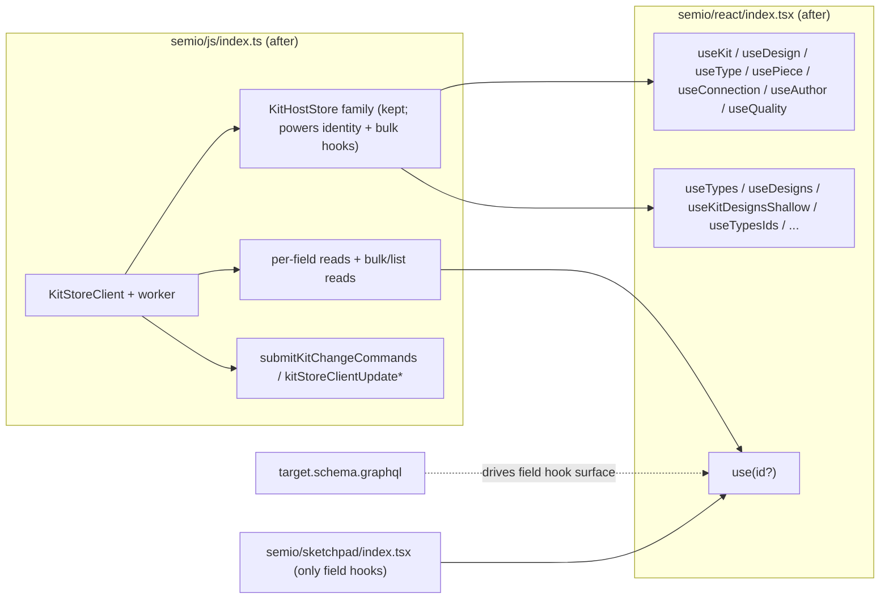

## 1. Direction

Sketchpad is allowed to read kit data only through schema-driven per-field hooks (`use<Entity><FieldPath>(idValue?)`) defined from [semio/graphql/target.schema.graphql](semio/graphql/target.schema.graphql).

The `@semio/react` API still exposes the named entity-identity selectors (`useKit`, `useDesign`, `useType`, `usePiece`, `useConnection`, `useAuthor`, `useQuality`) and the bulk / list / aggregate / metadata / shallow hooks for other consumers; sketchpad just must not import them. Everything else that is "general" (whole-object triads, generic schema readers, snapshot hooks, snapshot consumers in `@semio/js`, whole-object `*Input`/`*PatchInput` hooks, whole-snapshot file/binary helpers) gets deleted from the public surface.

## 2. Kept in the public API

Keep all of these as exports of `@semio/react`:

- Entity-identity selectors named in the original message: `useKit`, `useDesign`, `useType`, `usePiece`, `useConnection`, `useAuthor`, `useQuality` (and the `*ById` aliases).
- Bulk / list / aggregate / metadata / shallow hooks: `useTypes`, `useDesigns`, `usePieces`, `useConnections`, `useAuthors`, `useTypesIds`, `useDesignsIds`, `useTypesMetadata`, `useDesignsMetadata`, `useTypesFull`, `useDesignsFull`, `useFilesFull`, `useTagsFull`, `useKitDesignsShallow`, `useKitTypesShallow`, `useKitAuthorsShallow`, `useKitPieces`, `useKitConnections`, `usePiecesMetadataMap`, `usePieceMetadata`, `useIncludedDesigns`, `useDesignClusterableGroups`, `useDesignQualitySum`, `useTypeBestRepresentation`, `useKitColoredConnectors`, `useReplacableTypes`, `useReplacableDesigns`, `useExplodeableDesignNodes`, `useOpenKitGuids`, `useActiveKitGuid`, `useOpenKitShallows`, `useRegistryHasKit`, `useRegistryKitPersistenceKind`, `useKitAlternatives`, `useKitAlternativeSelection`.
- Per-field schema hooks: every existing `use<Entity><Field>` (e.g. `usePieceName`, `usePiecePlane`, `usePieceFlatCenter`, `usePieceFlatPlane`, `useTypeName`, `useDesignName`, …).
- Scopes + scope hooks: `KitScope`, `DesignScope`, `TypeScope`, `AuthorScope`, `QualityScope`, `PieceScope`, `ConnectionScope`, `useKitScope`, `useDesignScope`, `useTypeScope`, `useAuthorScope`, `useQualityScope`, `usePieceScope`, `useConnectionScope`, `useIs*Scope`, `useResolvedKitIdentifier`.
- Command hooks: `useUndo`, `useRedo`, `useCreate*`, `useDelete*`, `useUpdate*`, `useDeletePiece`, `useUpdatePiece`, `useUpdateConnection`, `useFlattenDesign`, `useExpandDesign`, `useChangePieceType`, `useClusterPieces`, `useDragPieces`, `useMovePieces`, `useFixPieces`, `useDeleteConnection`, `useAddConnections`, `useRemoveConnections`, `useDeselectAll`, `useDeleteSelected`, `usePasteDesignSelection`, `useCreateHangingPieces`, `useCreateConnectedPiece`, `useCreateFixedPiece`, `useStartNewChange`, `useSaveChange`, `useUnsavedChanges`, `useStartAlternative`, `useIntegrateAlternative`, `useImportKit`, `useExportKit`, `useMoveToFolder`, `useMoveKitArtifactToFolder`, `useChange`, `useCommandBuilder`, `useLogin`, `useLogout`, `useCanUndo`, `useCanRedo`, …
- Backbone hooks: `useBackboneStatus`, `useAttachBackbone`, `useDetachBackbone`, `useListConflicts`, `useResolveConflict`, `useSyncNow`.
- Diagnostics: `useWriteIndicator`, `useWriteQueue`, `useSchemaEvents`, `useSetErrors`, `useKitSync`, `useOptimistic`, `usePendingTriad`.

In [semio/js/index.ts](semio/js/index.ts), keep `KitStoreClient`, the worker plumbing, the GraphQL transport, the write helpers, the entity DTO classes (`Kit`, `Design`, `Type`, `Piece`, `Connection`, `Author`, `Quality`, `Tag`, `Concept`, `Family`, `File`, `Folder`, `Layer`, `Group`, `Stat`, `Prop`, `Attribute`, `Representation`, `Connector`, `Plane`, `Coordinate`, `Point`, `Vector`, `Camera`, `Side`, `Benchmark`) and their schemas, and the `KitHostStore` family (`InMemoryKitStore`, `createSessionKitStore`, `createJsonFileKitStore`, `createFolderKitStore`, `applyKitClientSnapshotToLocalStore`, plus the `IndexedSchemaState` / `resolveReference` / `readSchemaFieldValue` machinery in react). They back the kept hooks.

## 3. Deletions in `semio/react/index.tsx` (public-API only)

Delete these exported symbols (their internal helpers may stay un-exported when the kept hooks rely on them):

- Whole-object triads: `usePieceTriad`, `useDesignTriad`, `useTypeTriad`, `useAuthorTriad`, `useQualityTriad`, `useConnectionTriad` (the named identity selectors `useKit/useDesign/useType/usePiece/useConnection/useAuthor/useQuality` survive and absorb the role).
- Whole-object accessors that materialize generic objects: `useFolder`, `useFile`, `useTag`, `useConcept`, `useFamily`, `useGroup`, `usePort`, `useProp`, `useStat`, `useBenchmark`, `useCoordinate`, `usePoint`, `useVector`, `usePlane`, `useCamera`, `useAttribute`, `useLocation`, `useRepresentation`, `useConnector`, `useActor`, `useUser`, `useAgent`, `useSessionActorInput`, `useFolderInput`, `useFolderPatchInput`, every `*Input` and `*PatchInput` whole-object hook (their per-field versions remain).
- Snapshot exports: `useKitSnapshot`, `useKitStoreSnapshot`, `useKitHostStore`, `useKitStore`, `useSemioStoreSelector`, `useSemioReadSnap`, `useSemioKitScopedView`. (`useKitStoreClient` stays — it returns the worker handle, not a snapshot.)
- Generic schema readers: `useSchemaObjectState`, `useSchemaObjectMutation`, `useSchemaObjectValue`, `useSchemaFieldValue`, `useSchemaFieldMutation`, `useSchemaFieldState` (the field-state composer is moved to a non-exported internal helper that `usePieceName` etc. still call), and the public `useSchemaScope` / `useKitRuntimeSafe` / `useKitRegistry` / `useKitRegistrySafe` aggregate accessors.
- Whole-snapshot file/binary helpers: `useKitFileBlobUrl`, `useKitStoredFileUrls`, `useFileUrls`, `useKitFileState`, `useKitPersistenceKind`, `useKitPersistenceSource`, `useKitBinary`, `useEmbedKitFile`, `useKitFileUrl`. Re-introduce later only as field hooks if a use case appears.

## 4. Deletions in `semio/js/index.ts`

Delete these (the user explicitly named `Kit.getSnapshot()` / `Design.getSnapshot()` — i.e. snapshot-of-the-whole-graph paths):

- Public re-exports of snapshot types: `KitHostStoreSnapshot`, `KitStoreSnapshot`, `KitSyncSnapshot`, `DEFAULT_KIT_SYNC` — these become un-exported internals consumed only inside the kept host-store family. `KitHostStore.getSnapshot()` itself stays as an internal method; no consumer outside `semio/js` and `semio/react` internals may import the snapshot type.
- Aggregate read entrypoints that materialize whole entity graphs: `SemioKitLiveReadStore.getSnapshot`, `KitDesignReadStore.getSnapshot`, `KitShallowListStore.getSnapshot`, `KitViewCatalogStore.getSnapshot` are demoted to internal-only (still used to back the kept bulk hooks; they leave the public surface).
- Bulk-graph read commands that hand back full DTO subtrees survive only as private building blocks for the kept bulk hooks; their public-type aliases (`ReadDesignCommand`, `ReadKitCommand`, `ReadPieceCommand`, `ReadTypeCommand`) drop their whole-entity variants.
- Public `Kit.toJSON` / `Kit.toDto` / `Design.toDto` / `Type.toDto` / etc. as **public methods** are removed from the public type exports; the classes themselves remain for internal serialization in writes.
- `applyKitClientSnapshotToLocalStore` stays (used to bootstrap host stores) but its return + arguments are not re-imported in sketchpad.

## 5. Sketchpad migration ([semio/sketchpad/index.tsx](semio/sketchpad/index.tsx))

Sketchpad must compile without importing any of:

- the named entity-identity selectors `useKit`, `useDesign`, `useType`, `usePiece`, `useConnection`, `useAuthor`, `useQuality` (and their `*ById` aliases),
- any bulk / list / aggregate / metadata / shallow hook from §2 (e.g. `useTypes`, `useDesigns`, `usePieces`, `useConnections`, `useTypesIds`, `useDesignsIds`, `useKitDesignsShallow`, `useTypesFull`, …),
- any deleted hook from §3,
- any DTO class (`Kit`, `Design`, `Type`, `Piece`, `Connection`, `Author`, `Quality`) used as a runtime read carrier.

Per call site (64 currently identified by `\b(useKit|useDesign|useType|usePiece|useConnection|useAuthor|useQuality)\b`), identify which fields the JSX downstream actually reads and replace with explicit per-field hooks:

- `const piece = usePiece() as Piece` → `const id = usePieceScope()?.id; const [name] = usePieceName(id); const [plane] = usePiecePlane(id); …` reading only what is rendered.
- `const type = useType(undefined, undefined, true) as Type` → `useTypeName(typeId)`, `useTypeRepresentationIds(typeId)` + per-representation field hooks, `useTypeConnectorIds(typeId)` + per-connector hooks.
- `const connection = useConnection() as Connection` → `useConnectionConnectedPieceId(id)`, `useConnectionConnectingPieceId(id)`, `useConnectionGap(id)`, etc.
- `const design = useDesign() as Design` → `useDesignName(designId)`, `useDesignPieceIds(designId)`, then iterate ids and render child components reading per-piece fields.

Where a list of children is needed, sketchpad calls a per-entity list-id field hook (e.g. `useDesignPieceIds(designId)` returning `readonly string[]`) and renders one child component per id. The bulk hooks like `useTypes` stay in the API but sketchpad does not call them.

If a missing field hook is needed (e.g. `useTypeRepresentationIds`, `useDesignPieceIds`), add it to [semio/react/index.tsx](semio/react/index.tsx) following the existing `useSchemaFieldState`-backed pattern; do not pull from `useKit` / `useDesign` / etc.

## 6. Validation

- `npm run depcruise:layers` for the relevant packages.
- `npm run typecheck` for `semio/js`, `semio/react`, `semio/sketchpad` (see each `tsconfig.json`).
- Run the inline vitest blocks embedded in [semio/js/index.ts](semio/js/index.ts) and [semio/react/index.tsx](semio/react/index.tsx). Update tests that asserted on deleted exports (`useKitSnapshot`, `useSchemaObjectState`, …).
- Add an inline negative test in `semio/sketchpad/index.tsx` test region that grep-asserts the file source contains zero matches for the banned hooks listed in §5.
- Manual: launch sketchpad, open a kit, drag a piece, confirm rendering still works using only field hooks (`[DEBUG]` console traces on hook subscriptions).

## 7. Ticket + execution

- Open ticket (slug `field-only-kit-reads-in-sketchpad`) under the existing kit-data SSOT goal via the repo MCP; place all temporary scripts in its folder.
- Delegate two hour-scale subagents in parallel:
  - **A** ([semio/react/index.tsx](semio/react/index.tsx) + [semio/js/index.ts](semio/js/index.ts)): delete the public symbols listed in §3 and §4, demote any required helpers to non-exported internals, keep the kept symbols functioning, and add any field hook §5 needs.
  - **B** ([semio/sketchpad/index.tsx](semio/sketchpad/index.tsx)): rewrite all 64 banned-hook usages with per-field hook compositions, fan out to per-id child components, and add the negative-grep inline test.
- Coordinator (this agent) integrates, runs typecheck / depcruise / tests, fixes fallout, closes the ticket with a per-file summary.
