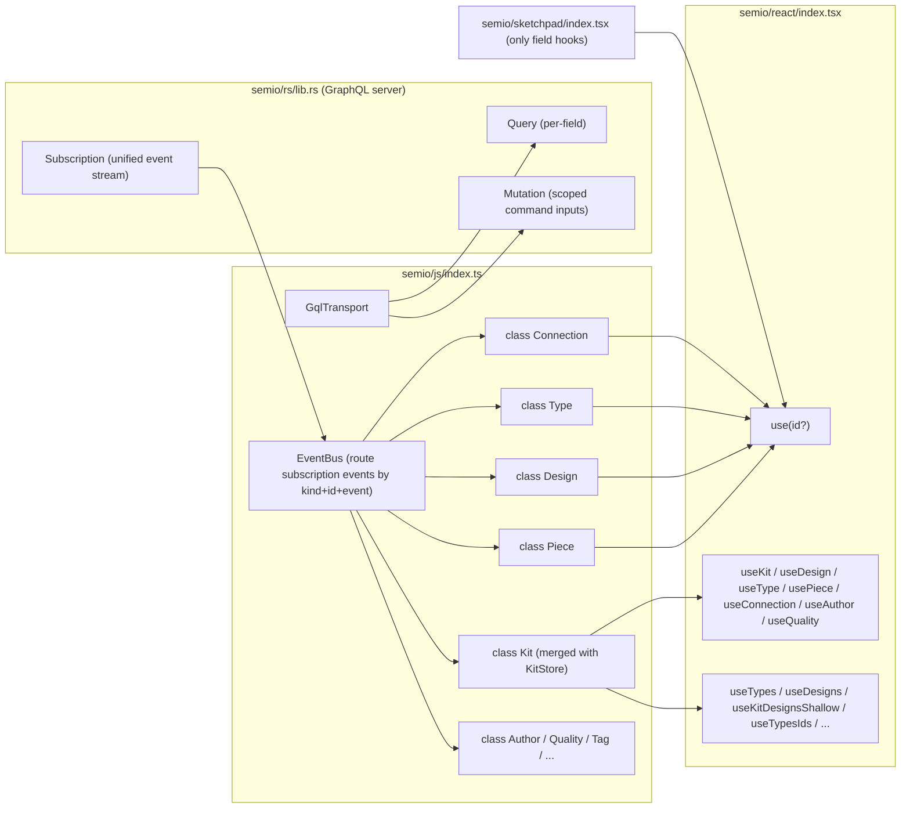

## 1. Direction

[semio/js/index.ts](semio/js/index.ts) is collapsed to a single layer of CQRS entity classes that talk only GraphQL to [semio/rs/lib.rs](semio/rs/lib.rs). `Kit` and the legacy `KitStore` merge into one `Kit` class. Every entity (`Kit`, `Design`, `Type`, `Piece`, `Connection`, `Author`, `Quality`, `Tag`, `Concept`, `Family`, `File`, `Folder`, `Layer`, `Group`, `Stat`, `Prop`, `Attribute`, `Representation`, `Connector`, `Port`, `Plane`, `Coordinate`, `Point`, `Vector`, `Camera`, `Side`, `Benchmark`, `Position`, `Place`, `Location`) follows the same CQRS pattern over the schema in [semio/graphql/target.schema.graphql](semio/graphql/target.schema.graphql).



## 2. CQRS surface on every entity class

Each class has three things, all driven by [semio/graphql/target.schema.graphql](semio/graphql/target.schema.graphql):

1. **Reads** — three methods per field from the schema's data/computed fields:
   - `field(): Promise<T>` — one-off GraphQL `Query` against [semio/rs/lib.rs](semio/rs/lib.rs).
   - `fieldSync(): T | undefined` — synchronous read from the in-class cache. For object-typed fields (`Plane`, `Coordinate`, `Position`, `Side`, …) the cache holds the same instance reference until the field changes, so React `useSyncExternalStore.getSnapshot` returns a stable reference and skips rerenders.
   - `on<Event>(cb: (next: T) => void): Unsubscribe` — subscribe to the routed event channel. Event names follow the schema's Edit/Modification union (`onRenamed`, `onDescriptionChanged`, `onMoved`, `onDragged`, `onFixed`, `onFlattened`, `onPlaneChanged`, `onCenterChanged`, `onAttributeAdded`, `onAttributeRemoved`, `onPieceAdded`, `onPieceDeleted`, `onConnectionAdded`, `onConnectionDeleted`, `onPortCreated`, `onPortDeleted`, `onConnectorAdded`, `onConnectorRemoved`, `onTagCreated`, `onTagDeleted`, `onConceptCreated`, `onConceptDeleted`, `onQualityCreated`, `onQualityDeleted`, `onTypeCreated`, `onTypeDeleted`, `onDesignCreated`, `onDesignDeleted`, `onCheckpointCreated`, …).

2. **Operations** — two methods per leaf command in the matching `*OperationInput` from §`#region Commands`. Method signatures mirror the schema (same names, same args, same nullability):
   - `op(...args): Promise<SetResult>` — async. Sends the GraphQL `mutation { session { ... } }` and resolves once the server confirms; the resulting `ID!` is in `ok.id`. Cache and `on<Event>` subscribers are updated when the matching subscription event arrives.
   - `opSync(...args): SetResult` — sync. Applies the operation optimistically to the in-class cache *immediately*, fires the matching `on<Event>` callbacks synchronously, returns the locally-derived `SetResult` (with the optimistic `id`), and dispatches the GraphQL mutation in the background. If the server later rejects (or returns a conflicting state), the reconciliation comes through the unified subscription stream and rolls the cache back; errors surface via `useSetErrors` (and via the rejected `Promise` of an internal background dispatch tracked by `Kit`).

3. **Navigation methods** — for command-input fields that nest into another scoped command input, the class returns the matching child class instance (lazy, cached by id). E.g. `design.piece(id) → Piece`, `design.pieces(ids) → PiecesOps`, `kit.type(id) → Type`, `type.port(id) → Port`, `type.connector(id) → Connector`, etc.

### Generic mechanisms (JS side)

Every entity class is built from the same internal `Entity` base + a tiny set of factory helpers, so per-field / per-op declarations are one-liners. The factories are private to [semio/js/index.ts](semio/js/index.ts); only the resulting classes are exported.

```ts
// internal — shared by every entity class
abstract class Entity {
  constructor(
    protected readonly transport: GqlTransport,
    protected readonly bus: EventBus,
    protected readonly kit: Kit, // owning Kit; routes commands through session/version/change scope
    public readonly id: string,
  ) {}

  /** Read the cached value for `key`. Object-typed values are stored with stable identity. */
  protected fieldSync<T>(key: string): T | undefined;
  /** Async query for `key` using the GraphQL document and select function `selector`. */
  protected fieldQuery<T>(key: string, selector: (data: any) => T, doc: GqlDoc): Promise<T>;
  /** Subscribe to the named event channel for this entity. */
  protected subscribeField(eventName: string, cb: () => void): Unsubscribe;

  /** Send an async mutation (await server confirmation); returns Promise<SetResult>. */
  protected dispatch(op: GqlOpInput): Promise<SetResult>;
  /** Apply a deterministic local cache mutation, fire matching events, queue background dispatch; returns SetResult. */
  protected dispatchSync(op: GqlOpInput, applyToCache: (cache: this["cache"]) => void): SetResult;
}

// internal helpers attached at class-definition time. Each returns a small object describing the
// field/op so the constructor can install methods on the prototype with one call to defineFields/defineOps.
const defineField = <E extends Entity, T>(spec: {
  key: string;
  query: GqlDoc;
  pickQuery: (data: any) => T;
  event: string;
}) => spec;

const defineOp = <E extends Entity, Args extends any[]>(spec: {
  name: string;                                  // matches the *OperationInput leaf name
  buildInput: (...args: Args) => GqlOpInput;
  applyToCache: (cache: E["cache"], ...args: Args) => void;
}) => spec;
```

Class definitions then read like a schema bundle, one line per leaf. Example for `Piece`:

```ts
export class Piece extends Entity {
  // Reads — defineFields installs name() / nameSync() / onRenamed(), and so on for every field.
  static fields = [
    defineField({ key: "name",            query: PIECE_NAME_QUERY,            pickQuery: d => d.node.name,            event: "Renamed" }),
    defineField({ key: "description",     query: PIECE_DESCRIPTION_QUERY,     pickQuery: d => d.node.description,     event: "DescriptionChanged" }),
    defineField({ key: "position",        query: PIECE_POSITION_QUERY,        pickQuery: d => d.node.position,        event: "PositionChanged" }),
    defineField({ key: "plane",           query: PIECE_PLANE_QUERY,           pickQuery: d => d.node.plane,           event: "PlaneChanged" }),
    defineField({ key: "center",          query: PIECE_CENTER_QUERY,          pickQuery: d => d.node.center,          event: "CenterChanged" }),
    defineField({ key: "scale",           query: PIECE_SCALE_QUERY,           pickQuery: d => d.node.scale,           event: "ScaleChanged" }),
    defineField({ key: "blueprint",       query: PIECE_BLUEPRINT_QUERY,       pickQuery: d => d.node.blueprint,       event: "BlueprintChanged" }),
    defineField({ key: "flatPosition",    query: PIECE_FLAT_POSITION_QUERY,   pickQuery: d => d.node.flatPosition,    event: "FlatPositionChanged" }),
    defineField({ key: "flatPlane",       query: PIECE_FLAT_PLANE_QUERY,      pickQuery: d => d.node.flatPlane,       event: "FlatPlaneChanged" }),
    defineField({ key: "flatCenter",      query: PIECE_FLAT_CENTER_QUERY,     pickQuery: d => d.node.flatCenter,      event: "FlatCenterChanged" }),
    defineField({ key: "parentPiece",     query: PIECE_PARENT_PIECE_QUERY,    pickQuery: d => d.node.parentPiece,     event: "ParentPieceChanged" }),
    defineField({ key: "parentConnection",query: PIECE_PARENT_CONN_QUERY,     pickQuery: d => d.node.parentConnection,event: "ParentConnectionChanged" }),
    defineField({ key: "childPieces",     query: PIECE_CHILD_PIECES_QUERY,    pickQuery: d => d.node.childPieces,     event: "ChildPiecesChanged" }),
    defineField({ key: "childConnections",query: PIECE_CHILD_CONN_QUERY,      pickQuery: d => d.node.childConnections,event: "ChildConnectionsChanged" }),
    defineField({ key: "depth",           query: PIECE_DEPTH_QUERY,           pickQuery: d => d.node.depth,           event: "DepthChanged" }),
    defineField({ key: "connectionKind",  query: PIECE_CONN_KIND_QUERY,       pickQuery: d => d.node.connectionKind,  event: "ConnectionKindChanged" }),
    defineField({ key: "attributes",      query: PIECE_ATTRIBUTES_QUERY,      pickQuery: d => d.node.attributes,      event: "AttributesChanged" }),
  ];

  // Operations — defineOps installs both op(...) and opSync(...).
  static ops = [
    defineOp({ name: "rename",            buildInput: (newName: string) => ({ rename: { newName } }),                         applyToCache: (c, newName: string) => { c.name = newName; } }),
    defineOp({ name: "changeDescription", buildInput: (newDescription: string) => ({ changeDescription: { newDescription } }), applyToCache: (c, d: string) => { c.description = d; } }),
    defineOp({ name: "drag",              buildInput: (offset: OffsetInput) => ({ drag: { offset } }),                          applyToCache: (c, offset: OffsetInput) => { c.center = applyOffsetToCenter(c.center, offset); } }),
    defineOp({ name: "move",              buildInput: (position: PositionInput) => ({ move: { position } }),                    applyToCache: (c, position: PositionInput) => { c.center = position.center; c.plane = position.plane; } }),
    defineOp({ name: "fix",               buildInput: () => ({ fix: true }),                                                    applyToCache: (c) => { c.fixed = true; } }),
    defineOp({ name: "changeBlueprint",   buildInput: (blueprintId: string) => ({ changeBlueprint: { blueprintId } }),          applyToCache: (c, id) => { c.blueprintId = id; } }),
    defineOp({ name: "addAttribute",      buildInput: (key: string, value: string, definition: string) => ({ addAttribute: { key, value, definition } }), applyToCache: (c, k, v, def) => { c.attributes = [...c.attributes, { key: k, value: v, definition: def }]; } }),
    defineOp({ name: "removeAttribute",   buildInput: (id: string) => ({ removeAttribute: { id } }),                              applyToCache: (c, id) => { c.attributes = c.attributes.filter(a => a.id !== id); } }),
    defineOp({ name: "removeAttributes",  buildInput: (ids: readonly string[]) => ({ removeAttributes: { ids } }),               applyToCache: (c, ids) => { const set = new Set(ids); c.attributes = c.attributes.filter(a => !set.has(a.id)); } }),
  ];

  // Navigation — Piece has no scoped child entities; Design/Type/Kit override this with cached children.
}

// One call per class wires every defined field/op into prototype methods named exactly as in the schema.
defineFields(Piece, Piece.fields);
defineOps(Piece, Piece.ops);
```

`defineFields(C, specs)` installs three methods per spec on `C.prototype`: `<key>(): Promise<T>` (calls `Entity.fieldQuery`), `<key>Sync(): T | undefined` (calls `Entity.fieldSync`), and `on<Event>(cb): Unsubscribe` (calls `Entity.subscribeField`). `defineOps(C, specs)` installs two methods per spec: `<name>(...args): Promise<SetResult>` (calls `Entity.dispatch`) and `<name>Sync(...args): SetResult` (calls `Entity.dispatchSync`). Same recipe for `Kit`, `Design`, `Type`, `Port`, `Connector`, `Connection`, `Author`, `Quality`, `Tag`, `Concept`, etc. — each class is mostly two static arrays.

The full operation surface per class (mirrors [semio/graphql/target.schema.graphql](semio/graphql/target.schema.graphql) exactly):

- **`Kit`** (merged with `KitStore`; mirrors `KitOperationInput`): owns `GqlTransport` + `EventBus`. Operations: `rename(newName)`, `changeDescription(newDescription)`, `createTag(name, description?, icon?, order?)`, `tag(id) → Tag`, `deleteTag(id)`, `deleteTags(ids)`, `createConcept(name, description?, icon?, order?)`, `concept(id) → Concept`, `deleteConcept(id)`, `deleteConcepts(ids)`, `createQuality(key, value?, unit?, definition?, description?, icon?)`, `quality(id) → Quality`, `deleteQuality(id)`, `deleteQualities(ids)`, `createType(name, description?, icon?, image?, unit?)`, `type(id) → Type`, `deleteType(id)`, `deleteTypes(ids)`. Plus version/session control: `startNewChange()`, `save()`, `createCheckpoint(message)`, `unsavedChange(id) → Kit` scope helper, `startAlternative(name?)`, `alternative(id)`, `integrateAlternative(id)`, `start()`, `end()`, `login(username, passwordHash, hubUrl?)`, `logout()`, `hydrateBundleJson(json)`.
- **`Design`** (mirrors `DesignOperationInput`): `rename(newName)`, `changeDescription(newDescription)`, `flatten()`, `addAttribute`, `removeAttribute(id)`, `removeAttributes(ids)`, `addFixedPiece(blueprintId, position, name?, description?)`, `addChildPieceWithParentConnection(blueprintId, parentPieceId, parentConnector, childConnector, name?, description?, position?, scale?)`, `addHangingChildPieceWithParentConnection(blueprintId, parentPieceId, parentConnector, childConnector, position, name?, description?, scale?)`, `piece(id) → Piece`, `pieces(ids) → PiecesOps`, `deletePiece(id)`, `deletePieces(ids)`, `deletePiecesAndConnections(pieceIds, connectionIds)`.
- **`PiecesOps`** (small helper returned by `design.pieces(ids)`; mirrors `PiecesOperationInput`): `drag(offset)`, `move(offset)`, `fix()`, `changeBlueprint(blueprintId)`. Has no reads — it's a pure command scope.
- **`Type`** (mirrors `TypeOperationInput`): `rename(newName)`, `changeDescription(newDescription)`, `changeIcon(newIcon)`, attributes ops, `createPort(code?, label?, description?, icon?, order?)`, `port(id) → Port`, `deletePort(id)`, `deletePorts(ids)`, `addConnector(code, description?, icon?, portId?)`, `connector(id) → Connector`, `removeConnector(id)`, `removeConnectors(ids)`.
- **`Port`** (mirrors `PortOperationInput`): `rename(newCode, newLabel?)`, `changeDescription(newDescription)`, `changeIcon(newIcon)`, attributes ops.
- **`Connector`** (mirrors `ConnectorOperationInput`): `rename(newCode)`, `changeDescription(newDescription)`, `changeIcon(newIcon)`.
- **`Tag`** / **`Concept`** (mirror `TagOperationInput` / `ConceptOperationInput`): `rename(newName)`, `changeDescription(newDescription)`, `changeIcon(newIcon)`, attributes ops.
- **`Quality`** (mirrors `QualityOperationInput`): `rename(newKey)`, `changeDescription(newDescription)`, `changeIcon(newIcon)`, attributes ops.
- **`Piece`** (mirrors `PieceOperationInput`): see snippet above.
- **`Connection`**, **`Author`**: per the connection / author fields the schema currently does not declare a dedicated `*OperationInput` for these, so the JS class only carries the read API; their commands (e.g. add/remove connection, addAuthor) live on the parent `Design` / `Kit` per the schema. If the schema later grows `ConnectionOperationInput` / `AuthorOperationInput`, the matching methods are added then.
- **Value-object classes** (`Plane`, `Coordinate`, `Position`, `Point`, `Vector`, `Side`, `Place`, `Location`, `Camera`, `Stat`, `Prop`, `Attribute`, `Representation`, `Family`, `File`, `Folder`, `Layer`, `Group`, `Benchmark`): the schema does not expose dedicated `*OperationInput`s for them either. They are read-only classes with the same `field()` / `fieldSync()` / `on<Event>(cb)` triple per field, but no command methods. They are mutated through their owners (Kit/Design/Piece/Connection/Type/Port).

Every command method translates to one `mutation { session { ... } }` GraphQL request. The session/version/change scoping (`session.theKit.unsavedChange(activeChangeId).kit.<…>`, or `session.alternative(…)`, or `session.theKit.…` for save / checkpoint flows) is encapsulated by `Kit`; child classes hold a reference to their owning `Kit` and route their own command through it.

The transport speaks only GraphQL:

- Reads: a single `GqlTransport.query(doc, vars)` per field method (typed `Query` selection with the right `node(id)` lookup).
- Subscriptions: one persistent `subscription { event }` per `Kit` instance; the `EventBus` deserializes each `Json` event, looks up its kind + entity id + field affinity, and pushes typed values into all registered channels.
- Commands (async `op(...)`): one `mutation { session { ... } }` per command; the resulting `ID!` is stored locally as the active change id when needed. The promise resolves after server confirmation.
- Commands (sync `opSync(...)`): an in-class reducer mutates the cache deterministically using the same logic the server applies for the matching event, fires the matching `on<Event>` callbacks synchronously so React `useSyncExternalStore` rerenders in the same tick, and returns a local `SetResult` (with the optimistic id). The same `mutation { session { ... } }` is enqueued through `Kit`'s background dispatch queue; the subscription event from the server later reconciles the cache (no-op if the optimistic state already matches, or a corrective re-emit if the server diverged). Background mutation failures surface through `Kit.errors` (consumed by `useSetErrors`).

## 3. Public exports of `semio/js/index.ts`

Keep only:

- The entity classes: `Kit` (merged with `KitStore`), `Design`, `Type`, `Piece`, `Connection`, `Author`, `Quality`, `Tag`, `Concept`, `Family`, `File`, `Folder`, `Layer`, `Group`, `Stat`, `Prop`, `Attribute`, `Representation`, `Connector`, `Port`, `Plane`, `Coordinate`, `Point`, `Vector`, `Camera`, `Side`, `Benchmark`, `Position`, `Place`, `Location`.
- The minimal types those classes need in their public method signatures, mirrored from [semio/graphql/target.schema.graphql](semio/graphql/target.schema.graphql) input objects: `OffsetInput`, `PositionInput`, `PlaneInput`, `CoordinateInput`, `PointInput`, `VectorInput`, `LocationInput`, `BackboneConfig`, `ConflictResolution`, `SetResult`, `SetError`, `Unsubscribe`, plus the GraphQL-derived event union types if a method signature references them.
- One factory: `openKit(config: { rsUrl?: string; backbone?: BackboneConfig; ... }): Promise<Kit>`. No `createKitStoreClient`, no `createSessionKitStore`, no `applyKitClientSnapshotToLocalStore`.

Delete entirely (full list — these were the bulk of the current 7715-line file):

- The legacy `KitStore` class and its client family — `KitStoreClient`, `WasmKitStoreClient`, `createKitStoreClient`, `kitStoreFromKitStoreClient`, `getKitClientReadPoint`, `theKitReadPoint`, `KitReadPoint`, `kitReadPointKey`.
- All host stores: `KitHostStore`, `KitHostStoreSnapshot`, `KitStoreSnapshot`, `KitSyncSnapshot`, `DEFAULT_KIT_SYNC`, `InMemoryKitStore`, `createSessionKitStore`, `createJsonFileKitStore`, `createFolderKitStore`, `applyKitClientSnapshotToLocalStore`, `KitBundlePersistingStore`, `KIT_BUNDLE_BOOTSTRAPPED`, `KitJsonFileAdapter`, `KitFolderAdapter`, `KitBinaryStore`.
- All read commands and aggregate read stores: `ReadKitCommand`, `ReadDesignCommand`, `ReadPieceCommand`, `ReadTypeCommand`, `SemioKitLiveReadStore`, `KitDesignReadStore`, `KitShallowListStore`, `KitViewCatalogStore`, `getSemioKitLiveReadStore`, every `getSnapshot` aggregate path. Reads are exclusively through the field methods on the classes.
- Free-standing write helpers, replaced by class methods: `kitStoreClientAddPiece`, `kitStoreClientAddConnection`, `kitStoreClientAddChildByKind`, `kitStoreClientUpdatePiece`, `kitStoreClientUpdateConnection`, `kitStoreClientRemovePiece`, `kitStoreClientRemoveChildByKind`, `submitKitChangeCommands`, `buildSchemaEntityChangeCommands`, `writeKitStoreClientSchemaField`, `StoreField`, `StoreCommand`, `CommandBuilder`.
- Zod schemas, DTO types, metadata/shallow types: every `*Schema`, every `*Dto`, every `*MetadataDto`, every `*Shallow`, `KitFullDto`, `KitFullDtoSchema`, `normalizeKitFullDtoFolderPaths`, `KitJsonObjectDto`, `KitJsonTreeDto`, `JsonValue`, `JsonObject`, `parseJsonValue`, `KitGraphqlResponseEnvelope`, `ReadonlyDto`, `kitChangeSemanticKindToGraphQl`, `KitChangeKind`, `KitChangeSemanticKindGql`, `KitCommandLifecycleEvent`, `SEMIO_KIT_STORE_CONTROL_COMMAND_KINDS`, `SemioKitStoreControlCommandName`.
- Helper utilities tied to the deleted graph: `asKitInstance`, `kitEventAffectsPieceLiveRead`, `kitEventAffectsCanUndoRedo`, `kitEventAffectsDesignQualitySumRead`, `kitEventAffectsKitColoredConnectorsRead`, `kitEventAffectsReplaceableCatalogRead`, `kitEventAffectsTypeScopedRead`, `kitEventTouchesDesign`, `resolveDesignIdForPieceOrConnection`, `isKitCommandLifecycleEvent`, `isKitBundlePersistingStore`, `getStoredKitFileUrls`, `getOrCreateKitFileState`, `getKitFileProvider`, `getExistingKitFileProvider`, `getReadableKitFileUrl`, `fetchReadableKitFileBlob`, `getKitFileStoragePath`, `createKitFileObjectUrl`, `isBrowserReadableFileUrl`, `getKitPorts`, `id` (uuid helper kept only if `Kit` constructor needs it), `TOLERANCE`, `ICON_WIDTH`, `DiffStatus`, `EntityLifecycle`, `FlatMerkleCacheEntry`, `OperationResult`, `DesignOperationResult`, `DesignDiffOperationResult`, `AlgorithmError`, `PiecePlacementRowDto`.
- The `*Diff` types and the `applyDiff` machinery: `*DiffSchema`, `*Diff`, `*sDiffSchema`, `*sDiff`, `Design.applyDiff`, `Design.previewWithDiff`, `Design.dragBySelection`, `Design.deletePiecesAndConnectionsDiff`, `Type.pickBestRepresentation`, `Kit.copyDesignOp`, `Kit.pasteDesignOp`, `Kit.flattenDesignCachedOp`, `Kit.findParentPieceInDesign`, `Kit.findParentConnectionForPieceInDesign`, `Kit.findChildrenPiecesInDesign`, `Kit.findDesign`, `Kit.findType`, `Kit.piecesMetadataFor`, `Kit.fromDto`, `Kit.toDto`, `Kit.toJSON`, `Kit.deserialize`, `Kit.serialize`, `Kit.ensure`. All graph navigation moves to the GraphQL server; the JS classes only hold the local cache.
- Inline subagent / view stores: `KitViewCatalogKey`, `KitDesignReadKind`, `KitShallowListKind`, `KitStoreReadSnap`, `KitAlternativeSummary` (re-derive from class subscriptions if needed in react).

The `kit-store.worker.ts` worker is rewritten to host only the GraphQL transport (`async-graphql` over WASM) and to forward `subscription { event }` payloads to the main thread; no DTO marshaling.

## 4. `semio/react/index.tsx` shape

### Strict separation of reads and writes

- **Reads** are pure plain-data hooks. `use<Entity><Field>(id?)` returns just the value (`T | undefined`). No tuple, no setter, no status, no `KitFieldBinding`, no `HookRead`. If the entity / kit / field is not yet resolved the hook returns `undefined`.
- **Writes** are operation hooks. `use<Operation><Entity>(id?)` returns a single function bound to that entity instance and that operation. The function takes the operation arguments and returns `Promise<SetResult>`. There is no read fallback embedded; callers compose a read hook and a write hook independently.
- The kit can only be modified through these operation hooks. Operation hooks map 1:1 to leaves of the `*OperationInput` types in [semio/graphql/target.schema.graphql](semio/graphql/target.schema.graphql).

### Resolution rules (every hook)

- Every read / write hook accepts a single optional argument `id?: string`. When `id` is omitted the hook reads the matching context (`KitContext`, `DesignContext`, `TypeContext`, `PortContext`, `ConnectorContext`, `PieceContext`, `ConnectionContext`, `AuthorContext`, `QualityContext`, `TagContext`, `ConceptContext`, …). When `id` is provided it wins over the context.
- There are no `useResolved*` helpers. Resolution is the explicit composition `useKit()` → `kit.<child>(id)`, `useDesign()` → `design.<child>(id)`, `useType()` → `type.<child>(id)`, `useDesign().piece(id)` → `Piece`, `useDesign().connection(id)` → `Connection`, `useType().port(id)` → `Port`, `useType().connector(id)` → `Connector`, etc. Inside the per-field hook body the chain is written out.
- The entity-identity selectors return the class instance from §2, never a DTO. Their union signatures are:

  ```ts
  export function useKit(): Kit | null;
  export function useDesign(id?: string): Design | null; // useKit().design(id ?? useDesignContext()?.id)
  export function useType(id?: string): Type | null; // useKit().type(id ?? useTypeContext()?.id)
  export function usePiece(id?: string): Piece | null; // useDesign().piece(id ?? usePieceContext()?.id)
  export function useConnection(id?: string): Connection | null; // useDesign().connection(id ?? useConnectionContext()?.id)
  export function useAuthor(id?: string): Author | null; // useKit().author(id ?? useAuthorContext()?.id)
  export function useQuality(id?: string): Quality | null; // useKit().quality(id ?? useQualityContext()?.id)
  ```

  `Connection`, `Author`, `Quality` get matching navigation methods on `Design` / `Kit` (`design.connection(id)`, `kit.author(id)`, `kit.quality(id)`) so the chain composes cleanly.

### Naming

All `*Scope*` symbols are renamed to `*Context*` across the public API:

- Components: `KitScope` → `KitContext`, `DesignScope` → `DesignContext`, `TypeScope` → `TypeContext`, `PortScope` → `PortContext`, `ConnectorScope` → `ConnectorContext`, `PieceScope` → `PieceContext`, `ConnectionScope` → `ConnectionContext`, `AuthorScope` → `AuthorContext`, `QualityScope` → `QualityContext`, `TagScope` → `TagContext`, `ConceptScope` → `ConceptContext`. Each is a JSX provider component used as `<PieceContext id="p1">…</PieceContext>` (writing `<PieceContext id>` shorthand for `<PieceContext id={id}>`).
- React contexts: `PieceScopeContext` → `PieceContext` (the React.Context object), and the same for every other entity. The provider component shares the entity's context name.
- Hooks: `useKitScope` → `useKitContext`, `useDesignScope` → `useDesignContext`, `useTypeScope` → `useTypeContext`, `usePortScope` → `usePortContext`, `useConnectorScope` → `useConnectorContext`, `usePieceScope` → `usePieceContext`, `useConnectionScope` → `useConnectionContext`, `useAuthorScope` → `useAuthorContext`, `useQualityScope` → `useQualityContext`, `useTagScope` → `useTagContext`, `useConceptScope` → `useConceptContext`. The `useIs*Scope` helpers go away.
- Other "scope" symbols are renamed too: `KitWriteScope` → `KitWriteContext`, `SchemaScope` → deleted (per §"Generic schema readers"), `useResolvedKitIdentifier` keeps its name (no "scope" in it).

### Context usage

Every entity has a JSX provider component that puts an id into the matching React context. Each provider takes a single `id` prop (mirrors the existing `*Scope` shape — `KitScope` already takes `id`, the live `Kit` instance is resolved from the registry inside the provider). Hooks omit their `id` argument to bind to the context. Providers nest naturally.

```tsx
<KitContext id={kitId}>
 <DesignContext id={designId}>
  <DesignNameLabel /> {/* uses useDesignName() */}
  <DesignPieceList /> {/* uses useDesignPieceIds() then maps to <PieceContext id={...}> */}
  <DesignControls /> {/* uses useFlattenDesign() / useAddFixedPiece() */}
 </DesignContext>
</KitContext>;

function DesignNameLabel() {
 const name = useDesignName(); // omits id → reads DesignContext
 return <span>{name ?? "…"}</span>;
}

function DesignPieceList() {
 const pieceIds = useDesignPieceIds(); // omits id → reads DesignContext
 if (!pieceIds) return null;
 return (
  <>
   {pieceIds.map((id) => (
    <PieceContext id={id} key={id}>
     <PieceCard /> {/* uses usePieceName(), usePiecePlane(), etc. */}
    </PieceContext>
   ))}
  </>
 );
}

function PieceCard() {
 const name = usePieceName(); // PieceContext-bound
 const center = usePieceFlatCenter();
 const plane = usePiecePlane();
 const dragPieceSync = useDragPieceSync(); // live UI update
 const fixPiece = useFixPiece();
 return (
  <Card title={name}>
   <Plane plane={plane} />
   <Coord center={center} />
   <button onClick={() => fixPiece()}>Fix</button>
   <DragHandle onDrag={(offset) => dragPieceSync(offset)} />
  </Card>
 );
}
```

The `id` argument always wins over the surrounding context, so a single provider tree can read sibling entities by passing ids explicitly:

```tsx
function PieceCompare({ otherId }: { otherId: string }) {
 const myCenter = usePieceFlatCenter(); // current PieceContext
 const otherCenter = usePieceFlatCenter(otherId); // explicit id
 return <Compare a={myCenter} b={otherCenter} />;
}
```

A connector editor binds inside a `Type` and a specific `Connector` and uses one of the operation hooks that *does* exist (`ConnectorOperationInput` declares `rename` / `changeDescription` / `changeIcon`):

```tsx
<TypeContext id={typeId}>
 <ConnectorContext id={connectorId}>
  <ConnectorRow />
 </ConnectorContext>
</TypeContext>;

function ConnectorRow() {
 const code = useConnectorCode();
 const description = useConnectorDescription();
 const icon = useConnectorIcon();
 const renameConnectorSync = useRenameConnectorSync();
 return <Row code={code} description={description} icon={icon} onRename={renameConnectorSync} />;
}
```

`Connection`, `Author` and the value-object classes do not have a `*OperationInput` in [target.schema.graphql](semio/graphql/target.schema.graphql), so they only get read hooks — no `useSet*` / `use<Op>*` hooks for them. Mutating a connection happens through the parent `Design`'s ops (e.g. `useAddChildPieceWithParentConnection(designId)`), and connection-field reads are still per-field hooks (`useConnectionGap`, `useConnectionShift`, `useConnectionRotation`, …).

Operation hooks called outside any provider must take an explicit `id` (otherwise the returned function reports a `Readonly` error).

### Sketchpad target

Today sketchpad re-implements piece- and connection-field hooks that internally call the now-banned `usePiece() as Piece | null` / `useConnection() as Connection | null` and mutate through `useDesignAppCommands().updatePiece(...)` / `.updateConnection(...)`. After the migration each of those sketchpad hooks becomes a thin composition of `@semio/react` field reads + sync ops, with no entity-class read carrier.

```ts
// Before — semio/sketchpad/index.tsx around line 16888
export function usePieceCenterU(): HookResult<number> {
 const pieceScope = usePieceScope();
 const piece = usePiece() as Piece | null;
 const commands = useDesignAppCommands();
 const setter = useCallback(
  (value: number) => {
   if (pieceScope && piece)
    commands.updatePiece(
     "semio.sketchpad.app.design.panel.details.section.piece.center.u",
     pieceScope.id,
     { center: { u: value, v: piece.center?.v ?? 0 } },
    );
  },
  [pieceScope, piece, commands],
 );
 return conditionalHookResult(!!pieceScope && !!piece, piece?.center?.u ?? 0, setter);
}
```

```ts
// After
export function usePieceCenterU(): HookResult<number> {
 const center = usePieceCenter(); // Coordinate | undefined, PieceContext-bound
 const movePieceSync = useMovePieceSync(); // (position) => SetResult
 const setter = useCallback(
  (value: number) => movePieceSync({ center: { u: value, v: center?.v ?? 0 } }),
  [movePieceSync, center?.v],
 );
 return conditionalHookResult(center !== undefined, center?.u ?? 0, setter);
}
```

The same shape replaces `usePieceCenterV` (uses `useMovePieceSync({ center: { u: center?.u ?? 0, v: value } })`), `usePieceScale` (composes `usePieceScale` from `@semio/react` plus `useMovePieceSync` since the schema models scale through `PositionInput.scale`), `usePieceIsHidden` / `usePieceIsLocked` (compose `usePieceAttributes` plus `useAddPieceAttributeSync` / `useRemovePieceAttributeSync` since `isHidden` / `isLocked` are stored as attributes per the schema). Each sketchpad hook keeps its name and `HookResult` return shape — only the body changes from "snapshot read + commands.updatePiece" to "field read + opSync".

Connection-field hooks migrate even though `Connection` has no operation input — gap / shift / rotation reads stay as direct field hooks, and any mutation that previously called `commands.updateConnection(...)` is rerouted to the parent `Design`'s ops (the schema only mutates connections through `Design.addChildPieceWithParentConnection` / `Design.deletePiecesAndConnections` today, so sketchpad's "edit connection gap" UI either disappears or is gated until `ConnectionOperationInput` is added):

```ts
// Before
export function useConnectionGapValue(): HookResult<number> {
 const connectionScope = useConnectionScope();
 const connection = useConnection() as Connection | null;
 const commands = useDesignAppCommands();
 const setter = useCallback(
  (value: number) => {
   if (connectionScope) commands.updateConnection("…", connectionScope.id, { gap: value });
  },
  [connectionScope, commands],
 );
 return conditionalHookResult(!!connection, connection?.gap ?? 0, setter);
}
```

```ts
// After
export function useConnectionGapValue(): number | undefined {
 return useConnectionGap(); // read-only until ConnectionOperationInput.gap exists
}
```

Drag interaction (canvas pointer move) collapses to a single sync op per piece:

```tsx
// Before — snapshot-driven optimistic diff applied through commands.applyKitDiff(...)
function useDraggingPiece(id: string) {
 const piece = usePiece(undefined, id) as Piece | null;
 const commands = useDesignAppCommands();
 return useCallback(
  (offset: OffsetInput) => {
   if (!piece) return;
   commands.applyKitDiff(buildDragDiff(piece, offset));
  },
  [piece, commands],
 );
}
```

```tsx
// After
function useDraggingPiece(id: string) {
 return useDragPieceSync(id); // (offset) => SetResult
}
```

Net effect: every banned `useKit` / `useDesign` / `useType` / `usePiece` / `useConnection` / `useAuthor` / `useQuality` import disappears from sketchpad, every `commands.updatePiece` / `updateConnection` / `updateType` / `updateDesign` / `applyKitDiff` call becomes a `use<Op><Entity>Sync` call (or a no-op when the schema has no matching operation), and every read becomes a per-field hook bound to the matching `*Context`. The `useDesignAppCommands` indirection itself is deleted — sketchpad calls the operation hooks directly.

### Generic mechanisms (React side)

Every per-field and per-op hook in [semio/react/index.tsx](semio/react/index.tsx) is produced by a tiny set of factories. The factories encapsulate context resolution, parent-class lookup, the `useSyncExternalStore` bridge, and the readonly fallback — so the actual hook declarations are one-liners.

```ts
// internal — hidden from the public API
const READONLY: SetResult = { ok: false, error: { kind: "Readonly", message: "no entity" } };

function bindFieldToReact<E, T>(
  entity: E | null,
  getSnap: (e: E) => T | undefined,
  subscribe: (e: E, listener: () => void) => Unsubscribe,
): T | undefined {
  const sub = React.useCallback((cb: () => void) => (entity ? subscribe(entity, cb) : noop), [entity, subscribe]);
  const get = React.useCallback(() => (entity ? getSnap(entity) : undefined), [entity, getSnap]);
  return React.useSyncExternalStore(sub, get, get);
}

function bindOpToReact<E, Args extends any[], R>(
  entity: E | null,
  call: (e: E, ...args: Args) => R,
): (...args: Args) => R | SetResult {
  return React.useCallback((...args: Args) => (entity ? call(entity, ...args) : (READONLY as R | SetResult)), [entity, call]);
}

// One field-hook factory per entity. Each one knows the context chain it needs to resolve the entity:
//   Kit       — useKit()
//   Design    — useKit().design(id ?? DesignContext)
//   Type      — useKit().type(id ?? TypeContext)
//   Port      — useType().port(id ?? PortContext)
//   Connector — useType().connector(id ?? ConnectorContext)
//   Piece     — useDesign().piece(id ?? PieceContext)
//   Connection— useDesign().connection(id ?? ConnectionContext)
//   Author    — useKit().author(id ?? AuthorContext)
//   Quality   — useKit().quality(id ?? QualityContext)
//   Tag       — useKit().tag(id ?? TagContext)
//   Concept   — useKit().concept(id ?? ConceptContext)
const createPieceFieldHook = <T>(
  getSnap: (p: Piece) => T | undefined,
  subscribe: (p: Piece, listener: () => void) => Unsubscribe,
): ((id?: string) => T | undefined) =>
  function usePieceField(id?: string): T | undefined {
    const design = useDesign();
    const pieceId = id ?? React.useContext(PieceContext)?.id;
    const piece = design && pieceId ? design.piece(pieceId) : null;
    return bindFieldToReact(piece, getSnap, subscribe);
  };

const createPieceOpHook = <Args extends any[], R>(
  call: (p: Piece, ...args: Args) => R,
): ((id?: string) => (...args: Args) => R | SetResult) =>
  function usePieceOp(id?: string) {
    const design = useDesign();
    const pieceId = id ?? React.useContext(PieceContext)?.id;
    const piece = design && pieceId ? design.piece(pieceId) : null;
    return bindOpToReact(piece, call);
  };

// Same shape for each entity:
// createKitFieldHook / createKitOpHook
// createDesignFieldHook / createDesignOpHook
// createTypeFieldHook / createTypeOpHook
// createPortFieldHook / createPortOpHook
// createConnectorFieldHook / createConnectorOpHook
// createPiecesOpHook                              (resolves design.pieces(ids), no field hook)
// createConnectionFieldHook                        (no op factory — Connection has no *OperationInput)
// createAuthorFieldHook
// createQualityFieldHook / createQualityOpHook
// createTagFieldHook / createTagOpHook
// createConceptFieldHook / createConceptOpHook
```

### Read hook pattern

Every per-field read hook is a one-line application of the matching `create<Entity>FieldHook`. The factory returns `(id?: string) => T | undefined`.

```ts
export const usePieceName       = createPieceFieldHook((p) => p.nameSync(),         (p, s) => p.onRenamed(s));
export const usePieceDescription= createPieceFieldHook((p) => p.descriptionSync(),  (p, s) => p.onDescriptionChanged(s));
export const usePiecePlane      = createPieceFieldHook((p) => p.planeSync(),        (p, s) => p.onPlaneChanged(s));
export const usePieceCenter     = createPieceFieldHook((p) => p.centerSync(),       (p, s) => p.onCenterChanged(s));
export const usePieceFlatPlane  = createPieceFieldHook((p) => p.flatPlaneSync(),    (p, s) => p.onFlatPlaneChanged(s));
export const usePieceFlatCenter = createPieceFieldHook((p) => p.flatCenterSync(),   (p, s) => p.onFlatCenterChanged(s));
export const usePieceScale      = createPieceFieldHook((p) => p.scaleSync(),        (p, s) => p.onScaleChanged(s));
export const usePieceAttributes = createPieceFieldHook((p) => p.attributesSync(),   (p, s) => p.onAttributesChanged(s));

export const useDesignName      = createDesignFieldHook((d) => d.nameSync(),        (d, s) => d.onRenamed(s));
export const useDesignPieceIds  = createDesignFieldHook((d) => d.pieceIdsSync(),    (d, s) => d.onPiecesChanged(s));
export const useDesignConnectionIds = createDesignFieldHook((d) => d.connectionIdsSync(), (d, s) => d.onConnectionsChanged(s));

export const useTypeName        = createTypeFieldHook((t) => t.nameSync(),          (t, s) => t.onRenamed(s));
export const useTypePortIds     = createTypeFieldHook((t) => t.portIdsSync(),       (t, s) => t.onPortsChanged(s));
export const useTypeConnectorIds= createTypeFieldHook((t) => t.connectorIdsSync(),  (t, s) => t.onConnectorsChanged(s));

export const useConnectionGap   = createConnectionFieldHook((c) => c.gapSync(),     (c, s) => c.onGapChanged(s));
export const useConnectionShift = createConnectionFieldHook((c) => c.shiftSync(),   (c, s) => c.onShiftChanged(s));
// …every other field on every entity follows the same one-liner.
```

Object-typed fields (`Plane`, `Coordinate`, `Position`, `Side`, …) get the same one-liner because `<entity>Sync()` is guaranteed by §2 to return the same reference until the matching event fires — `bindFieldToReact` simply forwards that to `useSyncExternalStore`.

### Operation hook pattern

Every per-op write hook is a one-line application of the matching `create<Entity>OpHook`. The factory returns `(id?: string) => (...args) => SetResult | Promise<SetResult>` (the return type follows whatever `call` returns, so the same factory produces both async and sync flavours).

```ts
export const useRenamePiece          = createPieceOpHook((p, newName: string) => p.rename(newName));
export const useRenamePieceSync      = createPieceOpHook((p, newName: string) => p.renameSync(newName));

export const useDragPiece            = createPieceOpHook((p, offset: OffsetInput) => p.drag(offset));
export const useDragPieceSync        = createPieceOpHook((p, offset: OffsetInput) => p.dragSync(offset));

export const useMovePiece            = createPieceOpHook((p, position: PositionInput) => p.move(position));
export const useMovePieceSync        = createPieceOpHook((p, position: PositionInput) => p.moveSync(position));

export const useFixPiece             = createPieceOpHook((p) => p.fix());
export const useFixPieceSync         = createPieceOpHook((p) => p.fixSync());

export const useChangePieceBlueprint = createPieceOpHook((p, id: string) => p.changeBlueprint(id));
export const useChangePieceBlueprintSync = createPieceOpHook((p, id: string) => p.changeBlueprintSync(id));

export const useDragPieces           = createPiecesOpHook((ops, offset: OffsetInput) => ops.drag(offset));
export const useDragPiecesSync       = createPiecesOpHook((ops, offset: OffsetInput) => ops.dragSync(offset));

export const useDeletePiece          = createDesignOpHook((d, pieceId: string) => d.deletePiece(pieceId));
export const useDeletePieceSync      = createDesignOpHook((d, pieceId: string) => d.deletePieceSync(pieceId));

export const useFlattenDesign        = createDesignOpHook((d) => d.flatten());
export const useFlattenDesignSync    = createDesignOpHook((d) => d.flattenSync());

export const useCreateType           = createKitOpHook((k, name: string, opts?: CreateTypeOpts) => k.createType(name, opts));
export const useCreateTypeSync       = createKitOpHook((k, name: string, opts?: CreateTypeOpts) => k.createTypeSync(name, opts));

export const useStartNewChange       = createKitOpHook((k) => k.startNewChange());
export const useStartNewChangeSync   = createKitOpHook((k) => k.startNewChangeSync());
// …every other op on every entity follows the same one-liner.
```

Use the **sync** variant for high-frequency UI feedback (`onDrag`, `onPointerMove`, slider inputs, …) so the local cache and `useSyncExternalStore` rerenders happen in the same tick as the user input. Use the **async** variant when the caller needs to await server confirmation (e.g. before navigating, before showing a toast, …).

### Operation hook surface (1:1 with [target.schema.graphql](semio/graphql/target.schema.graphql))

Every entry below ships in two flavours: `use<Op><Entity>` returning `(...args) => Promise<SetResult>`, and `use<Op><Entity>Sync` returning `(...args) => SetResult`. Only the base names are listed.

- **`KitOperationInput`** → `useRenameKit`, `useChangeKitDescription`, `useCreateTag`, `useDeleteTag`, `useDeleteTags`, `useCreateConcept`, `useDeleteConcept`, `useDeleteConcepts`, `useCreateQuality`, `useDeleteQuality`, `useDeleteQualities`, `useCreateType`, `useDeleteType`, `useDeleteTypes`, `useCreateDesign`, `useDeleteDesign`, `useDeleteDesigns`.
- **`VersionCommandInput` / `UnsavedChangeCommandInput`** → `useStartNewChange`, `useSaveUnsavedChange`, `useCreateCheckpoint`, `useSaveVersion`.
- **`SessionCommandInput` / `AlternativeCommandInput`** → `useStartSession`, `useEndSession`, `useLogin`, `useLogout`, `useStartAlternative`, `useIntegrateAlternative`.
- **`Mutation` root extras** → `useHydrateKitStoreBundleJson`.
- **`DesignOperationInput`** → `useRenameDesign`, `useChangeDesignDescription`, `useFlattenDesign`, `useAddDesignAttribute`, `useRemoveDesignAttribute`, `useRemoveDesignAttributes`, `useAddFixedPiece`, `useAddChildPieceWithParentConnection`, `useAddHangingChildPieceWithParentConnection`, `useDeletePiece`, `useDeletePieces`, `useDeletePiecesAndConnections`.
- **`PieceOperationInput`** → `useRenamePiece`, `useChangePieceDescription`, `useDragPiece`, `useMovePiece`, `useFixPiece`, `useChangePieceBlueprint`, `useAddPieceAttribute`, `useRemovePieceAttribute`, `useRemovePieceAttributes`.
- **`PiecesOperationInput`** (batch on `design.pieces(ids)`) → `useDragPieces`, `useMovePieces`, `useFixPieces`, `useChangePiecesBlueprint`. Each takes `(ids: readonly string[], …args)`.
- **`TypeOperationInput`** → `useRenameType`, `useChangeTypeDescription`, `useChangeTypeIcon`, `useAddTypeAttribute`, `useRemoveTypeAttribute`, `useRemoveTypeAttributes`, `useCreatePort`, `useDeletePort`, `useDeletePorts`, `useAddConnector`, `useRemoveConnector`, `useRemoveConnectors`.
- **`PortOperationInput`** → `useRenamePort`, `useChangePortDescription`, `useChangePortIcon`, `useAddPortAttribute`, `useRemovePortAttribute`, `useRemovePortAttributes`.
- **`ConnectorOperationInput`** → `useRenameConnector`, `useChangeConnectorDescription`, `useChangeConnectorIcon`.
- **`TagOperationInput`** → `useRenameTag`, `useChangeTagDescription`, `useChangeTagIcon`, `useAddTagAttribute`, `useRemoveTagAttribute`, `useRemoveTagAttributes`.
- **`ConceptOperationInput`** → `useRenameConcept`, `useChangeConceptDescription`, `useChangeConceptIcon`, `useAddConceptAttribute`, `useRemoveConceptAttribute`, `useRemoveConceptAttributes`.
- **`QualityOperationInput`** → `useRenameQuality`, `useChangeQualityDescription`, `useChangeQualityIcon`, `useAddQualityAttribute`, `useRemoveQualityAttribute`, `useRemoveQualityAttributes`.

### Kept exports

- Entity-identity selectors (return class instances): `useKit`, `useDesign`, `useType`, `usePiece`, `useConnection`, `useAuthor`, `useQuality` (plus the `*ById` aliases).
- Bulk / list / aggregate / metadata / shallow hooks: `useTypes`, `useDesigns`, `usePieces`, `useConnections`, `useAuthors`, `useTypesIds`, `useDesignsIds`, `useTypesMetadata`, `useDesignsMetadata`, `useTypesFull`, `useDesignsFull`, `useFilesFull`, `useTagsFull`, `useKitDesignsShallow`, `useKitTypesShallow`, `useKitAuthorsShallow`, `useKitPieces`, `useKitConnections`, `usePiecesMetadataMap`, `usePieceMetadata`, `useIncludedDesigns`, `useDesignClusterableGroups`, `useDesignQualitySum`, `useTypeBestRepresentation`, `useKitColoredConnectors`, `useReplacableTypes`, `useReplacableDesigns`, `useExplodeableDesignNodes`, `useOpenKitGuids`, `useActiveKitGuid`, `useOpenKitShallows`, `useRegistryHasKit`, `useRegistryKitPersistenceKind`, `useKitAlternatives`, `useKitAlternativeSelection`. Each returns plain data (lists or scalars) — no tuple wrapping. Implementations compose list-id field hooks plus per-id reads, all on top of the class instances (e.g. `useTypesIds(): readonly string[] | undefined`, `useTypes(): readonly Type[] | undefined`).
- Per-field read hooks (above) and per-operation write hooks (above).
- Context components + context hooks: `KitContext`, `DesignContext`, `TypeContext`, `PortContext`, `ConnectorContext`, `PieceContext`, `ConnectionContext`, `AuthorContext`, `QualityContext`, `TagContext`, `ConceptContext`, plus their `use*Context` accessors and `useResolvedKitIdentifier`.
- Backbone read hooks return plain data (`useBackboneStatus(): BackboneStatusDto | undefined`, `useListConflicts(): readonly KitConflict[] | undefined`); backbone operations follow the operation hook pattern, each shipped in async + sync flavours (`useAttachBackbone` / `useAttachBackboneSync`, `useDetachBackbone` / `useDetachBackboneSync`, `useResolveConflict` / `useResolveConflictSync`, `useSyncNow` / `useSyncNowSync`).
- Diagnostics: `useSchemaEvents(filter?)`, `useSetErrors(filter?)`, `useKitSync(): { status, lastError } | undefined`. `useWriteIndicator`, `useWriteQueue`, `useOptimistic`, `usePendingTriad` are deleted (they belong to the old `KitFieldBinding` pending model).

### Deleted exports

- All `KitFieldBinding`, `HookRead`, `WriteStatus`, `WRITE_STATUS_IDLE`, `WRITE_STATUS_READONLY`, `WRITE_STATUS_PENDING`, `writeStatusEquivalent` types and helpers — reads return data directly, writes return functions.
- Old combined "`run + status`" hooks: `useUndo`, `useRedo`, `useDeselectAll`, `useDeleteSelected`, `usePasteDesignSelection`, `useStartNewChange`/`useSaveChange`/`useUnsavedChanges`/`useStartAlternative`/`useIntegrateAlternative` legacy shapes (replaced by the operation hooks above which return plain functions). `useChange`, `useCommandBuilder` are deleted (no `CommandBuilder` in `@semio/js`).
- Old per-entity `useCreate*`/`useDelete*`/`useUpdate*` legacy hooks (replaced by operation hooks above).
- `useWriteIndicator`, `useWriteQueue`, `useOptimistic`, `usePendingTriad`.
- Whole-object triads: `usePieceTriad`, `useDesignTriad`, `useTypeTriad`, `useAuthorTriad`, `useQualityTriad`, `useConnectionTriad`.
- Whole-object accessors: `useFolder`, `useFile`, `useTag`, `useConcept`, `useFamily`, `useGroup`, `usePort`, `useProp`, `useStat`, `useBenchmark`, `useCoordinate`, `usePoint`, `useVector`, `usePlane`, `useCamera`, `useAttribute`, `useLocation`, `useRepresentation`, `useConnector`, `useActor`, `useUser`, `useAgent`, `useSessionActorInput`, every `*Input` and `*PatchInput` whole-object hook.
- Snapshot exports: `useKitSnapshot`, `useKitStoreSnapshot`, `useKitHostStore`, `useKitStore`, `useSemioStoreSelector`, `useSemioReadSnap`, `useSemioKitScopedView`. `useKitStoreClient` is removed entirely.
- Generic schema readers: `useSchemaObjectState`, `useSchemaObjectMutation`, `useSchemaObjectValue`, `useSchemaFieldValue`, `useSchemaFieldMutation`, `useSchemaFieldState`, `useSchemaScope`, `useKitRuntimeSafe`, `useKitRegistry`, `useKitRegistrySafe`. The `IndexedSchemaState` / `resolveReference` / `readSchemaFieldValue` / `KitRuntimeContext` machinery is deleted.
- `useResolved<Entity>` helpers.
- Whole-snapshot file/binary helpers: `useKitFileBlobUrl`, `useKitStoredFileUrls`, `useFileUrls`, `useKitFileState`, `useKitPersistenceKind`, `useKitPersistenceSource`, `useKitBinary`, `useEmbedKitFile`, `useKitFileUrl`.
- Re-exports of deleted js symbols (`asKitInstance`, `Kit`-class static helpers, `KitEntityStore`, `*Store` legacy aliases, `KitFileState`, …).

## 5. Sketchpad migration ([semio/sketchpad/index.tsx](semio/sketchpad/index.tsx))

Sketchpad must compile without importing any of:

- the named entity-identity selectors `useKit`, `useDesign`, `useType`, `usePiece`, `useConnection`, `useAuthor`, `useQuality` (and their `*ById` aliases),
- any bulk / list / aggregate / metadata / shallow hook from §4 (e.g. `useTypes`, `useDesigns`, `useTypesIds`, `useKitDesignsShallow`, `useTypesFull`, …),
- any deleted hook from §4,
- any entity class as a runtime read carrier (`Piece`, `Design`, `Type`, `Connection`, `Author`, `Quality`, `Kit`).

Per call site (64 currently identified by `\b(useKit|useDesign|useType|usePiece|useConnection|useAuthor|useQuality)\b`), inspect what fields the JSX actually reads and what mutations it performs, then replace with explicit per-field read hooks and per-operation write hooks. Reads and writes are spelled out independently (no tuple shape):

- `const piece = usePiece() as Piece` (read-only JSX) → `const { id } = usePieceContext() ?? {}; const name = usePieceName(id); const plane = usePiecePlane(id); const center = usePieceCenter(id); …`
- A drag handler that called `piece.drag(offset)` → use the **sync** variant for live drag (cache + UI update in the same tick): `const dragPieceSync = useDragPieceSync(id); … onDrag={offset => dragPieceSync(offset)}`. Use the async variant only when awaiting server confirmation matters: `const dragPiece = useDragPiece(id); await dragPiece(offset);`. A rename input commit similarly: `const renamePieceSync = useRenamePieceSync(id); … onCommit={name => renamePieceSync(name)}`.
- `const type = useType(undefined, undefined, true) as Type` → `useTypeName(typeId)` + `useTypeRepresentationIds(typeId)` (then per-representation field hooks) + `useTypePortIds(typeId)` (then per-port field hooks). Mutations like `type.createPort(...)` become `useCreatePort(typeId)(...)`.
- `const connection = useConnection() as Connection` → `useConnectionConnectedPieceId(id)`, `useConnectionConnectingPieceId(id)`, `useConnectionGap(id)`, `useConnectionShift(id)`, `useConnectionRise(id)`, `useConnectionRotation(id)`, `useConnectionTurn(id)`, `useConnectionTilt(id)`, …
- `const design = useDesign() as Design` → `useDesignName(designId)`, `useDesignPieceIds(designId)`, then iterate ids and render child components reading per-piece fields. Mutations like `design.deletePiece(id)` become `useDeletePiece(designId)(pieceId)`.

Where a list of children is needed, sketchpad calls a per-entity list-id field hook (e.g. `useDesignPieceIds(designId)` returning `readonly string[] | undefined`) and renders one child component per id. Bulk hooks like `useTypes` stay in the API but sketchpad does not call them.

Missing per-field hooks that sketchpad needs are added to [semio/react/index.tsx](semio/react/index.tsx) following the pattern in §4 (one method on the matching class, one hook in react). Likely additions: `useDesignPieceIds`, `useDesignConnectionIds`, `useTypeRepresentationIds`, `useTypePortIds`, `useTypeConnectorIds`, `useConnectionConnectedPieceId`, `useConnectionConnectingPieceId`, `useKitTypeIds`, `useKitDesignIds`, `useKitAuthorIds`, `useKitQualityIds`.

## 6. Validation

- `npm run depcruise:layers` for the relevant packages.
- `npm run typecheck` for `semio/js`, `semio/react`, `semio/sketchpad` (see each `tsconfig.json`).
- Run the inline vitest blocks embedded in [semio/js/index.ts](semio/js/index.ts) and [semio/react/index.tsx](semio/react/index.tsx). Update tests that asserted on deleted exports (`useKitSnapshot`, `useSchemaObjectState`, `KitFullDto`, `Kit.toJSON`, `store.getSnapshot().kit.id`, …). Add tests:
  - `Piece` class: `nameSync`/`name()`/`onRenamed` round-trip after a `rename` mutation on a stub transport.
  - `Piece.planeSync()` returns the same object reference until a `Moved`/`PlaneChanged` event fires.
  - `Piece.dragSync(offset)` mutates `centerSync()` synchronously, fires `onCenterChanged` in the same tick, and a stub `GqlTransport` records the queued background mutation. The matching subscription event arriving later is a no-op (cache already matches).
  - `Piece.dragSync(offset)` followed by a server-emitted *contradicting* `PlaneChanged` event reconciles the cache to the server value and fires `onPlaneChanged` once.
  - `useDragPiece` resolves with a `SetResult` after a stub server confirmation; `useDragPieceSync` returns synchronously and produces exactly one rerender for the bound `usePieceCenter` consumer.
  - `usePieceName`/`usePiecePlane`/`usePieceFlatPlane`/`usePieceFlatCenter` rerender exactly once when the matching event fires (use a fake `EventBus`).
- Add an inline negative test in `semio/sketchpad/index.tsx` test region that grep-asserts the file source contains zero matches for the banned hooks listed in §5.
- Manual: launch sketchpad, open a kit, drag a piece, confirm rendering still works using only field hooks (`[DEBUG]` console traces on hook subscriptions).

## 7. Ticket + execution

- Open ticket (slug `field-only-kit-reads-cqrs-classes`) under the existing kit-data SSOT goal via the repo MCP; place all temporary scripts in its folder.
- Delegate three hour-scale subagents in parallel:
  - **A** ([semio/js/index.ts](semio/js/index.ts) + [semio/js/kit-store.worker.ts](semio/js/kit-store.worker.ts)): introduce `GqlTransport` + `EventBus` + Entity base, reshape every entity class into the CQRS pattern (3 read methods per field, command methods 1:1 with the schema's scoped command inputs), merge `KitStore` into `Kit`, delete every non-class export listed in §3.
  - **B** ([semio/react/index.tsx](semio/react/index.tsx)): add `bindFieldToReact` / `bindOpToReact` bridges + the `create<Entity>FieldHook` / `create<Entity>OpHook` factory family; declare every per-field read hook and every per-op write hook (async + sync) as one-liners on top of the factories; rewire the kept bulk + identity hooks onto the new classes; delete the public symbols listed in §4 (including `KitFieldBinding`/`HookRead`/`WriteStatus`); add the missing field hooks listed in §5.
  - **C** ([semio/sketchpad/index.tsx](semio/sketchpad/index.tsx)): rewrite all 64 banned-hook usages with per-field hook compositions, fan out to per-id child components, and add the negative-grep inline test.
- Coordinator (this agent) integrates, runs typecheck / depcruise / tests, fixes fallout, closes the ticket with a per-file summary.
