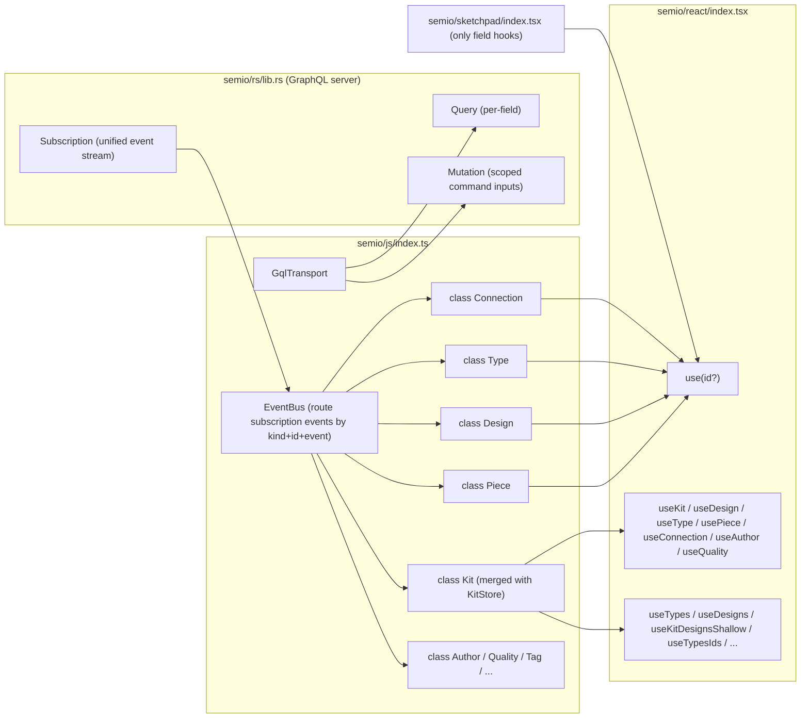

## 1. Direction

[semio/js/index.ts](semio/js/index.ts) is collapsed to a single layer of CQRS entity classes that talk only GraphQL to [semio/rs/lib.rs](semio/rs/lib.rs). `Kit` and the legacy `KitStore` merge into one `Kit` class. Every entity (`Kit`, `Design`, `Type`, `Piece`, `Connection`, `Author`, `Quality`, `Tag`, `Concept`, `Family`, `File`, `Folder`, `Layer`, `Group`, `Stat`, `Prop`, `Attribute`, `Representation`, `Connector`, `Port`, `Plane`, `Coordinate`, `Point`, `Vector`, `Camera`, `Side`, `Benchmark`, `Position`, `Place`, `Location`) follows the same CQRS pattern over the schema in [semio/graphql/target.schema.graphql](semio/graphql/target.schema.graphql).



## 2. CQRS surface on every entity class

Each class has three things, all driven by [semio/graphql/target.schema.graphql](semio/graphql/target.schema.graphql):

1. **Reads** — three methods per field from the schema's data/computed fields:
   - `field(): Promise<T>` — one-off GraphQL `Query` against [semio/rs/lib.rs](semio/rs/lib.rs).
   - `fieldSync(): T | undefined` — synchronous read from the in-class cache. For object-typed fields (`Plane`, `Coordinate`, `Position`, `Side`, …) the cache holds the same instance reference until the field changes, so React `useSyncExternalStore.getSnapshot` returns a stable reference and skips rerenders.
   - `on<Event>(cb: (next: T) => void): Unsubscribe` — subscribe to the routed event channel. Event names follow the schema's Edit/Modification union (`onRenamed`, `onDescriptionChanged`, `onMoved`, `onDragged`, `onFixed`, `onFlattened`, `onPlaneChanged`, `onCenterChanged`, `onAttributeAdded`, `onAttributeRemoved`, `onPieceAdded`, `onPieceDeleted`, `onConnectionAdded`, `onConnectionDeleted`, `onPortCreated`, `onPortDeleted`, `onConnectorAdded`, `onConnectorRemoved`, `onTagCreated`, `onTagDeleted`, `onConceptCreated`, `onConceptDeleted`, `onQualityCreated`, `onQualityDeleted`, `onTypeCreated`, `onTypeDeleted`, `onDesignCreated`, `onDesignDeleted`, `onCheckpointCreated`, …).

2. **Operations** — one method per leaf command in the matching `*OperationInput` from §`#region Commands`. Method signatures mirror the schema (same names, same args, same nullability). Returns `Promise<SetResult>` whose `ok` payload includes the operation `ID!`.

3. **Navigation methods** — for command-input fields that nest into another scoped command input, the class returns the matching child class instance (lazy, cached by id). E.g. `design.piece(id) → Piece`, `design.pieces(ids) → PiecesOps`, `kit.type(id) → Type`, `type.port(id) → Port`, `type.connector(id) → Connector`, etc.

```ts
class Piece {
  constructor(transport: GqlTransport, bus: EventBus, id: string) { /* ... */ }
  get id(): string;
  // reads (one of each set per Piece field in target.schema.graphql)
  name(): Promise<string>;             nameSync(): string | undefined;             onRenamed(cb): Unsubscribe;
  description(): Promise<string>;      descriptionSync(): string | undefined;      onDescriptionChanged(cb): Unsubscribe;
  position(): Promise<Position>;       positionSync(): Position | undefined;        onPositionChanged(cb): Unsubscribe;
  plane(): Promise<Plane>;             planeSync(): Plane | undefined;             onPlaneChanged(cb): Unsubscribe;
  center(): Promise<Coordinate>;       centerSync(): Coordinate | undefined;       onCenterChanged(cb): Unsubscribe;
  scale(): Promise<number>;            scaleSync(): number | undefined;            onScaleChanged(cb): Unsubscribe;
  blueprint(): Promise<Type | Design>; blueprintSync(): Type | Design | undefined; onBlueprintChanged(cb): Unsubscribe;
  flatPosition(): Promise<Position>;   flatPositionSync(): Position | undefined;   onFlatPositionChanged(cb): Unsubscribe;
  flatPlane(): Promise<Plane>;         flatPlaneSync(): Plane | undefined;         onFlatPlaneChanged(cb): Unsubscribe;
  flatCenter(): Promise<Coordinate>;   flatCenterSync(): Coordinate | undefined;   onFlatCenterChanged(cb): Unsubscribe;
  parentPiece(): Promise<Piece | undefined>; parentPieceSync(): Piece | undefined;  onParentPieceChanged(cb): Unsubscribe;
  parentConnection(): Promise<Connection | undefined>; parentConnectionSync(): Connection | undefined; onParentConnectionChanged(cb): Unsubscribe;
  childPieces(): Promise<readonly Piece[]>; childPiecesSync(): readonly Piece[] | undefined; onChildPiecesChanged(cb): Unsubscribe;
  childConnections(): Promise<readonly Connection[]>; childConnectionsSync(): readonly Connection[] | undefined; onChildConnectionsChanged(cb): Unsubscribe;
  depth(): Promise<number>;            depthSync(): number | undefined;            onDepthChanged(cb): Unsubscribe;
  connectionKind(): Promise<PieceConnectionKind | undefined>; connectionKindSync(): PieceConnectionKind | undefined; onConnectionKindChanged(cb): Unsubscribe;
  attributes(): Promise<readonly Attribute[]>; attributesSync(): readonly Attribute[] | undefined; onAttributesChanged(cb): Unsubscribe;
  // operations — 1:1 with PieceOperationInput
  rename(newName: string): Promise<SetResult>;
  changeDescription(newDescription: string): Promise<SetResult>;
  drag(offset: OffsetInput): Promise<SetResult>;
  move(position: PositionInput): Promise<SetResult>;
  fix(): Promise<SetResult>;
  changeBlueprint(blueprintId: string): Promise<SetResult>;
  addAttribute(key: string, value: string, definition: string): Promise<SetResult>;
  removeAttribute(id: string): Promise<SetResult>;
  removeAttributes(ids: readonly string[]): Promise<SetResult>;
}
```

The full operation surface per class (mirrors [semio/graphql/target.schema.graphql](semio/graphql/target.schema.graphql) exactly):

- **`Kit`** (merged with `KitStore`; mirrors `KitOperationInput`): owns `GqlTransport` + `EventBus`. Operations: `rename(newName)`, `changeDescription(newDescription)`, `createTag(name, description?, icon?, order?)`, `tag(id) → Tag`, `deleteTag(id)`, `deleteTags(ids)`, `createConcept(name, description?, icon?, order?)`, `concept(id) → Concept`, `deleteConcept(id)`, `deleteConcepts(ids)`, `createQuality(key, value?, unit?, definition?, description?, icon?)`, `quality(id) → Quality`, `deleteQuality(id)`, `deleteQualities(ids)`, `createType(name, description?, icon?, image?, unit?)`, `type(id) → Type`, `deleteType(id)`, `deleteTypes(ids)`. Plus version/session control: `startNewChange()`, `save()`, `createCheckpoint(message)`, `unsavedChange(id) → Kit` scope helper, `startAlternative(name?)`, `alternative(id)`, `integrateAlternative(id)`, `start()`, `end()`, `login(username, passwordHash, hubUrl?)`, `logout()`, `hydrateBundleJson(json)`.
- **`Design`** (mirrors `DesignOperationInput`): `rename(newName)`, `changeDescription(newDescription)`, `flatten()`, `addAttribute`, `removeAttribute(id)`, `removeAttributes(ids)`, `addFixedPiece(blueprintId, position, name?, description?)`, `addChildPieceWithParentConnection(blueprintId, parentPieceId, parentConnector, childConnector, name?, description?, position?, scale?)`, `addHangingChildPieceWithParentConnection(blueprintId, parentPieceId, parentConnector, childConnector, position, name?, description?, scale?)`, `piece(id) → Piece`, `pieces(ids) → PiecesOps`, `deletePiece(id)`, `deletePieces(ids)`, `deletePiecesAndConnections(pieceIds, connectionIds)`.
- **`PiecesOps`** (small helper returned by `design.pieces(ids)`; mirrors `PiecesOperationInput`): `drag(offset)`, `move(offset)`, `fix()`, `changeBlueprint(blueprintId)`. Has no reads — it's a pure command scope.
- **`Type`** (mirrors `TypeOperationInput`): `rename(newName)`, `changeDescription(newDescription)`, `changeIcon(newIcon)`, attributes ops, `createPort(code?, label?, description?, icon?, order?)`, `port(id) → Port`, `deletePort(id)`, `deletePorts(ids)`, `addConnector(code, description?, icon?, portId?)`, `connector(id) → Connector`, `removeConnector(id)`, `removeConnectors(ids)`.
- **`Port`** (mirrors `PortOperationInput`): `rename(newCode, newLabel?)`, `changeDescription(newDescription)`, `changeIcon(newIcon)`, attributes ops.
- **`Connector`** (mirrors `ConnectorOperationInput`): `rename(newCode)`, `changeDescription(newDescription)`, `changeIcon(newIcon)`.
- **`Tag`** / **`Concept`** (mirror `TagOperationInput` / `ConceptOperationInput`): `rename(newName)`, `changeDescription(newDescription)`, `changeIcon(newIcon)`, attributes ops.
- **`Quality`** (mirrors `QualityOperationInput`): `rename(newKey)`, `changeDescription(newDescription)`, `changeIcon(newIcon)`, attributes ops.
- **`Piece`** (mirrors `PieceOperationInput`): see snippet above.
- **`Connection`**, **`Author`**: per the connection / author fields the schema currently does not declare a dedicated `*OperationInput` for these, so the JS class only carries the read API; their commands (e.g. add/remove connection, addAuthor) live on the parent `Design` / `Kit` per the schema. If the schema later grows `ConnectionOperationInput` / `AuthorOperationInput`, the matching methods are added then.
- **Value-object classes** (`Plane`, `Coordinate`, `Position`, `Point`, `Vector`, `Side`, `Place`, `Location`, `Camera`, `Stat`, `Prop`, `Attribute`, `Representation`, `Family`, `File`, `Folder`, `Layer`, `Group`, `Benchmark`): the schema does not expose dedicated `*OperationInput`s for them either. They are read-only classes with the same `field()` / `fieldSync()` / `on<Event>(cb)` triple per field, but no command methods. They are mutated through their owners (Kit/Design/Piece/Connection/Type/Port).

Every command method translates to one `mutation { session { ... } }` GraphQL request. The session/version/change scoping (`session.theKit.unsavedChange(activeChangeId).kit.<…>`, or `session.alternative(…)`, or `session.theKit.…` for save / checkpoint flows) is encapsulated by `Kit`; child classes hold a reference to their owning `Kit` and route their own command through it.

The transport speaks only GraphQL:
- Reads: a single `GqlTransport.query(doc, vars)` per field method (typed `Query` selection with the right `node(id)` lookup).
- Subscriptions: one persistent `subscription { event }` per `Kit` instance; the `EventBus` deserializes each `Json` event, looks up its kind + entity id + field affinity, and pushes typed values into all registered channels.
- Commands: one `mutation { session { ... } }` per command; the resulting `ID!` is stored locally as the active change id when needed.

## 3. Public exports of `semio/js/index.ts`

Keep only:

- The entity classes: `Kit` (merged with `KitStore`), `Design`, `Type`, `Piece`, `Connection`, `Author`, `Quality`, `Tag`, `Concept`, `Family`, `File`, `Folder`, `Layer`, `Group`, `Stat`, `Prop`, `Attribute`, `Representation`, `Connector`, `Port`, `Plane`, `Coordinate`, `Point`, `Vector`, `Camera`, `Side`, `Benchmark`, `Position`, `Place`, `Location`.
- The minimal types those classes need in their public method signatures, mirrored from [semio/graphql/target.schema.graphql](semio/graphql/target.schema.graphql) input objects: `OffsetInput`, `PositionInput`, `PlaneInput`, `CoordinateInput`, `PointInput`, `VectorInput`, `LocationInput`, `BackboneConfig`, `ConflictResolution`, `SetResult`, `SetError`, `Unsubscribe`, plus the GraphQL-derived event union types if a method signature references them.
- One factory: `openKit(config: { rsUrl?: string; backbone?: BackboneConfig; ... }): Promise<Kit>`. No `createKitStoreClient`, no `createSessionKitStore`, no `applyKitClientSnapshotToLocalStore`.

Delete entirely (full list — these were the bulk of the current 7715-line file):

- The legacy `KitStore` class and its client family — `KitStoreClient`, `WasmKitStoreClient`, `createKitStoreClient`, `kitStoreFromKitStoreClient`, `getKitClientReadPoint`, `theKitReadPoint`, `KitReadPoint`, `kitReadPointKey`.
- All host stores: `KitHostStore`, `KitHostStoreSnapshot`, `KitStoreSnapshot`, `KitSyncSnapshot`, `DEFAULT_KIT_SYNC`, `InMemoryKitStore`, `createSessionKitStore`, `createJsonFileKitStore`, `createFolderKitStore`, `applyKitClientSnapshotToLocalStore`, `KitBundlePersistingStore`, `KIT_BUNDLE_BOOTSTRAPPED`, `KitJsonFileAdapter`, `KitFolderAdapter`, `KitBinaryStore`.
- All read commands and aggregate read stores: `ReadKitCommand`, `ReadDesignCommand`, `ReadPieceCommand`, `ReadTypeCommand`, `SemioKitLiveReadStore`, `KitDesignReadStore`, `KitShallowListStore`, `KitViewCatalogStore`, `getSemioKitLiveReadStore`, every `getSnapshot` aggregate path. Reads are exclusively through the field methods on the classes.
- Free-standing write helpers, replaced by class methods: `kitStoreClientAddPiece`, `kitStoreClientAddConnection`, `kitStoreClientAddChildByKind`, `kitStoreClientUpdatePiece`, `kitStoreClientUpdateConnection`, `kitStoreClientRemovePiece`, `kitStoreClientRemoveChildByKind`, `submitKitChangeCommands`, `buildSchemaEntityChangeCommands`, `writeKitStoreClientSchemaField`, `StoreField`, `StoreCommand`, `CommandBuilder`.
- Zod schemas, DTO types, metadata/shallow types: every `*Schema`, every `*Dto`, every `*MetadataDto`, every `*Shallow`, `KitFullDto`, `KitFullDtoSchema`, `normalizeKitFullDtoFolderPaths`, `KitJsonObjectDto`, `KitJsonTreeDto`, `JsonValue`, `JsonObject`, `parseJsonValue`, `KitGraphqlResponseEnvelope`, `ReadonlyDto`, `kitChangeSemanticKindToGraphQl`, `KitChangeKind`, `KitChangeSemanticKindGql`, `KitCommandLifecycleEvent`, `SEMIO_KIT_STORE_CONTROL_COMMAND_KINDS`, `SemioKitStoreControlCommandName`.
- Helper utilities tied to the deleted graph: `asKitInstance`, `kitEventAffectsPieceLiveRead`, `kitEventAffectsCanUndoRedo`, `kitEventAffectsDesignQualitySumRead`, `kitEventAffectsKitColoredConnectorsRead`, `kitEventAffectsReplaceableCatalogRead`, `kitEventAffectsTypeScopedRead`, `kitEventTouchesDesign`, `resolveDesignIdForPieceOrConnection`, `isKitCommandLifecycleEvent`, `isKitBundlePersistingStore`, `getStoredKitFileUrls`, `getOrCreateKitFileState`, `getKitFileProvider`, `getExistingKitFileProvider`, `getReadableKitFileUrl`, `fetchReadableKitFileBlob`, `getKitFileStoragePath`, `createKitFileObjectUrl`, `isBrowserReadableFileUrl`, `getKitPorts`, `id` (uuid helper kept only if `Kit` constructor needs it), `TOLERANCE`, `ICON_WIDTH`, `DiffStatus`, `EntityLifecycle`, `FlatMerkleCacheEntry`, `OperationResult`, `DesignOperationResult`, `DesignDiffOperationResult`, `AlgorithmError`, `PiecePlacementRowDto`.
- The `*Diff` types and the `applyDiff` machinery: `*DiffSchema`, `*Diff`, `*sDiffSchema`, `*sDiff`, `Design.applyDiff`, `Design.previewWithDiff`, `Design.dragBySelection`, `Design.deletePiecesAndConnectionsDiff`, `Type.pickBestRepresentation`, `Kit.copyDesignOp`, `Kit.pasteDesignOp`, `Kit.flattenDesignCachedOp`, `Kit.findParentPieceInDesign`, `Kit.findParentConnectionForPieceInDesign`, `Kit.findChildrenPiecesInDesign`, `Kit.findDesign`, `Kit.findType`, `Kit.piecesMetadataFor`, `Kit.fromDto`, `Kit.toDto`, `Kit.toJSON`, `Kit.deserialize`, `Kit.serialize`, `Kit.ensure`. All graph navigation moves to the GraphQL server; the JS classes only hold the local cache.
- Inline subagent / view stores: `KitViewCatalogKey`, `KitDesignReadKind`, `KitShallowListKind`, `KitStoreReadSnap`, `KitAlternativeSummary` (re-derive from class subscriptions if needed in react).

The `kit-store.worker.ts` worker is rewritten to host only the GraphQL transport (`async-graphql` over WASM) and to forward `subscription { event }` payloads to the main thread; no DTO marshaling.

## 4. `semio/react/index.tsx` shape

### Resolution rules (every hook)

- Every read / mutation hook accepts a single optional argument `idValue?: string`. When `idValue` is omitted the hook reads the matching scope context (`KitScope`, `DesignScope`, `TypeScope`, `PortScope`, `ConnectorScope`, `PieceScope`, `ConnectionScope`, `AuthorScope`, `QualityScope`, `TagScope`, `ConceptScope`, …). When `idValue` is provided it wins over the scope.
- There are no `useResolved*` helpers. Resolution is the explicit composition `useKit()` → `kit.<child>(id)`, `useDesign()` → `design.<child>(id)`, `useType()` → `type.<child>(id)`, `useDesign().piece(id)` → `Piece`, `useDesign().connection(id)` → `Connection`, `useType().port(id)` → `Port`, `useType().connector(id)` → `Connector`, etc. Inside the per-field hook body the chain is written out.
- The entity-identity selectors return the class instance from §2, never a DTO. Their union signatures are:

  ```ts
  export function useKit(): Kit | null;
  export function useDesign(idValue?: string): Design | null;       // useKit().design(id ?? useDesignScope()?.id)
  export function useType(idValue?: string): Type | null;           // useKit().type(id ?? useTypeScope()?.id)
  export function usePiece(idValue?: string): Piece | null;         // useDesign().piece(id ?? usePieceScope()?.id)
  export function useConnection(idValue?: string): Connection | null; // useDesign().connection(id ?? useConnectionScope()?.id)
  export function useAuthor(idValue?: string): Author | null;       // useKit().author(id ?? useAuthorScope()?.id)
  export function useQuality(idValue?: string): Quality | null;     // useKit().quality(id ?? useQualityScope()?.id)
  ```

  `Connection`, `Author`, `Quality` get matching navigation methods on `Design` / `Kit` (`design.connection(id)`, `kit.author(id)`, `kit.quality(id)`) so the chain composes cleanly.

### Per-field hook pattern

Every `use<Entity><Field>(idValue?: string)` walks the same chain and binds the field through `useSyncExternalStore`. Sample implementations (this is the *only* pattern used):

```ts
export function usePieceName(idValue?: string): KitFieldBinding<string> {
  const design = useDesign();
  const id = idValue ?? React.useContext(PieceScopeContext)?.id;
  const piece = design && id ? design.piece(id) : null;
  const subscribe = React.useCallback(
    (cb: () => void) => piece?.onRenamed(() => cb()) ?? noop,
    [piece],
  );
  const getSnap = React.useCallback(() => piece?.nameSync(), [piece]);
  const value = React.useSyncExternalStore(subscribe, getSnap, getSnap);
  const run = React.useCallback(
    async (next: string) =>
      piece ? piece.rename(next) : ({ ok: false, error: { kind: "Readonly", message: "no piece" } } as const),
    [piece],
  );
  return [value, run, piece ? WRITE_STATUS_IDLE : WRITE_STATUS_READONLY] as const;
}

export function usePiecePlane(idValue?: string): KitFieldBinding<Plane> {
  const design = useDesign();
  const id = idValue ?? React.useContext(PieceScopeContext)?.id;
  const piece = design && id ? design.piece(id) : null;
  const subscribe = React.useCallback(
    (cb: () => void) => piece?.onPlaneChanged(() => cb()) ?? noop,
    [piece],
  );
  const getSnap = React.useCallback(() => piece?.planeSync(), [piece]); // stable Plane reference until the event fires
  const value = React.useSyncExternalStore(subscribe, getSnap, getSnap);
  const run = React.useCallback(
    async (next: PlaneInput) =>
      piece ? piece.move({ plane: next, center: piece.centerSync() ?? { u: 0, v: 0 } }) : ({ ok: false, error: { kind: "Readonly", message: "no piece" } } as const),
    [piece],
  );
  return [value, run, piece ? WRITE_STATUS_IDLE : WRITE_STATUS_READONLY] as const;
}

export function usePieceFlatPlane(idValue?: string): HookRead<Plane> {
  const design = useDesign();
  const id = idValue ?? React.useContext(PieceScopeContext)?.id;
  const piece = design && id ? design.piece(id) : null;
  const subscribe = React.useCallback(
    (cb: () => void) => piece?.onFlatPlaneChanged(() => cb()) ?? noop,
    [piece],
  );
  const getSnap = React.useCallback(() => piece?.flatPlaneSync(), [piece]);
  const value = React.useSyncExternalStore(subscribe, getSnap, getSnap);
  return [value, piece ? WRITE_STATUS_IDLE : WRITE_STATUS_READONLY] as const;
}

export function usePieceFlatCenter(idValue?: string): HookRead<Coordinate> {
  const design = useDesign();
  const id = idValue ?? React.useContext(PieceScopeContext)?.id;
  const piece = design && id ? design.piece(id) : null;
  const subscribe = React.useCallback(
    (cb: () => void) => piece?.onFlatCenterChanged(() => cb()) ?? noop,
    [piece],
  );
  const getSnap = React.useCallback(() => piece?.flatCenterSync(), [piece]);
  const value = React.useSyncExternalStore(subscribe, getSnap, getSnap);
  return [value, piece ? WRITE_STATUS_IDLE : WRITE_STATUS_READONLY] as const;
}
```

Hooks for `Type` fields use `useKit()` → `kit.type(id ?? useTypeScope()?.id)`. Hooks for `Port` fields use `useType().port(id ?? usePortScope()?.id)`. Hooks for `Connector` fields use `useType().connector(id ?? useConnectorScope()?.id)`. Hooks for `Connection` fields use `useDesign().connection(id ?? useConnectionScope()?.id)`. Hooks for `Author` / `Quality` / `Tag` / `Concept` fields use `useKit().author(id?)` / `kit.quality(id?)` / `kit.tag(id?)` / `kit.concept(id?)`.

### Kept exports

- Entity-identity selectors (return class instances): `useKit`, `useDesign`, `useType`, `usePiece`, `useConnection`, `useAuthor`, `useQuality` (plus the `*ById` aliases).
- Bulk / list / aggregate / metadata / shallow hooks: `useTypes`, `useDesigns`, `usePieces`, `useConnections`, `useAuthors`, `useTypesIds`, `useDesignsIds`, `useTypesMetadata`, `useDesignsMetadata`, `useTypesFull`, `useDesignsFull`, `useFilesFull`, `useTagsFull`, `useKitDesignsShallow`, `useKitTypesShallow`, `useKitAuthorsShallow`, `useKitPieces`, `useKitConnections`, `usePiecesMetadataMap`, `usePieceMetadata`, `useIncludedDesigns`, `useDesignClusterableGroups`, `useDesignQualitySum`, `useTypeBestRepresentation`, `useKitColoredConnectors`, `useReplacableTypes`, `useReplacableDesigns`, `useExplodeableDesignNodes`, `useOpenKitGuids`, `useActiveKitGuid`, `useOpenKitShallows`, `useRegistryHasKit`, `useRegistryKitPersistenceKind`, `useKitAlternatives`, `useKitAlternativeSelection`. Each is a thin composition of a list-id field hook plus per-id reads, all on top of the class instances (e.g. `useTypes` = `useKit()` + `kit.typeIdsSync()` + per-id `kit.type(id)` mapping).
- Per-field hooks following the pattern above.
- Scope components + scope hooks: `KitScope`, `DesignScope`, `TypeScope`, `PortScope`, `ConnectorScope`, `PieceScope`, `ConnectionScope`, `AuthorScope`, `QualityScope`, `TagScope`, `ConceptScope`, plus their `use*Scope`, `useIs*Scope`, `useResolvedKitIdentifier`. The user wrote `<PieceContext id>` informally — that maps to the existing `<PieceScope id="...">` component.
- Command hooks (`useUndo`, `useRedo`, `useDeletePiece`, `useUpdatePiece`, `useFlattenDesign`, …) — each implemented as a thin wrapper that calls a class method on the resolved entity instance.
- Backbone hooks (`useBackboneStatus`, `useAttachBackbone`, `useDetachBackbone`, `useListConflicts`, `useResolveConflict`, `useSyncNow`) — each calls the matching `Kit` method.
- Diagnostics: `useWriteIndicator`, `useWriteQueue`, `useSchemaEvents`, `useSetErrors`, `useKitSync`, `useOptimistic`, `usePendingTriad`.

### Deleted exports

- Whole-object triads: `usePieceTriad`, `useDesignTriad`, `useTypeTriad`, `useAuthorTriad`, `useQualityTriad`, `useConnectionTriad`.
- Whole-object accessors: `useFolder`, `useFile`, `useTag`, `useConcept`, `useFamily`, `useGroup`, `usePort`, `useProp`, `useStat`, `useBenchmark`, `useCoordinate`, `usePoint`, `useVector`, `usePlane`, `useCamera`, `useAttribute`, `useLocation`, `useRepresentation`, `useConnector`, `useActor`, `useUser`, `useAgent`, `useSessionActorInput`, every `*Input` and `*PatchInput` whole-object hook (their per-field versions remain).
- Snapshot exports: `useKitSnapshot`, `useKitStoreSnapshot`, `useKitHostStore`, `useKitStore`, `useSemioStoreSelector`, `useSemioReadSnap`, `useSemioKitScopedView`. `useKitStoreClient` is removed entirely — the worker handle is now `Kit`; consumers call `useKit()`.
- Generic schema readers: `useSchemaObjectState`, `useSchemaObjectMutation`, `useSchemaObjectValue`, `useSchemaFieldValue`, `useSchemaFieldMutation`, `useSchemaFieldState`, `useSchemaScope`, `useKitRuntimeSafe`, `useKitRegistry`, `useKitRegistrySafe`. The `IndexedSchemaState` / `resolveReference` / `readSchemaFieldValue` / `KitRuntimeContext` machinery is deleted (the new runtime context simply carries a `Kit` instance).
- Helper hooks that pre-resolved an entity from selectors: any `useResolved<Entity>` (e.g. `useResolvedPiece`, `useResolvedDesign`) — the per-field hooks now spell out `useDesign().piece(id)` etc. directly.
- Whole-snapshot file/binary helpers: `useKitFileBlobUrl`, `useKitStoredFileUrls`, `useFileUrls`, `useKitFileState`, `useKitPersistenceKind`, `useKitPersistenceSource`, `useKitBinary`, `useEmbedKitFile`, `useKitFileUrl`. Re-introduce later as field hooks if a use case appears.
- Re-exports of deleted js symbols (`asKitInstance`, `Kit`-class static helpers, `KitEntityStore`, `*Store` legacy aliases, `KitFileState`, …).

## 5. Sketchpad migration ([semio/sketchpad/index.tsx](semio/sketchpad/index.tsx))

Sketchpad must compile without importing any of:

- the named entity-identity selectors `useKit`, `useDesign`, `useType`, `usePiece`, `useConnection`, `useAuthor`, `useQuality` (and their `*ById` aliases),
- any bulk / list / aggregate / metadata / shallow hook from §4 (e.g. `useTypes`, `useDesigns`, `useTypesIds`, `useKitDesignsShallow`, `useTypesFull`, …),
- any deleted hook from §4,
- any entity class as a runtime read carrier (`Piece`, `Design`, `Type`, `Connection`, `Author`, `Quality`, `Kit`).

Per call site (64 currently identified by `\b(useKit|useDesign|useType|usePiece|useConnection|useAuthor|useQuality)\b`), inspect what fields the JSX actually reads and replace with explicit per-field hooks:

- `const piece = usePiece() as Piece` → `const id = usePieceScope()?.id; const [name] = usePieceName(id); const [plane] = usePiecePlane(id); …`
- `const type = useType(undefined, undefined, true) as Type` → `useTypeName(typeId)` + `useTypeRepresentationIds(typeId)` (then per-representation field hooks) + `useTypePortIds(typeId)` (then per-port field hooks).
- `const connection = useConnection() as Connection` → `useConnectionConnectedPieceId(id)`, `useConnectionConnectingPieceId(id)`, `useConnectionGap(id)`, `useConnectionShift(id)`, `useConnectionRise(id)`, `useConnectionRotation(id)`, `useConnectionTurn(id)`, `useConnectionTilt(id)`, …
- `const design = useDesign() as Design` → `useDesignName(designId)`, `useDesignPieceIds(designId)`, then iterate ids and render child components reading per-piece fields.

Where a list of children is needed, sketchpad calls a per-entity list-id field hook (e.g. `useDesignPieceIds(designId)` returning `readonly string[]`) and renders one child component per id. Bulk hooks like `useTypes` stay in the API but sketchpad does not call them.

Missing per-field hooks that sketchpad needs are added to [semio/react/index.tsx](semio/react/index.tsx) following the pattern in §4 (one method on the matching class, one hook in react). Likely additions: `useDesignPieceIds`, `useDesignConnectionIds`, `useTypeRepresentationIds`, `useTypePortIds`, `useTypeConnectorIds`, `useConnectionConnectedPieceId`, `useConnectionConnectingPieceId`, `useKitTypeIds`, `useKitDesignIds`, `useKitAuthorIds`, `useKitQualityIds`.

## 6. Validation

- `npm run depcruise:layers` for the relevant packages.
- `npm run typecheck` for `semio/js`, `semio/react`, `semio/sketchpad` (see each `tsconfig.json`).
- Run the inline vitest blocks embedded in [semio/js/index.ts](semio/js/index.ts) and [semio/react/index.tsx](semio/react/index.tsx). Update tests that asserted on deleted exports (`useKitSnapshot`, `useSchemaObjectState`, `KitFullDto`, `Kit.toJSON`, `store.getSnapshot().kit.id`, …). Add tests:
  - `Piece` class: `nameSync`/`name()`/`onRenamed` round-trip after a `rename` mutation on a stub transport.
  - `Piece.planeSync()` returns the same object reference until a `Moved`/`PlaneChanged` event fires.
  - `usePieceName`/`usePiecePlane`/`usePieceFlatPlane`/`usePieceFlatCenter` rerender exactly once when the matching event fires (use a fake `EventBus`).
- Add an inline negative test in `semio/sketchpad/index.tsx` test region that grep-asserts the file source contains zero matches for the banned hooks listed in §5.
- Manual: launch sketchpad, open a kit, drag a piece, confirm rendering still works using only field hooks (`[DEBUG]` console traces on hook subscriptions).

## 7. Ticket + execution

- Open ticket (slug `field-only-kit-reads-cqrs-classes`) under the existing kit-data SSOT goal via the repo MCP; place all temporary scripts in its folder.
- Delegate three hour-scale subagents in parallel:
  - **A** ([semio/js/index.ts](semio/js/index.ts) + [semio/js/kit-store.worker.ts](semio/js/kit-store.worker.ts)): introduce `GqlTransport` + `EventBus` + Entity base, reshape every entity class into the CQRS pattern (3 read methods per field, command methods 1:1 with the schema's scoped command inputs), merge `KitStore` into `Kit`, delete every non-class export listed in §3.
  - **B** ([semio/react/index.tsx](semio/react/index.tsx)): rewire the kept bulk + identity hooks onto the new classes, rewrite per-field hooks to bind class fields through `useSyncExternalStore`, delete the public symbols listed in §4, add the missing field hooks listed in §5.
  - **C** ([semio/sketchpad/index.tsx](semio/sketchpad/index.tsx)): rewrite all 64 banned-hook usages with per-field hook compositions, fan out to per-id child components, and add the negative-grep inline test.
- Coordinator (this agent) integrates, runs typecheck / depcruise / tests, fixes fallout, closes the ticket with a per-file summary.
