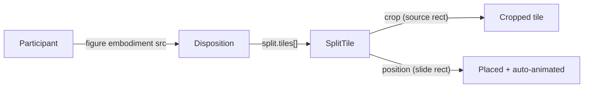

## Overview

Extend the render-independent core so a `Disposition` of a figure can declare a `split` into many tiles. Each tile is a normalized crop of the figure's source image with its own slide `position`, `emphasis`, and `style`. Because each tile renders with a stable reveal `data-id`, moving/scaling/hiding tiles across arrangements is animated automatically by reveal.js auto-animate (no manual animation, per the renderer rule). Then wire it into projektetage to split the catalogue figure into a 3×5 grid that is taken apart, scaled down, and partially hidden.

## 1. Core model + helpers

File: [framework/product/presentation/core/index.ts](framework/product/presentation/core/index.ts)

- In `//#region 🔖Disposition`, add types and extend `Disposition`:
  - `SplitTile`: `{ key: string; crop: DispositionPosition; position: DispositionPosition; emphasis?: ParticipantEmphasis; style?: DispositionStyle }` (`crop` = normalized 0..1 source rectangle of the figure; `position` = normalized 0..1 slide rectangle).
  - `DispositionSplit`: `{ readonly tiles: readonly SplitTile[] }`.
  - Add `readonly split?: DispositionSplit` to `Disposition`.
- In `//#region 🔖Morph`, add `tileMorphId(participantId, tileKey)` returning ``${participantId}--tile--${tileKey}`` (stable per-tile reveal `data-id`).
- New `//#region 🔖Split`:
  - `splitFigureGrid(spec)` where `spec = { rows, columns, frame: DispositionPosition, gap?: number, emphasis?, keyPrefix? }`. Returns `SplitTile[]` with one tile per cell:
    - `crop = { x: c/columns, y: r/rows, width: 1/columns, height: 1/rows }`
    - `key =` ${keyPrefix ?? "tile"}-r${r}-c${c}``
    - `position` packs the cell into `frame` honoring `gap` (cellW = (frame.width - gap*(columns-1))/columns, etc.). With `gap = 0` the tiles reconstruct the image exactly; with a `gap` and a smaller `frame` they are "taken apart and scaled down".
  - Hiding tiles / "only a portion shows" needs no new API: filter the tile array for that arrangement's `split.tiles`.
- Extend `ResolvedDisposition` (`//#region 🔖Resolved`) with `readonly split?: DispositionSplit`, and have `resolveArrangement` (`//#region 🔖Resolve`) pass `disposition.split` through.
- Tests in `//#region 🧪Tests`: `splitFigureGrid` yields `rows*columns` tiles, correct crops/keys, reconstructs `frame` at `gap = 0`, respects `gap`; `resolveArrangement` surfaces `split`; `tileMorphId` format.

## 2. React renderer

File: [framework/product/presentation/renderer/react/index.tsx](framework/product/presentation/renderer/react/index.tsx)

- Import `SplitTile`/`DispositionSplit` types and `tileMorphId`; re-export `SplitTile`, `DispositionSplit`, `splitFigureGrid`, `tileMorphId`.
- Add `FigureTileView` rendering a cropped tile via background-image (deterministic, aspect-correct):
  - `backgroundImage: url(embodiment.src)`, `backgroundRepeat: no-repeat`
  - `backgroundSize:` ${100/crop.width}% ${100/crop.height}%``
  - `backgroundPosition`: `crop.width >= 1 ? 0% : (crop.x/(1-crop.width))*100%` (same for Y) — standard CSS sprite formula
  - root `div` has `data-id={tileMorphId(participantId, tile.key)}` so reveal morphs it across arrangements.
- In `MorphDispositionView`: when `disposition.split` is set and `embodiment.kind === "figure"`, render a `Fragment` of tiles, each wrapped in an absolutely-positioned frame built from `tile.position` + `tile.style` (reuse `dispositionFrameStyle`), instead of the single `DispositionFrame`. Non-figure or no-split keeps current behavior.
- In `ArrangementSection`, treat the arrangement as positioned when any disposition has `position` OR `split` (so the `presentation-arrangement-canvas` is used).
- Tests in `//#region 🧪Tests`: a split figure disposition renders `tiles.length` nodes matching `[data-id^="catalogue--tile--"]`, with `background-image` set and absolute frames; hiding a tile removes its node.

File: [framework/product/presentation/renderer/react/globals.css](framework/product/presentation/renderer/react/globals.css)

- Add `.reveal .presentation-figure-tile { width:100%; height:100%; background-repeat:no-repeat; }` and ensure its frame keeps `overflow:hidden` (the existing `.presentation-disposition-frame` already does).

## 3. Projektetage demo

File: [mit-bestand/präsentation/33.projektetage/index.ts](mit-bestand/präsentation/33.projektetage/index.ts)

- Import `splitFigureGrid` from `@framework/presentation/core`.
- The catalogue PNG is 1222×896 (aspect ≈ 1.364). Define an aspect-matched centered frame `CATALOGUE_FRAME` (e.g. `{ x: 0.127, y: 0.1, width: 0.746, height: 0.75 }`) and set the existing `catalogue` disposition to it, so the whole-figure slide and the assembled-tiles slide line up (seamless fade).
- Insert new arrangements into `mediaThought` after `catalogue` (all reference participant `catalogue`):
  - `catalogue-tiles`: `split: { tiles: splitFigureGrid({ rows: 3, columns: 5, frame: CATALOGUE_FRAME, gap: 0 }) }` — looks identical to the figure; tiles are now individually addressable.
  - `catalogue-split`: `splitFigureGrid({ rows: 3, columns: 5, frame: <smaller centered frame>, gap: 0.02 })` — every tile flies apart and scales down (auto-animated from the assembled keys).
  - `catalogue-focus`: same grid but `.filter` to a few tile keys (e.g. center row) placed larger — the rest fade out ("only a portion shows / tiles hidden").
- Keep `media-suite` last.
- Update tests in `//#region 🧪Tests`: `countArrangements(deck)` becomes 12 (7 intro + 5 media); assert the media thought has a disposition with `split` of 15 tiles.

## 4. Ticket + verification

- Open a repo ticket (`ticket_open`) associated with the most appropriate goal (read `repo://goals` first) before editing; close it (`ticket_close`) with the file list when done.
- Run core + renderer tests via nx (`bun nx run @framework/presentation/core:test`, `...renderer/react:test`) and the deck test, then run the projektetage dev server to visually confirm the split → spread → focus choreography in the browser (console-verify auto-animate matching).

## Notes / decisions

- Split is modeled on the `Disposition` (matches "a disposition of a figure can include splitting it up"), reusing the existing figure participant rather than creating 15 participants.
- Hiding and "partial" states require no new API — they are just a filtered `tiles` array per arrangement; absent tiles fade out via reveal.
- All transitions stay declarative target-slides only; reveal.js auto-animate does the motion (honoring renderer AGENTS rule).

