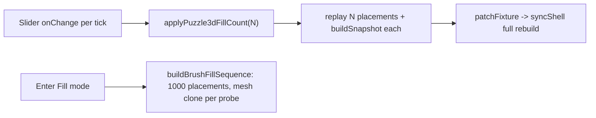

# Puzzle 3D Fill Slider Performance

## Problem

Two synchronous main-thread bottlenecks:

1. Entering Fill runs `buildBrushFillSequence` (up to 1000 greedy placements) in one blocking pass; each placement does `meshRoot.clone(true)` + `Box3.setFromObject` AABB probes against every placed object, and re-runs `brushCompatibleCandidates` (full catalog scan) per round. This is the multi-minute hang.
2. The fill slider only wires `onChange` (no debounce), and `applyPuzzle3dFillCount` replays all N placements from the base via `applyBrushFillPlacementsToFixture` -> `applyConnectToFixture` -> `buildSnapshot` on every drag tick, then `patchFixture` triggers a full `syncShell()` rebuild.

Placements are strictly append-only: `applyBrushPlacementToFixture` returns `{ ...connected, objects: [...connected.objects, nextObject] }` adding exactly one object + one attraction. This is the key that makes prefix-N derivable cheaply.

## Part A: O(1) prefix application (instant live drag)

In [puzzle/3d/play/index.ts](puzzle/3d/play/index.ts) (session ref + `preparePuzzle3dFillSession` ~360-433):

- Extend the fill session ref to store, alongside `sequence`, the precomputed `appendedObjects: FixtureObjectV1[]` and `appendedAttractions[]` (one entry per placement), captured while the sequence is built.
- Rewrite `applyPuzzle3dFillCount(count)` to compose `{ ...baseFixture, objects: [...base.objects, ...appendedObjects.slice(0, n)], attractions: [...base.attractions, ...appendedAttractions.slice(0, n)] }` instead of calling `applyBrushFillPlacementsToFixture`. This removes the per-tick `buildSnapshot`/`objectStateReducer` cost; a 1000-element array spread is microseconds.

This alone makes each slider tick cheap; the remaining `syncShell()` cost in `patchFixture` stays but operates on a ready fixture.

## Part B: Optimize collision hot path

In [puzzle/3d/react/index.tsx](puzzle/3d/react/index.tsx):

- Cache per-`meshUrl` local-space AABB (computed once via `setFromObject` in the GLB mesh frame). Replace per-candidate `brushProbeGroupFromPreview` (line ~3597) deep `clone(true)` with transforming the cached local box by the posed world matrix to get the world AABB used in `fillPreviewCollidesAccumulated` (line ~3926) and `fixtureObjectCollisionBox`.
- Memoize `brushCompatibleCandidates` (line ~3199) results per `(objectKind, vortexKind)` key within a build pass so the full catalog scan runs once per distinct vortex kind instead of once per free target per round.

These cut the dominant cost so a full 1000-fill completes in a fraction of the current time.

## Part C: Chunked build with progress (no freeze)

- Refactor `buildBrushFillSequence` into a resumable stepper (closure holding `fixture`, `placed`, `rng`, `sequence`) exposing a `step(budget)` that performs up to `budget` placements and reports `{ done, count }`.
- In `preparePuzzle3dFillSession` ([puzzle/3d/play/index.ts](puzzle/3d/play/index.ts) ~392) drive the stepper across frames via `setTimeout(0)`/rAF chunks. After each chunk: update the session's `sequence`/appended arrays, bump the ready epoch (`notifyPuzzle3dFillSessionReady`), and publish a build-progress value.
- Surface progress through the engagement control in [framework/product/playground/renderer/react/index.tsx](framework/product/playground/renderer/react/index.tsx) (`onFillMeshesReady` ~~1927, fill engagement spec) and the slider label in [puzzle/3d/react/index.tsx](puzzle/3d/react/index.tsx) (~~6612): show e.g. `Fill 50 (building 320/1000)` and clamp the applied count to the computed-so-far while building. Live drag stays instant within the computed range; the background build catches up quickly thanks to Part B.

Keep `onChange` wired (now cheap) for live preview; no `onCommit` debounce needed.

## Repo workflow

- Read `repo://goals`, then open a new repo ticket (e.g. "Optimize Puzzle 3D Fill Slider Performance") via the repo MCP; put any diagnostic scripts/logs under the ticket folder.
- Edit existing files only; structure additions with `//#region`/`//#endregion`. Validate by running the 3D puzzle play, entering Fill, and confirming console timing logs (`[DEBUG]`) plus a responsive slider and progress indicator. Close the ticket with a summary on completion.

