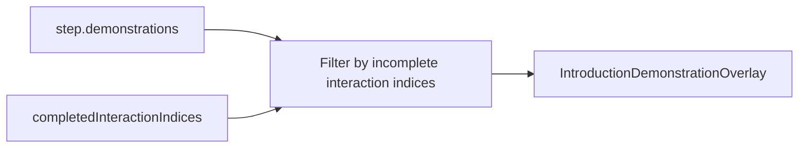

# Filter Introduction Demos by Incomplete Interactions

## Problem

Aggregator’s viewport step authors three parallel checklist interactions and three ghost-cursor demos (zoom / pan / orbit). Completion updates `completedInteractionIndices` and the checklist, but [`effectiveDemonstrations`](ui/js/react/index.tsx) always returns the full `step.demonstrations` array, so the overlay keeps demonstrating gestures the user already finished.

```6002:6008:ui/js/react/index.tsx
  const effectiveDemonstrations = reactHostPort.useMemo((): readonly IntroductionDemonstration[] => {
    if (!step) return [];
    const demonstrations = step.demonstrations ?? [];
    if (demonstrations.length > 0) return demonstrations;
    return (step.interactions ?? []).length === 0 ? [INTRODUCTION_DEMO_NEXT_BUTTON_DEMONSTRATION] : [];
  }, [step]);
```

## Approach

Treat `demonstrations[i]` as the preview for `interactions[i]` when a step has both lists (already how Aggregator is authored). Filter out demos whose interaction index is in `completedInteractionIndices`.



Concrete behavior in [`UIIntroduction`](ui/js/react/index.tsx):

1. Resolve `demonstrations = step.demonstrations ?? []`.
2. If `demonstrations.length === 0`: keep today’s auto-Next fallback for informational steps (no interactions).
3. If the step has interactions: return `demonstrations.filter((_, i) => i >= interactions.length || !completed.includes(i))`.
4. If the step has no interactions (Storybook gesture gallery): return all demos unchanged.
5. Memo deps: `[step, completedInteractionIndices]`.

When the last incomplete demo’s interaction completes, the filtered list becomes empty and the overlay unmounts; the shell already auto-advances the step when all interactions are done.

Document the parallel-index contract in the Rust docstring for `IntroductionStepDefinition.demonstrations` in [`framework/core/rs/lib.rs`](framework/core/rs/lib.rs) (no schema change).

## Tests

Extend the existing `describe("UIIntroduction demonstration")` block in [`ui/js/react/index.tsx`](ui/js/react/index.tsx):

- Viewport-like step with 3 demos + 3 interactions and `completedInteractionIndices={[0]}`: after idle threshold, demonstration still mounts (remaining demos).
- Same step with `completedInteractionIndices={[0,1,2]}`: demonstration does **not** mount / does not set `data-introduction-demonstrating`.
- Step with demos and **empty** interactions (gallery): still demonstrates with any completion array ignored.

## Ticket / goal

- Goal: `R26-02/RUNNING-SKETCHPAD/RUNNING-SKETCHPAD-APPS/RUNNING-DESIGN-APP`
- Open a new ticket for this fix (no existing open ticket covers demo filtering).
- No Aggregator brand edits required — authoring is already index-aligned.

## Out of scope

- Nesting demos onto `IntroductionInteraction` (larger schema redesign; not needed to fix this).
- Changing Storybook `GestureGallery` behavior.