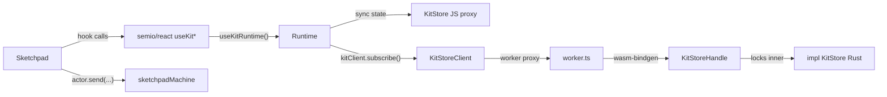

## Architectural rule for this plan

Everything new is a **method or property on an existing OO surface** — never a free function, never a new module, never a new event channel. Concretely:

- **Rust:** all behaviour lives on `impl KitStore` (private + algorithmic) and `impl KitStoreHandle` (`#[wasm_bindgen]` JS boundary that locks `inner` and calls the `KitStore` method). Both files [semio/rs/src/kit_domain.rs](semio/rs/src/kit_domain.rs) and [semio/rs/src/kit_queries.rs](semio/rs/src/kit_queries.rs) get **deleted**; their bodies are merged into the existing `impl KitStore` (~6054–7266) and `impl KitStoreHandle` (~12244–12685) blocks inside [semio/rs/src/lib.rs](semio/rs/src/lib.rs).
- **JS:** no new helper functions in [semio/js/index.ts](semio/js/index.ts). All ex-helpers become methods on `KitStoreClient` (interface + `WorkerKitStoreClient` + `FallbackKitStoreClient`). Removed-helper logic in `FallbackKitStoreClient` is implemented directly on `class KitImpl` as instance methods, so consumers without a worker still go through the kit object.
- **React:** every new query hook reuses the existing `useKitRuntime()` value (`store`, `state`, `recentEvents`, `kitClient`, `subscribe`). No new context, no new emitter, no new cache layer. Pure-data derivations sit inside `React.useMemo` keyed off `runtime.state`. Async/RPC hooks reuse the established `runtime.kitClient.subscribe(load)` pattern from `usePiecesMetadataMap` ([semio/react/index.tsx](semio/react/index.tsx) ~1801–1838).
- **Sketchpad:** UI state moves into the existing `sketchpadMachine` actor. No new XState machine, no new context, no new providers — `Origin`/`Focus`/`PanelSection`/`SidePanelTab`/`FooterItem`/`DragDrop` providers degrade to `useSelector(actor, …)` reads of slices already on the machine.

---

## Phase A — Rust consolidation (`rs_inline`)

1. In [semio/rs/src/lib.rs](semio/rs/src/lib.rs), inside the existing `impl KitStore` block at ~6054, add the algorithm methods previously in `kit_domain.rs`:
   - `pub fn cluster_pieces(&mut self, design_guid: &str, piece_guids: Vec<String>, cluster_name: String) -> SetResult`
   - `pub fn drag_pieces(&mut self, design_guid: &str, piece_guids: Vec<String>, du: f64, dv: f64) -> SetResult`
   - `pub fn move_pieces(&mut self, design_guid: &str, piece_guids: Vec<String>, gap: f64, shift: f64, rise: f64) -> SetResult`
   - `pub fn fix_pieces(&mut self, design_guid: &str, piece_ids: Vec<String>) -> SetResult`
   - `pub fn delete_connection(&mut self, design_guid: &str, connection_guid: &str) -> SetResult`
   - `pub fn flatten_design(&mut self, design_guid: &str) -> SetResult`
   - `pub fn expand_nested_design(&mut self, parent_design_guid: &str, nested_design_guid: &str) -> SetResult`
   - `pub fn change_piece_type(&mut self, design_guid: &str, piece_guid: &str, new_type_guid: &str) -> SetResult`
   - Stubs returning `SetError::InvalidValue { … }`: `paste_design_selection`, `create_hanging_pieces`, `create_connected_piece`, `create_fixed_piece`.

2. Inline `kit_queries.rs` items the same way, also on `impl KitStore`:
   - `pub fn get_pieces_metadata_json(&self, design_guid: &str) -> Result<serde_json::Value, SetError>`
   - `pub fn get_pieces_json`, `get_connections_json`, `get_designs_json`, `get_types_json`, `get_authors_json`, `get_kit_json`.
   - The `PiecePlacementMetadataJson` DTO becomes a `#[derive(Serialize)]` struct declared as a private item next to the method (still inside `pub mod kit`, no new file).

3. Make the previous `kit_domain.rs` private helpers (`type_index`, `normalize_coord`, `cross`, `move_translation_world`, `has_selected_ancestor_drag`, `design_dto_by_guid`, `connection_key`, `strip_design_piece_guid`, `expand_nested_design_pieces_in_dto`) **private associated functions** on the same `impl KitStore` block (`fn ...(...)` without `&self` is fine; they remain encapsulated to `KitStore`'s impl). No top-level free functions remain.

4. Update `impl KitStoreHandle` in [semio/rs/src/lib.rs](semio/rs/src/lib.rs) (~12244–12685): every `#[wasm_bindgen(js_name=…)]` method now `self.inner.read()`/`write()` and calls the corresponding `KitStore::*` method directly. Drop all `crate::kit_domain::*` / `crate::kit_queries::*` paths.

5. **Delete** [semio/rs/src/kit_domain.rs](semio/rs/src/kit_domain.rs) and [semio/rs/src/kit_queries.rs](semio/rs/src/kit_queries.rs). Remove their `mod` declarations from `lib.rs`.

6. `cargo test` (Windows linker flake noted; retry on lock).

---

## Phase B — JS helper removal & client absorption (`js_helper_removal`)

Goal: every removed helper either (a) becomes a `KitStoreClient` method backed by Rust, or (b) becomes an **instance method on `class KitImpl`** ([semio/js/index.ts](semio/js/index.ts)) so the fallback path stays OO.

1. Add new `KitStoreClient` methods (interface + worker proxy already exist for most; finish the missing ones): `pasteDesignSelection`, `createHangingPieces`, `createConnectedPiece`, `createFixedPiece` (call the new Rust stubs).

2. **Move algorithms out of free functions and onto `class KitImpl`** as instance methods (so `FallbackKitStoreClient` can call `this.kit.clusterPieces(...)` etc., not a top-level helper):
   - `KitImpl.prototype.clusterPieces(designId, pieceIds, name): SetResult` ← absorbs `createClusteredDesign` + `replaceClusterWithDesign`
   - `KitImpl.prototype.expandNestedDesign(parentId, nestedId): SetResult` ← absorbs `expandDesignPieces`
   - `KitImpl.prototype.dragPieces(designId, pieceIds, du, dv)`, `movePieces`, `fixPieces` ← absorb the corresponding `*InDesign` helpers
   - `KitImpl.prototype.replacableTypesFor(designId, pieceIds)` and `replacableDesignsFor(...)` ← absorb `findReplaceableTypesInDesignsForPiecesInDesign` / equivalent for designs
   - `KitImpl.prototype.piecesMetadataFor(designId)` becomes the canonical place for the metadata BFS (already partially exists per summary). The exported `piecesMetadata` / `piecesMetadataCached` free functions are deleted; `FallbackKitStoreClient.getPiecesMetadata` delegates to `this.kit.piecesMetadataFor(designId)`.
   - `KitImpl.prototype.applyDesignDiffCore(...)` already exists conceptually; the free `applyDesignDiffCore` export is removed in favour of the method.

3. Delete the free helper exports listed in the plan: `createClusteredDesign`, `replaceClusterWithDesign`, `expandDesignPieces`, `dragPiecesInDesign`, `movePiecesInDesign`, `fixPiecesInDesign`, `findReplaceableTypesInDesignsForPiecesInDesign`, `piecesMetadata`, `piecesMetadataCached`, free `applyDesignDiffCore`.

4. Update direct consumers in [semio/sketchpad/index.tsx](semio/sketchpad/index.tsx) (lines 19–106 and 364): remove the deleted names from the import list. Remaining call sites for these helpers move to `@semio/react` hooks/commands in Phase D, but the _imports themselves_ go away in this phase.

5. Vitest in [semio/js](semio/js): delete or rewrite tests that exercised the pure helpers; add small instance-method tests on `KitImpl` mirroring the previous coverage. Keep `KitStoreClient` worker tests (already added).

---

## Phase C — React hook completion (`react_queries`)

All new hooks live in [semio/react/index.tsx](semio/react/index.tsx). They follow exactly **one** of two patterns already in use:

- **Pattern X (state-derived, sync):** read `runtime.state` inside `React.useMemo`. Invalidation is automatic — `state` is a fresh reference whenever `useSyncExternalStore(store.subscribe, ...)` ticks.
- **Pattern Y (RPC, async):** copy the `usePiecesMetadataMap` block (`runtime.kitClient.getX(...)` + `runtime.kitClient.subscribe(load)`).

No new event bus, no `useEffect` watchers on `runtime.recentEvents` for these hooks (the existing `useSchemaEvents` is the only consumer of `recentEvents` and stays unchanged).

Add the following hooks (exported), each as a `SchemaHookTriad<T>` returning `[value, setter|undefined, status]`:

- Pattern X (composed off `usePiecesMetadataMap` and existing `useKit*` collection hooks):
  - `usePieceMetadata(designGuid, pieceGuid)`
  - `useFlatPiecePlane(designGuid, pieceGuid)` / `useFlatPieceCenter(...)`
  - `useIsConnectedPiece(...)`, `usePieceDepth(...)`, `useFixedPieceId(...)`, `useParentPieceId(...)`
  - `usePieceParentConnection(...)`
  - `useIncludedDesigns(designGuid)`
  - `useReplacableTypes(designGuid, pieceGuids)` / `useReplacableDesigns(...)`
  - `useExplodeableDesignNodes(designGuid)`
- Pattern X (read-only views of existing `runtime.state` collections — re-export aliases of existing `useKitTypes`/`useKitDesigns`/`useKitAuthors` etc. _if missing_; nothing new is computed):
  - Confirm and add missing: `useKitQualities`, `useKitFiles`, `useKitFolders`, `useKitTags`, `useKitConcepts`, `useKitPorts` (most already listed in the explore report at ~5009).
- Pattern Y completes with the already-added `useRpcPieces`/`useRpcConnections`/`useRpcDesigns`/`useRpcTypes`/`useRpcAuthors` and `usePiecesMetadataMap`. Add convenience aliases `usePieces`, `useConnections`, `useTypes`, `useDesigns`, `useAuthors` that **forward** to the Rpc variants — no new transport, no second cache.

Embedded vitest: add one test per derived hook category (metadata composition, replaceable types, included designs) using the existing stub-runtime pattern.

---

## Phase D — Sketchpad strip & rewire (`sketchpad_hook_delete` + `sketchpad_commands_delete` + `sketchpad_callsites`)

Done strictly inside [semio/sketchpad/index.tsx](semio/sketchpad/index.tsx). No new files, no new providers.

1. **Delete the local hook regions** (line ranges from explore):
   - `Granular Hook Types` (659–793): `HookResult`, `Field`, `createField`, `readonlyHookResult`, `writableHookResult`, `conditionalHookResult`, `fieldToHookResult` — and _every type alias_ derived from them.
   - `Entity Data Hooks` (7628–7729): `useAuthor`, `useType`, `useQuality`, `useDesign`, `usePiece`, `useConnection`, `usePieces`, `useConnections`.
   - `Piece Derived Hooks` (7731–7818): all 10 hooks.
   - `Design Derived Hooks` (7820–7849): all 6 hooks.
   - `Targeted Kit Hooks` (7978–8313): all 15 hooks (including `useKitConnectorCompatibility`).
   - `useKitTransaction` (8345), `useKitStore` (7947), `useKit` (7959) — replaced with `useKitRuntime`/`useKitStoreClient` from `@semio/react`.
   - `useKitCommands` (8364) — entire kit-mutation half deleted.
   - `Sync` helpers (`useSync*`/`usePath`/`useDerived`): the 64 call sites are rewritten to the corresponding `@semio/react` triads (most are `useKitInput*` shape).

2. **Delete** `KitScopeProvider` / `KitScopeContext` / `useKitScope` (the **83** `useKitScope` call sites are rewritten to use the `KitProvider` from `@semio/react` — already injected by `KitWasmRuntimeBridge`). The bridge component stays; the local context is removed.

3. **Delete** `SketchpadStore` kit paths (the kit slice of `SketchpadStore`). Kit lifecycle moves entirely into the existing `KitRegistry` (already imported via `useKitRegistrySafe`). Multi-kit listing/active-kit selection becomes a slice of `sketchpadMachine` context (`openKitGuids`, `activeKitGuid`).

4. **Rewire callsites** (counts from explore):
   - `commands.updatePiece(` ×8 and `commands.updateConnection(` ×9 + lone `commands.addConnection(` ×1 → `useUpdatePiece().run(...)`, `useUpdateConnection().run(...)`, `useAddConnection().run(...)`.
   - All **37** `store.execute("semio.designApp.*", ...)` sites in the ~29759–30144 block → `actor.send({ type: "designApp.*", ... })` for UI-only intents, or the corresponding `@semio/react` command hook for kit mutations (cluster/expand/flatten/drag/move/fix/changeType/paste/createHanging/createConnected/createFixed).
   - All **34** `kitCommands.*` sites → `@semio/react` command hooks: `useCreateDesign`, `useCreateType`, `useCreateAuthor`, `useCreateQuality`, `useCreatePort`, `useCreateFolder`, `useUpdateType`, `useUpdateDesign`, `useMoveToFolder`, `useImportKit`, `useAddFile`, `useDeselectAll`. (Add the missing ones to `@semio/react` as instance methods on the runtime — same pattern as `useUpdatePiece`. They were never algorithmic, just CRUD on collections, so they go through `runtime.kitClient.setField` / `setObjectValue` already exposed by the runtime.)
   - Replace every `canSet`/`HookResult.canSet` check with `status.kind === "writable"` from the triad.
   - Wrap every input that mutates the kit with the existing `useOptimistic` / `useWriteIndicator` (already in `@semio/react`).

5. Outcome: sketchpad's local `commands` / `kitCommands` / `useKit*` helpers **do not exist** anymore. All `HookResult`/`Field` (~133 occurrences) gone.

---

## Phase E — Sketchpad UI state into existing machine (`sketchpad_ui_machine`)

No new module — extend the **existing** `sketchpadMachine` already in [semio/sketchpad/index.tsx](semio/sketchpad/index.tsx).

1. Promote the slices currently held in ad-hoc providers into `sketchpadMachine.context`: `tutorial`, `panelSections`, `sidePanelTab`, `footerItem`, `origin`, `focus`, `dragDrop`, `openKitGuids`, `activeKitGuid`.

2. For each slice, add explicit XState events (`{ type: "ui.tutorial.advance" }`, `{ type: "ui.panel.toggle", … }`, etc.). The 37 `store.execute("semio.designApp.*", …)` calls that survive Phase D as **UI intents** become `actor.send(...)` here.

3. Reduce the providers `OriginProvider`, `FocusProvider`, `PanelSectionProvider`, `SidePanelTabProvider`, `FooterItemProvider`, `DragDropProvider` to one-line components that render their `children` inside the existing `SketchpadStateContext.Provider` (no new context). Their hooks become `useSelector(actor, (s) => s.context.<slice>)`.

4. Move I/O tasks (`importKit`, `exportKit`, `kitToSqlite`, JSON file save/load) into `fromPromise` actors invoked by `sketchpadMachine` — bodies are already present, only the scheduling moves.

---

## Phase F — Tests & verification (`sketchpad_playwright` + `verify_all`)

1. Extend the existing Playwright spec under [semio/sketchpad](semio/sketchpad) (no new file) with three scenarios:
   - Pending/error/readonly affordances visible during in-flight `useUpdatePiece` (uses `useWriteIndicator`).
   - Illegal-name preserves draft (covers triad rejection path).
   - Concurrent writes to two different pieces keep independent pending counters.

2. Run the full verification matrix:
   - `cargo test` in [semio/rs](semio/rs)
   - `pnpm -F @semio/js test`
   - `pnpm -F @semio/react test`
   - `pnpm -F @semio/sketchpad test`
   - Desktop smoke run over `metabolism.zip`: cluster → expand → drag → paste.

---

## Out of scope

- No new top-level modules in any package.
- No new pure helper functions (`function foo(...)`) in `@semio/js` or `@semio/react` — every addition is a method on `KitStoreClient`, `KitImpl`, `KitStore` (Rust), `KitStoreHandle`, the runtime context object, or the existing XState machine.
- No new contexts/providers in `@semio/sketchpad` — only the already-established `KitProvider` / `KitRegistryProvider` / `SketchpadStateContext`.
