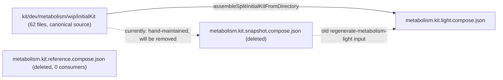

# Finish V1 Cleanup and File Consolidation

The prior cleanup pass renamed types/schemas in `react`/`internal` layers but never touched the play `core/index.ts` host layer, which still imports nonexistent `*V1` names, uses `/v1` schema strings, and keeps a few explicit legacy aliases. Separately, several fixture/manifest files in `compose/fixture/` duplicate the same Metabolism kit data across multiple monolithic JSON files instead of being generated from the single canonical split source.

## Phase 1 - Strip remaining `*V1` type identifiers in the core/host layer

Rename every `*V1` import/usage to its unversioned counterpart (the unversioned type already exists in `react`/`internal` for all of these except the GIS cluster, which is a plain rename since only the `V1` name exists):

- [writer/core/index.ts](writer/core/index.ts): `WriterDocumentV1` -> `WriterDocument` (11 sites)
- [shooting/core/index.ts](shooting/core/index.ts): `ShootingCameraV1`, `ShootingFixtureV1`, `ShootingSceneV1`, `ShootingShotV1` -> unversioned (19 sites)
- [mathematical/graph/port/directed/dag/core/index.ts](mathematical/graph/port/directed/dag/core/index.ts): `DagFixtureV1`, `DagNodeV1`, `WriterDocumentV1` -> unversioned (14 sites)
- [sequence/core/index.ts](sequence/core/index.ts): `SequenceFixtureV1`, `SequenceStepV1`, `WriterDocumentV1` -> unversioned (12 sites)
- [framework/product/presentation/core/index.ts](framework/product/presentation/core/index.ts): `PresentationDeckV1` -> `PresentationDeck` (9 sites)
- [trinity/jack/host-core/index.ts](trinity/jack/host-core/index.ts): `TrinityFixtureV1`, `WriterDocumentV1` -> unversioned (4 sites)
- [trinity/rewrite/core/index.ts](trinity/rewrite/core/index.ts): `RuleParameterV1`, `TrinityFixtureV1`, `WriterDocumentV1` -> unversioned (9 sites)
- [reasoning/mindmap/wires/core/index.ts](reasoning/mindmap/wires/core/index.ts): `WiresFixtureV1`, `WiresFixtureIdentityV1`, `WiresFixtureRelationshipV1`, `WiresFixtureKindCatalogsV1` -> unversioned (9 sites)
- [s/core/index.ts](s/core/index.ts) + [s/core/internal.ts](s/core/internal.ts): `SStudioDocumentV1` -> `SStudioDocument`, `WriterDocumentV1` -> `WriterDocument`; delete the `SStudioDocumentV1` alias line in `internal.ts` (it duplicates `SStudioDocument = OsDocument` on the next line)
- [flow/core/index.ts](flow/core/index.ts), [procedural/2d/core/index.ts](procedural/2d/core/index.ts), [procedural/3d/core/index.ts](procedural/3d/core/index.ts): `FlowFixtureV1`, `FlowWidgetV1`, `WriterDocumentV1` -> unversioned (37 sites total)
- [flow/react/index.tsx](flow/react/index.tsx) lines 551-552: delete the `FlowWidgetV1`/`FlowFixtureV1` alias exports now that no importer needs them
- [puzzle/2d/core/index.ts](puzzle/2d/core/index.ts), [puzzle/3d/core/index.ts](puzzle/3d/core/index.ts), [puzzle/5d/core/index.ts](puzzle/5d/core/index.ts): `WriterDocumentV1` -> `WriterDocument` (6 sites)
- [gis/2d/core/index.ts](gis/2d/core/index.ts): rename the entire `GisMap*V1` cluster (`GisMapFixtureV1`, `GisMapFixturePositionV1`, `GisMapFixtureRouteV1`, `parseGisMapFixtureV1`, `parseGisMapFixturePositionV1`, `parseGisMapFixtureRouteV1`) to drop the `V1` suffix (~40 sites); update the two call sites in [framework/product/playground/renderer/react/index.tsx](framework/product/playground/renderer/react/index.tsx) (lines ~6471, ~12655)

## Phase 2 - Strip `/v1` from schema and play-surface-id strings

Per confirmed scope, strip `/v1` from both document/fixture schema strings AND play-surface-id constants for full consistency:

- Document/fixture schema checks and envelopes: `writer.document/v1`, `flow.fixture/v1`, `flow.module/v1`, `dag.fixture/v1`, `presentation.deck/v1`, `shooting.fixture/v1`, `puzzle.2d.fixture/v1` (~~15 sites in `puzzle/2d/core/index.ts`), `puzzle.3d.fixture/v1` (~~17 sites in `puzzle/3d/core/index.ts`), `puzzle.5d/v1`, `gis.map.fixture/v1` (7 sites), `forms.form/v1`, `raster.document/v1`, `draw.document/v1`, `vcs.demo/v1`
- Fix the cross-format guards in [puzzle/5d/core/index.ts](puzzle/5d/core/index.ts) lines 777/780 that check `"puzzle.2d.fixture/v1"` / `"puzzle.3d.fixture/v1"` -> unversioned
- Play-surface-id constants losing `/v1`: `WRITER_PLAY_SURFACE_ID`, `FLOW_PLAY_SURFACE_ID*` (4), `DAG_PLAY_SURFACE_ID*` (2), `SEQUENCE_PLAY_SURFACE_ID*` (4), `PRESENTATION_PLAY_SURFACE_ID`, `SHOOTING_PLAY_SURFACE_ID*`/`SHOOTING_PLAY_STORE_KEY` (3), `PUZZLE_2D_PLAY_SURFACE_ID*` (3), `PUZZLE_3D_PLAY_SURFACE_ID*`/`VIEWPORT` (2), `PUZZLE_5D_PLAY_JACK_SURFACE_ID`, `GIS_MAP_PLAY_SURFACE_ID`, `IMPERATIVE_PLAY_SURFACE_ID`, `LOWPOLY_PLAY_SURFACE_ID`, `FORMS_PLAY_SURFACE_ID*` (2), `RASTER_PLAY_SURFACE_ID*` (2), `DRAW_PLAY_SURFACE_ID*` (2), `NOTE_PLAY_SURFACE_ID*` (2), `TRINITY_JACK_PLAY_*` (3), `TRINITY_REWRITE_PLAY_*` (6), `LAYOUT_PLAY_SURFACE_*` (2), `VCS_PLAY_SURFACE_ID_*` (2), `S_PLAY_SURFACE_*` (7)
- Update every test/expect assertion in the same files that checks for the old `/v1` string value
- Update [layout/example/sample.layout.json](layout/example/sample.layout.json), the one remaining example JSON fixture with a `/v1` schema value
- Exclude `cad/js/core/index.ts`: its runtime `schema` fields are already unversioned (`"spatial.modelspace"`); only doc comments mention `/v1`. However, fix the genuine bug at [cad/js/renderer/core/index.ts](cad/js/renderer/core/index.ts) line ~1209, which still guards on the never-matching `"spatial.modelspace/v1"` string

## Phase 3 - Remove remaining legacy aliases/comments

- [framework/product/os/core/index.ts](framework/product/os/core/index.ts) line ~2318: delete `RemoteJsonBackbone` legacy alias; update its only 2 usages in [s/core/internal.ts](s/core/internal.ts) (lines 66, 117) to import/re-export `RemoteOsBackbone` directly
- Rust doc comments still mentioning `/v1` (cosmetic, update to match unversioned schema names): [trinity/ram/lib.rs](trinity/ram/lib.rs) line 70, [mathematical/graph/port/directed/dag/lib.rs](mathematical/graph/port/directed/dag/lib.rs) line 1198, [reasoning/mindmap/wires/lib.rs](reasoning/mindmap/wires/lib.rs) line 63
- [puzzle/2d/react/index.tsx](puzzle/2d/react/index.tsx) line ~903: fix stale doc comment referencing `puzzle.2d.fixture/v1`

Out of scope (verified as unrelated to versioning): `orbitCameraViewFromLegacyPreset` in `puzzle/3d/core/index.ts` maps display-template-id strings, not schema versions; `generate.neo4j.gen.ts`'s `@deprecated` constant is a naming-clarity marker with one test consumer, not migration debt - leave both as-is.

## Phase 4 - Consolidate Metabolism kit fixture duplication

- Change `RegenerateMetabolismLightScript` in [compose/fixture/script.ts](compose/fixture/script.ts) to build directly from `assembleSplitInitialKitFromDirectory("kit/dev/metabolism/wip/initialKit")` instead of reading the hand-maintained `metabolism.kit.snapshot.compose.json`, then run the nx task to regenerate `metabolism.kit.light.compose.json` and verify the Rust (`compose/client/lib/rs/lib.rs`) and TS (`compose/client/lib/sketchpad/js/index.ts`) tests that read it still pass (they assert `nodeKind`/`handleKind` naming derived from type/port UUIDs, which stays stable since UUIDs don't change)
- Delete `metabolism.kit.snapshot.compose.json` (58 MB) once no longer read by the script
- Delete `metabolism.kit.reference.compose.json` (58 MB, zero active consumers)
- Rename `metabolism.new.kit.compose.json` -> a name that doesn't read as a version marker (e.g. `kit-store.bundle.example.compose.json`); update the one hardcoded path + assertion strings in `compose/client/lib/rs/lib.rs` (~lines 20811-20816)
- Delete the orphaned `.storybook/fixture/nakagin-capsule-tower.board.json` (no live importer found; the active Storybook story uses `puzzle/2d/example/nakagin-capsule-tower.2d.json`)
- Fix the typo'd duplicate export in [compose/fixture/index.ts](compose/fixture/index.ts) line 31 (`NakginCapsuleTowerDiffDesign` alias for a misspelled `nakgin-capsule-tower.diff.design.compose.json`): rename the source file to `nakagin-capsule-tower.diff.design.compose.json`, update the export to a single correctly-spelled `NakaginCapsuleTowerDiffDesign`, and update its consumers
- Delete the orphaned `nakagin.kpi.representation.compose.json` (not exported, not referenced)
- Dedupe the identical `metabolism.svg` icon: keep one canonical copy (`compose/fixture/kit/folder/metabolism/icon/metabolism.svg`) and point `compose/client/example/metabolism/icon/metabolism.svg` at it (or remove the second copy if the build allows a single source path)

**Not touched (verified as intentional, not duplication):** `metabolism.kit.diff.compose.json`, `metabolism.kit.diff.inverted.compose.json`, and `metabolism.kit.diffed.compose.json` are hand-maintained golden fixtures used as independent correctness oracles for diff/patch logic across Rust, Go, C#, and Python test suites - they test "does applying this diff to the original produce this exact result", so storing the expected output is the correct pattern, not file creep. Regenerating them programmatically would remove their value as regression oracles.

**Flagged but out of scope for this pass:** `trinity/manifest/nakagin.manifest.json` hand-duplicates ~18 port-kind names that already exist in the Metabolism kit family data. Deriving the graph manifest from kit data would introduce a new cross-package build dependency (compose fixture data feeding graph-manifest codegen) that doesn't exist today - this is a bigger architectural change better suited to its own ticket.

## Phase 5 - Consolidate duplicated `__itemsOf` helper

- Move the `{hash, items}` -> array normalization helper (currently duplicated as `fixtureItemsOf` in [compose/fixture/script.ts](compose/fixture/script.ts), and private `__itemsOf` copies in [asset/index.ts](asset/index.ts) and [compose/dev/algorithm/index.ts](compose/dev/algorithm/index.ts)) into [repo/lib/js/index.ts](repo/lib/js/index.ts) as the single shared implementation, and have all three call sites import it from there

## Phase 6 - Verification

- Rebuild affected WASM packages (`gis/2d`, `flow`, `dag`, `sequence`, `puzzle/2d`, `puzzle/3d`, `puzzle/5d`, `presentation`, `shooting`, `wires`, `trinity`) where Rust schema strings changed
- Run `cargo test` for touched Rust crates and `bun nx test` for touched TS packages (writer, shooting, dag, sequence, presentation, trinity, wires, gis, s, flow, procedural/2d, procedural/3d, puzzle/2d, puzzle/3d, puzzle/5d, compose-fixture, compose-client, asset)
- Run the `regenerate-metabolism-light` nx task and diff the output against the previous file to confirm `nodeKind`/`handleKind` values are unchanged (only intermediate snapshot dependency removed)
- Grep-verify zero remaining `[A-Za-z]V1\b` identifiers and `/v1` schema/surface strings outside of `cad/js/core` (excluded) and `.repo/` ticket archives
- Work inside a repo-mcp ticket per workspace rules; close it with a summary of every file touched

