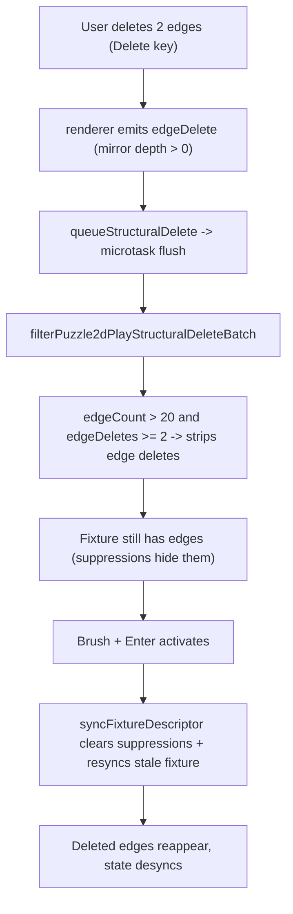

## Root cause

Deleting edges on the canvas only ever reaches the play layer as an authoritative user delete (the renderer gates node/edge delete events behind `structuralDeleteFixtureMirrorDepth > 0` in [puzzle/2d/react/index.tsx](puzzle/2d/react/index.tsx) line 3034, so WASM/LOD resync drains never emit them). Despite that, `filterPuzzle2dPlayStructuralDeleteBatch` in [puzzle/2d/play/index.ts](puzzle/2d/play/index.ts) still applies "resync burst" count heuristics and strips the user's edge deletes from the fixture commit whenever the fixture has >20 edges (nakagin has ~99) and 2+ edges are deleted.

Result: edges are removed from the WASM scene and hidden via `authoritativeStructuralSuppressions`, but they remain in the React fixture. When Brush activates, `puzzle2dSyncFixtureDescriptorToAllAuthoringPeers` clears those suppressions and re-syncs the stale fixture, resurrecting the edges and desyncing WASM/scene/selection (only pan/zoom keep working).

## Fix

### 1. Stop dropping authoritative user deletes

In [puzzle/2d/play/index.ts](puzzle/2d/play/index.ts), remove the three count-based "resync burst" early returns (lines ~1125-1133) from `filterPuzzle2dPlayStructuralDeleteBatch`. Keep the dedup and the existence-in-fixture check. Every item reaching this function is already an authoritative user delete (guaranteed by the renderer emit gate), so it must always commit. Update the function docstring to reflect that it only dedupes and drops ghost ids.

### 2. Avoid stale-ref re-sync on brush activation

In [framework/product/playground/renderer/react/index.tsx](framework/product/playground/renderer/react/index.tsx):

- Make `flushStructuralDeleteQueue` (~3487) report whether it applied any deletes (return a boolean / count).
- In the brush effect (~3617-3624), call `flushStructuralDeleteQueue()` first; if it applied deletes, return early and let the `fixture`-dependency re-run sync the committed graph (since `applyStructuralDelete` already calls `puzzle2dSyncFixtureDescriptorToAllAuthoringPeers(next)` with the correct fixture and produces a new `fixture` identity). Only call `puzzle2dSyncFixtureDescriptorToAllAuthoringPeers(fixtureRef.current)` when nothing was flushed, so we never push the stale `fixtureRef.current` (which still contains the just-deleted edges).

### 3. Update tests

In the `filterPuzzle2dPlayStructuralDeleteBatch` describe block in [puzzle/2d/play/index.ts](puzzle/2d/play/index.ts) (~1361-1490), convert the four "drops ... resync burst" tests to assert that authoritative deletes always commit:

- mass node deletes (e.g. all 3 nodes) are kept
- sequential/mass edge deletes are kept
- paired edge deletes on a nakagin-scale (>20 edge) fixture are kept
Keep the existing dedup and ghost-id-drop tests, and keep the `flushPuzzle2dPlayStructuralDeleteBatch` test.

## Verification

- Run `bun ./script.ts test` in [puzzle/2d/play](puzzle/2d/play) and [puzzle/2d/react](puzzle/2d/react).
- Runtime check per repo rules: add a temporary `[DEBUG]` log in `applyStructuralDelete` (edge branch) and confirm in the browser that dragging a node, selecting 2+ edges, deleting, then `Brush` + Enter keeps the edges gone, leaves the fixture edge count reduced, and keeps the canvas interactive. Remove `[DEBUG]` logs after confirming.

[{"id": "filter", "content": "Remove count-based burst guards from filterPuzzle2dPlayStructuralDeleteBatch in puzzle/2d/play/index.ts; keep dedup + existence check; update docstring"}, {"id": "brush-effect", "content": "Make flushStructuralDeleteQueue report applied deletes and skip stale fixtureRef sync in the brush activation effect in framework/product/playground/renderer/react/index.tsx"}, {"id": "tests", "content": "Update filterPuzzle2dPlayStructuralDeleteBatch tests to assert authoritative deletes always commit (incl. nakagin-scale)"}, {"id": "verify", "content": "Run play + react test suites and confirm runtime fix in browser with temporary [DEBUG] logs, then remove logs"}]
