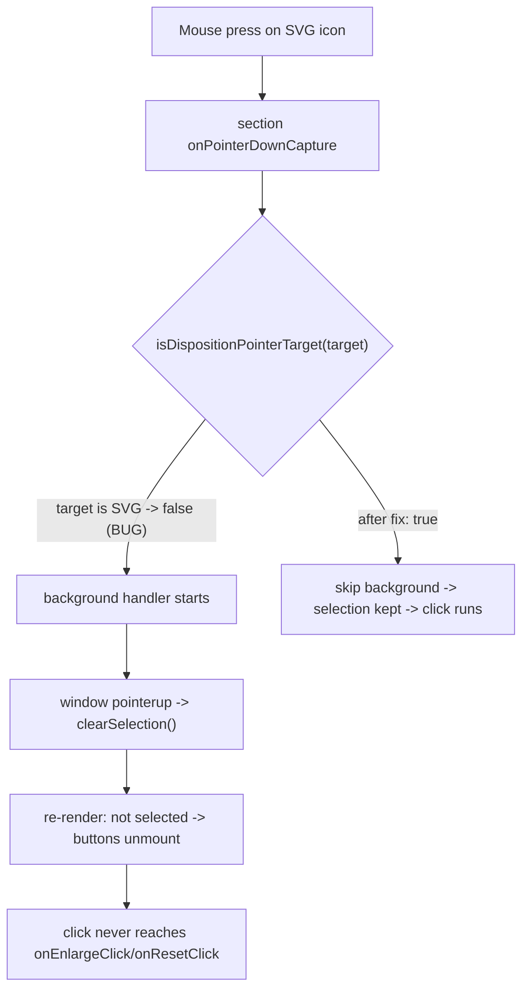

## Fix Disposition Enlarge/Reset Buttons (Projektetage slide 10 and all slides)

### Root cause

In [framework/product/presentation/renderer/react/index.tsx](framework/product/presentation/renderer/react/index.tsx), `isDispositionPointerTarget` (line 4240) bails out when `target` is not an `HTMLElement`:

```
if (!(target instanceof HTMLElement)) { return false; }
```

The action buttons contain an SVG icon, so a real mouse press lands on an `SVGElement`. The check returns `false`, so `useSlideBackgroundInteraction.onPointerDownCapture` (line 4302) does not skip, and its `onUp` calls `interaction.clearSelection()` (line 4334). The resulting re-render unmounts the buttons before the `click` fires, so `onEnlargeClick`/`onResetClick` never run.

Why earlier "passing" checks were wrong: verification used `element.click()` (click only, no pointer sequence), which never triggers the background path. Real input (`pointerdown -> pointerup -> click`) does.

### Flow




### Change 1 - the fix (one line, plus optional hardening)

In `isDispositionPointerTarget` change `instanceof HTMLElement` to `instanceof Element` (`Element.closest` covers HTML and SVG). Optionally also relax the two `event.target as HTMLElement` casts in the disposition `onPointerDown` guards to `Element` for consistency (runtime already works since `.closest` is on `Element`).

### Change 2 - regression test (extend existing tests, do not add files)

In the existing `if (import.meta.vitest)` block of the same file, add a test under the interaction DOM suite that:

- selects a positioned disposition,
- dispatches a real `pointerdown` + `pointerup` whose `target` is the SVG node inside `.presentation-interaction-enlarge` (e.g. `button.querySelector('svg')`), then the `click`,
- asserts the disposition stays selected and becomes enlarged (guards against regressing to `clearSelection`).

### Verification (must use real input, not element.click())

1. Add temporary `[DEBUG]` logs in `onEnlargeClick`, `onResetClick`, the background `onUp` clearSelection branch, and `SlideInteractionReset` onClick.
2. On `http://localhost:6050` slide 10, select a media item and use the browser `browser_click` tool (real CDP input with hit-testing) on the enlarge and reset buttons; confirm via the `[DEBUG]` logs that the action handlers fire and `clearSelection` does NOT, and that the item enlarges / resets and stays selected.
3. Repeat for figure, video, and PDF, plus the slide-level reset.
4. Remove the `[DEBUG]` logs.
5. Run the renderer suite: `bun ./script.ts test` in `framework/product/presentation/renderer/react` and confirm all pass (note: `scales pdf pages to cover the disposition frame` is a pre-existing intermittent failure unrelated to this change).

### Notes

- The earlier CSS edits (slide-reset-host `pointer-events`, action `z-index`, media `pointer-events` until selected) are retained; they are compatible and the media-not-selected rule still helps first-click selection.
- Per repo rules, do this inside a ticket via the repo MCP (reopen the existing presentation interaction ticket if present, else open one) and keep any temporary artifacts in the ticket folder.

