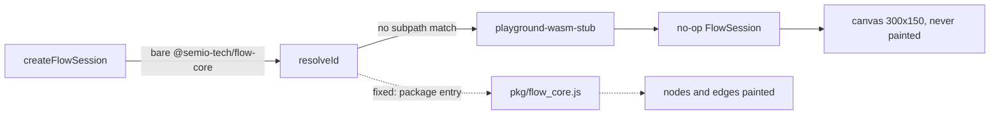

# Fix Empty Procedural 3D Flow Graph

Ticket: `.🦑️repo/🎫️tickets/🎆️26/🌙️08/☀️02/FIX-EMPTY-PROCEDURAL-3D-FLOW-GRAPH` (open).

## Root cause

The React renderer loads the flow canvas engine with a bare specifier:

```9442:9442:🧰️framework/🛍️products/💻️os/🔨️modules/📺️renderer/🧑️‍🎨️engine/⚛️react/⚡️implementations/🟦️typescript/📦️index.tsx
    flowSessionPromise = import("@semio-tech/flow-core").then(async (mod) => {
```

In [vite-elements-assets.ts](🧰️framework/🔨️modules/🖱️ui/🎨️styling/⚡️implementations/🦀️rust/🟦️vite-elements-assets.ts), `playgroundFlowWasmDevStubPlugin.resolveId` flags that id as a wasm package (line 162) but then only knows how to resolve `@semio-tech/<pkg>/<subpath>` ids:

- `const workspacePkg = cleanId.match(/^(@semio-tech\/[^/]+)\/(.+)$/)` requires a subpath, so the bare id falls into the `else` branch
- the only candidate becomes `<repoRoot>/@semio-tech/flow-core`, which never exists
- the resolver therefore returns the stub id on every run

Confirmed at runtime: the page loads `/@id/__x00__playground-wasm-stub/@semio-tech__flow-core`. The stub's `FlowSession` has `attachCanvas() { return Promise.resolve(); }`, `setSize() {}`, `renderFrame() {}`, so the flow canvas keeps a 300x150 backing store against a 966x807 CSS box and paints nothing. The failure is silent because the attach chain ends in a bare `.catch()` at line 18891 of the React engine.

`node_modules/@semio-tech/flow-core` correctly links to the wasm-pack `pkg/` dir, whose `package.json` declares `"main": "flow_core.js"`, and `buildEngineWasm` always builds that pkg (see the note at line 990 of the os dev [script.ts](🧰️framework/🛍️products/💻️os/🔨️modules/🧑️‍💻️dev/⚡️implementations/🟦️typescript/📜️script.ts)) - so the stub should never have applied here.



## Changes

### 1. Resolve bare workspace wasm packages

In `playgroundFlowWasmDevStubPlugin.resolveId`, make the subpath optional and resolve the package entry when absent:

```ts
const workspacePkg = cleanId.match(/^(@semio-tech\/[^/]+)(?:\/(.+))?$/);
```

When `subpath` is undefined, read `node_modules/<pkgName>/package.json` once and push candidates from `exports["."]` (string, or its `import`/`default`), then `module`, then `main`, resolved against the package root. Keep the existing subpath candidates and the existing final fallback so a genuinely unbuilt pkg still yields the stub. The single manifest read should be shared by both branches rather than duplicated.

### 2. Cover it in the existing in-file test region

Extend the `if (import.meta.vitest)` region already at the bottom of the same file (no new test file) with a `describe("playgroundFlowWasmDevStubPlugin", …)` asserting:

- bare `@semio-tech/flow-core` resolves to the real `pkg/flow_core.js` absolute path, not a `playground-wasm-stub` id
- an unknown/unbuilt `@semio-tech/…` wasm package still resolves to the stub id

## Already applied in this ticket

[framework/os/module/plugin lib.rs](🧰️framework/🛍️products/💻️os/🔨️modules/🔌️plugin/⚡️implementations/🦀️rust/📦️lib.rs) `dispatch_command_frame` had its pack-envelope fallback restored (decode `{kind,name,args}` via `store::pack_rt::decode_wire_value` and route to `dispatch_action`/`dispatch_command`) after an Aug 1 commit removed it and left every unmigrated app erroring with "app must handle command frames via handle_typed_command". Verified: `setActiveExample` and `nodeGraphSelect` no longer fail at runtime. Keep this change.

## Verification

- `cargo check -p semio-framework-plugin` (already passing)
- run the vitest suite covering `vite-elements-assets.ts`
- restart `bun run "dev:procedural:3d"`, then probe `http://127.0.0.1:6018/`: assert the served module list contains `flow_core.js` and no `playground-wasm-stub/@semio-tech__flow-core`, the flow canvas backing store matches its CSS size, and the graph reports non-zero nodes
- confirm visually with a screenshot on at least two examples (Hexagonal Mushroom Column, Rectangle Extrude Volume), and check procedural 2d at `:6021` since it shares the same flow session
- store probe artifacts inside the ticket folder, then close the ticket with `ticket_close`