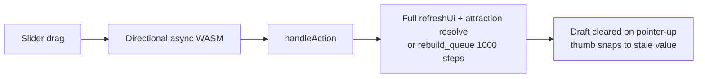

# Fix Puzzle 3D Fill Options Lag

## Diagnosis

Slider value lives in plugin WASM and only appears after `handleAction` → `refreshUi`. Today that path is far too heavy:

Root causes (confirmed in code):

1. **`setFillCount` / weight actions leave `UiDirtyScope::Full`** in [`puzzle/plugin/rs/lib.rs`](puzzle/plugin/rs/lib.rs) (~6161). Background `fillBuildTick` already uses narrow [`puzzle3d_fill_build_scope()`](puzzle/plugin/rs/lib.rs) (~3851); count/weight do not.
2. **Every count change runs** `puzzle3d_rederive_all_attractions` + `resolve_puzzle3d_attractions` in [`apply_puzzle3d_fill_count`](puzzle/plugin/rs/lib.rs) (~4042) even though the fill engine already returns posed objects.
3. **Distribution weight changes call `sync_precompute_session` → `set_scene` → `rebuild_queue()`** ([`puzzle/3d/rs/lib.rs`](puzzle/3d/rs/lib.rs) ~1218–1285), wiping up to 1000 planned fill steps so planning restarts from scratch while the UI waits on the serialized WASM queue.
4. **Jump-back**: [`Slider`](ui/js/react/index.tsx) clears `draftValues` on pointer-up (~10464) before the slow round-trip lands, so the thumb snaps to the old `measure.value`.

Prior tickets already fixed O(1) prefix apply and tick queueing ([`OPTIMIZE-PUZZLE-3D-FILL-SLIDER-PERFORMANCE`](.repo/🎫/26/06/06/OPTIMIZE-PUZZLE-3D-FILL-SLIDER-PERFORMANCE/), [`FIX-PUZZLE-3D-FILL-SLIDER-ADD-REMOVE-AFTER-STALL`](.repo/🎫/26/07/21/FIX-PUZZLE-3D-FILL-SLIDER-ADD-REMOVE-AFTER-STALL/)); this work finishes the remaining interactive path.

Goal: `🎯r2602` (same as recent puzzle 3D tickets). Ticket: open new `FIX-PUZZLE-3D-FILL-OPTIONS-LAG` after plan approval (no existing open ticket covers this).

## Approach

### 1. Narrow UI scopes for fill/distribution actions (plugin)

In [`puzzle/plugin/rs/lib.rs`](puzzle/plugin/rs/lib.rs):

- Reuse `puzzle3d_fill_build_scope()` for `setFillCount` (world body + tools only).
- Add `puzzle3d_fill_options_scope()` for `setObjectKindWeight` / `setVortexKindWeight`: `tools: true` + `measures: true` (distribution lives in fill tool measures and brush utility window measures), no full shell.
- Extend existing plugin tests that assert `fillBuildTick` Partial scope to cover these actions.

### 2. Weight-only soft replan (engine) — no full queue wipe

In [`puzzle/3d/rs/lib.rs`](puzzle/3d/rs/lib.rs):

- Add `update_weights` (or `set_scene` weight-only branch when fixture identity is unchanged): write `scene.weights`, refresh `scene_json`, clear brush cache, **do not** call `rebuild_queue()`.
- Soft-replan fill: truncate planned-ahead sequence/`appended_*` to `applied_count`, re-enqueue `FillStep`s for `(applied_count..max_count)` only. Applied objects stay; tail replans in background via existing `fillBuildTick`.
- Wire weight handlers to this path instead of blind `sync_precompute_session` that can rebuild. Keep `preserve_fill_plan` semantics for count/tick.

### 3. Drop redundant attraction work on fill count apply

In [`apply_puzzle3d_fill_count`](puzzle/plugin/rs/lib.rs):

- Stop calling `puzzle3d_rederive_all_attractions` + `resolve_puzzle3d_attractions` after `apply_fill_count_rust` — engine prefix compose already yields posed objects/attractions.
- Keep document delta ops (`coalesce_key: "fill-count"`) so the viewport still updates.

### 4. Hold slider draft until confirmed (UI)

In [`ui/js/react/index.tsx`](ui/js/react/index.tsx) `Slider`:

- On pointer-up / key-up, **do not** immediately `setDraftValues(null)`.
- Clear draft only when `externalValues` matches draft (epsilon) or on cancel/abort.
- Extend existing slider tests in the same file’s test suite (no new test files).

### 5. Validate with timings + tests

- Ticket-folder diagnostic timing script (like the old `fill-prefix-timing.mts`) measuring: weight update, count apply, and that `rebuild_queue` is not invoked on weight-only changes.
- Extend Rust tests in `puzzle/plugin/rs/lib.rs` / `puzzle/3d/rs/lib.rs` for: Partial scopes, weight soft-replan preserves `applied_count`, count apply without full attraction pass.
- Run relevant `nx`/`bun` test targets; confirm with `[DEBUG]` logs that slider round-trips stay in ms–low seconds under a large fill scene.

## Out of scope

- Reintroducing the old Web Worker precompute path ([`PUZZLE-3D-PRECOMPUTE-WORKER`](.repo/🎫/26/06/06/PUZZLE-3D-PRECOMPUTE-WORKER/)) — not required once interactive actions stop wiping the queue and stop doing Full refreshes.
- Changing Monte Carlo sample counts inside `fill_step_one` (background planning only).
