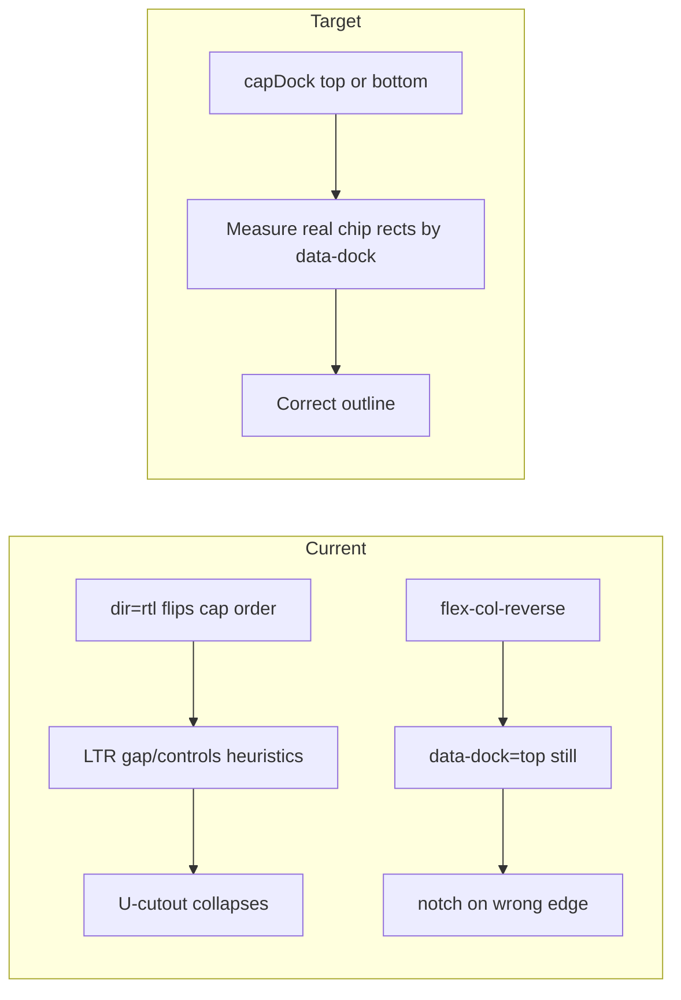

# Fix Mirrored Panel Growth (RTL / Bottom-Up)

## Diagnosis

Shell panels and panes share `[WindowChrome](ui/js/react/index.tsx)` + `[measureWindowSilhouetteMetrics](ui/js/react/index.tsx)`. Top-left growth works (and was just tightened in `FIX-PANEL-TAB-BODY-CHROME-GAP`). Mirrored anchors do not:

| Growth                                                     | Mechanism today                                                                     | Breakage                                                                                                                                                                                         |
| ---------------------------------------------------------- | ----------------------------------------------------------------------------------- | ------------------------------------------------------------------------------------------------------------------------------------------------------------------------------------------------ |
| Right → left (`top-right`, `bottom-right`, `right-middle`) | `dir="rtl"` on panel/pane root flips the cap flex row to **controls | gap | chips** | Metrics assume LTR **chips | gap | controls** (`gap.left` = end of first chip; controls pinned to stack right). Under RTL that paints a near-full-width top chip and **collapses the U-cutout**. |
| Bottom → top (`bottom-*`)                                  | `flex-col-reverse` on the chrome stack moves the cap under the body                 | Cap cells still stamp `data-dock="top"`; metrics always put cap depth/chips on `**top**`. Silhouette U-notch stays on the **top** edge while chips sit on the **bottom**.                        |

Resize `deltaFactor` for width handles is already correct for right anchors; this ticket is chrome growth/silhouette, not handle sign math. Pane gets the same fix because it shares the chrome stack.

## Approach

All permanent code stays in `[ui/js/react/index.tsx](ui/js/react/index.tsx)` (regions only). No new files outside the ticket folder.

### 1. Make WindowChrome dock-aware

- Add `capDock?: "top" | "bottom"` (default `"top"`) to `WindowChromeProps`.
- When `capDock === "bottom"`:
  - stamp chip/controls with `data-dock="bottom"` (not `"top"`)
  - stack with `flex-col-reverse` so body sits above the cap
- Panel/Pane pass `capDock={flow.block === "up" ? "bottom" : "top"}` and stop double-encoding reverse only via ad-hoc `stackClassName` where WindowChrome can own it cleanly (keep Panel root `flex-col-reverse` for empty/folded chrome if still needed).

### 2. Rewrite silhouette measurement to be layout-truthful

Replace the LTR-only heuristics in `measureWindowSilhouetteMetrics`:

- Collect `[data-window-silhouette-chip]` spans grouped by `data-dock` (`"top"` / `"bottom"`), using stack-local x from `getBoundingClientRect`.
- Depth per edge = max chip/gap height on that dock (fallback to gap/cap height when present on that edge).
- Keep footer selectors as an additional bottom-chip source when a true footer exists (mode windows).
- Do **not** assume controls live at `stack.right` or that the first chip starts at `x=0`.

`windowSilhouettePath` / outline math already supports a bottom edge with chips — measurement was the missing half.

### 3. Keep content flow mirroring

Leave `dir="rtl"` on the panel/pane root and `FlowProvider` for trees/ribbons/chevrons. Chrome structure stays physical; metrics follow painted chip geometry so RTL order stays intentional (tabs toward the outer/right edge).

### 4. Tests (extend existing vitest in the same file)

- **RTL metrics:** mock stack where controls are left, gap middle, chip right; expect two top chips with a gap between (not one full-width chip).
- **Bottom dock metrics:** mock cap/gap/controls on the bottom; expect `bottom.depth > 0` and `top.depth === 0` (or only footer on bottom when applicable).
- **Panel wiring:** `anchor="top-right"` keeps `dir="rtl"`; `anchor="bottom-right"` / `bottom-left` render `data-dock="bottom"` on chip/controls and `flex-col-reverse` on the chrome stack.
- Assert silhouette path for a bottom-cap panel uses the bottom edge (via `windowSilhouettePath` equality like existing mode-dock tests).

### 5. Ticket workflow (on implement)

- Goal: `🎯️r2602` (same as recent panel chrome work).
- Open a new ticket (related to, but not the same as, `FIX-PANEL-TAB-BODY-CHROME-GAP`).
- Temp logs/notes under the ticket folder; close with summary + touched files when done.
- Verify with targeted vitest on the new/extended cases (do not claim pass without running).

## Out of scope

- WGPU panel rails
- Adding vertical (height) resize handles
- Compose/puzzle-specific panel content

