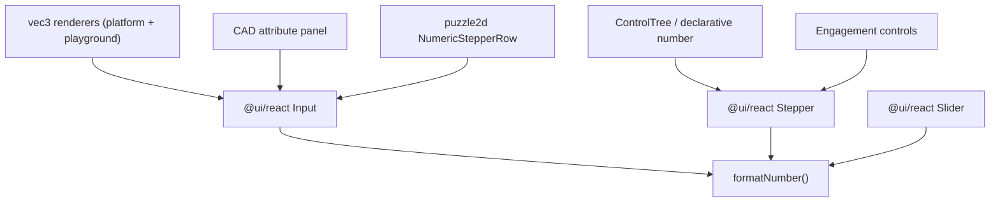

## Root cause

Numbers are rendered raw via `String(n)`, `n.toString()`, `.join(",")`, or bound directly to `<input type="number">` with no normalization. Float arithmetic (gumball/relocate transforms) produces values like `-2.5999999999999996`, which then display verbatim. There is no shared number-display formatter (only `formatLod` in `@infinite/world/r3f` for LOD, and `quantizeCoord` in `@cad/js/core` for hashing).

Every editable numeric field in every UI funnels through three `@ui/react` primitives, so centralizing the fix there covers all surfaces at once.



## Approach

### 1. Add canonical `formatNumber` to `@ui/react`

In [ui/react/index.tsx](ui/react/index.tsx), add an exported pure helper inside a `//#region` (near other formatting/util helpers), with an emoji docstring per repo rules:

```ts
//#region Number formatting
/** 🔢 Strip IEEE-754 float artifacts for display without losing real precision. */
export function formatNumber(value: number | string): string {
  const n = typeof value === "string" ? Number(value) : value;
  if (typeof value === "string" && !Number.isFinite(n)) return value; // leave non-numeric text untouched
  if (!Number.isFinite(n)) return "";
  return Number.parseFloat(n.toPrecision(12)).toString();
}
//#endregion
```

`(-2.5999999999999996).toPrecision(12)` to `"-2.60000000000"` to `parseFloat` to `-2.6` to `"-2.6"`. 12 significant digits removes binary noise (which appears around digit 15-17) while preserving genuine precision and magnitude (small/large numbers survive, unlike `toFixed`).

### 2. Route the three shared display components through it

- `Input` ([ui/react/index.tsx](ui/react/index.tsx) ~5316): when `type === "number"` and the field is not focused, format the display value:
  `const inputDisplayValue = type === "number" && !isFocused ? formatNumber(inputValue ?? "") : (inputValue?.toString() || "");`
  Formatting only while unfocused keeps live typing (`-2.`, partial entries) intact.
- `Stepper` ([ui/react/index.tsx](ui/react/index.tsx) ~5994): bind `value={isEditing ? displayedValue : formatNumber(displayedValue)}` so the spin-box shows a clean value at rest but raw while editing.
- `Slider` ([ui/react/index.tsx](ui/react/index.tsx) ~5791): the read-only value span becomes `{formatNumber(displayValue)}`.

This alone fixes the reported puzzle 3d `-2.6` coordinate inputs (vec3 axes in [framework/product/platform/renderer/react/index.tsx](framework/product/platform/renderer/react/index.tsx) ~1021 and [framework/product/playground/renderer/react/index.tsx](framework/product/playground/renderer/react/index.tsx) ~570), CAD attributes, puzzle2d steppers, and all `ControlTree`/engagement numbers, with no per-call-site changes.

### 3. Fix the one read-only string surface that bypasses numeric inputs

The multi-select vortex position in [puzzle/3d/play/index.ts](puzzle/3d/play/index.ts) ~2429 builds a `text` node via `positions[0]!.join(", ")` (raw floats), so it does not pass through `Input`. Apply the same formatter: `positions[0]!.map(formatNumber).join(", ")`. This requires `@puzzle/3d/play` to import `formatNumber` from `@ui/react` (add `@ui/react` to its `dependencies` in [puzzle/3d/play/package.json](puzzle/3d/play/package.json); it already pulls it in transitively via `@puzzle/3d/react`).

### Explicitly NOT changed

- `fixturePoseFingerprint` / `fixtureAppearanceFingerprint` `.join(",")` in [puzzle/3d/react/index.tsx](puzzle/3d/react/index.tsx) ~2028 are internal change-detection hashes, not UI — must stay exact.
- `quantizeCoord` (geometry hashing) and `formatLod` (LOD-specific `toFixed(2)`) keep their current behavior.

## Verification

- Extend the existing `@ui/react` test file (vitest) with cases for `formatNumber`: `-2.5999999999999996` to `-2.6`, `0.1+0.2` to `0.3`, integers unchanged, `1e-7` preserved, `NaN`/`Infinity` to `""`, non-numeric strings passed through.
- Run the affected package test targets via nx and confirm green before closing.
- Confirm runtime in the puzzle 3d play harness: select an object, drag the gumball, and verify the inspector shows `-2.6` rather than `-2.5999999999999996`.

## Repo workflow

Work inside a repo-mcp ticket (read `repo://goals`, reopen/open a ticket, close with summary + touched files when done). All edits extend existing files using `//#region` structuring; no new files.