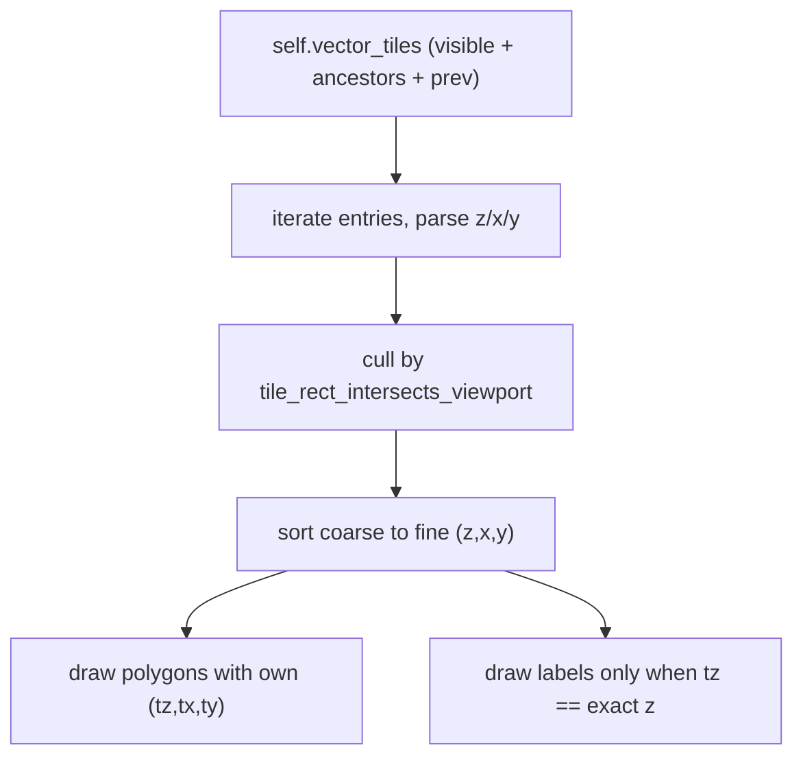

# Fix Vector Tile Zoom Flicker

## Problem

The raster flicker fix did not extend to vector tiles, and an in-progress concurrent edit to the vector path is incorrect.

In [gis/map/rs/lib.rs](gis/map/rs/lib.rs) `append_vector_tiles` (1035-1086):

```1045:1051:gis/map/rs/lib.rs
        for (tz, tx, ty) in tiles::visible_tiles(&self.camera, &self.viewport, z) {
            let tile = tiles::tile_key_ancestors(tz, tx, ty)
                .into_iter()
                .find_map(|key| self.vector_tiles.get(&key));
            let Some(tile) = tile else {
                continue;
            };
```

When an ancestor tile is found, its geometry is still drawn with `tile_local_to_screen(tz, tx, ty, ...)` (lines 1066, 1079) using the fine tile coordinates, not the ancestor's. A coarse tile gets squashed and repeated into every fine sub-rect. And `prepare_visible_tiles` (914-923) retains only the exact-level `vkeys`, so ancestors are evicted before they can be used. Net result: vector tiles still flicker / mis-render on zoom.

## Approach: mirror the raster fix

The raster path already works via two pieces: a coarse-to-fine pyramid draw in `append_tiles` (1088-1106) and ancestor + previous-frame retention in `prepare_visible_tiles` (905-913). Apply the identical pattern to vectors, drawing each tile with its OWN coordinates.




## 1. Shared retention helper (tiles module)

Rename `raster_retention_keys` (it has no raster-specific logic) to `tile_retention_keys` and reuse it for both raster and vector. Update the existing raster call at line 908 and the test that references it.

## 2. Retain vector ancestors + previous frame (`prepare_visible_tiles`, 914-923)

- Add field `last_vector_visible: std::collections::BTreeSet<String>` to `MapHost` (struct near 659; init empty near 687, mirroring `last_raster_visible`).
- In the `vector_tiles_available_at_camera_zoom` branch, build keys via `tiles::tile_retention_keys(&vvisible, &self.last_vector_visible)`, call `retain_vector_tiles_for_keys(&keys)`, then set `self.last_vector_visible` to the current `vvisible` set.
- Keep the `else { self.vector_tiles.clear() }` cutoff and also clear `last_vector_visible` there.

## 3. Pyramid render (`append_vector_tiles`, 1035-1086)

Replace the per-visible-tile `find_map` loop with a pyramid pass that mirrors `append_tiles`:

- Keep the early `vector_tiles_available_at_camera_zoom` guard and `let z = pick_vector_tile_zoom(...)`.
- Collect `(tz, tx, ty, &VectorTile)` by iterating `self.vector_tiles`, parsing each key with `tiles::parse_tile_key`, and culling with `self.tile_rect_intersects_viewport(projection::tile_world_rect(tz, tx, ty))`.
- Sort ascending by `(tz, tx, ty)` so coarse tiles paint under fine ones.
- For each tile, run the existing per-layer logic (geolines skip, countries/centroids handling) but using that tile's own `(tz, tx, ty)` in `append_vector_tile_polygon` and `tile_local_to_screen`.
- Gate label drawing with `if tz == z` so labels render only at the exact level, avoiding duplicate stacked labels across pyramid levels (polygons are opaque `land_fill`, so overdraw is harmless; `land_stroke` is alpha 0 in the theme).

## 4. Tests (extend existing `#[cfg(test)] mod tests`)

- Update the renamed-helper reference if a test uses `raster_retention_keys`.
- Add `vector_retention_keeps_ancestor_after_zoom_in`: `upload_vector_tile(0,0,0,&[])` (empty MVT decodes to an empty tile and inserts key `0/0/0`), set a deeper camera where vectors are available (e.g. zoom 2500 -> vz>=1), call `prepare_visible_tiles`, assert `host.vector_tiles` still contains `0/0/0`.

## Scope

Raster path is unchanged beyond the helper rename. Vector availability cutoff behavior (clearing when zoomed past demotiles) is intentionally preserved.

## Verification

- `gis/map/play` `test` task (runs `cargo test -p gis_map`, rebuilds wasm, vitest).
- `gis/map/play` `dev` (port 6040), set render mode to Vector, and zoom across z boundaries: vector land must stay covered by coarser tiles with no background flash and no squashed/repeated coarse geometry. Hard-refresh so the new wasm loads.

