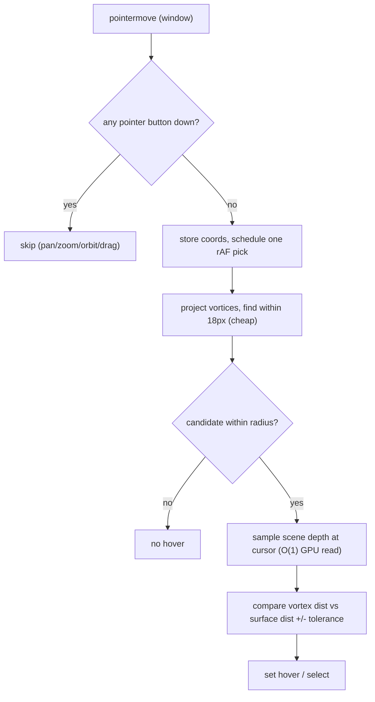

## Root cause (commit 93 -> 94, `bed5576a0`)

Commit 94 removed the per-vortex invisible pick-proxy meshes (hovered natively/cheaply by R3F) and added the `VortexScreenPick` bridge in [puzzle/3d/react/index.tsx](puzzle/3d/react/index.tsx). On `HEAD` it installs a global listener:

```2858:2859:puzzle/3d/react/index.tsx
    window.addEventListener("pointermove", onPointerMove);
    dom.addEventListener("click", onClickCapture, true);
```

For every pointer move, `pickAt` projects all vortices and, whenever the cursor is within `VORTEX_SCREEN_PICK_RADIUS_PX` (18px) of any vortex, runs a brute-force recursive raycast over the whole scene to get the occluding surface depth:

```2809:2810:puzzle/3d/react/index.tsx
      const objHits = raycaster.intersectObjects(st.collectObjectGroups(), true);
      const surfaceDist = objHits.length > 0 ? objHits[0]!.distance : Infinity;
```

Because objects carry vortices on/inside them, the cursor is almost always within 18px of a vortex, so this `intersectObjects(..., true)` walks every triangle of every mesh on the main thread, dozens of times per second, during panning, zooming, and dragging. There is no throttle, the canvas is `frameloop="demand"` (line 4978), and there is no BVH. The only guard (`busy`) covers attraction drag only — not orbit/pan/zoom or relocate drag. Result: minutes-long stalls.

## Fix strategy




Three coordinated changes, all in [puzzle/3d/react/index.tsx](puzzle/3d/react/index.tsx):

### 1. O(1) GPU depth occlusion (replaces the full-scene raycast)

Add a `SceneDepthCapture` component mounted alongside `VortexScreenPick` inside the Canvas (near line 4664). It:

- Creates a canvas-sized `WebGLRenderTarget` with a `DepthTexture` (resized on `useThree(s => s.size)` change), pulling `WebGLRenderTarget`, `DepthTexture`, `ShaderMaterial`, `OrthographicCamera`, `Scene`, and depth/filter enums from `sceneHostPort.three` (already exposes all of `THREE`).
- Takes over rendering via `useFrame((state) => { ... }, 1)` (positive priority disables R3F's default render): render `scene` into the offscreen target, then blit `target.texture` to the default framebuffer with a fullscreen-quad pass. Use `samples: 4` on the target to preserve `antialias`. Net per-frame cost stays ~one scene render + one cheap blit.
- Exposes a `sampleDepthDistance(clientX, clientY): number | null` via a new `SceneDepthContext` (or shared ref). It renders a 1x1 pass sampling `tDepth` at the cursor UV, packs depth with three's `#include <packing>` (`packDepthToRGBA`), reads it back with `gl.readRenderTargetPixels(read1x1, ...)`, unpacks on CPU, and converts the non-linear depth to an eye-space distance via `perspectiveDepthToViewZ(d, near, far)`. This is O(1) on the CPU and needs no per-hover scene redraw.

In `pickAt`, replace lines 2808-2810 with `const surfaceDist = depth.sampleDepthDistance(clientX, clientY) ?? Infinity;` and keep the existing `pickNearestScreenVortex` depth-tolerance comparison.

### 2. Coalesce picking to one attempt per animation frame

In the `VortexScreenPick` effect, change `onPointerMove` (lines 2814-2823) to only store the latest `clientX/clientY` and `requestAnimationFrame` a single pending pick (drop intermediate moves). Cancel the frame on cleanup. This bounds picking to <=1/frame regardless of pointermove rate.

### 3. Skip picking while a pointer button is held

Track `buttonsDown` via `pointerdown`/`pointerup`/`pointercancel` listeners in the same effect; in the rAF pick, return early when any button is down. Pan, zoom, orbit, and drag all hold a button, so this fully suppresses picking during camera/drag interaction (superseding the narrow `busy` check, which can be removed or folded in).

### Cleanup

Remove the obsolete full-scene raycast plumbing now unused for occlusion: `collectObjectGroups` usage in `VortexScreenPick` (line 2809) and the local `Raycaster`/`ndc` (2783-2784) once depth sampling replaces them. Strip the `[DEBUG]` `window.__p3d*` globals (lines 2829, 2838-2856, 2863-2865) added during this feature.

## Verification

- Run the puzzle 3D play canvas with a dense scene; confirm via console timing logs that pan/zoom/drag no longer trigger `intersectObjects` and frame times return to commit-93 levels.
- Confirm vortex hover + click still select the correct vortex and respect occlusion (a vortex behind a foreground surface beyond `VORTEX_PICK_DEPTH_TOLERANCE` is not pickable) using the depth-buffer path.
- Confirm antialiasing is unchanged after the render-target takeover.

[{"id": "depth-capture", "content": "Add SceneDepthCapture: offscreen WebGLRenderTarget + DepthTexture, useFrame render takeover with fullscreen blit, and a SceneDepthContext exposing sampleDepthDistance(clientX, clientY) via a 1x1 packed depth readback converted to eye-space distance."}, {"id": "replace-raycast", "content": "In VortexScreenPick.pickAt, replace raycaster.intersectObjects(collectObjectGroups(), true) with depth.sampleDepthDistance(...); remove the now-unused Raycaster/ndc and collectObjectGroups usage."}, {"id": "coalesce-raf", "content": "Coalesce onPointerMove to one rAF-scheduled pick using the latest cursor coords; cancel pending frame on cleanup."}, {"id": "button-gate", "content": "Track pointer button state via pointerdown/up/cancel and skip picking while any button is held (covers pan/zoom/orbit/drag); fold in or remove the old busy check."}, {"id": "cleanup-debug", "content": "Remove the [DEBUG] window.__p3d* globals added with this feature and verify hover/click correctness, occlusion, and antialiasing."}]
