## Root cause (confirmed via source inspection, not guesswork)

`framework/renderer/wgpu/rs/lib.rs` routes every winit `WindowEvent` through `dispatch_window_event()` in `ui/wgpu/rs/lib.rs`:

```7150:7173:ui/wgpu/rs/lib.rs
pub fn dispatch_window_event(...) -> bool {
    match event {
        ...
        WindowEvent::CursorMoved { position, .. } => {
            let (x, y) = pointer_coords(window, *position);
            ...
            (callbacks.on_move)(x, y, ...);
```

`pointer_coords` for the winit path is:

```7116:7119:ui/wgpu/rs/lib.rs
pub fn pointer_coords(window: &winit::window::Window, position: winit::dpi::PhysicalPosition<f64>) -> (f32, f32) {
    let dpr = window.scale_factor() as f32;
    (position.x as f32 * dpr, position.y as f32 * dpr)
}
```

This was introduced in today's `🧊Wgpu winit+trunk migration` commit (`8e8e4e88`). The problem: winit's `WindowEvent::CursorMoved` position is **already** a `PhysicalPosition` (already multiplied by scale factor). This is true for every winit backend, including the web/wasm backend actually used by this renderer — confirmed directly in `winit-0.30.13`'s own source:

```88:94:winit-0.30.13/src/platform_impl/web/web_sys/pointer.rs
event::mouse_position(&event).to_physical(super::scale_factor(&window)),
```

So `pointer_coords` multiplies by `scale_factor` a **second time**. On any HiDPI/Retina display (`scale_factor` = 2.0, extremely common on macOS, which is this user's OS), every reported pointer x/y is exactly double where the cursor actually is. Meanwhile `state.bounds` (the 3D viewport's hit-test rect, set via `sync_world3d_state` in `infinite/world/rs/lib.rs:952`) and `shell.screen_w`/`screen_h` are laid out in true physical-pixel space (`css_width * dpr`, computed once, correctly). So `state.bounds.contains(x, y)` in `AppRuntime::handle_pointer_move`/`handle_pointer_button` (`framework/renderer/wgpu/rs/lib.rs:10879-10998`) almost never matches reality away from the top-left corner — meaning `handle_world3d_pointer_move`/`handle_world3d_pointer_button` (which drive hover/select picking for vertex/edge/face/mesh, `infinite/world/rs/lib.rs`) essentially never fire correctly. This explains why hover/select silently fails for **all** component types uniformly, while rendering itself (which uses `screen_w`/`screen_h` directly, unaffected by this bug) looks perfectly fine.

```mermaid
flowchart LR
    dom["Browser DOM mouse event\n(CSS/logical px)"] --> winitWeb["winit web backend\nalready converts to PhysicalPosition"]
    winitWeb --> cursorMoved["WindowEvent::CursorMoved\n(physical px, correct)"]
    cursorMoved --> pointerCoords["pointer_coords()\nBUG: multiplies by scale_factor AGAIN"]
    pointerCoords --> callbacks["PointerCallbacks.on_move/on_button"]
    callbacks --> appRuntime["AppRuntime::handle_pointer_move/button"]
    appRuntime --> boundsCheck["state.bounds.contains(x, y)\nbounds are true physical px -> mismatch"]
    boundsCheck -->|"almost never true away from origin"| pick["handle_world3d_pointer_move/button\n(pick_hover_command / pick_select_command)"]
```



Because the same doubled coordinates also feed general UI widget hit-testing (`self.shell.handle_pointer_move/button`), this likely also explains inconsistent/seemingly-random toolbar clicks (e.g. the four adjacent Mesh/Vertex/Edge/Face selection-target toggle icons are small and close together, so a 2x offset click can land on a neighboring icon instead of a total miss — consistent with the user managing to toggle "all of them on" while precise 3D picking never registers).

## Fix

1. **`ui/wgpu/rs/lib.rs`** — remove the erroneous second scale-factor multiplication in the winit-facing `pointer_coords(window, position)` (around line 7116). Winit already delivers physical pixels; just pass `position.x`/`position.y` through as `f32`.
   - Leave the separate `pointer_coords(canvas, event)` (line 4193, used only by the dead `attach_dom_listeners`/`attach_dom_listeners` DOM-listener path) alone for now — it operates on raw CSS `MouseEvent` coordinates so its `* device_pixel_ratio()` is actually correct there, but that whole function is unreferenced dead code left over from before the winit migration (confirmed via repo-wide search: `attach_dom_listeners` has no call sites, and is not wasm-bindgen-exported to JS). Remove `attach_dom_listeners`, its private `pointer_coords(canvas, ...)` helper, and its `pub use input::attach_dom_listeners;` re-export as part of this cleanup, per the no-dead-code/no-legacy-support rule.

2. Rebuild the WGPU wasm artifact (`bun run` the renderer's build script) and the lowpoly plugin as needed.

## Verification (must produce real runtime evidence, not just "should work now")

3. Add temporary `[DEBUG]`-prefixed logging (ticket-scoped, removed at the end) at the two or three critical points: raw `CursorMoved` position received, computed `pointer_coords` output, and `state.bounds` for the active `World3dState`, plus whether `pick_hover_command`/`pick_select_command` produce a command. 
4. Launch the WGPU dev server and drive it with browser automation (or ask the user to reproduce) with the four selection-target toggles on, capturing actual console output and a screenshot showing hover highlight and a click producing a visible selection highlight for at least: mesh, vertex, edge, and face.
5. Only once that evidence is captured, remove the temporary debug logs, rerun `cargo test` for `infinite/world` and `ui/wgpu`, and report back with the concrete evidence (not an assumption).

## Files touched
- `ui/wgpu/rs/lib.rs` — fix `pointer_coords(window, position)`; remove dead `attach_dom_listeners` path.
- Possibly none else — this is intentionally a narrow, surgical fix given four prior fix rounds already touched `apply_runtime_draw_flags`, `apply_ops`/`refresh_ui`, and the React renderer without resolving the WGPU symptom.