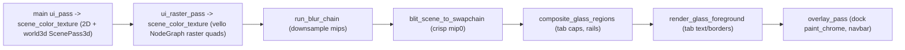

# Fix Window Chrome Rendering Bug (wgpu)

## What's already confirmed structurally sound

Dock chrome (tab caps, per-tab borders, resize handles, navbar/footer backgrounds) is genuinely framework-owned and painted unconditionally, independent of program `render()` output:

- `render_stack` (`[framework/renderer/wgpu/rs/lib.rs:1226-1400](framework/renderer/wgpu/rs/lib.rs)`) draws the tab cap, borders, and cap buttons regardless of what the plugin returns for that window's body.
- `paint_chrome` (`framework/renderer/wgpu/rs/lib.rs:459-482`) walks the dock tree with a **no_operation** body renderer and is routed through `with_chrome_sink` (`framework/renderer/wgpu/rs/lib.rs:10667`, commented "Chrome content must always win over window bodies").
- A plugin's `UiNode` tree only ever fills the scissored content rect inside `render_window_content` (`framework/renderer/wgpu/rs/lib.rs:11640-11684`); it cannot structurally replace dock chrome.

So the bug is not "plugins can override chrome" in the naive sense — it's a rendering defect in a specific, real code path plus a set of chrome-adjacent features that are silently plugin-optional. Both need fixing.

## Leading hypothesis for the visual defect (needs live confirmation)

The dock tab cap now renders via a **GPU glass-blur composite** (`GlassTier::Toolbar`, `[ui/wgpu/rs/lib.rs:1256-1262](ui/wgpu/rs/lib.rs)`), part of a recently-added multi-pass pipeline (`composite_to_swapchain` → `run_blur_chain` → `blit_scene_to_swapchain` → `composite_glass_regions` → `render_glass_foreground` → overlay pass, `ui/wgpu/rs/lib.rs:3420-3492`). This pipeline renders window bodies (including 3D `ScenePass3d` and vello `raster_instances` for `NodeGraph`) into an offscreen `scene_color_texture`, blurs it, blits it, then composites glass-tinted chrome rects on top.

`procedural 3d`'s default layout (`procedural/plugin/rs/app_3d.rs:1286-1291`) is the **only** app configuration in the codebase that shows a `SurfaceKind::NodeGraph` window (vello raster, "Flow") and a `SurfaceKind::World3d` window (`ScenePass3d`, "Preview") side by side in the same frame on first load. `lowpoly`'s default layout is a single `World3d` window; its only multi-window view (`Paint`) combines `World3d` + `Canvas2d`, never `NodeGraph` + `World3d` together. This makes "NodeGraph + World3d simultaneously" untested territory, and `render_interleaved_layers`/`upload_world_passes`/the separate raster pass (`framework/renderer/wgpu` calls into `[ui/wgpu/rs/lib.rs:3000-3200](ui/wgpu/rs/lib.rs)`) is the prime suspect for a layer/pass-ordering or shared-resource defect that corrupts the glass composite specifically in that combination.

## Plan

### 1. Live repro and bisection (agent mode)

- Restart clean `bun run dev:lowpoly` and `bun run dev:procedural:3d` dev servers, screenshot both at first load.
- Bisect by temporarily forcing procedural's default layout to a single `World3d`-only window (matching lowpoly's shape) and re-screenshot; then temporarily forcing lowpoly's default layout to combine `World3d`+`NodeGraph` (e.g. via its Paint window kinds if feasible, or a throwaway second window kind) to see if the same corruption reproduces on lowpoly. This isolates whether the defect is (a) NodeGraph+World3d co-presence, (b) the 2-window `row` split/axis path in general, or (c) something else (missing `mode_tools`/engagement/measures purely cosmetic).
- Capture exact visual diffs (missing borders vs. wrong color vs. z-order/overlap vs. garbled blur).

### 2. Root-cause and fix the render defect

- Once isolated, fix in the shared engine (`ui/wgpu/rs/lib.rs`), not in any program — likely candidates depending on bisection result:
  - `render_interleaved_layers`/`upload_world_passes`/`pass_index_map` (`ui/wgpu/rs/lib.rs:3000-3098`) if the world-pass index mapping misaligns when raster (vello) layers are interleaved with scene (3D) layers in the same frame.
  - `composite_glass_regions` (`ui/wgpu/rs/lib.rs:3683-3763`) if glass regions positioned over a mixed-surface backdrop sample the wrong mip/rect.
  - `render_axis`/`walk_resize_hits` (`framework/renderer/wgpu/rs/lib.rs:1017-1167`) if the defect is purely about multi-window `row` splits regardless of surface kind.
- Add a regression test/fixture in the existing dock test region (`framework/renderer/wgpu/rs/lib.rs:1667+`) exercising a two-stack row layout with one `NodeGraph` and one `World3d` window, so this exact configuration can never silently regress again.

### 3. Close the "plugin can silently degrade chrome" enforcement gaps

This is the structural fix for "mechanisms must enforce proper framework, plugins just declare":

- **Engagement/measures rails**: `PluginApp::window_engagements()`/`window_measures()` default to empty (`framework/plugin/rs/lib.rs:388-401`), so a plugin that skips them (like `procedural`) gets a visibly different/absent rail with no framework fallback. Replace the silent-empty default with either (a) a framework-derived default rail built purely from `WindowKindDefinition` metadata already present in the manifest (no program code required), or (b) make these mandatory `AppBuilder` fields with a required, validated call so omission is a build-time/manifest-lint error rather than a runtime visual gap.
- **Mode toolbar**: `procedural` declares `.mode("edit", ...)`/`.mode("generate", ...)` but never calls `.mode_tools(...)` (contrast `lowpoly/plugin/rs/lib.rs:2241-2242`), leaving the navbar tool strip empty. Either render a sane empty-but-consistent toolbar state (no layout shift) when omitted, or add manifest lint validation (the dev script already lints program manifests) that flags declared modes without registered tools.
- `**SurfaceKind` is undeclared\*\*: nothing in `WindowKindDefinition`/`WindowKindSpec` (`framework/core/rs/lib.rs:2893-2913`, `framework/plugin/rs/lib.rs:32-39`) declares which `SurfaceKind` a window kind is expected to render. Add an explicit `surface_kind` field to the window kind manifest, and validate at render time (alongside the existing `RenderPlanLimits`/`validate_ui_node` render-plan validation) that the `UiComponentSceneNode` a plugin returns for a given `body_key` matches its declared kind — on mismatch, render a framework-owned error placeholder instead of whatever the plugin produced, rather than letting mismatched/unexpected content flow through silently.

### 4. Harden program load resilience (secondary, found during investigation)

- `os-shell.tsx:690` awaits `Promise.all(registry.map(loadPluginModule))` with no per-entry timeout or isolated error handling; one hung/failed program blocks the entire shell from ever rendering _any_ app (observed live on the running `dev:procedural:3d` server, though not confirmed as the user's exact symptom). Replace with per-plugin `Promise.allSettled` + timeout, rendering a framework-owned per-app quarantine/error tile for the failed program while unaffected apps still load — consistent with the existing Rust-side program supervisor's crash-containment intent, just applied to the browser boot path too.

## Todos to track

[{"id": "repro", "content": "Restart clean dev:lowpoly and dev:procedural:3d, screenshot both, bisect NodeGraph+World3d co-presence vs axis-split vs cosmetic causes"}, {"id": "fix-render-defect", "content": "Root-cause and fix the identified rendering defect in ui/wgpu/rs/lib.rs (interleaved layers / glass composite / axis split, whichever bisection points to)"}, {"id": "regression-test", "content": "Add a dock/render regression test/fixture covering a NodeGraph + World3d two-window row layout"}, {"id": "enforce-engagement-measures", "content": "Make window engagement/measures rails framework-derived or build-time-required instead of silently-optional plugin trait overrides"}, {"id": "enforce-mode-tools", "content": "Ensure declared modes without mode_tools render a consistent empty toolbar or fail manifest lint"}, {"id": "declare-surface-kind", "content": "Add surface_kind to WindowKindDefinition/WindowKindSpec and validate program render() output against it, falling back to a framework error placeholder on mismatch"}, {"id": "harden-plugin-load", "content": "Replace Promise.all with per-plugin timeout/isolated error handling in os-shell.tsx program loading"}]
