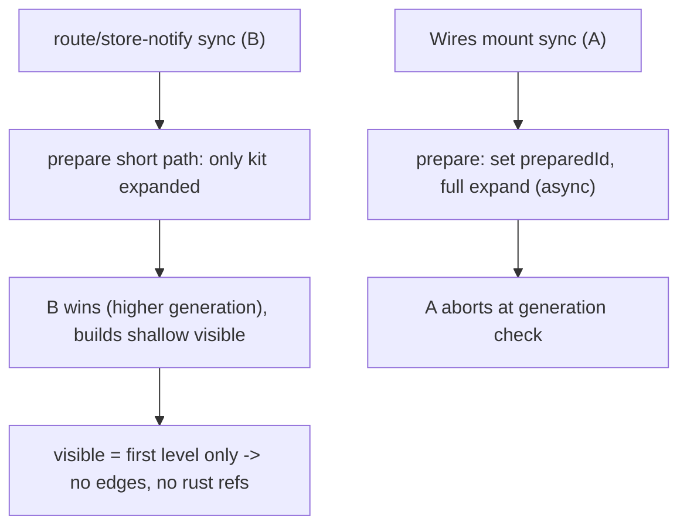

## Symptom

In dev sketchpad, the kit **Wires** window shows identity boxes but zero connecting lines. The kit is imported from a file, so the store is a `ComposeJsKitStore` (Rust/WASM GraphQL is available).

## Root cause

Edges are built in `sketchpadKitWiresFixtureFromVisible` ([compose/client/lib/sketchpad/js/index.ts](compose/client/lib/sketchpad/js/index.ts) ~~11885) from the **visible VFS node set** plus Rust reference data from `sketchpadFetchKitWiresReferences` (~~11820). Two bugs zero out the edges:

### Bug 1 - kit root excluded from visible nodes

`visibleVirtualFileSystemNodesFromTree` ([framework/product/platform/core/index.ts](framework/product/platform/core/index.ts) ~876) only visits the root's children, never the root itself:

```883:894:framework/product/platform/core/index.ts
	const visit = (node, parentId, depth) => {
		nodes.push({ ...node, parentId });
		...
	};
	const rootChildren = childrenByParentId[root.id] ?? rootBucket;
	if (rootChildren?.length) {
		for (const child of rootChildren) visit(child, root.id, 0);
	}
```

In `pushRelationship` an edge is dropped unless both endpoints are in `visibleIds`. The kit's direct children (typologies/folders/files) all have `parentId = kitId`, but the kit node is not visible -> every `kit -> child` containment edge is discarded. The builder's own tests (~15747, ~15766) pass only because they _manually_ include the kit root in `visible`, masking the runtime gap.

### Bug 2 - sync race leaves the tree shallow

`syncKitWiresTopology` ([compose/client/lib/sketchpad/js/index.ts](compose/client/lib/sketchpad/js/index.ts) ~14166) runs on mount, on route change (`syncVirtualFileSystemRoute` ~14532), and on every kit-store notification (`registerKitStore` subscribe ~14112 -> `invalidateKitVirtualFileSystem` ~14537, which also resets `kitWiresVfsPreparedKitId = null` and wipes the children cache).

`prepareKitWiresVfsForTopology` (~14131) guards with `kitWiresVfsPreparedKitId`: the first call does the full two-level expansion asynchronously; a concurrent call sees the flag already set and takes the short path, resolving early while only `[kitId]` is expanded. Each sync also bumps `kitWiresSyncGeneration` and the slower (full-expansion) sync aborts at the generation check. Net result: the winning sync builds `visible` with only the kit's first level (or nothing) -> no design/type/piece nodes -> `sketchpadFetchKitWiresReferences` has nothing to query in Rust -> and with Bug 1 those first-level nodes have no drawable parent either. Zero edges.



## Fix

### 1. Include the kit root in the Wires visible set (Bug 1)

In `syncKitWiresTopology`, prepend the kit root node to the `visible` array before calling `sketchpadFetchKitWiresReferences` / `sketchpadKitWiresFixtureFromVisible`, using the controller's existing `getRoot(scope)` (already used by `kitWiresNodeMetaForKit` ~14121). Build it as `{ ...root, parentId: null }` (kind `kit`). This restores `kit -> typology/folder/file` `owns` edges; the reference fetch already ignores non-design/piece nodes.

- Keep the change sketchpad-local rather than altering `visibleVirtualFileSystemNodesFromTree`, because the platform VFS demo tests (~2212-2220) assert the shared helper excludes the root.

### 2. Make Wires VFS preparation deterministic (Bug 2)

Replace the `kitWiresVfsPreparedKitId` boolean guard with a memoized prepare-promise per kit (e.g. `kitWiresVfsPreparePromises: Map<string, Promise<void>>`):

- `prepareKitWiresVfsForTopology` returns the cached promise if present; otherwise it runs the full kit + first-level expansion (with `ensureChildrenLoadedAsync`) once and stores the promise.
- Concurrent syncs all `await` the same full preparation, so whichever `kitWiresSyncGeneration` wins reads a fully expanded tree.
- Clear the memo in `invalidateKitVirtualFileSystem` (~~14549) and `syncVirtualFileSystemRoute` (~~14530) so a live kit change re-preps from scratch.

This guarantees design/type/piece nodes are visible, which both draws their containment edges and gives `sketchpadFetchKitWiresReferences` real designs/pieces to query (`referencesTypesTransitive`, `referencesDesignsTransitive`, `piece.blueprint`) -> `is`/`references` edges render from the Rust store.

## Tests (extend existing files only)

- `framework/product/platform/core/index.ts` test block: keep existing visible-node assertions (root excluded) intact.
- `compose/client/lib/sketchpad/js/index.ts` `describe("sketchpadKitWiresFixtureFromVisible")` (~~15746) and the Rust-backed wires test (~~15692 region): add a case asserting that the controller's `syncKitWiresTopology` output (or the visible set it feeds the builder) includes the kit root and produces `owns` edges from the root, and that with a fully-expanded kit the fixture yields containment + `references`/`is` edges. Validate at runtime in dev sketchpad (confirm `fixture.relationships.length > 0` and edges render) per repo "confirm runtime behaviour" rule.

## Repo process

Per repo rules: read `repo://goals`, reopen the existing ticket `26/06/03/WIRES-KIT-RELATIONSHIP-VIEW` (it owns this feature) via repo MCP before editing, keep any temp artifacts/logs in the ticket folder, structure additions with regions, extend existing tests in place, and close the ticket with a summary of changed files when done.

## Files

- [compose/client/lib/sketchpad/js/index.ts](compose/client/lib/sketchpad/js/index.ts) - prepend kit root to visible set; memoized prepare promise; clear memo on invalidate/route reset; extend tests.
- [framework/product/platform/core/index.ts](framework/product/platform/core/index.ts) - unchanged behavior (decision: do not include root in the shared helper).
